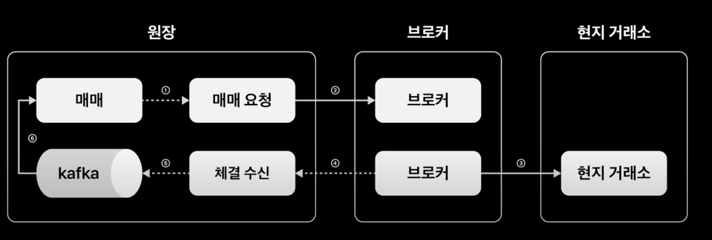
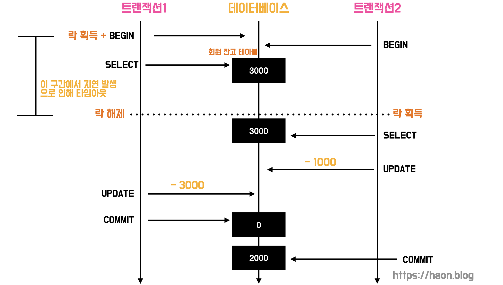
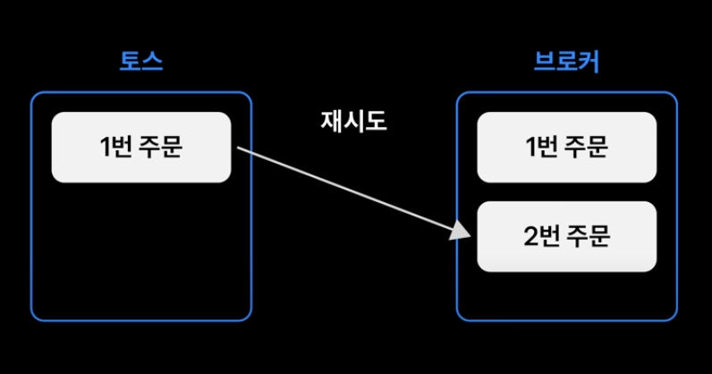
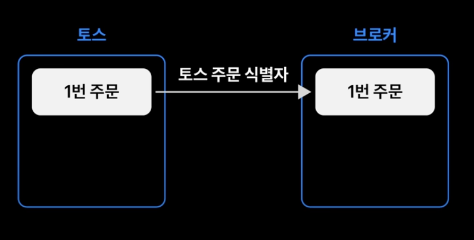
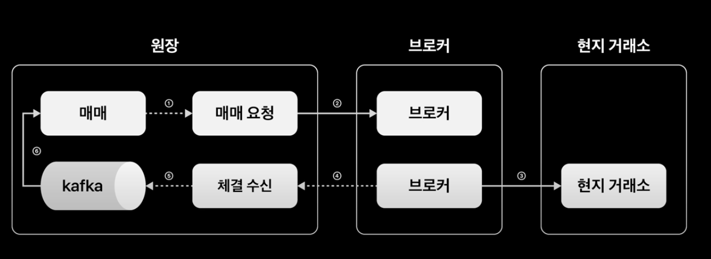
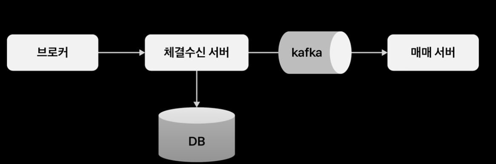
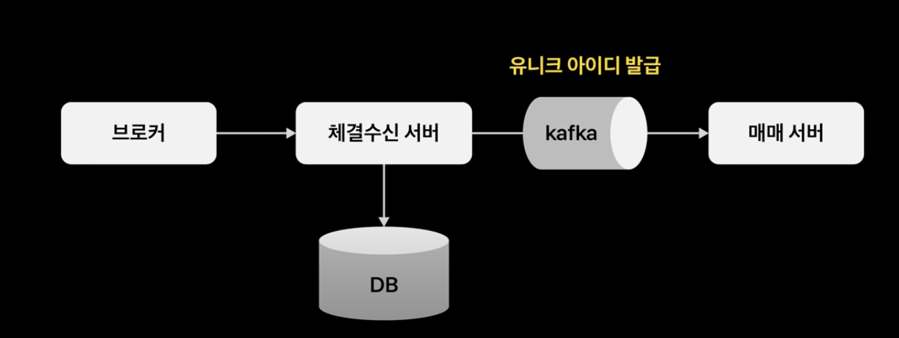

> 💡 [토스 SLASH 22, 애플 한 주가 고객에게 전달 되기까지](https://www.youtube.com/watch?v=UOWy6zdsD-c) 에서 필요한 내용을 발췌하여 간단히 정리하였다.

<iframe width="100%" height="350" src="https://www.youtube.com/embed/UOWy6zdsD-c?si=FCpZVfkB4ixiQQXx" title="YouTube video player" frameborder="0" allow="accelerometer; autoplay; clipboard-write; encrypted-media; gyroscope; picture-in-picture; web-share" referrerpolicy="strict-origin-when-cross-origin" allowfullscreen></iframe>

토스증권의 해외주식 원장계는 MSA를 기반으로 구성하였다. 각 도메인 별 모듈들이 독립적으로 구성되어 있기 때문에 단일 모듈의 장애 전파를 방지하고, 효율적인 리소스 관리가 가능하다.

토스증권은 한국 법인이므로, 나스닥과 같은 현지 거래소와 직접 거래할 수 없다. 이 때문에 중간에서 브로커(해외거레 중개인) 을 통해 주문을 제출하고, 체결한다. 브로커를 통해 주문을 체결하므로 토스증권과 브로커간의 주문 데이터 정합성 관리가 매우 중요하며, 네트워크 지연 이슈도 잘 고려해야한다.

## 주문 체결 플로우



고객의 주문은 `(1)` 매매 서버, 매매 요청 서버를 거쳐서 브로커에게 전달되고, 브로커는 해외 현지 거래소에 주문을 제출하게 된다. (이 과정은 모두 하나의 주문 트랜잭션으로 처리되는 듯 하다.) `(2)` 브로커를 통해 해외 거래소로 제출된 주문에 대한 체결 결과 여부를 처리하는 트랜잭션은 앞선 주문 트랜잭션과는 별개로 동작한다.

앞선 `(2)` 의 주문 체결 결과 처리 트랜잭션은 체결 수신 서버를 거친 뒤 Kafka 를 거쳐서, 다시 매매 서버로 유입되어 처리가 마무리된다.

## 동시 다발적으로 발생하는 트랜잭션에서 고객 자산에 대한 동시성 처리하기

토스증권에서는 WTS, MTS, 자동 매매등 다양한 방법을 통해 고객의 잔고를 동시에 갱신하는 트랜잭션이 발생하게 된다. 즉, 고객의 잔고 갱신에 한 동시성 처리가 필요하다. 이 방법들을 통해 유입된 요청은 매매 서버로 전달되고, 브로커에게 전달된다. (앞선 `(1)` 트랜잭션이다.)

이는 어떻게 해결할 수 있을까? `(1)` 무턱대고 대상 테이블에 대해 하나하나 모두 `FOR UPDATE` 로 락을 걸어버린다면 데드락을 피할 수 없다. `(2)` 이를 위해 락을 위한 테이블(계좌락 테이블) 을 별도로 두고, 아래처럼 `FOR UPDATE` 를 걸어서 동시성을 제어해볼 수 있다.

```sql
BEGIN TRANSACTION

SELECT *
FROM account_lock
WHERE account_number = "1911234"
FOR UPDATE;

// ... (비즈니스 로직상에 존재하는 쿼리 실행)

END TRANSACTION;
```

하지만 이 방식은 단일 데이터베이스 환경에서만 적용할 수 있다. MSA 환경에서 각 마이크로 서버(모듈)는 서로가 각기 다른 독립적인 데이터베이스를 바라보고, 사용한다. 즉, 각 모듈은 서로 락을 공유하지 않는다. 게다가 각 모듈이 바라보는 서버 내에서도 데이터베이스 다중화까지 발생할 수도 있다.

## Redis 분산 락을 사용한 동시성 해결

이는 Redis 분산 락으로 해결할 수 있다. 분산 락을 통해 모든 서버는 락을 중앙화된 Redis 서버로부터 공유하고, 제어한다. 또한 분산 락은 여러 서버들에서 모두 요청하기 때문에 높은 처리량(throughput) 이 보장되어야 한다. Redis 는 메모리 기반 저장소이므로 DBMS 에서 계좌락을 별도로 사용하는 방식보다 높은 처리량을 제공한다.

### 분산 락 타임아웃 설정과 그에 따른 갱실문제

하지만, 분산 락을 사용하면 임계영역에 하나의 쓰레드만 진입할 수 있다. 이 때문에 하나의 트랜잭션이 무한정 락을 소유한다면 다른 서버들의 요청이 무한정 대기하여 데드락이 발생한다. 이 때문에 분산 락의 타임아웃을 설정하여 문제를 해결해보고 싶지만, 아쉽게도 **분산 락 타임아웃은 의도대로 동작하지 않을 수 있다.**

분산 락 타임아웃이 지나서 락 자체를 해제가 되었으나, 트랜잭션은 아직 끝나지 않는 상태라서 다른 트랜잭션과의 경합이 발생할 수 있다. 즉, **갱신 분실 문제(Lost Updates Problem)** 가 발생할 수 있다.

### 갱실 분실 문제 (Lost Updates Problem)

이와 관련한 유사한 문제는 [JPA 낙관적 락과 비관적 락으로 엔티티에 대한 동시성 이슈 해결하기](https://haon.blog/database/optimistic-pessimistic-lock/) 에서도 동일하게 다룬적이 있다. 토스증권 또한 송금 관련 트랜잭션에서 갱실 분실 문제가 발생한 듯 하다.



통장에 3000원이 있는 상황이다. 트랜잭션1 과 트랜잭션2 는 서로 다른 서버에서 시작되었고, 트랜잭션1이 먼저 실행되어 분산 락을 획득(acquire) 한 상태이다. Redis 분산 락의 타임아웃은 2초 설정했다 가정해보자.

그런데 만약, 트랜잭션1 에 지연이 발생하여 2초 넘게 UPDATE 와 COMMIT 을 하지 못한 상태로 타임아웃되면 어떻게 될까? 우선 트랜잭션 1은 락을 해제하고, 그 즉시 트랜잭션 2가 락을 획득한다. 이때, 트랜잭션 1은 아직 커밋을 하지 못한 상태이므로 통장의 잔고를 업데이트하지 못했다. 이 타이밍에 트랜잭션 2가 통장 잔고를 데이터베이스로 부터 조회해버리게 되므로, 트랜잭션 2의 입장에서는 잔고를 0원이 아니라 3000원으로 읽어오게 된다.

그 뒤로, 뒤늦게 트랜잭션 1이 잔고를 갱신하고 커밋했다. 이 때문에 데이터베이스내에 잔고는 0원으로 갱신된다. 그러나, 곧 이어서 트랜잭션 2가 이 또한 커밋되어 잔고가 -1000원 (엄밀히는 -1000이 아니라, 이때 애러 핸들링을 하긴 했을 것이다.) 이 아니라 2000원으로 갱신해버린다. 즉, 트랜잭션1의 갱신 내역을 덮어씌워버린다.

이렇듯 분산 락 메커니즘을 사용하였음에도 불구학, 갱신 분실 문제가 발생했다. 이처럼 분산 락이 있음에도 락이 발생하는 경우는 언제일까? `(1)` 분산 락을 해제하기 전에 DB 트랜잭션이 커밋되거나, `(2)` 분산 락을 해제하고나서 커밋 되는 경우에 발생하게 된다. (위 경우는 2번에 해당할 것이다.) JPA 를 사용한다면 쿼리를 영속성 컨텍스트에 저장해 놓았다가 지연 쓰기 하므로, 이 문제가 발생할 확률이 더 높아진다.

### 해결안

겡신 분실 문제를 어떻게 해결할 수 있을까? 그 해결안은 아래와 같을 것이다.

- `(1)` 명시적 잠금 (FOR UPDATE 절)
- `(2)` 원자적 연산 사용 (atomic 하게 연산 처리. mutex, sempahore 등)
- `(3)` 갱신 손실 자동 감지 (낙관적 락 기반 Version 관리와 유사)
- `(4)` CAS(Compare-And-Set) 연산

> 각 메커니즘에 대한 추가적인 이해가 필요하다. (각 기법이 정확히 무엇을 말하는 것인가?)

그런데, 명시적 잠금의 경우 앞서 살펴본 것 처럼 여러 테이블을 갱신하는 트랜잭션에서 비용이 매우 비싸다. 한편 원자적 연산 과 갱신 손실 자동 감지 기법의 경우는 DBMS 에 의존적이기 때문에 ORM 과 호환성이 좋지 않다고 한다.

### 낙관적 락을 사용한 동시성 해결

토스 증권은 CAS 연산 구현을 택하였다. JPA 에서 제공하는 @OptimisticLocking 을 사용해, 즉 낙관적 락을 사용하여 간단히 CAS 연산 구현이 가능하다.

그렇다면, 분산 락 없이 낙관적 락 만으로도 동시성 해결이 가능하지 않을까? 싶다. 하지만, **분산 락이 업다면 동시적으로 발생하는 트랜잭션들은 대기 없이 실패하게 된다. 또는 갱신 실패시 재시도를 위한 별도의 재시도(Retryable) 구현이 필요하다.** 재시도 구현은 [JPA 낙관적 락과 비관적 락으로 엔티티에 대한 동시성 이슈 해결하기](https://haon.blog/database/optimistic-pessimistic-lock/) 에서도 다루었듯이 좋은 방법이 아니고, 코드의 복잡성이 증가한다.

따라서 토스증권은 분산 락으로 동시성을 제어하고, 만약의 상황을 대비하여 낙관적 락을 통해 갱신 분실 문제를 해결하였다.

## 해외구간 네트워크 지연으로부터 안전하게 서비스하기


앞서 살펴보았듯이, 매매 요청 서버는 브로커와 통신하고 있다. 이때, 브로커와 매매 요청 서버가 통신하는 이 구간은 해외 망으로써 네트워크 지연이 빈번히 발생한다. 이를 위해, 토스 증권에서는 고객의 요청을 받는 매매 서버와, 브로커에게 요청하는 쓰레드를 분리하여 모든 쓰레드가 Blocking 되는 이슈를 해결하였다. (즉, 브로커 요청과 관련없는 쓰레드들까지 모두 Blocking 되는 상황을 막은 듯 하다.)

### 브로커의 응답을 받지 못한 상태에서 타임아웃 되버린 경우

하지만, 매매 서버와 브로커가 통신하는 구간은 여전히 네트워크 지연이 발생한다. 따라서 하나의 API 에서 동기로 처리할 경우 상황에 따라 고객은 이 주문 응답을 기다리느라 다른 서비스를 이용할 수 없게 된다.

토스증권은 이 구간을 비동기로 처리하여 고객 경험을 상승시키고, 트랜잭션 시간을 최소화하고 있다. 브로커 요청이 실패할 수도 있기 때문에, 브로커 요청 이전에 주문을 반드시 대기상태로 저장해야 한다. 대기상태의 주문은 브로커의 응답 결과에 따라 접수 성공/실패로 주문 상태를 갱신하게 된다.

그런데 만약, **매매 서버와 브로커간에 TCP 기반으로 통신하는 이상 타임아웃이 발생한다면 어떻게 처리해야 할까?** 브로커의 응답을 받지 못한체 타임아웃 되버렸기 때문에 해당 주문 상태를 임의로 우리가 판단할 수 없게 된다. (타임아웃 되버렸다고 무식하게 주문 상태를 완료 처리로 바꿔버린다면 문제가 된다. 네트워크 지연으로 인해 타임아웃 되었지만, 실제 브로커에서는 주문을 정상 처리했을 수 있기 때문이다.)

또한 브로커 측의 식별자를 전달받지도 못한 상태이므로 주문 상태를 조회할 수도 없다. 토스증권은 이렇듯 브로커와의 통신에서 타임아웃되어 주문 상태를 처리하지 못하는 주문들을 **재시도 대상으로 판단한다.** 재시도에서 발생할 수 있는 문제들을 간단히 살펴보고, 이를 어떻게 해결했는지 알아보자.

### 멱등한 API 요청을 통해 안전하게 처리하기



사용자가 1번 주문을 요청하였다. 이에 따라 매매 서버는 브로커와 통신하여 주문 요청을 한다. 이때 네트워크 지연 문제로 인해 타임아웃 되었지만, 브로커 서버에서는 주문이 정상적으로 처리 되었고 주문 데이터도 1번으로 잘 생성되었다고 해보자. 이 상황에서 재시도 요청을 하였다면, 브로커는 1번 주문에 대해 2개의 주문을 생성해버린다. 즉, 토스증권의 주문과 브로커의 주문 데이터간의 정합성이 깨진다.



이는 멱등한 API 요청을 통해 해결했다. 멱등성은 같은 요청에 대해 항상 같은 값을 유지하는 성질로, 여러번 요청하더라도 항상 같은 결과를 반환한다. **멱등성을 위해 토스증권은 토스 주문 ID 를 멱등키로 보내어, 하나의 토스 주문 ID 에는 하나의 브로커 주문한 생성하도록 보장하였다.**

### 네트워크 병목이 발생하지 않기 위한 재시도 전략

이렇게 주문 요청에 대한 멱등성을 확보했다. 그러면 이제 성공할 때 까지 주문 요청을 계속 재시도하면 끝날까?

**타임아웃의 특성상, 짧은 주기로 재요청을 하게 된다면 네트워크 지연 상황을 더욱 악화시킬 수 있다.** (되려 네트워크 병목을 불러일으키는 셈이다.) 네트워크 지연으로 인해 더 빈번한 타임아웃이 발생하게 되는 악순환의 고리로 이어지는 셈이다.

따라서 토스증권에서는 일정 횟수로 재시도를 제한하고, 지수적으로 간격을 두어 재시도하는 전략을 사용하고 있다. 예를들면 1분에 한번, 그리고 2분, 4분, 8분에 한 번식 재시도 요청을 보내는 것이다.

혹시라도 주문 및 체결 정합성이 깨지는 경우가 발생하면 대사 배치에서 잡히게 되고, 이는 별도의 오퍼레이션에 의해 처리할 수 있도록 장치가 준비되어 있다. 그리고 토스증권내의 모든 데이터 정합성은 채결 내역에서부터 시작하기 때문에, 토스증권내의 정합성이 틀어지는 일을 절대 발생하지 않는다.

이렇게 되면 해외 구간 요청은 안전하게 처리되었다.

## 브로커 의존성 격리하기

브로커는 외부 기관이므로, 비즈니스 로직이 언제든 추가되고 변경될 수 있다. 별도의 처리가 없는 위에서 본 구조라면, 새로운 브로커가 추가되면 네트워크 프로토콜부터 인터페이스까지 매매 서버가 새로운 브로커에 맞추게 되며 변경에 같이 가해진다. 또한 매매 서버 처리량이 브로커의 처리량과 강하게 결합되어 있다. (브로커가 문제가 발생하면 매매 서버도 영향을 받는다.)

이를 위해, 토스증권은 브로커 의존성을 가장 강한 격리 수준인 서버 레벨에서 격리시키고 있다. (기존에는 매매 서버가 직접 브로커와 통신했는데, 매매 서버와 브로커 사이에 매매 요청 서버를 증설했다는 뜻인듯 하다.) 즉, 브로커가 전문 통신을 지원하던, HTTP 등 어떤 스팩을 지원하던간에 상관없이 매매 서버는 영향을 받지 않도록 내부 인터페이스만 맞추면 되도록 했다.

앞서 살펴본 타임아웃 주문 처리 역시 대표적인 브로커 인터페이스 의존 요소이다. 토스증권 식별자로 상태를 조회할 수 있게 제공해주는 브로커가 추가된다면, 전혀 다른 방식의 타임아웃 주문 처리를 도메인 로직과는 무관하게 확장 가능하다.

또한 브로커 처리량에 따라서 매매 요청 서버를 Scale Out 하여 효율적인 리소스 사용이 가능해지고, 브로커 장애가 토스 증권 서비스 전체로부터 격리 가능한 구조로 개선되었다.



위의 주문 체결 플로우를 보면, 매매 요청과 체결 수신 서버를 중간에 배치하여 매매 서버를 브로커와의 결합성을 낮추었다.



브로커 의존성을 격리함으로써 채결 수신 처리 서버 또한 강력한 장점들이 생겨난다. 채결 수신 서버는 브로커의 이벤트를 받아 데이터베이스에 적재하고, Kafka 로 매매 서버에게 발송한다. 이로써 매매 서버가 매우 바쁜 상황이더라도 브로커의 이벤트를 수신하지 못하는 상황을 방지할 수 있다.



또한 카프카에 이벤트를 업로드하기 전에 브로커 수신 내역을 데이터베이스에 적재하고 있기 때문에, 카프카 서버가 다운되더라도 폴링 모드로 전환하는 등 다양한 Fail Over 전략이 메시지 유실 없이 처리 가능해진다.

또한 중복 이벤트 역시 브로커 인터페이스와 무관하게 처리 가능해진다. 중복 처리는 이벤트를 발행할 때 Unique 한 ID 를 발급하여 처리가 가능하다. 브로커 파트너가 여러개라면, 각 파트너끼리 ID 가 경합될 수도 있다. 하지만 이 역할을 체결 수신 서버가 여러개의 브로커 파트너에 대해서도 중복 없이 전역적인 Unique 한 ID 발급이 가능해진다.

## 마치며

이렇게 토스증권이 어떻게 해외까지 이어지는 트랜잭션을 안전하게 처리하는지 알아보았고, MSA 의 특성을 이용해 확장 가능한 원장을 만들었는지 알아보았다.

## 더 학습해볼 질문 주제

- 모행 서비스가 분산 환경, 데이터베이스 Source 서버가 다중화되는 경우의 동시성 처리 방법

- 지난 [[가상 면접 사례로 배우는 대규모 시스템 설계 기초] 제 10장. 알림 시스템 설계](https://haon.blog/virtual-interview/chap04/) 에서 등장한 내용과 연관지어 생각하기. 왜 카프카를 쓰는가? 왜 수신 내역을 데이터베이스에 저장하도록 구성했는가?
