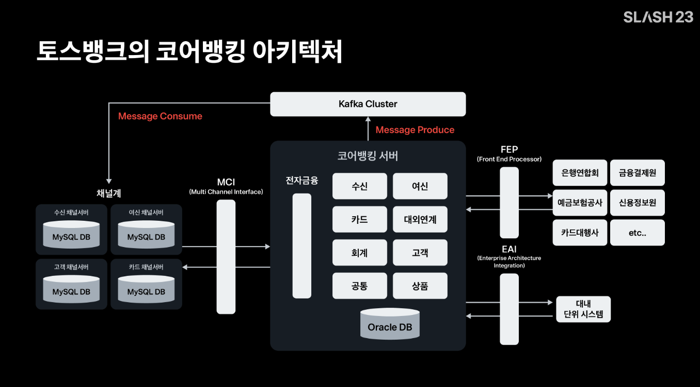
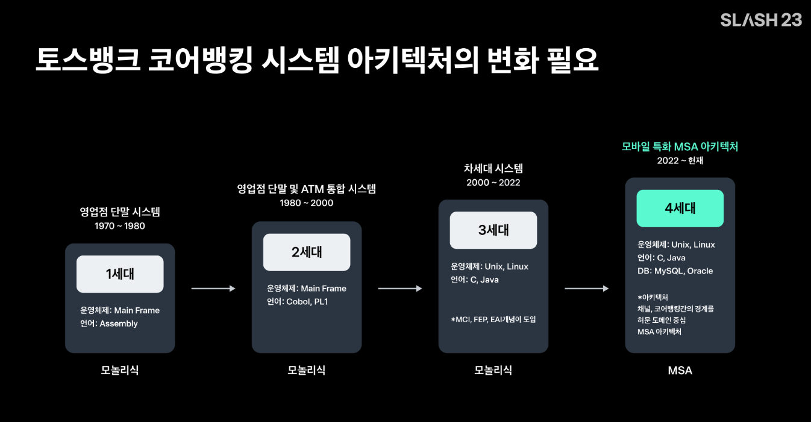
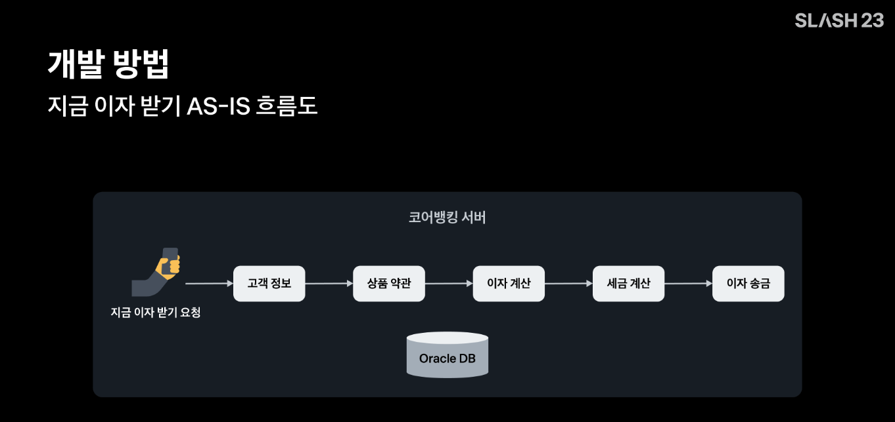
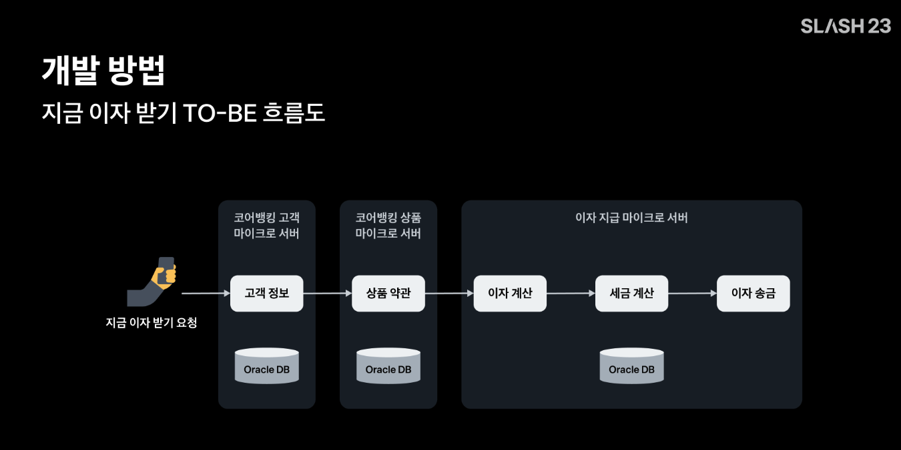
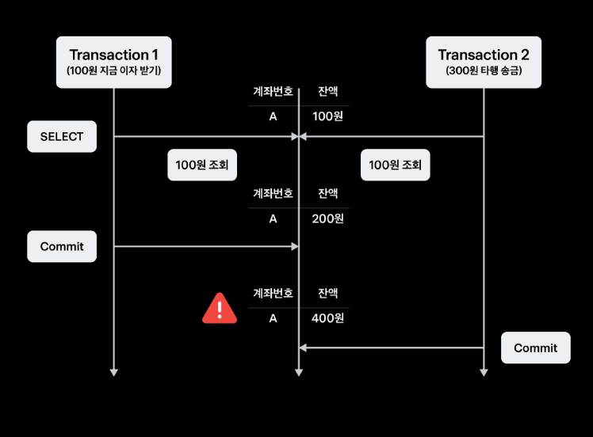
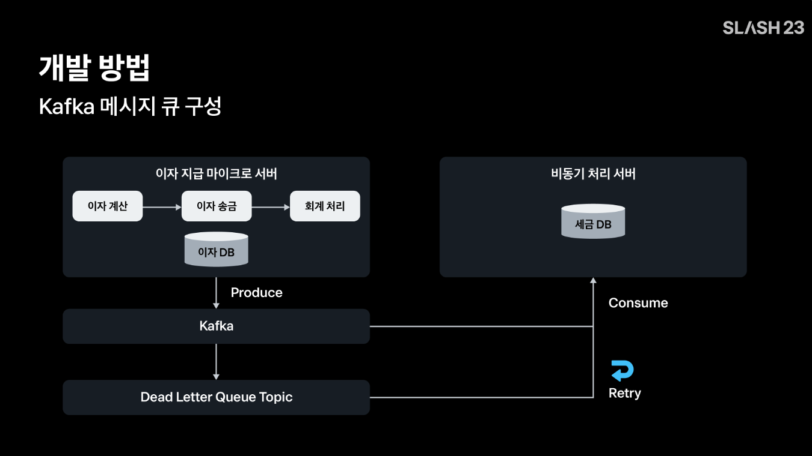
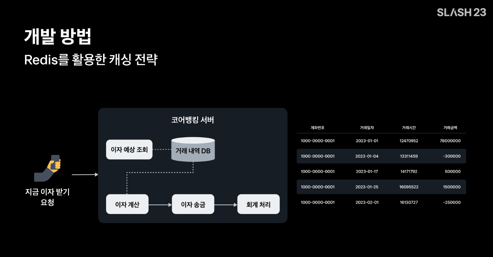
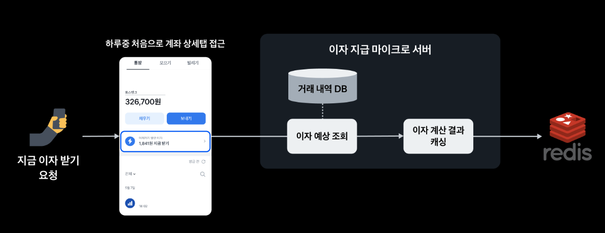
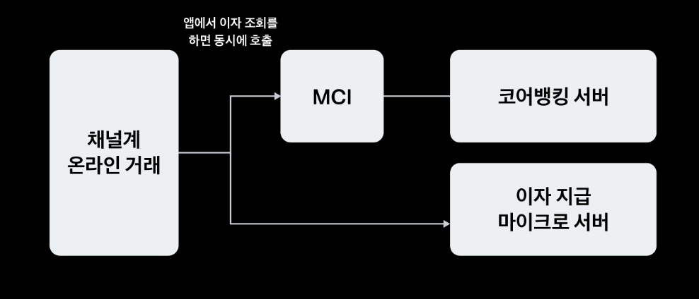
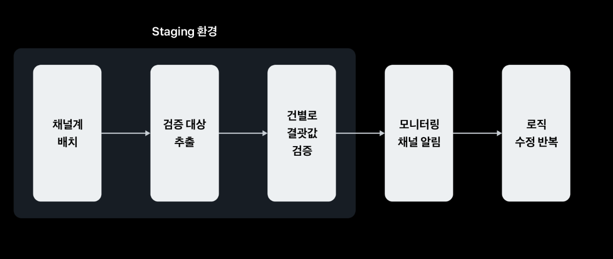

> 💡 현재 포스팅은 [토스 SLASH 23, 코어뱅킹 MSA 전환기](https://www.youtube.com/watch?v=amTJyIE1wO0&t=1237s) 를 듣고 정리한 내용이다.

<iframe width="100%" height="400" src="https://www.youtube.com/embed/amTJyIE1wO0?si=o1JKz_Tpz801Stfu" title="YouTube video player" frameborder="0" allow="accelerometer; autoplay; clipboard-write; encrypted-media; gyroscope; picture-in-picture; web-share" referrerpolicy="strict-origin-when-cross-origin" allowfullscreen></iframe>`

토스뱅크는 기존의 코어뱅킹 서비스를 고객 중심으로 변화시키기 위해, 금융의 혁신을 위해 많은 노력을 기울이고 있다. 그런데, 문제가 있다. 기존의 전통적인 뱅킹 시스템을 구현하는 방식으로는 안정적인 고객 중심 뱅킹 서비스에 한계가 있었다. 토스뱅크는 어떤 기술로 고객 중심의 뱅킹 서비스를 제공할 수 있었을까?

## 전통적인 금융 시스템

### 채널계와 코어뱅킹(계정계)

일반적인 금융권 시스템은, 특히 코어뱅킹 서버는 매우 거대한 모놀리식 아키텍처로 구성되어 있다. 은행에는 크게 고객의 요청을 코어뱅킹 서버로 전달하는 채널계와, 금원과 관련된 메인 비즈니스 로직을 처리하는 코어뱅킹(계정계) 라고 하는 2개의 서버를 중심으로 아키텍처가 구성되어있다. 

### 코어뱅킹 시스템 아키텍처 역사

코어뱅킹 시스템은 왜 거대한 모놀리식 아키텍처를 유지해왔을까? 이 이유는 금융 시스템의 변천사를 이애하면 그 정답을 알 수 있다.

1970년대부터 은행의 계좌 데이터를 적절하게 가공하고 처리해야 하는 니즈가 생기면서, 1세대와 2세대 코어뱅킹 아키텍처가 생겨났고, 2000년대에 디지털 붐이 일면서 모바일 뱅킹, 웹 뱅킹, 텔레뱅킹 등 다양한 거래 요청을 한 곳에서 적절하게 처리해줄 수 있도록 현재의 모놀리식 코어뱅킹 아키텍처가 생겨나게 되었다.

지난 20여년간 코어뱅킹 아키텍처는 운영체제와 개발 언어의 크고 작은 변화는 있었지만, 현재의 모바일 트렌드와는 맞지 않는 20년전의 모놀리식 아키텍처를 대부분의 은행에서 사용한다. MSA 의 구조를 취하지 않고, 현재의 거대한 모놀리식 형태로 몸집을 더 키워나가고 있었다.

현재 토스뱅크의 채널계는 기존 토스 전반 생태계의 DNA를 이어받아 모두 MSA 환경으로 구성되어 있다. 하지만, **기존의 토스 코어뱅킹 시스템은 여타 은행과 다름없이 채널계와의 통신을 위한 모놀리식 시스템으로 구성되어 있었다.** 기존의 토스 코어뱅킹 시스템은 Redis, Kafka 등의 모던한 기술을 사용하고는 있었지만, 여타 은행과 다름없이 채널계와의 통신을 위한 **MCI**, 대외연계를 위한 **FEP**, 대내 단위 시스템과의 연계를 위한 **EAI** 가 코어뱅킹 서버에 강하게 결합되어 있는 구조를 취하고 있었다. 

> 💡 `용어 정리`
> - **MCI(Message Channel Interface)** : 시스템 간의 데이터 교환을 위해 사용하는 메시지 기반 통신 인터페이스
> - **FEP(Front-end Processor)** : 메인 시스템 앞단에서 데이터 통신을 처리하는 전처리 장치 또는 프로세서
> - **EAI(Enterprise Application Integration)** : 조직 내 여러 이기종 애플리케이션간의 통합 및 데이터 교환을 가능하게 하는 소프트웨어 아키텍처

## 모놀리식 아키텍처의 한계. MSA 로의 전환

토스 코어뱅킹 시스템은 과거의 모놀리식 아키텍처를 금융권 최초로 MSA로 전환하였다. 모놀리식 코어뱅킹 아키텍처는 어떤 한게가 있었기에 MSA 로 전환을 했을까?

모놀리식 아키텍처도 몰론 장점이 있긴하다. 로컬 트랜잭션으로 하위 도메인 데이터를 ACID 하게 변경할 수 있고, 개발하게도 쉽다는 점이다. 하지만, **SPOF(Single Point Of Failure)** 에 취약하다. 모놀리식으로 구성된 코어뱅킹 시스템에 트래픽이 몰린다면, 특정 코어뱅킹 시스템만 스케일 아웃하는 전략을 취할 수 없다. 

토스뱅크는 대량 트래픽에 특화되어 있고, 각 업무별 서비스 영향도를 분리할 수 있는 MSA로 전환하기로 했다. 그 중에서도 토스뱅크 서비스 중 가장 트래픽이 많은 **이자 받기 서비스를 모놀리식 코어뱅킹 시스템에서 분리하여 MSA로 전환하기로 했다.** 지금부터 토스뱅크가 이자 받기 서비스를 어떻게 MSA 로 전환했는지에 대해 알아보자.

#### 기술 스택

MSA 로의 전환을 위해, 토스뱅크 채널계에서 사용하는 기술들을 대부분 채택했다. 쿠버네티스위에 스프링부트, 코틀린, JPA 등을 기반으로 개발했고, 비동기 메시지 처리와 캐싱은 Kafka, Redis 를 사용하기로 결정했다. 

## "지금 이자 받기" 기능 AS-IS 흐름

### MSA 아키텍처 구조

우선, 토스뱅크가 MSA 구조를 어떻게 구성했는지 전반 아키텍처 플로우에 대해 알아보자. 토스뱅크는 MSA 전환을 시작하자마자 첫 번째 고민에 봉착했다. 현재 모놀리식으로 강하게 결합된 업무별 비즈니스 의존성을 어느 정도까지 느슨하게 가져갈 것인가이다. **지금 이자 받기 서비스**를 위해 필요한 도메인은 `(1)` 고객 정보 조회, `(2)` 금리조회 및 이자계산, 그리고 `(3)` 이자의 회계 처리를 위한 회계 정보 조회 및 처리. 이 모든것을 하나의 마이크로 서버에서 처리하는 것은 MSA의 장점을 활용하지 못할 것이라 판단하여, 도메인 단위로 서비스를 나누기로 결정했다.

과거의 고객의 지금 이자 받기 요청은 고객 정보 조회를 거쳐, 금리 조회와 이자계산, 이자 송금, 회계처리를 1개의 트랜잭션으로 처리하고 있었다. MSA 로 전환한 새로운 코어뱅킹 아키텍처에서는, **트랜잭션으로 엮이지 않아도 되는 도메인은 별도의 마이크로 서버로 구성했다.** 그리고 각 서버의 API 호출을 통해 비즈니스 의존성을 느슨하게 가져가도록 구성했다.

>  💡 아키텍처를 보면서 궁금한점은, 각 마이크로 서버간의 데이터베이스는 어떻게 구성되어있고, 공유하는가이다. 정확한 구현 방식은 안그래도 조만간 토스뱅크 면접이 잡혀있으니, 한번 어쭤봐야겠다 😎

### 동시성 제어

은행 시스템의 안정성과 직결되는 부분은 동시성 처리이다. 토스뱅크 또한 동시성 처리를 위해 많은 고민이 있었다.

>  💡 이와 거의 똑같은 동시성 처리에 관하여 [JPA 낙관적 락과 비관적 락으로 엔티티에 대한 동시성 이슈 해결하기](https://haon.blog/database/optimistic-pessimistic-lock/) 에서 다룬적이 있다. 이를 참고하자.

동시성 문제가 터지는 상황을 하나 가정해보자. 현재 사용자 계좌에 남은 잔액은 100원이다. 그리고 트랜잭션 1은 "100원 지금 이자 받기" 를 처리하며, 트랜잭션 2는 "300원 타행 송금" 을 처리한다.

가장 먼저 트랜잭션1을 통해 이자를 받았고(잔액 100원 감소 로직), 트랜잭션2를 통해 입금을 받았다(잔액 300원 증가 로직)고 가정해본다면, 트랜잭션1은 현재 잔액인 100원에 지금 이자 받기를 수행하여 200원으로 계좌 잔액을 갱신할 것이다. 

이렇게 트랜잭션 1이 수행되는 그 사이에 트랜잭션2가 수행된다면? 트랜잭션2는 200원이 아니라 기존 잔액 값인 100원이라는 값을 읽어오고, 300원을 더하여 400원이라는 엉뚱함 금액으로 잔액을 갱신하게 된다. 즉, 데이터 정합성 문제가 발생한다. 토스뱅크는 동시성 처리를 위해 **Redis Global Lock 과 JPA 에서 제공하는 락**을 사용하여 문제를 해결했다.

다만, 락을 사용할떄는 주의사항이 있다. 락을 꼭 잡아야하는 최소한의 데이터에 대하서만 락을 획득해야 데드락과 성능 저하를 예방할 수 있다는 점이다. 지금 이자 받기 API 의 경우 잔액을 갱신하는 이벤트가 메인 비즈니스 로직이다. 따라서 계좌 단위 현재 잔액 데이터에 대해서만 **ROW 단위의 락이 걸리도록** 개발하여, 동시성을 처리했다.

또한 트랜잭션 2의 동시성이 발생했을 때, 트랜잭션 1이 끝날 때까지 기다릴 수 있도록 **재시도할 수 있는 로직과 적절한 타임아웃을 적용해주었다.** 이를 통해 고객은 락이 걸렸는지도 모르게 안정적으로 이자를 받을 수 있게 된다.  

> 💡 추측컨데, 토스뱅크는 이 당시 동시성 처리를 위해 **JPA 낙관적 락을** 사용하지 않았을까라는 생각이 든다. 우선 낙관적 락은 충돌이 자주 발생하지 않고 락을 거는 방식이다. "지금 이자 받기" 의 기능은 동시성이 아무래도 자주 발생할 경우는 아니다. 또한 재시도 로직은 `@Retryable` 로 처리할 수 있읉텐데, 비관적 락의 경우 처음부터 충돌을 방지하기 위해 락을 걸어두므로 재시도 로직을 수행할 필요가 없다. 타임아웃의 경우 낙관적 락과 비관적 락 어느 하나에 한정되지 않고 처리할 수 있는 로직이다. 낙관적 락을 활용해 @Retryale 로 재시도 로직을 구현하다 무한 대기에 빠지는 경우를 처리하기 위해 JPA 의 QueryHint 를 사용하지 않았을까? 라는 추측이다. 이 또한 토스뱅크 면접때 가능하다면, 한번 어쭤봐야겠다.

> 💡 또한 Redis Global Lock 을 사용했다고 하는데, 이는 단일 서버가 아닌 분산 환경에서 흔히 사용되는 락 메커니즘 일 것이다. JPA 락 메커니즘과 Redis 분산락을 어떻게 함께 사용했다는 건지 이 영상만 보고는 이해가 안간다. 이 또한 알아봐야겠다.

> 💡 나 또한 모행 서비스에서 동시성 처리를 해주었는데, 우리 서비스는 비관적 락으로 처리해두었다. "지금 이자 받기" 와 달리 여행지 조회시 카운팅 로직은 충돌이 자주 발생할 수 밖에 없는 상황이다. 이와 관련한 내용은 이전에 따로 정리해두었다.

### 성능 개선을 위해, Kafka 를 활용한 비동기 처리

다음으로, 토스뱅크는 Kafka 를 활용하여 비동기 트랜잭션을 구현했다. 기본 코어뱅킹 시스템에서는 1번의 이자를 지급받기 위해, 무려 20개의 테이블에 80번의 UPDATE, INSERT **대량의 쿼리를 날려야하는 복잡한 구조였다.**

따라서 지금 이자 받기 서비스의 속도는 평균 300ms 으로, 전체 코어뱅킹 서비스 중에서 정말 느린 편에 속했다. 이렇게 대량의 쿼리가 나가는 상황이라면, 아무리 DB 정규화를 잘 하고, 인덱스로 쿼리 튜닝을 하더라도 매우 빠른 응답속도를 기대하기는 어려울 것이다. 그래서 기존의 지금 이자 받기 기능의 **트랜잭션에서 분리가 가능한 테이블은 카프카를 이용해 트랜잭션에서 분리했다.**

> 카프카의 비동기 처리에 대한 추가 학습이 필요하다.

트랜잭션 분리에 대한 기준은 어떻게 했을까? 이는 고객의 잔액과 통장 데이터 관점에서 DB 쓰기 지연이 발생했을 때, 실시간으로 문제가 발생하느냐? 로 접근했다. 또한, 반드시 트랜잭션이 보장되어야 하는 데이터 모델과 즉시성(즉시 처리되지 않아도 되는) 을 요구하지 않는, 즉 세금 처리와 같이 지금 이자 받기 트랜잭션과 묶이지 않아도 되는 데이터 모델의 DML 은 트랜잭션을 분리했다. 

더 자세히 알아보자면, **지금 이자 받기 서버에서 지금 이자 받기의 트랜잭션 종료와 동시에 세금 카프카 토픽에 메시지를 Produce 하고, 비동기 처리 서버가 Consume 해서 세금 DB 에 저장하도록 구현했다.** 이와 유사한 브로트캐스팅 기법은 [Redis Pub/Sub 을 사용한 분산 환경에서 로컬 캐시 동기화](https://haon.blog/spring/redis-pub-sub-local-cache-synchornization/) 에서 다룬적이 있다. 정상적인 상황이라면, 이자 DB 와 세금 DB 에도 준 실시간으로 업데이트가 되었을 것이기 때문에 지금 이자 받기 거래는 정상적으로 종료될 것이다.

그런데, 카프카 메시지가 정상적으로 처리되지 않는 경우도 있다. 따라서 **Dead Letter Queue** 를 이용해서 세금 DB 에 대한 트랜잭션을 안정적으로 처리할 수 있도록 보장했다. 또한, 재처리시 중복으로 세금이 업데이트 안 되도록 API 도 멱등하게 설계했다.

이렇듯 토스뱅크는 세금 DML 을 지금 이자 받기 트랜잭션에서 분리함으로써, 기존 80회의 DML 쿼리가 이루어지던 트랜잭션을 50회의 DML 로 줄이는 개선 효과를 얻어내었다.

### Redis 를 활용한 캐싱 전략

기존 코어뱅킹 시스템에서의 이자 계산은 RDB 기반의 일자별 거래내역 DB 를 조회해서 연산하는 방식으로 구현되어있었다.

고객이 지금 이자 받기를 할 때마다, 계좌의 매일 매일 거래내역을 데이터베이스로 부터 조회해서 이자 계산과 세금을 계산하는 구조였다. 그 때문에 성능적으로 오래 걸릴 수 밖에 없는 구조였다. 그러나 **고객은 하루에 1번밖에 이자를 못 받기 때문에** Redis 를 활용하면, 하루에 1번만 DB I/O 를 발생시킬 수 있을 것이라 판단해서 Redis 를 이용해 캐시를 활용하기로 했다.

기존의 이자 금액은 고객이 계좌 상세탭에 접근할 때 마다, 이자계산을 위한 DB I/O 가 발생하고 있었다. 이를 고객이 하루 중 처음으로 계좌 상세탭에 접근할 때만 DB 에 접근하도록 구현했고, **이자예상조회의 결과를 Redis 에 캐싱해 두도록 구현했다.**

그래서 고객이 하루에 2번이상 계좌 상세탭에 접근할 경우에는 Redis 에 미리 저장되어있던 이자계산 결과를 리턴하도록 했다. 그래서 불필요하게 DB 리소스가 낭비되는 것을 방지했다. 또한, Redis 에 캐싱된 이자 데이터의 **만료일자도 하루로 두어서,** 이자금액이 잘못 계산되는 오류 케이스도 원천적으로 방지했다. 그래서 매일 자정 이후 고객이 계좌 상세탭에 처음 접근할 때만, 이자 에상 조회의 결과를 캐싱해서 이자 **데이터의 정합성을 보장할 수 있게 되었다.**

## 기존 모놀리식 아키텍처를 MSA 로 안전하게 마이그레이션 하는 방법 (API 검증)

위와 같은 과정을 통해, 토스뱅크는 이자 지급 마이크로 서버에 이자 조회 거래, 지금 이자 받기 거래 개발을 마쳤다. 그렇다면 이제, 기존 코어뱅킹(계정계) 를 참조하던 서비스를 이자 지급 마이크로 서버를 바라보도록 라우팅 환경을 전환해야 할 것이다.

그런데, 이 라우팅 환경을 재구축하기 위한 선수 과정이 필요했다. 이자 지급 마이크로 서버 API 가 기존에 모놀리식 아키텍처에 구현된 방식과 똑같이 동작하는 것에 대해 검증이 필요하다는 점이다. 이를 위해 어떤 방식으로 검증을 할 수 있을까?

### 실시간 검증을 통한 건별 검증 방식 (온라인 검증)

토스뱅크는 이를위한 첫번째 방안으로, 온라인 검증을 시도했다. 먼저, 앱(채널계)에서 고객이 이자 조회 거래를 일으키면 채널계에서 `MCI(Message Channel Interface)` 통한 기존 코어뱅킹 서버에 이자 조회 서비스를 호출하고, 이자 지급 마이크로 서버의 API 를 **"동시에"** 호출했다. 

**코어뱅킹 서버에서 리턴된 이자 값과 이자 지금 마이크로 서버에서 리턴된 이자 값을 각각 리턴받아, 두 이자값이 불일치 할 경우 토스뱅크 내부 모니터링 채널에 해당 내용을 알림받도록 했다.** 채널에 알림이 오면 대상 및 로그를 확인하고 원인을 확인하여, 이자 계산 로직을 수정해주는 과정을 거쳤다.

### 배치를 활용한 대량 검증 방식

> Staging 환경이란, 실제 운영환경과 동일하게 구성된 내부 API 테스트용 환경을 뜻한다.

또한 배치를 활용한 대량 검증 방식을 도입했다. **Staging 환경에서 채널계 배치를 통해 매일 대량의 검증 대상 목록을 추출했고,** 앞선 온라인 검증 방식과 동일하게 코어뱅킹 서버와 이자 지급 마이크로 서버를 각각 호출해주었다. 대상 목록에 대한 검증이 모두 끝나면, 이자 리턴 값이 불일치했던 건들에 대한 내용을 담아 내부 모니터링 채널에 알림으로 받았고, 로직 수정을 반복하였다.

## 테스트 시나리오 작성을 통한 E2E 통합 테스트 수행하기

위와 같은 API 검증 방식을 통해, 이자 조회 거래에 대한 검증을 마쳤다. 그런데 실제 이자를 지급받는 지금 이자 받기 거래의 경우 코어뱅킹 DB 원장에 잔액을 갱신하고, 회계 처리를 해주는 등의 작업이 필요했다. 따라서 **거래가 발생했을 때 실제 데이터가 정확하게 쌓이고 갱신되었는지 추가로 검증해야 했다.**

토스뱅크 통장은 잔액을 구간별로 나누어 이자를 차등 지급하고 있다. 잔액 구간별로 나누어 차등 계산되어, 이자가 지급되었는지 검증이 필요했다. 그리고 명의도용, 해킹 피해, 사망 등 토스뱅크 고객의 상태에 따른 검증이 필요했고, 계좌의 상태 및 출금/입금 정지 상태에 따른 검증이 필요했다. 

해당 검증 케이스들을 고려해서 테스트 시나리오를 작성했고, 케이스 별로 테스트를 진행하여 이자 계산 및 실제 데이터베이스에 데이터가 정확하게 갱신되었는지를 확인하며 로직을 수정해주는 과정을 거쳤다. 이 과정을 통해, 이자 받기 거래에 대한 정합성 검증을 완료할 수 있다.

## 순차 배포를 통한 안정적인 마이그레이션하기

> 💡 여기서 말하는 순차 배포란, 무중단 배포 전략 중 하나인 롤링(Rolling) 배포를 말하는 듯 하다.

이렇게 API 검증이 끝났으니, 코어뱅킹을 바라보던 서비스를 이제는 이자 지급 마이크로 서버 API 만을 바라보도록 라우팅 환경을 전환해주면 된다. API 를 전환할 때 대상 모수를 점차 늘려가며, 순차적으로 오픈했다. 먼저 토스뱅크 수신 개발팀에 오픈하여 직접 이자 받기 거래를 일으키며 데이터 검증 값을 검증했다. 특이사항이 없는 것을 확인하여 토스뱅크 내부 팀원에게 오픈했고, 모니터링을 진행했다.

다음으로는 **일부 고객을 대상으로 오픈하고 점차 모수를 늘려가며 순차 오픈하여, 전체 고객을 대상으로 전환을 완료하는 방식을 선택했다.** 코어뱅킹 서버를 바라보던 API 호출량과 이자 지급 마이크로 서버를 바라도면 API 호출량을 조절하여 이자 지급 마이크로 서버의 트래픽을 점차 늘려가는 형태로 진행했다. 

이로써 토스뱅크는 순차 배포 방식을 채택함으로써 기존에 운영하고 있던 시스템을 무중단하고, 안정적으로 시스템을 마이그레이션했다. 

## 코어뱅킹 MSA 전환의 성과

- 코어뱅킹 시스템의 세대 전환
- 오픈소스 기반의 개발 환경 변화에 따른 유연성 및 확장성 증가
- 지금 이자 받기 거래의 성능 170배 개선
- 계정계 서버로부터 독립저깅ㄴ 서버를 구축함으로써 안정성 증가
- 지금 이자 받기 피크타임 트래픽에도 개별적으로 이자 지급 서버 스케일 아웃 가능
- 도메인 단위로 분리하여 효율적인 MSA 코어뱅킹 시스템 구축
- 빅뱅 배포 방식을 탈피하여 무중단 시스템 전환 가능

