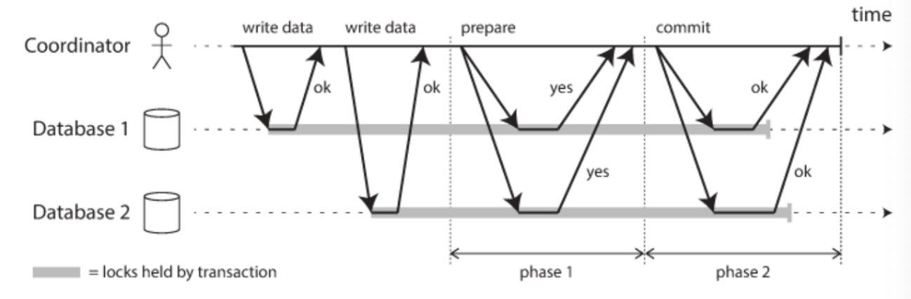
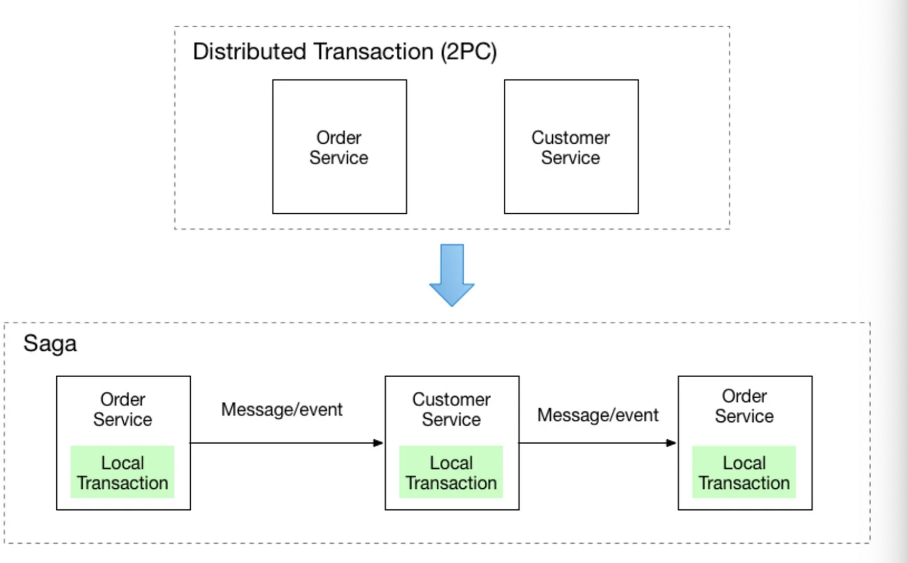
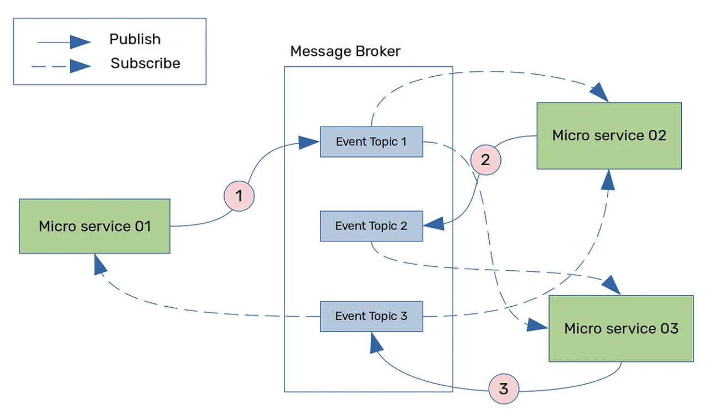
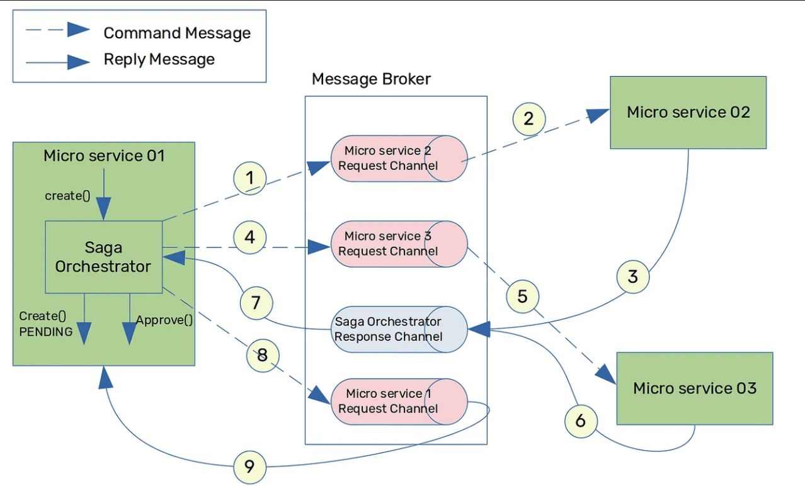

## MSA 환경에서 글로벌 트랜잭션 구현하기

기존 모놀리식 환경에서는 DBMS 가 트랜잭션의 ACID 를 보장해주었다. 이는 로컬 트랜잭션으로 동작하기 덕분이다. 트랜잭션 작업 중 일부가 실패하면, 전체 작업을 커밋 또는 롤백하는 구현이 간단했다.

하지만, MSA 환경에서는 하나의 기능이 여러 마이크로 서버를 걸쳐서 수행된다. 즉, **MSA 환경에서는 하나의 트랜잭션이 마이크로 서비스의 물리적인 로컬 트랜잭션 여러개가 묶여서 구성된다.** 더 이상 DBMS 가 지원하는 단순한 로컬 트랜잭션 만으로는 데이터 일관성을 유지할 수 없게 된다. **일부 마이크로 서버에서 로컬 트랜잭션 커밋에 실패하여 롤백하게 되면, 데이터 일관성을 깨지게 된다.**

예를들어 MSA 환경에서 회원 서비스, 멤버쉽 혜택 관리 서비스, SNS 친구 관리 서비스가 있다고 해보자. 각 마이크로 서비스는 독립적인 데이터베이스를 바라보고 있다. 이때, 유저가 회원가입을 시도하면 어떻게될까? 우선 `(1)` 회원 서비스에서 회원가입과 동시에 회원 데이터를 데이터베이스에 저장하는 트랜잭션이 생성될 것이다. 그리고 `(2)` 신규 회원을 위한 멤버쉽 혜택을 회원 서버에게 전달하며, 신규 회원을 위한 멤버 혜택 정보 및 등급을 저장하는 트랜잭션이 실행된다. 마지막으로 `(3)` 친구 추천을 제공하기 위한 트랜잭션이 실행된다.

각 트랜잭션 1, 2, 3은 서로 다른 마이크로 서비스내의 완전히 분리된 데이터베이스에서 동작한다. 그런데 트랜잭션 2를 실행하다 장애가 발생하여 롤백해야 한다면? 트랜잭션 1은 이미 커밋된 상황이라면 어떻게 될까? 아불싸. 달리 방법이 없다. 각 트랜잭션들은 별도의 처리가 없다면 로컬 트랜잭션으로 동작하므로 각자 알아서 커밋되고, 롤백되기 때문이다. 2번 트랜잭션을 수행하다 장애가 터져 트랜잭션 1, 2를 모두 함께 롤백하고 싶다면, 이 로컬 트랜잭션들을 하나의 트랜잭션 덩어리로 묶어서 커밋, 롤백하는 기법이 필요하다. 이를 **글로벌 트랜잭션(Global Transaction)** 이라고 한다.

그렇다면, MSA 환경에서 여러 마이크로 서비스에 걸친 로컬 트랜잭션들을 마치 하나의 트랜잭션으로 합쳐서 수행하는 방법으로 무엇이 존재할까? 즉, 글로벌 트랜잭션 구현 방법 종류에 어떠한 것들이 있을까? 이 구현 방법에는 크게 2PC 와 SAGA 패턴이 있다.

### 글로벌 트랜잭션

글로벌 트랜잭션과 관련해서는 [글로벌 트랜잭션 (feat. GTID)](https://haon.blog/database/global-transaction/) 에서도 간단히 다룬적이 있다. 복습 차원에서 다시 개념을 짧게 학습해보겠다.

만약 하나의 트랜잭션에서 데이터베이스 여럿에 접근해 데이터를 추가해야 한다면 어떻게 해야할까? 또는 데이터베이스에 데이터를 추가하고, 그 이후에 메시지 큐에 메시지를 추가하는 작업을 하나의 트랜잭션으로 묶고 싶다면? 즉, 2개 이상의 작업 단위를 하나의 트랜잭션으로 처리하고 싶다면?

이는 앞서 설명했듯이 로컬 트랜잭션으로는 처리가 불가능하다고 했다. 로컬 트랜잭션은 하나의 커넥션에 종속적이기 떄문이다. 따라서 **다수의 자원 및 작업에 대한 요청을 하나의 트랜잭션으로 처리하기 위해선 각 DB 에 종속적으로 만들어지는 커넥션을 통해서가 아니라, 별도의 트랜잭션 매니저를 통해 트랜잭션을 관리하는 글로벌 트랜잭션 방식으로 처리해야한다.**

스프링 진영에서는 JTA(Java Transaction API) 라는 트랜잭션 매니저 API 를 제공하고 있다. **스프링에서는 JTA 기반 트랜잭션 매니저에 글로벌 트랜잭션(2PC) 가 구현되어 있다고 했었다.**

## 2PC(Two-Phase Commit) 패턴

2PC 에 대해 다시금 학습해보자. 2PC 는 [글로벌 트랜잭션 (feat. GTID)](https://haon.blog/database/global-transaction/) 에서도 간단히 다룬적이 있다. 2PC 는 **코디네이터(coordinator)** 와 독립된 여러 데이터베이스간의 합의를 통해 트랜잭션이 커밋/롤백이 결정된다. (어쩌면 합의라는 표현보다는, 코디네이터와 DB 간의 질의를 통해 커밋/롤백이 결정된다고 표현하는 것이 적합하겠다.)

2PC(Two-Phase Commit) 은 이름 그대로 두 단계의 Phase 를 거쳐서 트랜잭션을 수행한다. 각 Phase 에서는 어떠한 작업을 수행하는가? 글로벌 트랜잭션 수행되는 플로우를 3단계로 나누어보면 아래와 같다.

- `(1)` 코디네이터(트랜잭션 매니저) 는 트랜잭션을 시작하고, 각 데이터베이스에게 쿼리를 날려 연산을 수행한다.

- `(2)` 1-Phase : 1-Phase 에서는 Coordinator 가 각 데이터베이스에게 커밋을 해도 되는지 (또는 롤백해야 하는지) 를 질문한다. 이에 따라 글로벌 트랜잭션에 참여하는 각 데이터베이스는 커밋이 가능한 상태 또는 불가능한 상태임을 코디네이터에게 응답한다.

- `(3)` 2-Phase : 1-Phase 응답 과정을 분석하여, 코디네이터는 모든 트랜잭션을 커밋 또는 롤백할지 결정한다.

1-Phase 는 Prepare 과정으로도 불리고, 2-Phase 는 Commit 과정으로 불린다. 두 단계의 Phase 로 나뉘므로 Two-Phase Commit 으로 불린다. 이를 통해 서로 다른 DB 간의 정합성을 보장할 수 있다.

그리고 그림을 보면 알 수 있듯이, 데이터에는 쓰기 시작할 때 부터 커밋할 때 까지 락을 건다. 따라서 두 데이터베이스를 함께 조회하더라도 커밋되지 않은 쪽은 락이 잡혀있어서, 두 데이터베이스가 불일치된 상태로 조회되지 않는다. **즉, 락을 이용해 정합성을 보장한다.** Phase-1 에서 모든 리소스(데이터베이스) 가 OK 응답을 보재면, Phase-2 에서는 모든 리소스 매니저에게 Commit 을 지시하고, 락도 해제한다.

### 단점

다만, 2PC 패턴은 아래의 단점들로 인해 MSA 환경에서 잘 사용되지 않는다.

- 락을 사용하므로 성능이 저하된다.

- NoSQL 등 일부 DBMS 에서 지원하지 않는 경우가 존재하여, 2PC 를 구현 불가능한 경우가 있다.

- 이종의 DBMS 에서는 사용하기 어렵다.

- MSA 에서 일반적으로 마이크로 서비스는 각자의 데이터베이스를 소유하고, 다른 마이크로 서비스에게는 Public API 를 통해 데이터를 제공한다. 여러 데이터베이스에 걸친 글로벌 트랜잭션을 하나의 코디네이터가 관리하는 구조에서 적합하지 않다.

- 코디네이터에 의존적이다. 코디네이터 장애 상황에서 각 데이터베이스는 커밋/롤백 여부를 스스로 결정할 수 없다.

## SAGA 패턴

SAGA 패턴은 MSA 같은 분산 환경에서 데이터 일관성을 보장하기 위해 등장한 설계 패펀이다. 이 패턴에서는 **연속된 개별 마이크로 서비스에서 로컬 트랜잭션이 실행되고 이어지면서, 전체 비즈니스 트랜잭션을 구성한다.** 첫번째 트랜잭션이 완료되면 두번째 트랜잭션이 트리커 되고, 두번째 트랜잭션이 완료되면 3번째 트랜잭션이 트리커된다.

만약 트랜잭션 중 하나가 실패하면, SAGA 패턴은 이미 성공적으로 완료된 로컬 트랜잭션들을 **보상 트랜잭션(compensating transaction)**을 발생시켜 모두 취소하여 전체 데이터 일관성을 유지한다. 보상 트랜잭션이란 이전에 커밋된 트랜잭션을 취소하는 연산이다. 즉, SAGA 패턴에서는 **데이터 일관성을 보장하는 주체가 DBMS 가 아니라 애플리케이션**이다. 이것이 핵심이다. 보장 트랜잭션이 적용되기 전까지 일시적으로 데이터베이스 일관성이 잠시 깨져있을 수 있으나, 보장 트랜잭션이 완료되면 "결과적으로" 정합성을 보장한다.

> 💡 보상 트랜잭션은 이미 발생한 트랜잭션이 만들어낸 변경을 되돌리기 위해 새로운 트랜잭션을 추가하는 방식이다. 고객이 이미 결제 금액을 지불했다면 지불된 돈을 돌려주는 것이고, 고객에게 포인트를 부여했다면 그 포인트를 다시 회수하는 것이 보상 트랜잭션의 예시가 될 수 있다. 이렇기 때문에 보상 트랜잭션을 의미론적인 롤백(semantic rollback) 이라고도 말한다.

SAGA 패턴는 2가지 종류가 있다. 코래오그래피 기반 사가와 오케스트레이션 기반 사가 이 2가지가 있다.

### 코레오그래피 기반 사가 (Choreography-based Saga)

각 마이크로 서비스는 트랜잭션이 완료되면, 완료 이벤트를 메시지 큐에 발행한다. 만약 그 다음에 수행되어야 할 로컬 트랜잭션이 있다면, 해당 이벤트를 구독한 마이크로 서비스가 이어서 로컬 트랜잭션을 실행한다. 이때 만약 중간에 로컬 트랜잭션이 실패하면, 이를 상쇄하기 위한 보장 트랜잭션 이벤트를 발생하여 롤백을 시도한다.

#### 장점

- 구성이 편리하다
- 하나의 서비스에 장애가 터져도, 시스템 나머지 부분이 영향을 덜 받는다.

#### 단점

- SAGA 참여자가 많을 경우 트랜잭션 흐름이 복잡하고, 길어진다.
- 마이크로 서비스간 순환 종속성이 발생할 수 있다.
- 각 마이크로 서비스가 서로를 알고있는 구조로, 결합도가 높다.

### 오케스트레이션 기반 사가 (Orchestration-based Saga)

중앙 집중된 1대의 SAGA Orchestrator(코디네이터) 가 SAGA 참여자들에게 어떤 로컬 트랜잭션을 실행해야하는지 알려주는 방식이다. 즉, 중앙화된 1대의 코디네이터가 전체 프로세스의 로컬 트랜잭션 실행 순서를 정의하고, 필요하다면 보상 트랜잭션을 발생시켜 롤백한다.

#### 징점

- 모든 로컬 트랜잭션을 오케스트레이터가 관리하여, 트랜잭션 흐름이 명확하다. (모니터링 하기도 쉬워질 것이다.)

- 각 마이크로 서비스는 서로를 알 필요가 없다. 따라서 결합도가 낮다.

#### 단점

- 오케스트레이터가 중앙 집중되어 SPOF(단일 장애 지점) 이 될 수 있다.
- 같은 이유로 확장성과 유연성이 낮다.

## 정리

MSA 환경에서 각 마이크로 서비스별로 데이터베이스를 분리하는 것은 일반적인 패턴이다. 데이터베이스를 분리할 때는 서비스간의 독립성과 확장성을 확보할 수 있다는 장점이 있지만, 서비스 전체의 데이터 일관성을 유지하는 것이 기존의 단일 데이터베이스보다 어려워진다는 이슈도 존재한다.

이를 해결하기 위해 2PC 와 같은 2단계 커밋 프로토콜이 등장하기도 했지만, 이는 모든 DB 가 응답할 떄까지 코디네이터가 기다려야하는 방식이므로 네트워크 지연등으로 인해 전체 트랜잭션 처리 시간이 길어질 수 있다는 성능 문제가 있다.

이후 등장한 SAGA 패런은 연속적인 로컬 트랜잭션의 조합으로 데이터 일관성을 유지하고 하는데, 2PC 과 달리 특정 데이터에 락을 걸지 않아도 된다는 장점이 있다.

### 코레오그래피 기반 사가 vs 오케스트레이션 기반 사가

SAGA 패턴의 구현 방식 2가지 중 어떤 방식을 선택하는게 적합할까? 우선 코레오그래피 방식은 마이크로 서비스간의 결합도가 낮고 중앙화된 코디네이터를 필요로 하지 않기 떄문에, 오케스트레이션 방식에 비해 장점이 크다고 보지만 그만큼 프로세스의 실행 순서와 진행 상황을 파악하고, 모니터링하기 어렵다. 따라서 **코레오그래피 방식은 팀 내에서 적절한 모니터링과 로깅, 이벤트 전략을 갖추었을 때에만 선택하는 것이 적합하다.**

### SAGA 패턴은 트랜잭션이 격리(Isolation)되지 않는다

SAGA 패턴은 트랜잭션 ACID 원칙 중에 격리성(Isolation) 을 보장하지 않는다. 따라서 이를 고려한 설계가 필요하다.

## 참고

- https://hudi.blog/global-transaction/
- https://www.youtube.com/watch?v=xpwRTu47fqY
- https://medium.com/@greg.shiny82/마이크로서비스-사가-패턴-544fc1adf5f3
- https://microservices.io/patterns/data/saga.html
