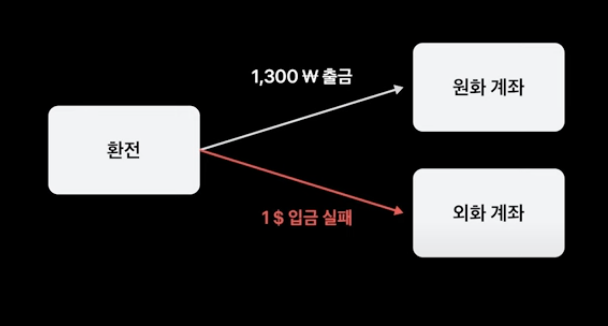
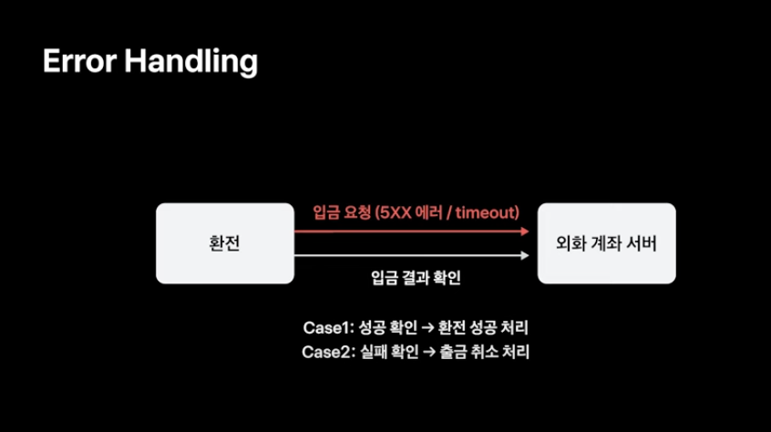

## 코어뱅킹 서버의 환전 기능

토스뱅크는 코어뱅킹 서버의 도메인들은 Oracle DB 를 그대로 참조하고 있다. 반면 새롭게 개발중인 도메인들은 MySQL 을 참조한다. 예를들면 예전부터 존재했던 원화 계좌 서버는 변동없이 기존 코어뱅킹의 데이터베이스인 Oracle 을 참조하고 있다. 반면 신규 상품인 외화 계좌 서버는 DB 까지 분리된 MSA 환경에서 MySQL 을 참조하고 있다.

즉, 환전 기능은 데이터베이스와 마이크로 서버 모두가 독립적으로 분리된 원화 계좌 서버, 외화 계좌 서버로 2개를 동시에 활용하며 구현되어야 했다. 토스뱅크의 환전 기능은 토스뱅크 앱으로 간편하게 원화를 지불하고 외화로 바꿔받는 기능이다. (또는 그 반대이다.)

여기서 문제는, 원화 계좌 서버와 외화 계좌 서버가 서로 다른 데이터베이스를 바라보고 있다. 이에 따라 분산 트랜잭션 기법이 필요함을 느낄 수 있다. 즉, 글로벌 트랜잭션을 구현해야 한다.

## 분산 트랜잭션 구현하기 (2PC vs SAGA)

2PC 와 SAGA 패턴은 [MSA 환경에서 SAGA 패턴과 2PC 패턴를 통해 트랜잭션 일관성 보장하기](https://haon.blog/article/toss-slash/distribution-transaction/) 에서도 다룬적이 있다. 코어뱅킹 서버의 환전 기능에는 어떠한 구현 방식이 적합할까?

2PC 의 경우 모든 데이터에 락을 걸기도 하고, 글로벌 트랜잭션에 참여하는 모든 참여자로부터 OK 신호를 받을 때 까지 기다려야한다. 즉, 참여자중에 트랜잭션 처리가 가장 느린 참여자들을 위해 다른 모든 참여자들이 대기해야하므로 성능이 느리다.

반면 SAGA 패턴의 경우 각 서비스들에서 로컬 트랜잭션만 진행한다는 점에서 높은 가용성과 확장성을 갖는다. 몰론 일부 로컬 트랜잭션들만 커밋된 중간 상태가 노출되며, 롤백을 위한 보장 트래잭션을 직접 구현해야 한다는 단점이 있긴하다. 하지만 토스뱅크는 환전 서비스가 높은 트래픽을 견디고 카드, 회계등 다른 참여자들도 향후에 더 생길 수 있다는 점에서 SAGA 패턴을 택했다.

### 오케스트레이션 기반 사가 vs 코레오그래피 기반 사가

코레오그래피 사가는 중앙 제어가 없기 떄문에 SPOF 가 발생하지 않고, 각 서비스들간에 메시지 큐를 활용해 통신하므로 결합도가 느슨하다.

하지만, 토스뱅크는 모니터링이 중요했기 떄문에 오케스트레이션 사가를 택했다. 클라이언트 요청을 받아 환전을 시작하는 환전 서버가 필요했고, 현재 진행중인 환전들의 상태를 실시간으로 관리해야 했기 떄문이다. 예를들어 환전 한도를 구현하려면, 현재 진행중인 환전의 금액과 상태도 추적해야 했기 떄문이다.

## 환전 구현 방법

환전 기능 이해를 위해, 한화 1300원을 지불하고 외화 1달러를 지급받는 것을 가정해보자. 이떄, 실패 하는 경우를 가정해보겠다. 실패의 종류는 `(1)` 정상적인 실패와 `(2)` 비정상적인 실패(에러) 로 나뉜다.

정상적인 실패란 잔액 부족, 고객/계좌 거래 제한등으로 인해 입출금이 실패하는 것으로, 당연히 실패하는 것이 정상적인 케이스를 뜻한다. 반대로 네트워크 에러, 타임아웃등의 에러가 발생하는 경우이다.

### 환전 실패 CASE1 - 입금 실패

만약 사용자가 원화 계좌로 1300원을 출금하는데는 성공했지만, 외화 계좌로 1달러는 입금받는데 실패했다면 어떻게 처리해야할까? 이는 SAGA 패턴에서 보상 트랜잭션을 통해 롤백하여, 원화 계좌로 입금된 1300원을 사용자에게 원상태로 되돌려줘야 한다.

이를 위해 보장 트랜잭션을 내부 로직을 원화 계좌로 1300원을 입금해주는 방식으로 구현하여, 사용자에게 돈을 다시 되돌려줄 수 있다. 즉, 유저 입장에서는 -1300원 되었던것이 다시 +1300원 되어 0원이 되어서, 원상 복귀 된 것이다.

### 왜 출금이 입금보다 선행 되어야 할까?

SAGA 패턴의 특성상, 일부 로컬 트랜잭션만 커밋된 중간 상태가 노출될 수 있다고 했었다. 이 특성 때문에 **출금이 입금보다 선행되어야 한다.** 만약 입금이 선행된다면 무슨 문제가 발생할까?

외화 계좌로 1달러를 가장 먼저 입금했다고 해보자. 그 두에 원화 계좌로부터 1300원을 출금해오려고 하는데, 이때 실패하여 보상 트랜잭션으로 롤백해야한다. 그런데 이때, 카드 서버에서 결제 요청이 와서 외화 계좌로 부터 입금되었던 1달러를 가져간다면, 외화 계좌는 0달러가 된다. 맙소사. 이 상황이 발생하면 보상 트랜잭션 처리가 불가능해진다. 외화 계좌가 카드 결제로 인해 1달러에서 0달러로 변했으므로, 현재 잔고 0달러에서 1달러를 가져오는 것은 불가능하기 때문이다. (계좌 잔고가 0달러에서 1달러가 출금되어 -1달러가 되는건 말이 안되니깐.)

즉, **환전을 입금부터 실행하면 환전이 끝나기전에 다른 트랜잭션에서 입금한 돈에 개입하여 출금해버릴 수 있다.** 따라서 환전 기능은 반드시 출금이 선행되어야 한다.

### 입금, 출금시 통신 방식 (HTTP vs Kafka)

이때, 입출금시 어떠한 통신 방식으로 통신하고 있을까? 크게 HTTP 와 Messaging 방식이 있을 것이다.

대부분 SAGA 패턴에서는 Messaging 방식으로 구현된다. 비동기 방식이며, 서비스간 결합도가 느슨해지며, 메시지 브로커 레벨에서 재시도와 같은 애러 핸들링을 지원하기 때문에 데이터에 대한 결과적 정합성을 보장하는데 유리하다.

하지만, 토스뱅크는 HTTP 통신 방식을 택했다. 그 이유는 `(1)` **출금 결과를 반드시 알고 입금으로 넘어가야 하기 때문이다. (By 동기 방식)** 그리고 `(2)` **유저에게 환전이 즉시 완료되기를 알려줘야 하기 때문이다. 만약 환전 기능이 지연되었다면 유저에게 환전이 지연되었음을 알려줘야 하는데, 이 경우 타임아웃 기능이 필요하다.** 타임아웃을 비동기 메시징 방식으로 구현하려면 입출금 결과를 다시 메시지로 받고 Polling 하는 등의 구현 복잡도가 높아진다.

### 출금 취소는 Messaging

반면 보상 트랜잭션의 구현 내용인 출금 취소는 Messaging 방식을 택했다. 그 이유는 `(1)` 출금 취소는 마지막 과정이며, `(2)` 유저가 이를 기다릴 필요가 없기 떄문이다. (돈이 실제로 다시 입금되는 것을 동기로 기다릴 필요는 없다.) 그리고 `(3)` 출금 취소 또한 실패할 수 있다. 이미 입금이 실패했기 때문에, 출금된 돈은 반드시 유저에게 돌려줘야한다. 그런데 이런 애러 핸들링을 메시지브로커 원화 계좌 컨슈머에게 위임한다면, 결과적 정합성을 보장하기 유리할 것이다.

## 비정상적인 에러 핸들링

환전 서버에서 원화 계좌 서버로 출금 요청을 보냈을 때 타임아웃이 발생했다면 어떻게 해야할까? 타임아웃 자체가 나버리면 원화 계좌 서버에서 요청을 정상적으로 처리했는지 안했는지, 즉 성공/실패를 확정할 수 없다.

이는 원화 계좌 서버로 다시 출금 결과룰 재확인(Retry)하여 그에 따라 조취한다. 재확인 결과로, 만약 출금에 성공했음을 알게 되었다면 출금 취소를 처리하면 된다. 반대로 출금에 실패했다면 요청 자체가 실패한 것이므로, 추가적인 조취 없이 환전을 실패 처리하면 끝이다.

입금의 경우도 마찬가지이다. 입금 요청에서 타임아웃이 발생하면 입금 결과를 다시 재확인한다. 그 결과로 입금에 성공했음을 알게 되면 출금과 입금 모두 성공한 것이므로 환전을 성공 처리하면 된다. 반대로 입금에 실패했다면, 앞서 출금했던 내역을 보장 트랜잭션으로 취소한다.

### 재확인조차 못한다면?

만약 상대방 서버(외화 계좌, 원화 계좌) 자체에 장애가 터져거나 네트워크 병목이 발생하여 재확인 조차 못한다면 어떻게 해야할까? 이 해결법은 [확정할 수 없는 모종의 네트워크 에러/지연 문제를 안전하게 서비스하기](https://haon.blog/article/toss-slash/safely-network-handling-errors/) 에서도 다룬적이 있다. 바로 카프카와 같은 메시지 큐를 이용하면 된다.

토스뱅크에는 메시지를 지연시켜서 발행할 수 있는 카프카 메시지 스캐줄러 서버가 존재한다. 일반적인 경우, Producer 가 메시지를 발행하면 그 즉시 메시지 브로커를 통해 컨슈머에게 메시지가 전달된다. 그런데 여기에, 메시지에다 지연시간 값을 넣어서 메시지를 발행하면 별도의 지연 Topic 을 거쳐서 메시지가 카프카 메시지 스캐줄러에게 전달된다. **카프카 메시지 스캐줄러는 메시지를 지연시간만큼 대기시킨 후, 원래의 Topic 에 메시지를 다시 발행하여 컨슈머가 해당 메시지를 가져갈 수 있게 유도한다.**

이때, Producer 와 Consumer 를 모두 환전 서버가 된다면 어떤 효과가 있을까? Kakfa 에 발행한 메시지를 지연 시간만큼 지연된 후 다시 자기 자신에게 되돌려받는 셈이다. 이 방법을 활용하여, 상대 서버가 회복(Recovery) 할 시간을 줄 수 있다. 만약 아직도 회복하지 못한 상태라면, 재요청하는 시간대를 더 늘리면 된다.

### 환전 서버가 다운되었다면?

만약 환전 서버에 장애가 터져서, 환전 지연 메시지를 카프카 메시지 스캐줄러에 발행하지 못하고 죽었다면 어떻게 해야할까?

이런 경우는 Batch 를 통해 재처리 할 수 있다. 오케스트레이션 SAGA 패턴으로 구현된 환전 서버가 환전 트랜잭션의 마지막 상태를 저장하고 있기 떄문에 (어떤 로컬 트랜잭션까지 실행되었는지 알고 있기 떄문에) 트랜잭션이 중단된 구간부터 다시 재개하면 된다.

예를들어 출금이 성공하고 멈춰버린 환전의 경우에는, 배치가 출금 취소 메시지를 발행한 후에 환전을 실패 처리할 수 있다.

지금까지의 과정을 요약하면, 입출금 요청에서 애러가 발생했을 때 기본적으로 입출금 결과를 다시 확인하여 재처리하고, 네트워크 병목으로 인해 확인 자체를 못한다면 환전 지연을 통해 계좌 서버에게 회복할 시간을 준다. 그런데 이러한 환전 지연까지 못했을 경우네는 최종적으로 배치를 통해 환전을 재시작할 수 있다.

### 원화 계좌 서버가 출금 취소 메시지를 처리하다 애러가 발생했다면?

토스뱅크는 위 애러 처리를 위해 **CDL(Consumer Dead Letter)** 메시지 브로커를 통해 카프카 메시지의 정합성을 보장하고 있다. 원화 계좌 서버가 애러가 발생하면 CDL 메시지 브로커릃 통해 메시지를 DL 서버로 전송한다.

그리고 이 DL 서버는 정해진 재시도 횟수와 간격으로 서비스 메시지 브로커를 다시 전달하여 원화 계좌 서버의 출금 취소를 재시도한다.

## Transaction Mesaging

SAGA 패턴에서는 로컬 트랜잭션 커밋과 메시지 발행이 원자적으로 함께 이루어져야한다. 즉, 입금 실패로 인한 환전 실패 처리와 출금 취소 메시지 발행은 항상 같이 이루어져야 한다. 그런데, 서비스 몌시지 브로커 장애 등으로 메시지 발행 자체가 안되면 이를 어떻게 보장할 수 있을까?

### PDL (Producer Dead Letter)

트랜잭션 메시징을 보장하는 방법에는 여러가지가 있지만, 토스뱅크는 그 중에 PDL 기법을 택하고 있다. 환전 서버가 서비스 메시지 브로커의 장애로 메시지 발행에 실패했을 경우에는 Producer 메시지 브로커로 메시지를 대신 발행하여 DL 서버로 메시지를 전달한다. 그리고 이 DL 서버는 일정 시간이 지난 후 회복된 서비스 메시지 브로커로 메시지를 다시 전달하여 원화계좌 컨슈머가 가져갈 수 있도록 한다.

## 더 학습해볼 주제 및 궁금점

- Kafka Message Scheduler 를 통해 지연 시키는 방법과, 지난 Exponential 지연 방식과 어떤 연관이 있을까?
