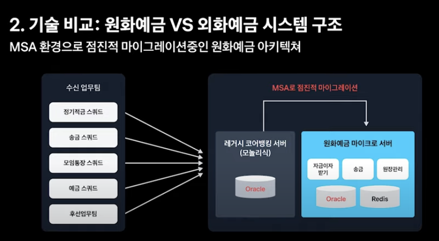
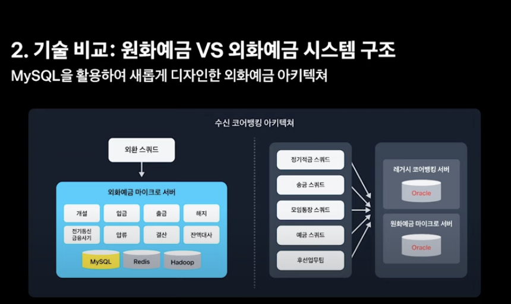
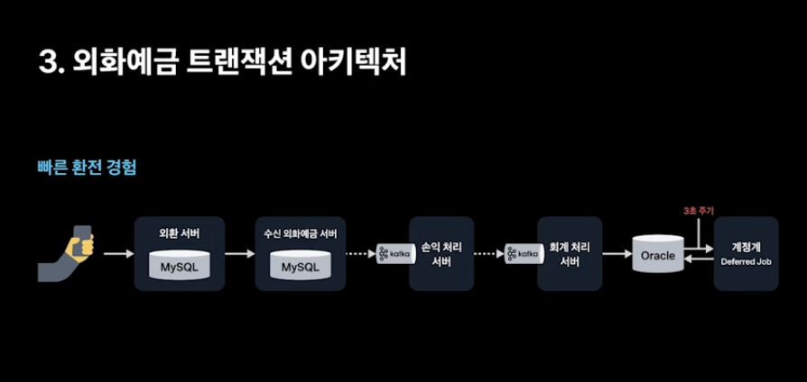
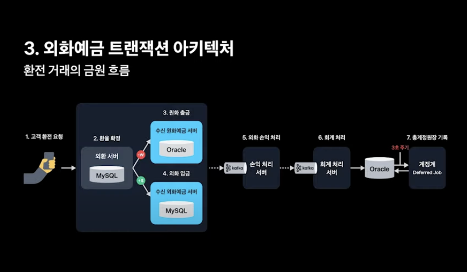
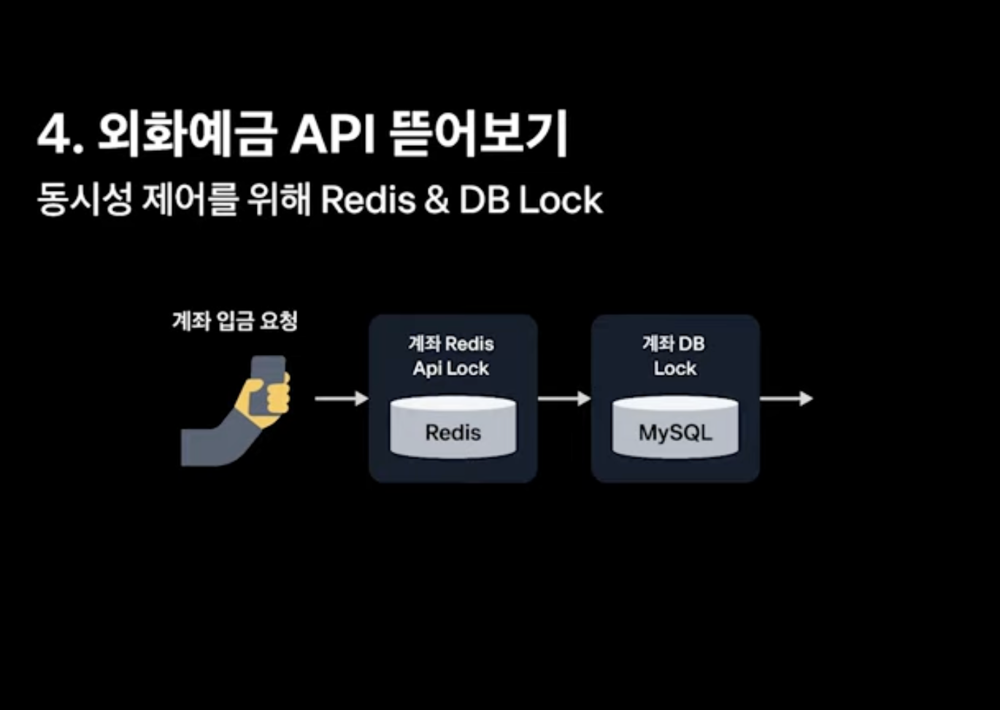
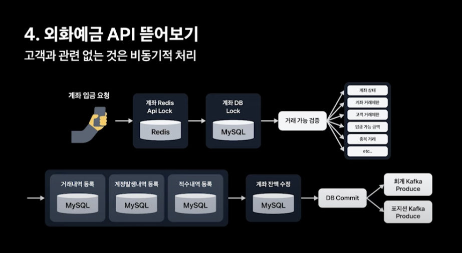
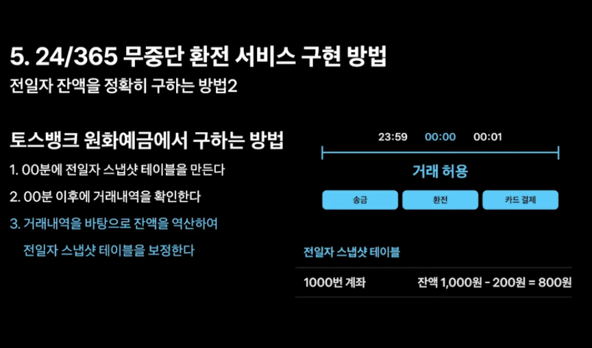
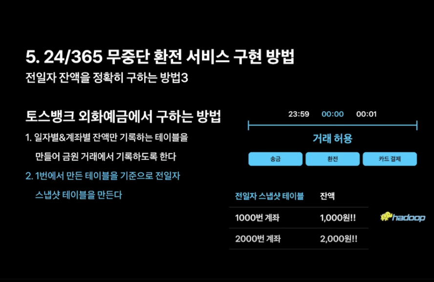

## 왜 모든 은행은 Oracle 만 사용하고 있을까?

기존 토스뱅크의 코어뱅킹 시스템을 아울러, 대부분의 은행은 Oracle 데이터베이스를 사용하고 있다. 어떤 장점에서 오라클 데이터베이스를 사용하고 있었을까? `(1)` **신뢰성과 안정성이 뛰어나다.** 트랜잭션 관리, 고가용성, 복구 기능, 데이터 무결성 보장등의 측면에서 좋다. `(2)` **확장성이 좋다.** 매우 큰 데이터 볼륨을 처리할 수 있는 뛰어난 확장성을 갖는다. `(3)` **성능도 좋다.** 복잡한 트랜잭션 처리와 대규모 데이터베이스 쿼리에 효과적이다. `(4)` **오랜기간 축적된 노하우가 있다.**

반면 오라클 데이터베이스는 치명적인 단점이 있다. 바로 `(1)` Scale Out 이 제한적이라는 점이여서, 유연한 대처가 어렵고 SPOF 가 발생한다. 또한 `(2)` MySQL 대비 비싼 라이센스 비용을 갖는다. 오라클의 경우 CPU 코어수에 비례하여 비용이 증가한다. (이 때문에 토스뱅크는 SPOF 를 해결하고자 각 마이크로 서버에게 서로 다른 Oracle 데이터베이스를 바라보게 하는 전략을 고려했지만, CPU 코어 수에 비례하는 비용 증가 문제로 인해 택하지 않았다.)

이 떄문에 MySQL 을 도입했다. MySQL 은 Oracle 대비 확장성에 유리하다. 레플리케이션과 같은 전략을 통해 유연한 Scale Out 이 가능하고, 비용도 Oracle 대비 저렴하다. 또한 MySQL 은 MVCC 기술을 사용하기 떄문에 동시성 제어에도 유리하다. 이 외에도 Oracle 을 사용할 이유가 점점 옅어졌다. IT 기술이 발전함에 따라 트랜잭션 관리 방법이 발전하였다. 기존에는 데이터베이스에서 트랜잭션을 직접 제어해야 했지만, Redis 분산락, Kafka 를 활용한 SAGA 패턴등의 기술을 도입하여 애플리케이션 Layer 에서도 유용하게 트랜잭션 관리를 가능케 했다.

## MSA 환경을 전환중인 아키텍처

토스뱅크는 기존의 레거시한 모놀리식 코어뱅킹 서버(원화 예금 서버) 에서 기능을 마이크로 서버로 조금씩 때내고 있다. 대표적으로 지금 이자 받기, 송금, 원장 관리와 같은 도메인들을 새롭게 MSA 로 구현중에 있다. (몰론 데이터베이스는 오라클 DB 를 바라보고 있다.)

그리고 외화 예금 서버를 MySQL 과 마이크로 서버로 새롭게 다자인했다. (위 그림에서 왼쪽 부분이 외화 예금 서버이고, 오른쪽은 원화 예금 서버이다.) 전반 오버뷰는 위와 같은데, 지금부터 외부 예금 서버에서 트랜잭션을 어떻게 처리하고 있는지 아키텍처를 더 자세히 뜯어보자.

## 외화예금 트랜잭션 아키텍처

외화 예금 서버에서 사용자에게 빠른 환전 경험을 제공하기 위해 트랜잭션들이 전반적으로 느슨하게 연결되도록 설게했다. 단, 고객의 잔액 관리 부분(외환 서버, 수신 외화예금 서버) 에서 만큼은 서버들간의 트랜잭션을 엄격하게 관리했다. 하지만 이 외의 고객과 관련 없이 은행 내부적으로 회계 처리를 위한 서버들(손익 처리, 회계 처리, 계정계 서버) 간의 트랜잭션을 카프카를 활용하여 비동기적으로 처리했다.

### 금원 거래(환전) 플로우

이런 아키텍처 위에서 금원 거래가 어떻게 이루어지는지 플로우를 알아보자. (즉, 사용자의 원화가 외화로 어떻게 환전되며, 은행의 총 계장 원장 금액이 어떻게 바뀌는지 플로우를 알아보자.)

`(1)` 가장 먼저 고객이 환전을 요청할 것이다. `(2)` 그 요청은 외환 서버로 도착하고, 외환 서버는 어떤 종류의 환전인지 확인하고 환율을 확정한다. `(3)` 이어서 수신 원화예금 서버를 호출하여 원화 계좌에서 출금하고, `(4)` 수신 외화예금 서버를 호출하여 외화 계좌에 돈을 입금한다.

여기까지 되었다면 고객 계좌의 잔액 변동은 끝이난다. 빠른 환전 경험을 제공하기 위해 여기까지만 서버들간의 트랜잭션을 SAGA 패턴으로 묶어서 안전하게 관리하고 있다.

이후 은행 계좌를 처리하는 부분은 카프카를 이용해서 트랜잭션을 분리시켰다. `(5)` 외환 거래였기 때문에 손익에 대한 처리가 필요하다. 따라서 손익을 위한 카프카에 메시지를 발행하면 손익 서버가 그를 컨슘하여 환율에 따른 손익을 결정한다. `(6)` 이후 은행 회계 처리를 위해 회계 처리 서버가 카프카로 또 컨슘한다. (이 과정에서 회계 처리 서버는 은행의 어떤 계좌에 얼마를 기록할지를 오라클에 기록해둔다.) `(7)` 그렇게 오라클에 기록된 정보를 레기시 코어뱅킹의 Deferred 라는 존재가 주기적으로 조회해서, 은행 계좌 총 원장에 잔액을 변동시킨다.

### 만약 기존 레거시 코어뱅킹으로 환전 기능을 구현했다면?

몰론 위 과정들을 기존 레거시 코어뱅킹에서 하나의 로컬 트랜잭션으로 모두 처리할 수는 있었을 것이다. 하지만, 복잡한 은행 비즈니스 로직간의 의존성이 더욱 높아지게 되고, 고객과 관련없는 회계처리 부분도 하나의 트랜잭션으로 함께 묶여서 처리된다. 즉, 모든 것들이 하나의 로컬 트랜잭션으로 묶어 동기적으로 처리되므로 환전 속도가 느려진다.

## 외화예금 API

### 동시성 처리

환전 기능에서 외화예금 API 가 있을텐데, 그 중에 입금 API 에는 동시성 처리가 필요했다. (원화 계좌에서 출금된 돈이 외화 계좌로 "입금" 될 때 동시성 처리) 환전을 하는 동시에 똑같은 계좌로 카드 결제가 들어올 수 있었기 때문이다. 즉, 환전을 하는 동시에 얼마든지 타 요소로 인해 잔액 변동이 일어날 수 있었다.

동시성 처리를 위해 애플리케이션 계층에서는 Redis 분산 락을 사용했으며, 실제로 데이터가 수정되는 MySQL 데이터베이스에는 비관적 락을 걸었다. 이때 분산 락은 당연히 DB 보다 빠른 응답 속도를 기대할 수 있기 때문에 다른 트랜잭션에서 접근하더라도 Fail Fast 를 유도할 수 있었기 때문이다.

### 코루틴

그 다음으로는 거래가 가능한지 검증하는 단계이다. 예를들어 계좌를 확인하여 계좌가 해지된 상태는 아닌지, 명의도용된 계좌는 아닌지 등을 검증하는 것이다. 여기서는 레거시 코어뱅킹처럼 하나씩 동기적으로 검증하기엔 검증 요소들이 너무 많아서 느리다. 이를 해결하기 위해 코루틴을 도입하였고, 동시간대에 여러 검증을 수행하도록 했다.

### 그 이후 플로우

거래 가능한 계좌라는 것이 확인되었다면, 거래 내역을 MySQL 에 저장하고, 계좌의 잔액을 수정하고, DB 커밋을 한다. 그 이후로는 은행 계좌 및 회계 처리를 위한 카프카를 발행하고 있다.

## 24시간, 365일 무중단 환전 서비스 구현 방법

기존 은행 시스템은 매일 자정 근방에 거래가 불가능하다. 이는 은행의 회계 시스템 때문이다. 이 회계 시스템과 연관된 것이 바로 수신 외화예금 마이크로 서버에서 잔액대사 기능이다.

잔액대사란 무엇일까? 앞서 설명했듯이, 금원거래가 발생하면 고객 계좌와 은행 계좌가 바뀐다고 했었다. 그것이 매일 자정마다 잘 처리되었는지 검증하는 행위이다. **즉, 매일 자정을 기준으로 모든 고객 계좌의 잔액의 총 합이 은행의 총 계좌의 잔액의 합과 동일한지 검증한다.**

일반 은행에서 정확한 전일자 잔액을 계산하기 위해선, 자정 근방에 모든 사용자들의 거래를 막고 모든 고객 계좌 잔액의 총합을 계산하면 된다. 00시 00분 근방에 거래가 없었기 떄문에 정확한 잔액을 산출할 수 있다. 하지만, 고객들이 거래할 수 없다는 치명적인 단점이 존재한다.

### 새로운 방안1

이를 위해 토스뱅크는 새로운 방안을 찾았다. `(1)` 00시 00분에 전일자 스냅샷 테이블을 만든다. 몰론, 이때도 거래가 계속 이루어질 것 이므로 정확한 계산 값이 도출되지 않을 것이다. `(2)` 그래서 00분 이후의 각 사용자의 첫번째 거래 내역을 확인하고, 가져온다. `(3)` 이렇게되면 잔액과 거래내역 금액을 게 되었으므로, 잔액을 역산하여 전일자 스냅샷 테이블을 보정하면 된다.

### 새로운 방안2

이 보다 외화예금 기능을 개발하면서 더 좋은 방안을 찾았다. 이 방법은 데이터 보정도 없이 데이터 구조를 바꿔서 새롭게 설계한 방법이다.

첫번째로 `(1)` 일자별 & 계좌별을 PK 구분자로 하여 잔액만 기록해두는 테이블을 만든다. 그리고, 금원 거래가 발생할 때 마다 일자별을 기준으로 그 계좌에 잔액을 기록해둔다. `(2)` 그리고 전일자 스냅샷 테이블을 만들 때, 앞서 `(1)` 엣허 만들어 놓은 테이블에서 일자별을 기준으로 모든 계좌의 잔액을 가져온다.

## 100% 테스트 자동화

5명의 팀원들이 어떻게 6개월이라는 짧은 기간만이 외화 예금을 출시할 수 있었을까? 이 비결은 100% 테스트 자동화에 있다. 외화 예금을 만드는 당시 총 3가지 방법으로 테스트를 자동화했다.

### 로컬 환경에서 테스트 : 단위 테스트 작성

로컬에서는 우리가 흔히 알고있는 단위 테스트를 작성했다. 테스트가 단 1개라도 실패하면 빌드가 실패된다.

### Dev 환경에서 테스트 : E2E 테스트 활용

그리고 Dev 서버에서는 E2E 서버를 활용하여 업무의 정합성을 검증했다. E2E 서버란 실제로 배포 서버의 타깃이 되는 API 서버를 Dev 환경에서 호출할 수 있도록 코드를 작성할 수 있는 공간이다. 토스뱅크는 E2E 서버에 고객의 외화예금을 거래하는 것 처럼 고객의 시나리오를 코드화하여 작성했다.

코드 수정 사항이 발생할 때 마다 Trigger 되어, E2E 서버가 자동으로 수신 외화 예금 서버에 API 를 호출할 수 있도록 해놓았다.

### Live 환경에서 테스트 : 이상거래탐지 서비스 개발 (데이터 완결성 검증)

마지막으로 운영 환경에서는 이상 거래 탐지 서비스를 개발하여 데이터 완결성까지 검증했다.

이상거래탐지 서비스란, 운영 환경에서 발생하면 안되는 데이터가 발생했는지 한 번더 검증하는 서비스이다. 이 서비스는 데이터의 중요도에 따라 주기적으로 돌면서 알림을 주도록 설정해놓았다.

예를들어 해지된 계좌에서 거래가 발생한 건은 없는지, 하루에 이자를 2번받은 잘못된 계좌는 없는지등 처럼 발생하면 안되는 데이터가 발생했는지를 검증한다.

## 전환 성과

- 금융권 최초로 MySQL 을 도입, MSA 기반의 안정적인 코어뱅킹 시스템을 구축하였음 : 덕분에 1910만 MAU를 자랑하는 토스 홈에서의 3000TPS 트래픽을 안정적으로 소화 중이다.

- 세상에서 가장 빠른 환전 고객 경험 제공 : 원화 송금 속도인 280ms 보다도 훨씬 빠른 속도인 외화 환전 속도를 30ms 로 빠르게 구현. MySQL 뿐만 아니라 Redis 기반 캐싱, 코루틴 등의 신기술을 활용하여 속도를 최적화

- 24시간, 365일 잠들지 않는 무중단 환전/결제 고객 경험 제공 : 외환 서버 구축과 동시에 은행의 회계 정합성을 위한 원장 보정 작업들도 MSA 로 전환함에따라 고객분들에게 24시간 서비스 제공

## 참고

- https://www.youtube.com/watch?v=uWnAVYgCd0k
