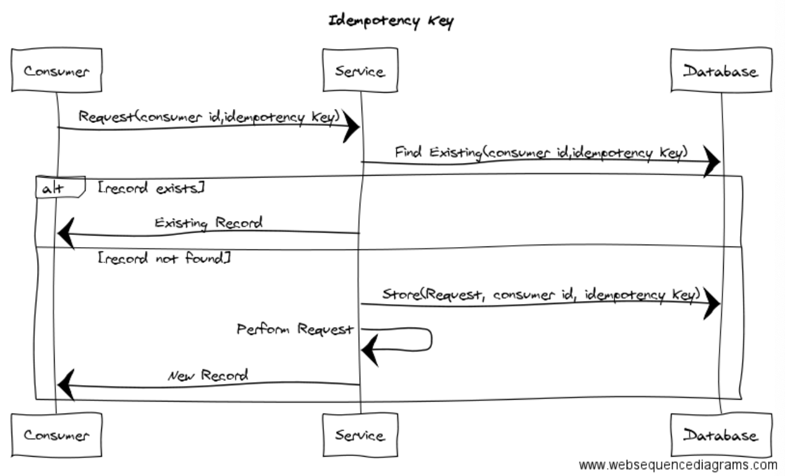
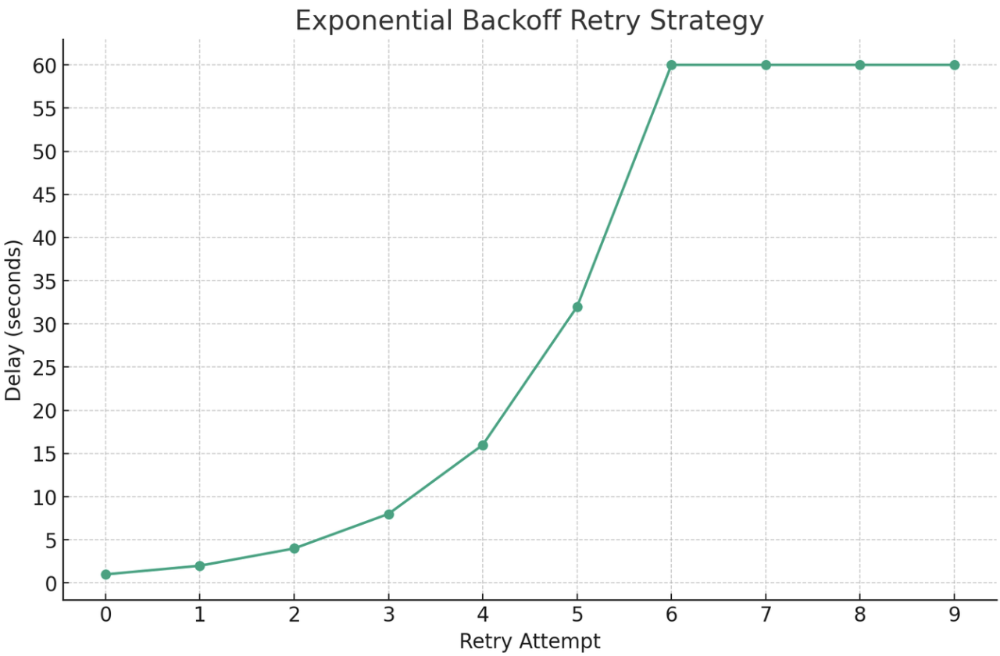
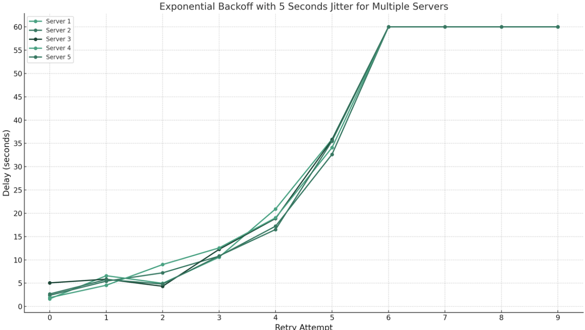
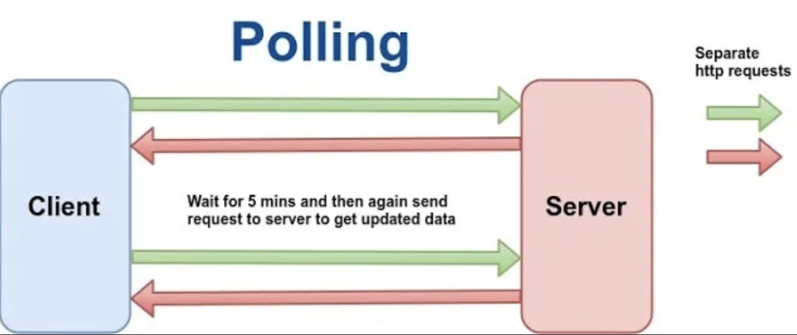

## 네트워크 지연으로 인해 실패를 확정지을 수 없는 상황

클라이언트가 서버로 네트워크를 통해 요청을 보낼 때, 성공적으로 잘 처리되어 응답을 받는 경우가 대부분이겠지만, 일부 요청에서는 에러가 발생할 것이다. 그리고 이 에러 중 대부분의 경우는 응답을 받는 즉시 요청이 정말로 실패했는지 확정지을 수 없겠지만, 일부 에러의 경우 실패를 확정지을 수 없다.

서드파티에게 요청을 보냈을 때, 서드파티가 요청을 정상적으로 처리하였지만 타임아웃이 되었다면? 아불싸. 네트워크 지연 문제로 인해 우리 서비스는 요청을 성공했다고 처리해야할까, 아니면 실패했다고 처리해야할까? **네트워크 지연으로 인해 타임아웃 되었다면 서드파티가 우리가 보낸 요청을 성공적으로 처리했는지, 실패했는지 알 방법이 없다.**

### 타임아웃 발생

한 가지 상황을 떠올려보자. 클라이언트가 서버에 게시글 작성을 요청했고, 서버는 그 요청을 받아 게시물을 데이터베이스에 저장하기 시작했다. 그런데 데이터베이스에 병목이 발생하여 요청한 DB I/O 작업이 장시간 지연되었다. 클라이언트는 30초 넘게 기다렸지만 서버가 응답을 주지 않아 Read Timeout 에러로 클라이언트는 서버와 연결을 끊었다. 즉, 타임아웃이 발생하였다.

하지만 타임아웃 발생 이후 데이터베이스 작업이 끝났고, 게시물이 정상적으로 등록되었다. 분명 클라이언트는 Read Timeout 에러를 만났지만, 서버는 요청 처리 속도가 느렸을자라도 성공적으로 작업을 수행하였다. 만약 여기서 무턱대고 클라이언트에게 요청이 실패했다고 응답한다면? 실제 요청은 성공했음에도 클라이언트에게는 요청이 실패했다고 응답하게 되는 아주 모순적인 상황이 발생한다.

### 성공/실패를 단언할 수 없는 네트워크 에러 문제

이처럼 네트워크 에러는 성공/실패 여부를 즉시 확정지을 수 없는 경우가 존재한다. 이러한 네트워크 에러가 발생한 경우, 아래 3가지 case 로 나누어볼 수 있을 것이다.

> - `(1)` 요청이 서버에 도달한 뒤, 네트워크 에러가 발생했고, 그 요청을 실제로도 진짜 실패했다.
> - `(2)` 요청이 서버에 도달한 뒤, 네트워크 에러가 발생했지만, 사실 그 요청은 서버에서는 막상 까보니 성공했다.
> - `(3)` 알고보니 요청이 서버에 도달 조차 하지 못했다.

결과를 당장 확정할 수 없는 네트워크 에러가 발생했을 때 별 생각없이 이를 실패했다고 확정 해버린다면, 사용자에게 잘못된 결과를 노출할 수 있다. 또한 모놀리식 환경과 다르게, **MSA 환경에서는 데이터베이스의 트랜잭션을 활용한 롤백이 불가능하다. 따라서 한쪽에 실패한 경우 정합성이 깨질 수 있는 것이다.**

> 💡 왜 MSA 환경에서는 트랜잭션을 활용한 롤백이 불가능한지 추가 학습이 필요하다. 이는 2PC, SAGA 패턴 등으로 해결 가능한것인가? 보상 트랜잭션등에 관련한 학습을 해봐야겠다.

## 주문과 결제 서버

> [hudi 님의 기술 블로그 포스팅](https://hudi.blog/safely-handling-network-errors/)을 다수 인용 및 참고하여 작성하였다.

이커머스 서비스를 개발하고 있다고 가정해보자. 우리 서비스는 유저로부터 주문 요청을 받는 주문 서버, 주문 서버로부터 결제 요청을 받는 결제 서버를 만들고 있다. 주문 서버는 유저의 주문 내역을 저장하고, 결제 서버는 유저의 결제 내역을 저장한다.

이때, 주문 서버가 결제 서버로 요청했지만 타임아웃이 발생했다면 어떻게 핸들링 해야할까? 주문 서버는 자신의 주문을 확정해야하는데, 결제가 완료되었는지 알 수 없으니 그럴 수 없다. 단순히 결제 요청이 실패해다고 곧바로 주문을 실패처리한다면, 유저는 주문이 실패했다고 응답을 받았는데, 맙소사. 막상 실제로 결제는 성공하여 돈이 빠져나가는 경우가 발생할 수 있다.

### 재시도 (Retry) 를 통해 성공/실패를 확정짓기

일단 주문서버는 결제서버에 재시도를 해볼 수 있을 것이다. 결제 서버가 제대로 응답을 할 때 까지 2번이고, 3번이고, ... 성공할 때 까지 N번의 요청을 재시도하는 것이다. 이때 재시도 과정에서 결제 서버가 정상 응답을 내려주었다면, 주문의 상태도 성공/실패로 확정지을 수 있다.

그렇다고해서 무턱대고 재시도를 막 구현해도 괜찮을까? [토스 SLASH 22, 애플 한 주가 고객에게 전달되기 까지](https://haon.blog/article/toss-slash/broker-issue-concurrency-and-network-latency/) 에서도 다루었듯이, `(1)` 타임아웃의 특성상 짧은 주기로 재요청을 시도하면 네트워크 지연 상황을 더욱 악화시킬 수 있다. (네트워크 병목이 더 심해지기만 한다.) `(2)` 또한 의도치 않게 1번의 주문으로 다건의 결제가 진행되는 금융 사고가 발행할 수 있다. 즉, 1건의 주문에 대해 1건의 결제 데이터가 적재되는 것이 아닌, 다량의 결제 데이터가 적재될 수 있다.

위 2가지 문제를 어떻게 현명히 해결할 수 있을까?

## 멱등한 API 요청을 통해 안전하게 재시도

우선 `(2)` 를 해결하기 위한 방법을 생각해보자. 멱등성이란 같은 요청을 여러번 수행하더라도 항상 최초 요청과 동일한 결과를 응답받도록 하는 성질을 뜻한다. 예를들어, 결제 서버에 멱등성이 적용된다면 동일한 결제 요청이 도달하더라도 결제는 단 1번만 수행되어야 할 것이다. 그런데, 이 멱등성은 어떻게 구현할 수 있는가? "동일한 요청" 임을 결제 서버가 어떻게 식별하고, 판단할 수 있을까?

### 멱등 키 (Idenpotency Key) 를 통한 동일한 요청 식별

주문 서버는 결제 서버에 결제 요청을 보낼 때, Unique 한 ID 를 생성하여 함께 보내면 된다. 이 ID 를 멱등키라고 한다. 유일성을 갖는 식별자를 양측간에 서로 공유함으로써, 중복 결제 요청을 방지할 수 있다.

결제 서버는 주문 서버로부터 결제 요청을 받음과 동시에, 이전에 동일한 멱등키로 결제가 진행된 적이 있는지 확인하면 된다. 만약 없다면, 즉 처음 받은 멱등키라면 결제를 진행한다. 반대로, 이전에 받아 이미 결제가 수행되었던 멱등키라면, 결제를 수행하지 않고 처음 요청의 결과를 그대로 반환한다.

## 네트워크 병목을 고려하여 Retry 하기

그리고 앞선 `(1)` 을 고려한 해결방법을 떠올려보자. `(1)` 은 짧은 주기로 재시도했을 때 되려 네트워크 병목만 발생하여 실패 확률을 더 높이는 상황이다. 이 상황으로보아, 현재 네트워크 상에서 결제 서버는 굉장히 큰 부하를 받고 있는 상태이다.

결제 서버 입장에서는 당장 현재 받고있는 트래픽이 낮아져야지 요청 속도가 개선된다. 하지만 **결제 서버는 주문 서버가 짧은 주기로 Retry 해버리면 이전보다 더 큰 부하를 받게되어, 상황이 더 악화되기만 한다.** 게다가 실제 서비스에서는 주문 서버 뿐만 아니라, 결제 서버에 의존하는 수 많은 서버들이 Retry 요청을 보내게 될 것이다. 이를 **Retry Storm** 이라고 부른다.

### 지수적 간격으로 재시도 (Exponential Backoff)

이를 위해, 토스증권에서도 지수적(Expoential) 재시도 간격을 두는 전략을 취하고 있다.

예를들면, 위 그래프처럼 최초 재시도는 1초 뒤에 보낸다. 그 뒤에는 재시도 간격을 지수적으로 늘리는 전략을 취한다. 이후 재시도는 2초 뒤에, 그 다음은 4초 뒤에, 8초 뒤, 16초 뒤, ... 이렇게 **지수적으로 재시도 간격을 늘리는 전략을 취하면 된다.**

짧은 주기로 동일한 간격을 갖는 재시도 요청을 보내는 것 보다, 지수적으로 재시도 주기를 더 늘려가면서 요청하는 것이 부하도 훨씬 적어지고, 응답 속도도 더 빨리질 것이다.

하지만, **결제 서버로 요청하는 모든 서버가 동일한 지수적 증가 전략을 사용하게 되면, 결국 재시도 시점에 결제 서버가 받는 부하는 여전히 클 것이다.** (결국엔 모든 서버가 재시도를 보내는 시점 타이밍이 똑같으니깐.) 이를 해결할 수 있는 방법은 아래와 같다.

### Exponential Backoff with Jitter

Jitter 란 패킷이 도달하는 시간이 일정하지 않고 불규칙한 현상을 뜻한다. Exponential Backoff with Jitter 전략은, 이 **Jitter 를 의도적으로 발생시켜서 재시도 요청들이 일정한 시각에 몰리는 것을 방지하는 전략이다.** 즉, 위에서 살펴본 지수적 증가 전략에다 무작위성을 더한 전략이다.

위 그래프에서도 볼 수 있듯이, 지수적으로 증가하는 간격에다 무작위성을 추가하니 동일한 시간대에 요청이 몰리지 않고 분산됨을 알 수 있다.

### 재시도는 무한정 시도할 수 없다.

당연하게도, 재시도는 무한정으로 보내면 안된다. 무제한으로 재시도 요청을 보낼수는 없다. 많은 재시도를 하게 된다면, 사용자도 그 만큼 늦게 응답을 받게된다. 또한, 재시도는 그 자체로 리소스 낭비가 될 수 있다. **즉, 최대 재시도 횟수를 정해두고 언젠가는 재시도를 포기해야한다.**

그렇다면 최악의 경우에 수많은 재시도 끝에도 타임아웃을 만나게 되었다면, 주문 서버는 결국 결제 요청의 성공 여부를 결국 모를 것이다. 하지만 주문 서버는 자신의 주문 상태를 확정지여야 한다. 이를 어떻게 해결해야할까?

## 중복 주문 방지

수 많은 재시도 요청끝에 타임아웃을 만나게 되었다면, 유저에게는 "주문 처리 결과를 알 수 업다" 는 메시지가 노출 될 것이다. 유저는 자신의 주문이 어떻게 처리되었는지 알 방법이 없으니, 재주문을 시도할 것이다. 하지만 재주문을 요청한다면 중복으로 주문이 발생할 가능성이 있다. 따라서 주문 서버는 아래 과정을 통해 중복 요청을 막아야한다.

- `(1)` 주문 상태 초기화 : 주문 서버는 유저에게 주문 요청을 하자마자, 주문을 `대기` 상태로 저장한다.

- `(2)` 결제 요청 및 주문 상태 전이 : 주문 서버는 결제 서버에 결제 요청을 보내고, 응답에 따라서 주문의 상태를 `성공` 또는 `실패` 로 변경한다. 하지만 다수의 Retry 에도 불구하고 타임아웃이 발생했다면, 결제의 상태를 확정할 수 없으므로 주문의 상태도 여전히 `대기` 상태이다.

- `(3)` 중복 주문 방지 : 대기 상태의 주문을 보유한 유저가 새로운 주문을 중복 요청하려는 경우, "이전 주문건이 진행중입니다. 잠시만 기다려주세요." 이라는 문구를 노출하고 중복 주문 요청을 막는다.

## 확정되지 않은 결제 요청 확정

우선 이렇게 중복 주문을 방지했다. 이제부터는, 주문 서버가 결제 서버로부터 결제 상태를 알아내어 주문 상태를 `대기` 에서 `성공` 또는 `실패` 로 확정시켜야 한다. 이를 위해 주문 서버가 결제 서버로 부터 결제 상태를 알아낼 수 있는 방법은 크게 2가지이다.

첫번째는 주기적으로 결제 서버에게 요청을 보내어, 결제 내역 상태를 물어보는 방법인 **풀링(Polling)** 을 사용한 방법이 있다. 두번째는 결제 서버가 최종 상태로 전이된 결제 내역에 대해 이벤트(메시지) 를 발행하는 방법인 **메시지 큐(Message Queue)** 를 사용하는 방법이다.

### 풀링(Polling)

결제 서버가 결제 내역의 상태를 조회할 수 있는 API 를 하나 만들어두고, 주문 서버가 해당 API 를 주기적으로 요청하는 것이다. 주문 서버는 이 API 를 통해 대기 상태로 남아있는 결제건에 대해 상태를 주기적으로 질의한다. 주기적인 질의를 통해 결제 서버가 해당 결제에 대해 성공 또는 실패의 최종 상태로 응답을 한다면, 주문 서버도 해당 결제건과 매핑되어 있는 주문 내역의 상태를 성공 또는 실패로 확정(갱신) 하면 된다.

하지만 이 풀링(Polling) 의 특성상 앞서 살펴본 Retry Storm 과 마찬가지로 결제 서버에 부하를 줄 수 있다. 결제 상태가 최종 상태로 확정되는 순간에, 주문 서버가 이를 알 수 있도록 하는 방법은 없을까? 이는 바로 메시지 큐를 사용하면 가능해진다.

### 메시지 큐 (Message Queue)

카프카와 같은 메시지 큐를 사용하면, 결제 서버에 부하를 주지 않는다. 결제 서버는 완료된 결제 내역에 대해 성공/실패 여부를 메시지로 발행하고, 주문 서버가 해당 메시지를 컨슘한다. 주문 서버는 컨슘한 메시지의 결제 내역의 상태에 따라, 주문 내역의 상태를 성공 또는 실패로 갱신한다.

풀링에 비해 부하도 발생하지 않으며, CDL Retry 패턴등을 사용하여 더 안정적으로 정합성을 유지할 수 있다.

### 결제 서버에서 결제 요청이 도달조차 하지 못했다면?

네트워크 지연으로 인해 주문 서버의 요청이 결제 서버에 도달조차 하지 못한 경우도 낮은 확률로 발생할 수 있다. 이 경우 결제 서버는 해당 결제건에 대해 애당초 전혀 모를 것이다. 이런 경우 영영 주문 상태는 최종 상태로 확정되지 못할 것이고, 유저는 영원히 주문을 할 수 없는 상태에 놓인다.

이런 상황을 막기 위해선, 대기중인 주문이 이미 존재하여 유저의 주문을 막기 전에, 주문 서버는 결제 서버에게 대기중인 주문건에 매핑된 결제건에 대해 알고있는지 물어보야한다. 결제 서버가 모르고 있다면, 결제 과정 자체가 시작되지 않았으므로 주문을 실패로 확정 처리해도 된다.

몰론 결제 요청이 알 수 없는 이유로 결제 상태 확인 요청보다 늦게 들어오는 경우 또 정합이 깨질 수 있다. 이럴 때에는 주문 서버와 결제 서버 모두가 타임아웃 시간을 합의하고, 결제 요청에 요청을 보낸 타임스탬프를 기록한 뒤, 타임아웃 시간 이후에 요청이 들어온 경우를 항상 실패처리하면 된다.

## 참고

- https://hudi.blog/safely-handling-network-errors/
- https://www.youtube.com/watch?v=v9rcKpUZw4o
- https://www.youtube.com/watch?v=UOWy6zdsD-c
- https://tech.kakaopay.com/post/msa-transaction/
- https://jungseob86.tistory.com/12
