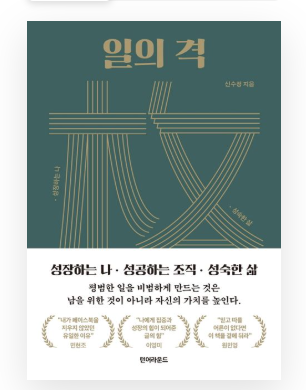

회사를 다니다가, 지난번에 LINE+ 신규 입사자.임원간의 회식 자리를 가진 적이 있다. 조직장님을 통해 책 ['일의 격'](https://product.kyobobook.co.kr/detail/S000001938229?utm_source=google&utm_medium=cpc&utm_campaign=googleSearch&gt_network=g&gt_keyword=&gt_target_id=dsa-1974044872798&gt_campaign_id=9979905549&gt_adgroup_id=132556570510&gad_source=1) 을 추천받았는데, 나에게 큰 동기부여와 도움이 된 책인 것 같다. 주말이기도 하고, 서적을 읽으면서 마음이 들었던 부분 및 문구들을 인용하며 생각을 정리해보고자 한다.

아직 1장, 2장 외에 3장은 못 읽었지만, 그냥 읽는대로 편하게 블로그에 발행해보려고 한다. 완벽한 글을 올리고 싶은 마음이 아닌, 그냥 내 생각이 정리된 글을 편하게 올리고 싶은 것이 목적이니.

## 📚 1장. 성장 | 일의 성과를 극대화 하는 기술 

### 성공의 가장 큰 적은 실패가 아닌 지루함

- 아마추어는 기분 좋을 떄만 훈련한다. 보통 선수는 매일 훈련하지만 지루할 떄면 대충 한다. 그러나 뛰어난 선수는 상관없이 훈련한다.

- '신경 끄기의 기술' 이라는 책에서도 이런 내용이 있다. "목표는 멋지지만 목표로 가는 길에는 똥 덩어리가 가득하다. 지루한 길이다. 성공을 결정하는 질문은 '나는 무엇을 하고 싶은가?' 가 아니라, '그 과정에서 오는 고통을 견딜 수 있는가?' 이다. 특히 직장 생활을 시작한 초급 사원에게 제일 필요한 것은 허드엣일을 견디는 것이다"

- 나 자신을 돌이켜보고 내 주위를 봐도 이 지루함을 멈추는 그떄부터 그 사람은 더 이상 성장하지 않는다. 그것이 멈추어질 때 프로들은 현역에서 은퇴한다. 강수진은 그떄 떠나는 게 후배들, 관객들을 위한 예의이자 존중의 표시라고 했다.

- 그러면 이 지루함을 도대체 어떻게 이길까? 홀륭한 선수라고 열정이 무한대가 아니다. 그들도 열정이 식을 떄가 있다. 그러나 그들을 그 지루함을 지속할 동기를 스스로 찾는다고 한다. **동일한 일을 그대로 반복하는 것이 아니라 조금씩 목표를 올려 도전함으로써 즐거움을 만든다.** 그리고 이 과정을 습관화하여 자동으로 행동하게 만든다고 한다.

### 그냥 찾아가라

- 어떤 운동을 배울 떄 나 혼자 연습을 열심해 해서 좀 괜찮아진 후 코치를 만나야겠다고 생각했다. 그리고 이것저것하고 시간을 끌었다. 한참 후에 코치를 만나니, 그동안 혼자 이것저것 했던 게 대부분 시간 낭비였음을 발견했다.

- 우리가 진단, 코칭, 피드백 또는 도움을 받는 이유는 무엇일까? **당연히 문제를 정확히 찾아 빠르게 해결하고 실력의 진보를 위한 것이다.** 그런데 왜 미루는 것일까? 여러 이유가 있겠지만, 그 중 하나는 그것을 **'평가' 로 여기기 때문이기도 하다.** 학창 시절 끝없는 비교와 평가로 살아왔던 우리는 모든 것을 평가로 인식하는 경향이 있다. 또한 실제 진단을 평가로 쓰는 곳도 많다. 그러다 보니, **잘한 다음에 하려고, 또는 잘 보이고자 하는 마음에 자꾸 미룬다.**

- 가장 효과적이며 효율적인 길은 가장 빠른 시간 내에, 그냥 있는 그대로 모습을 드러내어 피드백을 받거나 진단, 도움을 받는 것이다. 미루지 말고 그냥 헤라. 잘한 뒤에 상사나 멘토나 코티나 도움받을 사람을 찾아가는 것이 아니다. **잘하기 위해 찾아가는 것이다.** 미리 잘 하려고 애쓰지 마라. **내가 좋은 평가를 받기 위해 고수를 찾아가는 것이 아니라, 도움받기 위해 찾아가는 것이다.**

> 💡 나에게 지금 가장 필요한 조언이 아닐까? 나에게 완벽하는 것을 바라는게 아닐 것이다. 잘하기 위해서, 피드백과 도움을 받기 위해 선배들을 찾아가자.

### 연봉을 더 받으려면?

- 연봉이라는 것은 어떻게 산출될까? 경험상으로 대략 공식을 만들어 보면 **'개인의 연봉 = f(자신이 만드는 가치, 희소성)'** 이라고 할 수 있다. 여러가지 변수가 있겠지만 나는 이 두 가지 변수가 가장 크다는 생각이다.

- **'자신이 만드는(또는 기여하는) 가치'** 란 자신이 일함으로써 회사가 얼마나 이익을 창출할 수 있는가이다. 이는 개인의 능력만으로 결정되는 것은 아니고, 회사의 수익 시스템과 결합되어 결정된다. 예를들어 한 회사가 한 사람을 뽑아 1억의 수익을 얻는다고 한다면 그 사람의 연봉은 1억 이상을 줄 수 없다. 그런데 실제로는 연봉 외에 그 사람을 위해 들어가는 간접비(사무실 임대료, 각종 비용 등) 가 50% 에서 100% 까지 더 들어간다. 만일 간접비가 100% 라면 그 사람에게 최대로 줄 수 이는 연봉은 5천만원 정도이다. 그러면 회사는 아무 이익을 남기지 않고 사업을 할 수 있나? 아니다. 그러므로 마진을 떄면 더 낮아진다.

- 연봉을 많이 받으려면, 아래 2가지 법칙을 준수하라.

    - **법칙1. 가능한 자신을 통해 만들 수 있는 가치가 큰 기업으로 가야한다.** 똑같은 능력의 사람으로 5천만원 바에 못 만드는 회사도 있고 10억을 만드는 회사도 있다. 당연히, 적은 가치를 만드는 회사가 높은 연봉을 줄 수 없다. 나랑 똑같은 학교, 학과를 졸업한 내 친구는 저 만큼 받는데 나는 이 모양이라고 불평한다면 답을 심플하다. '갈 수 있다면 그곳으로 가라' 단지, 기억할 것은 지금 큰 가치를 만드는 회사가 미래에도 계속 그러리라는 보장은 없다.

    - **법칙2. 대체하기 어려운 희소성을 확보하는 것이다.** 그런데, 이때 희소성은 '고정적' 이 아니다. 내가 작은 회사에 다닐 떄는 대체 가능한 사람이 주위에 없었지만, 큰 회사에 가니 대체 가능한 사람들이 주위에 많을 수 있다. 이 경우 오히려 작은 회사에 있는 것이 높은 연봉을 받을 수 있는 가능성이 더 높다. 그러므로, 무조건 큰 기업에 가는 것이 나은 선택이 아니다. 벤처에서 펄펄 날다가 대기업에 와서 그저 그렇게 지내고 연봉도 이후 거의 상승 안되는 직원들도 많이 봤다.

- 결론적으로, 두 가지 조합의 관점에서 생각해보면 4가지 경우로 나뉜다.

    - `(1)` 생산가치도 높고, 나의 희소성도 높다 : 지금 있는 회사가 좋다. 여기에서 승부를 건다. 굳이, 욕심을 낸다면 동일한 희소성을 유지하면서 더 높은 생산가치를 낼 수 있는 곳으로 옮길 수 있지만, 기업문화 차이 등을 고려할 떄 위험하다.
    
    - `(2)` 생산가치는 높은데 나의 희소성이 낮다 : 신의 직장이다. 최대한 지금 있는 회사에서 잘리리 않으려 노력한다. 공명심에 회사 그만두면 밖에서는 지옥을 경험할 것이다. 단, 희소성을 높이돌혹 자기계발을 해야 한다.

    - `(3)` 생산가치가 낮은데 나의 희소성은 높디ㅏ : 지금 있는 회사에게 낮은 연봉을 받는다면 높은 연봉을 요청한다. 안 올려주면 같은 회소성을 유지하면서 더 높은 생산가치를 낼 수 있는 곳을 찾아 옮길 것을 고려한다.

    - `(4)` 생산가치도 낮고 나의 희소성도 낮다 : 큰일이다. 연봉은 신경 쓰지 말고 일단 실력을 키운다. 미 취업자라면 일단 받아주는 곳에 가서 잔말 말고 2~3년 정도는 열심히 일하며 실력을 키운다.

### 하버드생보다 더 뛰어난 성과를 올리는 방법

- 한 분야의 오랜 학습은 이것저것 잘하는 천재를 이긴다. 소위 공부 잘하는 사람들이 서울대, 허버드를 자랑하고 최고의 성적을 자랑하고 있을 떄, **조금 덜 똑똑해도 한 분야를 끈질기게 오래 한 사람은 자신의 분야에 획을 그을 수 있다.**

- 예전에 일본인 노벨상 수상자들에 관한 글을 읽은 적이 있다. 여기서 흥미로운 점이 있는데, 그들 중 어떤 분들은 평생 외국 유학도 안해보고, 심지어 박사학위도 없이 일반 회사에 다니는 분들도 있다는 것이다. 천재도 아니고, 심지어 공부를 그리 잘하지 못했던 분들도 있었다. 그런데 공통점은 '한 분야' 에 미쳤다는 것이다. **돌아가도 좋다. 서툴러도 좋다. 하나는 완성하는 일, 그것이 중요하다.**

- 스스로 머리가 부족하다고 여길수록 한 분야를 파라. 미친 듯이 오랜 기간 파라. 그러면 이것저것 관심 많고 인기 분야만 쫓아다니는 수재, 천재, 고학력자를 이길 수 있다. 세상은 알량한 머리와 학벌을 자랑하는 이들에 의해 바뀌는게 아니다. 우직하고 호기심 있는 이들의 꾸준하고 피땀어린 노력에 의해 바뀐다.

### 리더가 에너지를 너무 많이쓰는 대상이 안되는게 좋다.

- 잘 맞는 인재는 리더가 에너지를 많이 쓰지 않게 한다. 능동적으로 움직인다. 어떤 지시를 하면 리더의 마감일보다 조금 빠르게 결과를 제공하고, 성격이 급한 리더와 함께 할 때는 적절하게 중간 진행을 커뮤니케이션한다. 자신의 일을 깔끔하게 처리하고 맡긴 조직을 잘 끌고 가서 리더가 신경 쓸 일이 많지 않게 한다. 가벼운 코칭으로도 실행을 빠르게 해낸다.

- 반면, 잘 맞지 않는 구성원은 리더의 에너지를 많이 쓰게 한다. 리더와의 마감 약속을 자꾸 어긴다. 자신의 일을 깔끔하게 처리하지 못해서 자꾸 잔소리를 하게 한다. 커뮤니케이션을 적절히 하지 못햇거 성질 급한 리더가 자꾸 물어보게 한다. 자꾸 마음에 걸리고 신경 쓰인다.

- 당신이 구성원이라면? 리더가 에너지를 많이 쓰지 않게 하는 것이 좋다. 이 말은 리더가 당신에 대해 무관심하게 만들라는 것이 아니라 믿을만한 모습을 보여주라는 것이다. 특히 꼼꼼하고 성질 급한 상사에 대해서는 선재적인 것이 좋다. 수동적으로 있으면 일을 적게 받는다고 생각하는 분들이 있는데 큰 오해다. 또한 마감보다 항상 조금 앞서 제공하라. 너무 빨리하면 일이 많아질 위험이 있으나 약간 정도만 빠르게 해라. 리더를 위협하지 마라. 셜령 이후 커리어를 고민하고 있을지라도, 있을 때는 영원히 있을 것 처럼 일하라. 리더가 개인 에너지를 덜 빼앗긴다면 당신은 괜찮은 직원으로 여겨질 것이다.

- 그것보다 더 좋은 것은? 리더의 에너지를 안 쓰게 만드는 정도를 넘어 반대로 리더에게 에너리를 주는 사람이 있다. 그를 보면 힘이 난다. 그러면 당신은 정말 사랑받을 것이다.

> 💡 요즘 말로 표현하면 알잘딱갈센이 아닐까? 믿을만한 신입 사원이 되기 위해 노력해보자. 선배들이 에너지를 쓰지 않도록 신뢰도 있는 후베가 되어보자.

### 평범해도 비범해지는 법

- 어떤 사람은 비범한 일도 평범하게 만드는데, 어떤 사람은 평범한 일도 비범하게 만든다. 일 자체가 평범하거나 비범하다고 여겨서는 안 된다. 일하는 태도가 평범과 비범을 나눈다.

- "쥐꼬리만한 돈밖에 받지 않는데 평범한 일을 비범하게 하는 것은 결국 착취당하는 거 아닌가요? 돈 받은 만큼만 일하고 근무시간에는 최대한 놀아야지요. 그건 구세대들 때나 통해는 이야기에요" 이런 말을 하는 분들이 있다. 바보 같은 질문이다. **평범한 일을 비범하게 만드는 것은 남을 위한 것이 아니라 자신의 가치를 높인다.** 또한 그런 사람은 절대 그 일만 계속하지 않는다. 더 큰 일을 하게 되며, 그렇게 일하는 것이 몸에 익어 더 큰 을 맡거나 자기 사업을 해도 역시 비범하게 한다.

-  고깃집에서 알바를 오랜 기간 했다는 직원이 있었다. 그때 팁을 꽤 많이 받았단다. 비결을 물어보니 손님이 오면 어떤 분이 어떤 반찬을 좋아하는지 유심히 관찰했다고 한다. 그분이 다시 오면 그 반찬을 많이 내어 드리고 빠르게 채워드렸다고 한다. 고객이 놀랄 수밖에 없다. 알바는 고기를 더 줄 순 없지만, 반찬은 더 줄 수 있는 권한이 있다. 역시 동일한 알바를 해도 다르게 하는 사람이 있다.

> 💡 평소에 일하고 있는 작업들도 더 비범하게 만들어보자. 마감기한이 아닌 더 빠르게 작업을 끝낸다던지, 다른 사람들이 생각치 못했던 서비스 장애 및 검수 사항등을 더 고민하고 파악해볼 수 있을 것이다. 또한 내가 노력해 작업한 내용들의 가치를 소중하다고 생각하고, 인정해주자. 비범하게 만든 일을 괜히 평범하게 만들어버릴 수도 있는것은 나 자신이 될 수도 있다.

### 바쁜 사람은 항상 바쁘다

- 가끔 "저는 너무 바빠요. 좀 여유롭게 일할 수 없을까요?" 라고 상담하는 분들을 만났다. 그런데 흥미롭게도 이런 분들의 상당수는 여유를 부릴 수 있는 환경에서조차 스스로를 바쁘게 굴린다는 것을 발견했다. 이에 대게 바쁜 사람은 여유로운 일을 맡아도 바쁘고, 여유로운 사람은 정신없는 일을 맡아도 여유롭다.

- 바쁜 사람과 여유로운 사람 유형으 차이는 무엇일까? 바쁜 사람은 고객 수준이나 프로젝트의 유형과 무관하게 목표를 항상 100% 에 잡았고 품질에 대한 스스로의 완벽성과 만족을 중시하며 일했다. 황상 계획을 빡빡하게 잡았다. 고객의 평가와 무관하게 자신이 만족해야 했기에 매사 힘들 수 밖에 없었다. 반대로 여유로운 사람 유형은 고객의 수준과 프로젝트의 유형에 따라 프로젝트를 진행했다. 고객의 수준이 80 이면 85 정도를 목표로 했던 것이다. 가끔 수준이 높은 고객 프로젝트는 힘들게 진행했지만 대개의 프로젝트는 여유를 가질 수 있었던 것이다.

- 바쁜 사람으로 일하는 것이 필요하지만 평생 그렇게 일하는 것은 삶에 좋지 않다. 삶은 균형과 여유 공간이 필요하다. 과도하게 일하다가 건강을 해치기도 한다. 강철 체력도 있지만 그렇게 일하다 진짜 골병드는 사람이 있다. 매사 바쁘고 매사 최선을 다하는 삶이 꼭 바람직하다고 말하기 어렵다. **매사 최선을 다하지 말라. 최선을 다할 가치가 있는 일에만 최선을 다하자!**

- 여유롭게 일하는 비결은 다음과 같다.

    - **모든 것은 다 동일하게 중요하지 않다는 사실을 인정한다.** 중요한 것에 에너지를 쏟고, 중요하지 않은 일을 초스피드로 하거나 대충 하거나 타인에게 맡기거나(떠맡기는게 아니라, 대가를 주거나 역할로 맡김) 아예 하지 않는다.

    - **내가 할 일은 내가 빠르게 하고 남의 일을 대신 고민하지 않는다.** 나는 내가 할 일과 산하 구성원이 할 일을 명확히 한다. 정치적인 구성원들은 자기가 할 일을 위나 옆이나 아래에 미루곤 한다. 이에 나는 산하 임원에게 "그건 당신이 고민하고 답할 문제인데 왜 제게 떠넘기죠?" 라는 말로 책임을 명확히 준다. 단, 그가 그것을 이루지 못할 경우를 대비한 계획을 준비한다.

- 바쁘다는 것 자체를 인생을 보람있게 사는 것으로 여기는 분들도 있다. 새벽에 출근해 밤중에 나오면서 삶의 보람을 느끼곤 하신다. 그러다가 퇴직하고는 멘붕에 빠진다. 사실 위로 올라갈수록 더 여유를 가질 수 있는데 대개 워커홀릭은 스스로를 바쁘게 한다.

> 💡 바쁜것은 나 스스로가 바쁘게 만든 것이 아닐까? 우선순위를 구분하고, 모든 일이 중요하지 않다는 것을 인지하고 일을 하자.

### 때로 뺀돌이가 되어라

- 바쁘지 않으면서도 성과를 내는 비결은 이미 다 나와있다. '파레도의 법칙' 을 실행하면 된다.

- 우리 일을 살펴보면 20의 핵심적인 일과 80의 비 핵심적인 일이 있다. 앞의 20의 특징은 잘하면 비선형적인 성과를 내는 일이다. 핵심 프로젝트를 성공 시키거나 고객을 발굴하거나 새로운 변화를 만드는 일, 새로운 고객 가치를 만드는 일, 재테크 등일 것이다. 반면 뒤의 80은 못하면 욕을 먹지만 잘해야 본전인 일이 많다. 대개 많은 사람 손이 가고 시간을 많아 잡아먹는 운영상 일들이다.

- 몰론 위의 20이나 80의 일, 둘 다 대충 하면 실패환다. **성실하고 바쁜 사람들은 대개 위의 20이나 80을 구분하지 않고 무조건 최선을 다해 열심히 한다.** 다 완벽하려 한다. 이러면 성과도 나고 인정도 받고 승진도 하지만 항상 정신이 없고 여유가 없다. 너무 바빠서 새로운 생각을 하거나 새로운 시도를 하거나 삶을 돌아볼 여유가 부족해진다.

- 그러면 어떻게 일할 것인가?

 - 위의 20은 열심히 한다. 에너지를 쏟는다. 시간을 더 투자한다.

 - 위의 80은 무작정 열심히 하지 말고 '어떻게 편하게 할까?" 에 초점을 둔다. 소위 뺀돌이가 되는 것 이다. 허술하게 하라는 뜻은 아니다. 거절하거나 시스템화하거나 자동화하거나 아웃소싱하거나 협업을 하거나, 여하튼 편할 방법을 찾아야 한다.

 - 80 중 아예 할 필요가 없는 것은 하지 않는다. **할 필요가 없는 일을 판단하는 기준은 "그 일을 안 했을 때 무슨 큰 일이 일어나는가?" 를 자문하면 된다.** 큰 일이 안 일어나는 일은 하지 않으면 된다. 할 필요가 없는 일을 효율적으로 하는 것도 바보짓이다.

### 피하는 쪽이 아니라 향하는 쪽으로 생각하라 

- **"이러한 원하지 않는 모습을 어떻게 해결할 수 있을까요?"** 라는 질문을 많이 받는다. 즉, **"피하고 싶은 미래를 어떻게 피하고 해결할 수 있을지"** 에 대한 질문이다. 예를들면 "저는 역량이 부족한 것 같아요", "상사가 힘들게 하고 마음에 안 들어요" 등이 있다. 

- 하지만 사람들은 **"피하고 싶은 미래가 아니라 정말 이루고자 하는 미래, 원하는 모습, 마음을 하나로 집중시킬 목표는 무엇인가요?"** 에 대한 대답은 하지 못한다. 생각 외로 원하는 모습은 잘 묘사하지 못한다. 피하고자 하는 상황, 문제는 잘 아는데 진짜 원하는 모습을 그리는데 익숙하지 않은 것이다. 돈의 결핍을 피하고자 하지만 돈을 번 후 그걸로 무엇을 할지는 생각이 없다. 역량의 부족은 피가호자 하나 역량을 쌓아 뭘 할지는 생각이 별로 없다는 것이다.

- "나는 왜 돈이 부족할까?", "나는 왜 실력이 부족할까?", "나는 왜 나쁜 습관에 빠져있을까?" 등에 집중하다보면 항상 돈, 실력이 부족하고 나쁜 습관에 빠져있는 채 살게 된다는 것이다. 

- 진짜 원하는 다른 것에 집중하고 시간을 쓰다보면 버리려던 나쁜 습관이 자연스럽게 없어질 수 있다. 그러므로 중요한 것은, **원하지 않는 것을 없애려는데 시간을 쓰기 보다는 원하는 것에 에너지를 쓰는 것이 더 낫다.** "내가 직장에서 어떤 모습을 만들까? 어떤 사람이 될까? 돈을 많이 벌어서 뭐 할까?" 에 집중하게 이를 위해 무엇을 할까? 를 실행하는 것이다.

- **피하려고 생각하기보다는 향해서 나아가려고 생각하라.** 나아가려하면 창의적인 생각들이 떠로은다. 자신의 부족함을 극복하기 위해 애쓰려는 노력을 원하는 형상이나 이미지를 만들고 이를 성취하는데 쓰라.

### 초보 코치가 아니라 코치다

- 스스로 과도한 겸손에 빠지면 "초보" 라는 말 뒤에 숨어서 가능성을 제한해버릴 수 있다. 겸손이 지차닌 것 은 부족함과 유사하다. 그런데 흥미로운 점은, 대개 당신이 선망하는 그 유명한 분들은 당신보다 더 어린 나이와 부족한 지식으로 남들을 돕고 가르치기 시작했다는 것을 잊지 마시라.

- 코치면 코치지 무슨 초보 코치인가? 초보 코치가 아니라 코치이고, 신입사원이 아니라 사원이다.

- '신입' 이나 '초보' 라는 이름하에 숨을 이유가 없다. 그것은 겸손이 아니다. 프로의 세계에 들어가면 그때부터 프로인 것이고 프로답게 행동해야 한다. 연륜을 존경할 필요는 있지만, 오히려 연륜이 부족할 때 더 신선한 시각과 넘치는 에너지로 더 잘할 수 있다는 것을 기억할 필요가 있다.

### 집중력과 의지력의 명과 암

- **열정, 집중력, 의지력은 등은 용량이 한정되어 있다.** 이에, 어떤 것이 에너지를 과하게 쓰는 사람은 항상 그 이면이 있다.

- 너무 한쪽에 모든 에너지를 써버리거나 매사에 과도한 열정과 의지력을 써버리는 것도 위험하다. 조금 남겨두어야 개인의 삶이나 진짜 원하는 꿈을 위해서도 쓸 수 있다. 일주일에 하루 정도는 눈앞의 일에서 벗어나 소소함을 누리거나 조금 먼 시각, 장기적인 시각에서 자신의 일과 삶을 돌이켜 볼 필요도 있다.

- 매사에 빈둥거리는 것도 문제이지만 매사에 효과, 효율만 강조하게 조급해하고 불안해하는 것이 오히려 건강한 성장에 도움이 안된다. 의외로 쉬거나 주제없이 대화하는 것을 불안해하고 죄챇감을 느끼는 분들이 많다. **가끔식은 그 동안 집중했던 것에서 떠나 에너지를 축적하고 일상의 소소함, 자연이나 큰 관점에서 에너지를 써보자.**

### 탁월한 사람과 경쟁하면 실력이 늘까?

- 건전한 경쟁, 약간의 차이가 있는 사람들과의 경쟁은 우리의 실력을 향상시킨다.

- 그러나 슈퍼스타와의 경쟁은 오히려 자신의 실력을 망가뜨린다. 기량 발휘를 못하고 심리적으로 주눅 들고 쪼그라든다.

- 그러므로 슈퍼스타가 없는 곳에서 마음 편하게 놀아라. 즉, 용의 꼬리보다 뱀의 머리가 돼라.

- 더 훌륭한 전략은 슈퍼스타와 경쟁하려 하지 말고 협력화는 것이다. 그리고 실력이 쌓이면 슈퍼스타를 떠나서 자기만의 분야를 만들어라.

> 💡 내 생각을 다시 정리하면, 우선 경쟁을 통한 성장을 하고 싶다면 비슷한 실력 수준의 사람들과의 경쟁을 통한 성장을 하는 것이 좋다는 것으로 정리되었다. 이것보다 더 좋은 방안은 뛰어난 실력자와 경쟁이 아닌 협업을 통해 성장하는 것이다.

### 글로 쓰면 다룰 수 있다

- 글로 명료화하는 순간, 복잡한 생각을 쉽게 다룰 수 있게 된다. 글로 명료화하지 않으면 다루기 어렵다. 생각이란 실체가 없어서 머리 밖으로 뿔뿔이 산발되어 흩어지기 쉽다. 게다가 감정까지 복합되면 아무리 똑똑한 사람도 이를 다룬다는 것은 거의 불가능하다.

- 그러므로 일할 때나 보고서, 논문 쓸 때만 글로 쓰지말고 평소 자기 삶에서도 써보길 권고한다. 좋은 생각이면 좋은 생각대로, 부정적인 생각이면 부정적인 생각대로 써보면 된다.

- 쓰지 않는 또 하나의 이유는 너무 잘 쓰려 해서이다. 특히, 블로그나 페북 등의 SNS 를 꾸준히 하는 비결은 몇 줄이라로 가볍게 쓰는 것이다. 처음엔 그냥 내 감정이나 생각을 2~3줄로 '명명' 하거나 '명로화' 하는 정도로 충분하다.

- 너무 '길게' 그것도 '자주' 그리고 '잘' 쓰려하면 오래가지 못한다. 주말에만 쓰는 것도 방법이다. 주위 사람들의 반응은 '동기' 가 되기도 하고 '독' 이 되기도 한다. 그냥 적절한 동기부여 정도로만 받아들여야지 너무 의식하면 피곤해진다. 자신을 위해서 쓰는 것이지 타인에게 영향주려고 쓰면 피곤해진다. 처음엔 2~3줄로 충분하다. 아무렇게나 막 쓰면 되고, 그러다가 좀 쓰게 되면 글쓰기 책 한 권 정도 보면 된다.

- 유명해지지 않는 한 당신의 글에 주위 사람들은 아무 관심이 없다. 그냥 고민없이 한번에 쉼 없이 쓰는 것을 추천한다. 그리고 혹 수정할 필요가 있으면 이후 몇 차례 수정한다. 자꾸 읽다 보면 활자 중독이 되어 책을 쉽게 읽게 되는 것 처럼 쓰는 것도 습관화되다 보면 쉽게 된다.

> 💡 내가 가장 인상깊게 읽었던 부분인 것 같다. 내가 평소에 글을 지주 쓰는 이유 및 철학과 완전히 일치한다. 글을 쓰면 생각이 정교화(elaboration) 되고, 메타인지가 활성화 되는 효과를 자주 느낄 수 있었다. 글쓰기와 관련해 느낀 점 및 개선점을 추가로 적어보자면 아래와 같다.
> - 업무 중에도 CS, QA, 회의 및 기타 안건을 해결할 때 생각이 흩어진 느낌을 받았다면 바로 글로 상황을 정리해보자.
> - 길게, 자주, 잘 쓰려는 것이 부담이 될 수 있다. 블로그에 요즘 글 발행을 거의 못하고 있는데, 부담이 된다면 짧게라도 정리되지 않은 내용을 올린 후 자주 수정 및 업데이트를 해보자. 타인을 의식하지 않고, 순수히 나만을 위한 글을 써보겠다.

### 타인의 성공비결이 내게 얼마나 도움이 될까?

- 타인의 성공 및 실패 경험은 나의 성공 및 성장률에 얼마나 큰 도움이 될까? 성공률에 큰 영향력을 끼치는 요소는 타인의 성공 경험이 아닌, 타인의 실패 경험이라는 점이다.

- 타인의 실패 경험은 내 성공 및 성장에 큰 영향력을 끼친다. 흥미롭게도 타인의 성공 경험은 자신의 성공에 큰 영향을 미치지 않았으나, 타인의 실패 경험은 자신의 성공에 매우 큰 영향을 미쳤다. 왜일까? 대개 사람은 타인의 성공을 부러움으로 가져가지만, 자신의 레슨과 피드백으로는 가져가지 않기 때문이다. 그러나, 타인의 실패는 명확한 피드백이 되고 타산지석이 된다.

- 흥미롭게도, 자신의 실패를 통한 배움은 없었다. 인간은 오히려 유사한 실패를 반복한다. 그런데 자신의 성공 경험은 더 큰 성공을 가져왔다. 왜일까? 대개 사람은 자신의 실패에 대해서는 주위나 자신을 탓할 뿐 냉정한 피드백을 가져가지 못하기 때문이다.

> 💡 내가 성공하려면 타인의 성공/실패 경험 어떤 것을 집중해야 할까? 타인의 실패 경험에 집중해보자. 실패 경험을 들음으로써 명확한 피드백과 타산지석이 될 것이다. 아울러, 나 자신의 실패를 통한 배움은 없다고 하는데, 나 자신에게 실패했을 경우에 대한 냉정한 피드백이 있으면 되는 것 아니곘는가? 나 자신에 대한 실패 경험이 생겼을 경우, 괴롭고 고통스럽겠지만 냉정한 피드백을 해보자.

### 주위에 나보다 잘하는 사람이 많다면

- 잘하는 상대의 타입에 따라 두 가지 중 하나를 권고한다. 대개 나이가 어린 사람에게는 꾸준함을 잃지 않고 일단 현재 영역에서 어느 정도 수준까지 도달할 것, 또 하나는 현재의 영역을 하고 싶거나 다른 잘 하는 영역과 융합해 볼 것을 이야기한다.

- 이미 방법론과 룰이 세팅되어 있는 영역에서는 경험과 실력이 더 많은 사람이 항상 또는 거의 이기게 되어있다. 그런 영역은 1등부터 꼴등까지가 명확하다. 자신이 앞서 있다면 몰라도 그렇지 않다면 기존의 게임의 룰을 따르기보다는 자신의 영역을 만드는 것이 나을 것이다. 자신의 영역은 어떻게 만들까? 완전히 새로운 것을 찾을 수도 있지만, 자신의 적당히 하는 것들을 적절히 융합해서 나만의 콘텐츠 및 개성을 찾을 수 있다. 그리고 보통 사람에겐 전자보다 후자가 더 현실적이다.

### 배움의 기술

- 배움이 가장 효과를 거두려면 운동이나 악기를 배우는 방식과 유사하다.

  - 개략적인 큰 그림을 동영상이든 세미나를 통해 가능한 그 분야를 제일 잘 하는 분이나 잘 가르치는 분에게 배운다. 가능한 '독학으로는' 공부하지 않는다. 수영을 처음하는 사람이 수영을 배우기 위해 수영장이 아닌 수영 책을 섭렵하는 것은 그리 바람직하지 않다.

  - 초기에는 실행 과정을 등록하여 그저 시키는 대로, 삶이나 일의 현장에서 실행하면서 꾸준히 피드백과 코칭을 받는다. 프로를 목표로 하지 않는 경우라도 최소 1~3년 정도는 꾸준히 해야 한다.

  - 그러면서 어느정도 스스로 분별할 수 있는 수준이 되며 책이나 다른 사람들의 경험, 세미나를 선택하여 스스로 공부하고, 자신에게 접목한다. 열심히 읽고 배우고 다양하게 실험해본다. 그리고 초기에 배웠던 특정 스승을 떠난다.

  - 기존 방식과는 다른 자신만의 차별화 방법을 만든다. 멘토의 말은 선별하여 듣는다. 꾸준히 책을 읽으며 감각을 유지하고 발전시킨다. 소비는 그만하고 생산한다.

  - 이제 남들을 가르치면서 더 발전한다. 글도 열심히 쓰고 영향력을 확대한다. 타 영역도 배우면서 타 영역의 인사이트를 융합시킨다. 꾸준히 자신의 차별화를 강화시킨다.

- 좋지 않는 배움의 방식은,
   
  - 혼자 무작정 실행한다. 혼자 무작정 책만 보고 배우거나 주위 비슷한 수준의 친구를 보고 배우거나 자기 느낌대로만 실행하면 초기에는 빠르게 성장하는 것 같지만, 어느 시점 이후로 성장이 정체된다. 거리 싸움꾼이 일반인들은 이기겠지만, 제대로 배운 프로선수는 이기지 못한다. "Street Smart" 에 그친다.

  - 유명한 분들만 찾아다니고 수동적인 공부만 하면서 지식만 잔뜩 쌓는 것도 안좋은 배움 방식이다. 방법만 찾고 막상 실험과 행동을 별로 안한다. 소비만 하고 생산은 별로 안한다. 남들의 방법만 쫓아다니고 지적 만족에 그치며, 막상 실험과 행동을 통해 자신만의 방법을 만들지 않는다. 예를들어, 남들이 말하는 '돈 버는 법' 백발 배우고 쫓아다녀야 돈 못 번다. **배우고 실험해서 자신만의 '법' 을 만들어야 한다.** 이런 분들은 대개 머릿속에 온작 이론이 뭉쳐저있어 행동을 더 못한다. 'Book Smart' 에 그친다.

  > 💡 말만 번지르르, 책만 읽는 수동적인 배움 태도는 성장하지 못한다. 적극적으로 자신만의 노하우 및 스킬을 찾아나가는 배움의 태도가 최고일 것 같다.

### 효과적으로 배우는 방법은 비효율적으로 배우는 것이다

- 수동적인 독서, 강의 듣기는 편하지만 한계가 분명하다. 기껏해야, 이해하거나 요약하는 정도의 머리밖에 쓰지 않는다. 떠먹여 주는 강연이나 설교는 이해나 요약조차 필요 없다. 

- 실제 삶의 변화가 이루어지려면 뇌에 새겨져야 한다. 뇌에 새겨지려면, 스스로 몸과 머리를 쓰고 기록하고 실습하고 연습하고 자기가 이를 말로 이야기해봐야 한다. 그것도 반복해서 해야 한다. 

- '귀찮음' 과 '지루함' 을 이겨야 한다. 또한 '돈과 시간의 소비' 가 필요하다. 진짜 '효과적' 으로 배우는 방법은 '비효율적' 으로 배우는 것이다.

### '처음부터 제대로' 가 '민첩함' 의 발목을 잡는다

- 어떤 분들은 '처음부터 제대로' 할 것이 아니라면 아예 실행하지 않는다. '실수' 하거나 '실패' 하려 하지 않는다. 특히, 지금까지 좋은 경력과 브랜드를 쌓아 왔을수록, 성공과 인정의 욕구가 강할수록 더더욱 그러하다. 

- 일단 작게 실험해보고 피드백을 받으며 발전시키는 것이 훨씬 효과적이고 효율적이다. 더더욱 변화가 빠르게 예측이 어려운 이 세상에서는 말이다. 

- '부담 없는 작은 출발' 그리고 '반복', 이 과정 중의 '피드백' 의 '지속적인 반영' 이 완벽한 준비 부담으로 아예 출발조차 못하거나 무겁게 출발했다가 부담이 되어 지속하지 못하는 것보다 훨씬 낫다.

> 💡 어쩌면 인생은 '애자일' 방법론을 따르면 살아야 하지 않을까? 부담없이 작은 출발을 하고, 피드백을 통해 점차 개선하는 모습은 마치 애자일 방법론을 떠오르게 한다.

### 낮은 수준의 생각 전략

- 중요한 일을 회피하는 자신을 합리화하고 안심을 주기 위해 쓸데없는 일을 열심히 하는 것을 '낮은 수준의 생각 전략' 이라고 명명한다. 중요하지만 하기 싫은 일이 있을 때, 높은 수준의 생각을 써야 하는 것이 귀찮고 힘들 떄, 단순한 일을 하고 낮은 수준의 생각을 함으로써 스트레스를 줄이고 자기 합리화를 하는 것이다.

- 자신이 바쁘다면 스스로에게 물어볼 필요가 있다. 내가 진짜 중요한 일에 바쁜가? 아니면 그것을 회피하기 위한 쉬운 일을 하면서 이게 그 중요한 일이 도움 될 거야라고 스스로를 합리화하고 있는 것은 아닌가?

### 전략적 무능

- '전략적 무능' 이라는 표현이란, 우리가 모든 것이 유능하려고 애쓸 필요가 없다는 것이다. 모든 것을 제대로 하고, 모든 것을 잘 하려고 하면 바쁘고 에너지가 한없이 든다. 그러므로 떄로 어떤 것들에는 '무능' 해질 필요가 있다는 것이다. 가장 가치있고 중요한 일에 초점을 맞추고 나머지는 전략적으로 대충 해도 된다는 뜻이다.

- 일을 할 때도 내가 집중적으로 봐야 할 부분은 굉장히 깊고 꼼꼼하게 들어가지만, 그렇지 않은 부분은 대충 보는 것이 좋다. 

- 몇 가지 영여겡서 '무능' 을 선택하면 의외로 시간이 많이 남는다. 그 시간에 자기가 원하고 필요한 것을 하면 된다. 세미나 또는 교육 과정을 참석하기도 하고 새로운 것을 배우기도 하며, 책도 읽고 글도 쓰고 페북도 하고 휴일에 침대에서 뒹굴거리기도 하는 것이다. 

- 매우 바쁘게 살고 이를 좀 변화하고 싶다면, 한 번쯤은 거절하고 쳐낼 것, 좀 무능할 영역을 찾아보시라. 그거 안 한다고 죽지도 않고 큰 일 나지도 않는다.

### 그리 안 똑똑해도 엄청 똑똑하게 보이는 비결은?

- 일터에서 **'묻는 질문에 간략히 핵심만 대답하기'** 만 잘해도 정말 똑똑해 보인다. 

- 예를들어, '그 방안의 장점과 단점을 말해주세요' 라고 물었다면 '그 방안의 장점은 ~ 이고, 단점은 ~ 입니다' 이렇게 답함녀 되는데 이렇게 답하는 사람은 의외로 많지 않다. '그 방안은 어떻고요. 그 방은 어떻게 만들어졌고요' 질문과 관계없는 주변 가지들을 자꾸 말한다. 

- 질문에 대해서는 **'결론만 짧고 명확히 먼저 말한다'** 그리고 시간이 남거나 상대가 이유를 요청하면, 근거가 되는 이유 3가지를 첫째, 둘째, 셋째 이렇게 말한다. 이렇게만 하면 엄청나게 똑똑한 사람으로 보인다.

### '그때 그걸 했어야 했는데' 를 지금 하라

- 과거는 지나갔다. 후회나 평론은 아무 변화를 가져오지 못한다. 과거에 못했다면 교훈을 얻어 지금이라도 하면 된다. 과거는 바꾸지 못하지만 현재와 미래는 바꿀 수 있다. '이랬어야 했는데' 는 과거다. 과거는 과거다. 이랬어야 했는 걸 지금 행동하면 된다. 

- 불가능한 일이 아니라면 지금 하면된다. 창피할지라도, 이랬다저랬다 한다고 욕을 먹더라도, 그냥 하면된다. 돌이키고 자백하고 사과하고 하면 된다. 그것이 진짜 똑똑한 사람이 하는 방식이다. 그런데 왜 이렇게 하기 어려울까? '용기' 가 부족하기 때문이다. 바꾸면 자존심도 상하고 욕도 먹게 되어있다. 과거의 결정이 잘못되었다고 스스로 인정하는 것이기 때문이다. 그걸 뛰어넘는게 '용기' 이다. 욕먹을 용기, 과거 잘못된 판단을 시인할 용기, 자존심을 꺾을 용기, 미움받을 용기, ...

- 진짜 똑똑한 살함은 '용기 있는 사람' 이다. 진짜 똑똑한 사람은 사과를 하고 변화를 만든다.

### 제대로 망치를 두드려라

- 열심히 땀을 뻘뻘 흘리며 일하는게 중요한 것이 아니다. 열심히 일하는데 아무 곳이나 망치를 두드리면 오히려 상황을 악화시킨다.

- 프로, 전문직이나 기업은 '열심' 이나 '노력' 으로 박수를 받는 것이 아니다. '유능함' 으로 박수를 받아야 한다. 끝없는 훈련과 개발, 경험으로 역량을 쌓아 문제의 본질을 찾아 해결해야 박수를 받는 것이다. 이것저것 아무거나 건드려서 시간을 빼앗과 비용과 에너지를 증가시키는 의사, 변호사, 경영자를 지지할 사람들은 거의 없다.

- 제대로 망치를 두드려야 한다. 우리 또한 제대로 망치를 두드리는 사람이 되도록 훈련하고 실력을 쌓아야 한다. 만일, 우리 자신이 부족하다면 그런 전문가를 찾아야 한다. 누가 제대로 망치를 두드리는 사람인가를 아는 능력 또한 제대로 망치를 두드리는 능력만큼이나 중요하다.

### 이미 지고 들어가는 말들

- 가끔 예의 바른 직원이 자신의 의견을 제시하면서 이런 표현을 쓴다. "외람될지도 모르는 말씀이오나..." 그러나, 이러한 표현을 쓰는 순간 그 다음 그가 하는 말이 별거 아닐수도 있었는데, 이미 듣는이에게 긴장과 불쾌감을 주게 된다.

- 불필요한 말은 안하는게 낫다. "제가 오늘 준비가 안되었지만요", "제가 오늘 화장이 잘 안 먹어서요", "제가 떨려서요" 다 불필요한 말이다. 몰론 이런 말을 하는 심리적 이유가 있다. 진짜 겸손의 표현일 수도 있지만, **실패할 경우를 대비하여 변경거리를 미리 만드는 것일 수도 있다.** 이렇게 해야 심리적 안정이 될 수 있다. 신경 쓰지 않으면 본능적으로 이런 말을 하게 된다.

- **그러나 불행히도 그런 말을 하는 순간 살함들은 그 프레임 속에서 당신을 보기 시작한다. 화장을 관찰하고 긴장.떨림을 관찰한다.** 내가 왜 나보다 못난 녀석에게 이야기를 들어야하지? 라고 여기게 된다.

- 그냥 하시라. 대부분은 당신의 화장이 잘 먹었는지, 긴장되었는지 모두 관심없다. 발표를 하고 강의를 하고 건의를 하고 부탁을 하고 실례를 하려면 그냥 자신있게 해라.

### 속독이냐? 정독이냐?

- 의지력이 강하지 않는 보통 사람들은 기본적으로 '속독' 하고, 마음에 들면 이후 '정독' 하는게 효과적이다. 의지력이 강하거나 책에 쉽게 몰입하는 분들은 처음부터 정독해도 좋으나, 일반인들은 그렇게 접근했다가는 단 한 권도 책 끝까지 못 읽는다. 

- 그러므로 일단, 대충 쓱쓱 읽으면서 주요 부분한 밑줄 친다. 날을 정해서 가능한 몇 시간 내 단숨에 끝까지 읽는다. 그리고 별로면 거기서 끝내고, 정말 좋으면 다시 읽어라.

- 결론은, 당신이 집중력이 강하고 끈기가 있는 비범한 사람이라면 처음부터 정독하라. 그러나 의지박약에 약한 기억력의 소유자라면 대충 속독하여 일단 끝까지 읽어라. 그리고 정말 좋은 책이라 생각하면 다시 읽어라. 정독할 능력이 안된다면 굳이 처음부터 정독하려 애쓸 필요없다. 또한 다양한 많은 책을 읽으려면 일단 속독하라.

> 💡 나는 기억력이 좋지않고, 흥미가 안 붙으면 머리속에 정리도 안되고 기억도 안남는다. 이 떄문에 책 안의 내용이 친숙해지고 흥미로워 질 떄까지 n회 속독을 한다. 앞으로도 계속 고집 피우지말고 속독 스타일로 공부, 독서를 해볼까 한다.

### 피드백을 회피하지 말자

- 피드백이 제대로 효과를 발휘라혀면 아래 4가지가 충족되어야 한다.

 - 자신이 피드백을 받으려는 마음이 있어야 한다 : 그러나 불행히도 피드백을 받길 좋아하는 사람은 사실상 없다. 인간 본성상 누구에게 쓴 말을 듣고 싶은 사람은 없다.

- 피드백을 주는 사람에 대한 신뢰가 있어야 한다 : 이 또한 쉽지 않다. 대부분은 리더에 대해 신뢰가 부족하다. 신뢰하지 않는 리더나 코치가 주는 피드백은 꼰대의 잔소리나 간섭, 질책으로 밖에 안 들린다.

- 피드백을 주는 사람이 제대로 된 구체적인 피드백을 줄 정도로 실력이 있어야 한다

- 피드백을 주는 사람이 그 피드백을 잘 전달해야 한다

- '피드백' 이 없으면 절대 발전이 없다. 천재가 아닌 이상 혼자의 방식대로 수영하고 바둑을 둬서는 제대로 배우고 피드백 받은 사람들을 이길 수 없다. 마찬가지로 일을 하거나 사업을 할 때, 훌륭한 코치를 찾아 제대로 된 피드백을 받아 성장하는 것이 효과적이고 효율적인 길임이 분명하다. 그러하니 누구든지 좋은 코치를 찾아야 하고, '피드백' 받는 것을 회피하거나 두려워하지 말자.

### '즐긴다' 는 말의 허상

- 즐기면서 최고가 될 수 있는 사람은 아무도 없다. 결과는 즐길 수 있겠지만 그 과정은 즐길 수 있는 성질의 것이 아니다. (몰론, 순간순간 성취감에 즐거움을 느낄 수 있겠지만) 고통을 극복하고 최고의 위치에 오른 후 되돌아보니 과거의 고통이 미화되고 성취감과 승리감의 기억에 즐겼다고 오해하는 것일 가능성이 높다.

- 그러므로 '즐기면서 해라' 라는 말은 취미생활 정도를 목표로 하는 이들에게나 할 수 있는 조언이지, 최고를 지향하는 이들에게 할 수 있는 조언은 아니다.

### 약점이 강점이 된다

- 자신의 치명적 약점을 생각해 보면, 의외로 그 약점 덕분에 다른 부분이 발달되었거나 성장할 수 있음을 발견하게 된다. 치명적인 약점을 극복하는 과정에서 오히려 강점이 된 것이 있을 것이다.

### Yes 는 Yes 이고 No 는 No 이다

- 삶에서 어려운 것 중 하나는 Yes 와 No 를 분명히 하지 못하는 것이다. Yes 도 No 도 아닌 채 어중간하게 유지하는 경우들이 종종 있다. 이 이유는 정말 마음속에서 분명한 선택을 못해서인 경우도 있지만, 마음속에 선택을 했음에도 불구하고 상대를 실망시키거나 상대에게 싫은 말을 하지 않기 위해서 질질 끄는 경우가 많다.

- 그런데, 이렇게 미루는 것은 결과적으로 서로에게 더 큰 피래를 주는 경우가 많은 듯 하다. 상대에게 희망고문이 되는 경우가 많다. 빠르게 'No' 라고 하면, 깨끗하게 포기하고 다른 대안을 찾아 나서면 되는데 이도 저도 아니면 끝없이 기다리고 자원을 써야 한다. 

- 그러므로 중간은 없다. Yes 는 Yes 라고 하고, No 를 No 라고 하는 것이 결과적으로 서로에게 낫다. Yes 를 Yes 라, No 를 No 라 명확히 못하는 사람은 '마음이 여린' 사람이 아니다. '자기중심적인' 사람일 뿐이다.

> 💡 나도 종종 이럴때가 있다. 결정에 있어 빠르게 판단하고, 의사를 확실하게 밝혀서 상대에 대해 배려를 해주자. 시간을 너무 오래 끌어서 자기중심적인 사람이 되지 않도록 노력하자.

### 가장 나쁜 핑계 : 나보다 잘하는 사람이 얼마나 많은데요

- '나보다 잘하는 사람이 얼마나 많은데요' 이 생각은 자신을 평가절하하고 새로운 시도를 스스로 제한하는 가장 나쁜 핑계 중 하나이다. 가장 노래 잘하는 가수가 가장 유명하고 부를 얻는게 아니다. 가장 노래 잘하는 사람은 보이스 코칭을 하거나 미사리에서 어렵게 어렵게 돈을 벌고 있다. 노래는 별로인데 특별한 매력을 가진 이들이 돈도 벌고 인기도 얻는다. 지신만의 독특함을 찾는게 더 중요하다.

### 45세 때부터였다

- '논리적이고 체계적으로 생각하는 가장 좋은 방법' 은 무엇일까? 이 방법 중 하나는 바로 자신의 생각을 '글로 쓰는 것' 또는 '그림으로 그리는 것'이다. 자신의 머릿속의 생각을 글로 쓰거나 그림으로 표현해 보면 생각을 더욱 정교화 할 수 있다. 

- '힘든 일이 있거나 감정이 복잡할 떄 해결할 수 있는 방법' 은 무엇일까? 이 또한 '쓰는 것' 이 가장 좋은 방법이다. 헝클어진 생각들은 다루기 힘들다. 이를 글로 정리하면 이제 머릿속의 생각이 지면으로 옮겨진다. 머릿속은 내가 다루기 어렵지만, 언어화된 글은 내가 다룰 수 있다. 글을 써보면 논리적 오류도 찾을 수 있고 생각의 변화를 가져갈 수 있다.

## 📚 2장. 성공 | 조직을 성공으로 이끄는 리더쉽의 발견

### 왜 훌륭한 목표와 전략이 실행에서 실패할까?

- 한 연구소는 50만명 이상의 리더와 팀을 대상으로 조사하여 목표와 전략이 실행단계에서 실패하는 4가지 근본 원인이 있음을 발견했다.

 - 85% 의 응답자는 조직의 목표를 몰랐다.
 - 85% 의 응답자는 조직의 목표를 이루기 위해 자신이나 자신의 조직이 할 일을 명확히 몰랐다.
 - 85% 의 응답자는 회사가 가장 중요해 하는 목표와 관련해서 성공하는지 실패하는지 몰랐다.
 - 79% 는 목표 진행에 있어 자신의 명백한 책임을 몰랐다.

 ### 최고의 실행이 안먹히는 이유

 - 우리가 책에서 본 최고의 실행을 도입할 때 주의할 것 중 하나는 Context 를 놓치면 안 된다는 것이다. 그런데 책이나 강연에는 이 Context 가 없다. 저자들이나 강연자들 또한 다른 회사들의 사정을 알 리가 없다. 무작정 듣고 읽고 뱅룬다고 다른 회사의 성과가 복제되는 것은 아니다. 많은 리더들이 이 Context 를 읽지 못한다.

 - 예를들어, 대부분의 실리콘밸리 기업이 자율을 추구할 수 있는 이유는 구성원들의 역량이 있기 때문이다. 완전한 자율과 위임은 구성원들의 역량이 있고 목표가 명확할 때 가능하다. 이 가정을 보지 않고 겉에 드러난 '자율' 만을 이식하려고 하면 어려움이 생기는 것이다.

 - 그러므로 중요한 것은, 자신과 자신의 조직에 대한 이해가 선행되어야 한다. 그렇지 않은 상ㄱ태에서는 아무리 멋진 실행도 맞지 않는 옷이 되는 것이다. 그렇다고 포기하고 예전의 방식을 고수하라는 것은 아니다. 당연히 훌륭한 철학과 실행을 도입하고 변화를 만들어내야 하지만, 자신의 회사가 가지고 있는 역량과 문화에 맞게 조율해야 한다는 것이다.

 ### 우리를 성공하게 한 비결이 우리를 실패하게 할 수 있다

 - 자신을 성공으로 이끈 개인 성향 또는 조직의 원칙, 문화가 실패로 이끌 수도 있다. 논리나 데이터를 중시하는 분은 그것이 반드시 최상의 결과를 가져오지 않을 수 있다는 것을 받아들일 필요가 있다. 

 - 복잡한 상황, 문제를 대하는 가장 좋은 전략은? 바로 '유연성' 이다.

## 힘들게 하는 상사를 어떻게 대해야 하는가?

- 상사와 잘 지내기 위해서는 근본 원리와 기술이 필요하다. 근본 원리는 '신뢰' 이다. 신뢰가 형성되지 않으면 상사와 함께 일하기 어렵다. 신뢰를 얻기 위해서는 1) 일에서 크고 작은 성공들을 쌓고 2) 성실과 충성을 통해 믿을만한 모습을 보이고 3) 인간적 친밀감을 쌓아 나가는 것 외에 길이 없다. 

- '그는 어떻게 그 모든 일을 해내는가' 책을 보면 '상사를 대하기 위한 좋은 기술' 들이 아래와 같이 접근법을 제시하고 있다.

 - 상사의 스타일을 파악하고 맞춘다.

 - 간섭하는 상사에게는 작은 프로젝트를 통해 신뢰를 얻어라. 상사가 묻기전에 먼저 보고하라. 이런 유형은 안심이 될수록 간섭은 줄어든다.

 - 상사의 의사소통 방식, 업무 스타일에 맞춘다. 메일을 좋아하면 메일로, 대면 보고를 좋아하면 대면으로 하라.

 - 상사가 어떤 유형이든 당신이 매번 과제를 성공한다면 환영을 받는다.

 - 프로젝트를 성공한다는 것과 그걸 알린다는 것은 다르다. 요청하지 않아도 시의적절하게 성과를 알려야 한다. 인사고과 시즌은 당신이 겸손할 때가 아니다. 가만히 있는데 알아서 점수를 잘 주는 상사는 거의 없다.

 - 프로젝트가 실패할 것 같으면 빨리 알려라. 지연되다가 갑자기 안좋은 소식을 듣고 반길 상사는 아무도 없다.

 - 문제 보고 시에는 창의적 해결책도 같이 보고하라.

 - 상사와의 신뢰 구축은 오래 걸리지만 무너지는 것은 한순간이다. 절대 동료들과 상사 뒷담화를 하지마라. 다 귀에 들어간다.

 - 상사에게 반대 의견을 제시해도 최종 결론은 상사의 것이며 따를 것임을 분명히 한다. 근거 자료와 대안을 준비하라. 절대 감정적으로 맞서거나 상사의 능력을 비하하지 마라.

### 새로운 일을 꺼리고 저항하는 이유는 싫어서가 아니라 몰라서이다

- 사람들이 저항하는 이유는 '익숙함을 벗어나는 것에 대한 두려움' 이다. 새로운 것을 잘 못화면 뒤쳐질 것 같은 두려움 때문에 저항하는 것이다. 혁신적인 10~20% 는 누가 말 안해도 스스로 배우지만, 중간에 있는 다수는 염려하고 저항한다.

- 만약 새로운 것을 팀과 도전하고 싶다면, 방법은 2가지가 있다. 하나는 끊임없이 이야기한다. 만날 때고 하고, 메일로도 하고, 전체로 모여도 하고, 그룹으로 모여도 한다. 일 년 내내 이야기한다. 이려면, 대부분의 구성원들이 새로운 변화의 용어를 스스로 자연스럽게 말하게 된다. 두 번째는 배울 수 있도록 도와준다. 말만 백날하고 토론만 백날 해서는 단 하나도 변화하지 않는다.

## Learn it all 은 Know it all 을 이긴다

- "Learn it all 은 Know it all 을 이긴다" 이 말은 **아는체 하지 말고 겸손하게 모른다는 것을 인정하고, 매일이 새로운 날이 되도록 배우고 탐구하고 실험하라는 것이다.**

- 회사를 다닌 기간이 중요한 것이 아니다. 3년 경력만으로도 10년 경력보다 잘 하는 사람들을 종종 보았다. 중요한 것은 얼마나 배우고 성장했는가이다. 

- **모르는 것을 인정하고 끊임없이 배움을 추구하는 사람은, 자신은 이미 모든 것을 알고 있다고 착각하는 사람을 이긴다.**

### 우리가 진실이라고 받아들이는 가정이 때로 우리를 한계 짓는다

- 한 영역에서 오래 일한 분들은 그 업무를 매우 잘 이해하고 전문성이 있음에 틀림없다. 그런데 흥미롭게도 이들 대부분은 더 큰 애벌레가 되는 '변화' 는 훌륭하게 해내지만, 애벌레가 나비가 되는 '변신' 을 생각하는 데 있어서는 매우 힘들어한다. 

- 왜 그럴까?

  - 첫쨰, 기존의 '가정' 을 고수하고 있다. 어느 업무나 '이래야 한다' 는 가정이 있다. '서커스는 동물이 있어야 하고, 프라이드 감자는 기름에 튀경야 하고, 음악은 CD 로 들어야 한다' 는 식의 널리 받아들여진 가정이다. 일도 마찬가지 일 것이다. 어떤 것을 가정하고 오랫동안 일 하다보면, 어느새 그 가정을 절대 깨어질 수 없는 '법칙' 이 된다. 이에 그 가정을 넘어서는 생각을 하지 못한다.

  - 둘째, '비효율의 숙달화' 이다. 불편하고 비효율적인 일도 자꾸 하다보면 숙달되어 편해진다. 편해지면 그게 바꾸어야 할 것이라는 것을 못 느낀다.

- 해결 방법은 무엇일까?

  - 1) 경험자들은 자신의 눈에 '맹점' 이 있을 수 있다는 것을 인정해야 하고, 자신이 고수하고 있는 가정이 무엇일지 생각해 본다.

  - 2) 고객, 외부에서 온 직원, 신입 직원, 외부인들의 관점을 무시하지 말고 들을 필요가 있다.

  - 3) 자신과 다른 업종의 혁신을 참조하고, 새로운 관점을 얻기 위해 책을 읽고 공부해라.

### 좋은 회사란 무엇인가?

- 아마존에서 10년 이상 근무한 한국 청년이 아마존에 대해 이상적인 좋은 평가를 하지 않았다. 그의 평은 이러했다. '성장할 수 있지만 버터기 힘든 회사, 괴롭지만 배울 점이 있는 곳, 행복하지 않은 곳, 다시 돌아가고 싶지는 않은 곳' 한마디로 말하면 '훈련소' 같은 느낌이다. 만약, 성장을 중요시하는 직원이었다면 이 회사에 대해 반대로 매우 긍정적인 평가를 했을 가능성이 높다.

- 무엇이 반드시 성공하는 회사 문화라고, 더 좋은 문화라고 단정할 수 없다.

- 직원은 자신의 철학과 가치에 일치하는 기업을 찾고 선택하고 노력해야 한다. 개인생활과 자유가 중요한 가치인 직원은 그런 철학을 가진 회사에, 훈련과 성장이 중요한 가치인 직원은 그런 철학을 가진 회사에 가는 것이 좋다. 

- **좋은 회사란 남들이 좋다고 하는 회사가 아니라 자신의 가치와 철학에 맞는 회사이다.**

### 모르는 걸 모른다고 말할 용기

- 마이그크로소프에서는 실패하면 그 직원은 천재가 아니라고 간주하며 낮은 평가를 주거나 해고하는 문화가 있었다. 그래서 이들은 잘 묻지도, 정보를 공유하지도 않았다. 다들 아는체 했다. 실패하거나 모르면 평가절하되기 때문이다. 

- 그리고 목표를 낮게 설정했다. 높게 했다가 멍청이라고 비난을 받기 때문이다. 실패를 두려워하고 작은 성공에 목매고 모르는 것을 두려워했다. 부서 간에 서로 정보를 감추었다. 당연히 회사는 점점 쇠락했다.

- 새롭게 CEO 로 부임한 시티아 나델라는 이렇게 말했다. "저는 이 기술을 몰라요. 설명을 해주세요" 그러고는 이런 말을 했다. **"모른다는 것과 실패 했다는 것은 멍청하다는 의미가 아닙니다. 성장을 의미하는 것입니다.** 우리에겐 천재가 필요한게 아니라 서로 협력하는 팀이 필요합니다." 그러자 그동안 천재 흉내를 내었던 임직원들은 실패를 두려워하지 않고 높은 목표를 설정하고 정보를 오픈했다. 모르는 것은 솔직하게 서로 묻고 답했다.

- 모르는 것은 모른다고 하는 데에는 상당한 용기가 필요하다. 그러니 용기를 내어 솔직하게 말하자. 그리고 배우고 귀 기율여야 한다. 이것은 자신의 무능을 드러내는 것이 아니라 배움과 성장을 만드는 기회이다. '모르는 것을 모른다고 하는 것' 이것이 성장의 출발점이다.

> 💡 책을 읽으면서 나에게 가장 교훈이 된 것 같다. 난 아직도 모르는 것을 모른다고 잘 말하지 못하고 있다. 나에겐 아직 용기가 없다. 용기를 내어서, 모른다는 것을 솔직하게 말해야 겠다. 모른다는 것은 성장할 수 있는 기회라는 것을 항상 새기고 있자. 모르는 것을 바로 모른다고 용기있게 말하는데는 아직 습관화되기 전까지는 시간이 걸리겠지만, 그 전까지는 천재인척 모르는 것이 없으며 성장하지 않으려는 태도를 보인다면, 그때 내 스스로를 부끄러워 하자.

### 상대가 진짜 똑똑한지 허풍인지 구별하는 방법

- 아마존의 제프 베조스는 자신이 같이 일하고자 하는 '똑똑한 사람' 의 기준을 다음과 같이 일한다. '가장 똑똑한 사람들은 끊임없이 자신의 이해를 수정한다. 그들은 이미 해결했던 문제들에 대해서도 다시 고려해본다. 그들은 기존 사고에 대항하는 새로운 관점, 정보, 생각, 모순, 도전 등에 대해 열려있다. 자신의 예전 생각이 잘못되었다면 언제든 바꾼다"

- 새로운 정보가 들어왔을 때 자신의 기존 의견 및 의사결정을 바꾸는 것을 '자신이 틀렸고 패배했고 어리석었다' 라는 마인드로 생각해버리지 말자.

- 몰론, 반드시 지켜야 할 가치와 원칙은 흔들리지 않고 고집스럽게 지켜나가는 것이 중요하다. 또한, 자신의 의견을 바꾸라는 것은 아무 생각도 줏대도 없이 남의 말에 혹해서 정신없이 이랬다저랬다 하라는 의미는 아니다. 자신의 의견은 가지고 있되 가정과 사실과 환경이 바뀌면 과감히 변경하라는 것이다.

