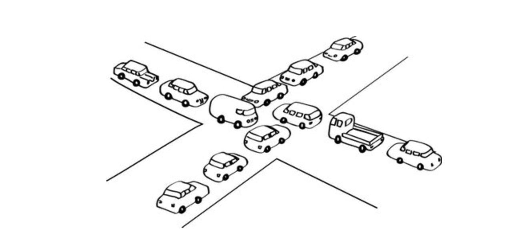
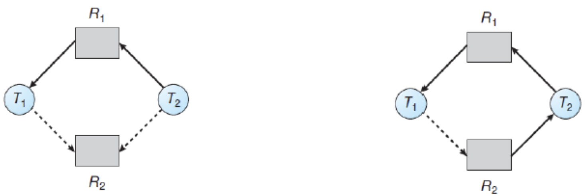
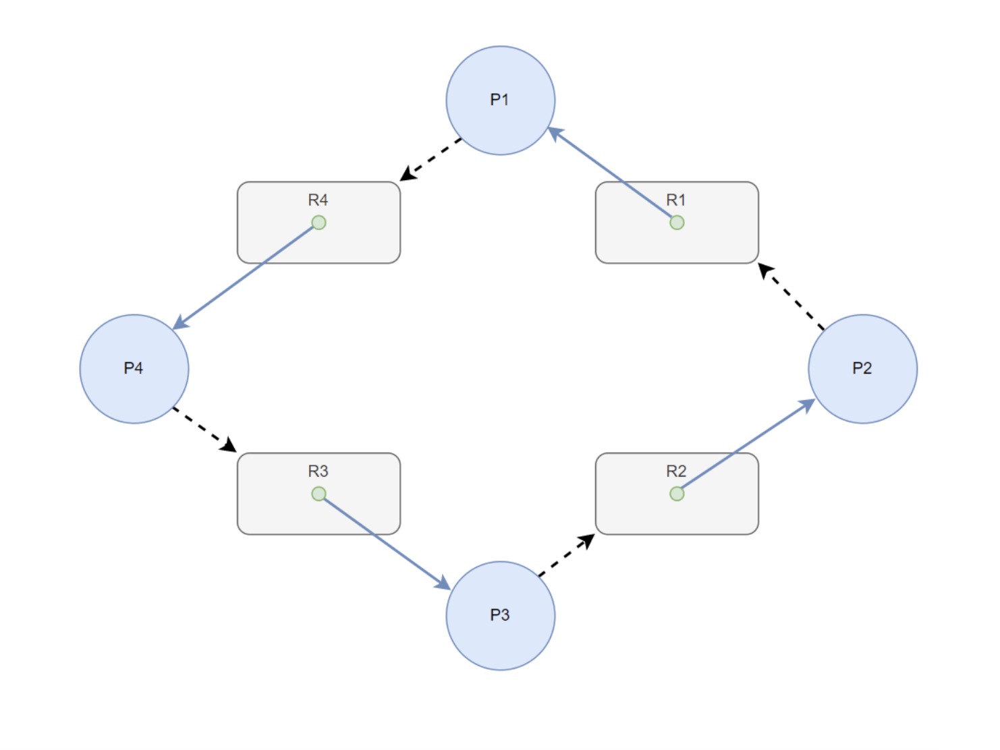

## 데드락(DeadLock)

위처럼 도심 속 도로에서 차가 꽉 막혀 이도저도 못하고 대기하는 상황을 간혹 본적이 있을 것이다. 이렇게 교통이 마비되어 버리면 복구되기까지 오랜 시간이 걸릴것이다. 운영체제내 프로세스 간에도 이와 비슷한 문제가 발생한다. 이를 `데드락(DeadLock)` 이라고 하며, `교착상태` 로 번역된다. 2개 이상의 여러 프로세스가 자원을 획득하기 위해 무기한 대기하는 상황으로, 이 데드락에 빠진 프로세스들은 그 누구도 빠져나오지 못하고 다른 작업을 진행할 수 없게된다.

### 식사하는 철학자 문제(Dining Phliosophers Problem)

식사-철학자 문제는 데드락이 발생하는 상황을 설명하기 위한 아주 고전적이고 재밌는 문제이다. 아래처럼 철학자 4명이 식탁에 앉아있고, 식사를 하는 상황을 가정해보자. 각 철학자들은 본인의 양측에 있는 젓가락을 손에 집어서 식사를 할 것이다.

하지만 문제가 발생한다. 만약 철학자1이 젓가락1을 손에 집었다면, 철학자 4는 본인의 왼쪽 젓가락인 젓가락1을 획득하기 까지 대기해야한다. 즉, 모든 철학자가 동시에 포크를 집어 식사를 하면 그 어떤 철학자도 식사를 할 수 없고, 젓가락을 획득하기 위해 영원히 대기해야한다. 다시 말해, 모든 철학자는 다른 철학자가 포크를 내려놓을 때 까지 대기해야하는 상황에 빠진다. **이렇듯 공유 자원을 본인이 이미 획득한  자원을 내려놓지 못하고, 다른 프로세스가 획득한 자원을 얻기 위해 서로가 무한정 대기하고 있는 상태가 바로 데드락이다.** 

### RAG(자원 할당 그래프)

데드락이 발생하는 상황은 어떻게 표현할까? 이를 위해 RAG 라는 그래프 개념이 등장했고, 그래프를 그림으로 표현하여 언제 데드락이 발생하는지를 손 쉽게 표현할 수 있다. 즉, RAG 라는 자원 할당 그래프란 어떤 프로세스가 어떤 자원을 사용중에 있고, 또 어떤 프로세스가 어떤 자원을 획득하기 위해 대기중인지 표현하는 그래프다.

자원 할당 그래프는 아래와 같은 규칙으로 표현된다.

> - `(1)` 프로세스는 원으로, 자원의 종류는 사각형으로 표현한다.
> - `(2)` 사용할 수 있는 자원의 개수는 자원 사각형 내에 점으로 표현한다.
> - `(3)` 프로세스가 어떤 자원을 할당받아 사용 중이라면 자원에서 프로세스를 통해 화살표를 표시한다.
> - `(4)` 프로세스가 어떤 자원을 획득하기 위해 대기 중 이라면 자원으로 화살표를 표시한다.

위의 왼쪽 예시의 경우, 프로세스 T2 가 자원 R1 을 획득하기 위해 대기중이다. 또한 자원 R1 은 프로세스 T1 에게 할당되어 사용중에 있다.

## 데드락의 발생 조건 

당연하게도 데드락은 아무때나 발생하는 일이 아니다. 어떤 특정 조건을 만족했을 상황에만 발생하느데, 크게 4가지 조건(상황) 이 만족되면 발생한다.

### 상호 배제(Mutual Exclusion)

한 프로세스가 사용중인 자원을 다른 프로세스가 아직 획득하지 못하고 사용할 수 없을 때, 즉 상호배제가 존재하는 상황이라면 데드락이 발생할 수도 있다.

### 점유와 대기

식사-철학자 문제에서 그 누구도 식사를 못했던 이유는, "왼쪽 포크를 들고" 다른 철학자가 들고있는 포크를 획득하고자 대기했기 떄문이다. 다시말해, 한 자원을 보유한 채 다른 자원을 기다렸기 떄문이다. 프로세스도 마찬가지로, **어떤 자원을 획득한 상태에서 다른 자원을 획득하고자 대기하는 상황**라면 데드락이 발생할 수 있다. 이런 상황을 `점유와 대기` 라고 한다.

### 비선점 모드 (Non-Preemption Mode)

선점 모드와 달리, 비선점 모드는 다른 프로세스가 획득한 자원을 강제로 빼앗지 못하고 획득하기 위해 계속 대기해야한다. 비선점 모드에선 내가 얻고자 하는 자원을 이용하는 다른 프로세스의 작업이 끝나야지만 비로소 이용할 수 있다. 즉, 어떤 프로세스도 강제로 자원을 빼앗지 못하므로 데드락이 발생할 수 있다.

### 원형 대기(Circular Wait)

RAG 그래프가 원형 형태로 그려지만 데드락이 발생할 수 있다. 프로세스들이 원의 형태로 대기하는 상황을 원형 대기라고 한다.

## 데드락 해결방안 4가지

운영체제는 애당초에 데드락이 발생하지 않도록 사전에 자원을 적절히 분배하여 `예방(Prevention)`할 수 있고, 데드락이 발생하지 않을 정도로 조금씩 자원을 할당하다가 데드락이 위험이 있으면 자원을 할당하지 않는 방식으로 `회피(Avoidence)` 할 수도 있다. 또한 자원을 제약 없이 마음껏 할당하다가 데드락이 `탐지(Detection)` 되면 그제서야 데드락을 `회복(Recovery)` 하는 방법도 취할 수 있다.

### 예방(Prevention)

데드락을 어떻게 사전에 예방할까? 이는 생각보다 단순하다. 데드락이 발생하는 조건을 파악하고, 이 조건들이 발생하지 않도록 사전에 막아버리는 것이다. 이 조건들은 앞서 살펴본 `상호배제`, `점유와 대기`, `비선점`, `원형 대기` 이다. 이 4가지 발생조건이 일어나지 않도록 사전에 막아버리는 것이다.

>  - 상호배제 부정 : 여러 프로세스가 공유 자원 사용
> - 점유대기 부정 : 프로세스 실행전 모든 자원을 할당
> - 비선점 부정 : 자원 점유 중인 프로세스가 다른 자원을 요구할 때 가진 자원 반납
> - 순환대기 부정 : 자원에 고유번호 할당 후 순서대로 자원 요구

#### 상호배제 제거

자원의 상호배제는 없앤다는 뜻은 곧, 여러 프로세스가 모든 자원을 공유하여 사용하게 만든다는 말과 똑같다. 이 방식은 이론적으로만 가능하지, 현실적으로는 모든 자원의 상호배제를 없애는 것은 어렵기 떄문에 현실적으로 사용하기란 무리가 있다.

#### 점유와 대기 제거

마치 식사-철학자 문제에서 철학자들에게 한 손에 포크를 들고, 다른 포크를 기다리지 못하게 금지하는 것과 같다. 한 철학자가 포크 2개를 동시에 들게 만들거나, 아니면 아예 들지 못하게 하는 방식이다. 이는 프로세스 관점에서 다시 해석하자면, 특정 프로세스가 모든 자원을 획득하도록 허용하거나, 또는 아예 어떤 자원도 획득하지 못하도록 하는 것이다.

이는 데드락을 해결하는 방법이긴 하지만, **자원 이용률(Resource Utilization)** 이 낮아진다는 치명적인 단점이 존재한다. 점유와 대기를 금지사면 한 프로세스에 필요한 자원들을 몰아주고, 그 다음에 다른 프로세스에 필요한 자원들을 몰아줘야 한다. 즉, 여러 프로세스가 동시간대에 병렬적인 작업을 하지 못하고, 한 프로세스만 작업해야 하므로 효율성이 떨어진다. 

#### 비선점 모드 제거 

비선점 모드가 없어지면, 즉 선점 모드가 되면 자원을 획득해서 사용중인 프로세스의 자원을 빼앗아서 자원을 사용할 수 있다. 

비선점 모드와 선점 모드의 장단점은 상황에 따라 다르기 떄문에, 상황에 따라 이 방법을 택하는 것이 좋다. 가령 CPU 는 프로세스들이 선점할 수 있는 대표적인 자원인데, 한 프로세스가 CPU 를 이용하다가 타임아웃이 발생하여 다른 프로세스가 CPU 를 할당받아 사용할 수 있는 경우(일명 Context Switching)가 효율적인 경우가 있다. 

장단점이 모두 존재하기에, 다소 범용성이 떨어지는 방안이다.

#### 원형 대기 제거

모든 자원에 번호를 붙이고, 오름차순으로 자원을 할당하면 원형 대기가 발생하지 않는다. 예를들어, 식사-철학자 문제에서 모든 포크크게 1~4번까지 번호를 붙이고, 철학자들이 번호가 낮은 포크부터 높은 포크 순으로 집어들게 하면 원형 대기가 발생하지 않는다.

이 방식은 앞서 3가지 방식들보다 비교적 현실적이고 실용적이지만, 역시나 단점은 존재한다. 모든 컴퓨터 시스템내에 존재하는 수 많은 자원에 번호를 붙이는 일은 다소 번거로운 작업이며, 각 자원에 어떤 번호를 붙이는지에 따라 특정 자원에 이용률(utilization) 이 떨어질 수 있으므로 설계 측면에서 어렵다는 것이 단점이다.

### 회피(Avoidence)

회피 기법은 데드락이 발생하지 않을 정도로만 조심스럽게 자원을 할당하는 방식이다. 이 기법에선 데드락을 한정된 자원의 무분별한 할당으로 인해 데드락이 발생한다고 가정하여, 마구잡이로 자원을 할당하지 않고 더욱 신중하게 자원을 할당하는 방식이다.

회피 기법에선 아래 용어가 등장한다.

> - 안전 상태(Safe State) : 자원을 할당받고 종료될 수 있는 상태
> - 불안정 상태(Unsafe State) : 교착 상태가 발생할 수도 있는 상태
- 안전 순서(Safe Sequence) : 데드락 발생없이 안전하게 프로세스들이 자원을 할당할 수 있는 순서

운양체게가 데드락을 회피하기 위해서는 시스템 상태가 `안전 상태` 에서 `안전 상태` 로 움직이는 경우에만 자원을 할당하면 된다. 즉, 데드락 회피 기법은 항상 안전 상태를 유지하도록 자원을 할당하는 방식이다. 

### 탐지(Detection) 와 회복(Recovery)

앞선 `예방` 과 `회피` 기법이 데드락을 사전에 최대한 막기위한 노력이라면, 데드락 탐지 & 회복 기법은 데드락이 발생했을 때가 되어서야 그떄가서 조치를 취하는 방법이다. 

운영체제는 프로세스들이 자원을 요구할 때 마다 그떄그떄 매번 모두 할당해주며, 데드락 발생 여부를 주기적으로 검사한다. 검사 결과로 데드락이 발생했다고 탐지되면 그때서야 비로소 다음과 같은 방식으로 회복한다.

#### 선점을 통한 회복

**데드락이 해결될 때 까지 한 프로세스씩 자원을 몰아주는(일명 몰빵) 방식**이다. 데드락이 해결될 떄 까지 다른 프로세스로부터 자원을 강제로 빼앗아 버린뒤, 빼앗은 자원들을 한 프로세스에 할당한다.

#### 프로세스 강제 종료를 통한 회복

프로세스를 강제로 종료시켜서 데드락을 회복할 수 있다. 가장 단순하면서 확실한 방식이다. 운영체제는 데드락에 빠진 프로세스들을 모두 강제 종료할 수도 있고, 데드락이 없어질 떄 까지 한 프로세스만 강제 종료할 수도 있다. 하지만 많은 프로세스들이 작업한 내역을 잃게 될 수 있다.
