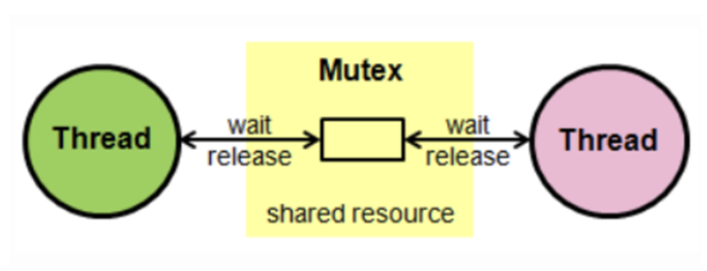
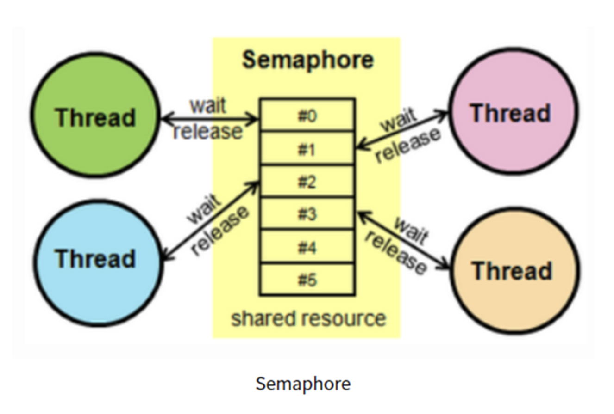
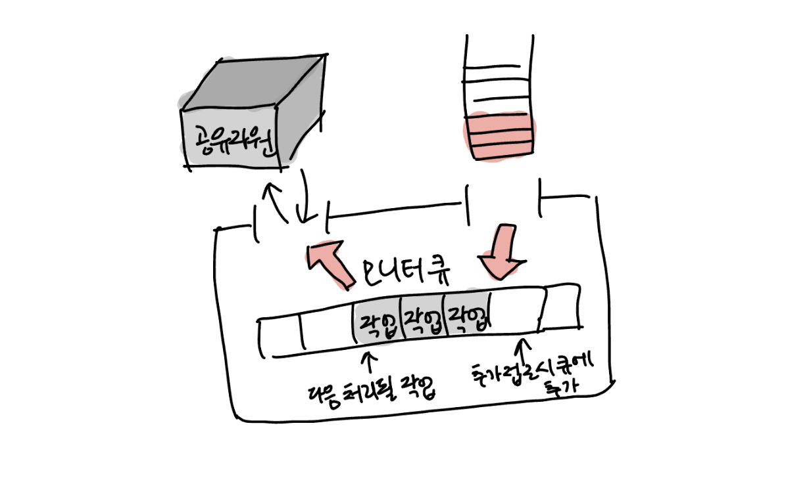

스프링 애플리케이션은 멀티 쓰레드 기반으로 동작한다. 이로 인해 공유 자원에 대한 동시성 이슈는 언제든 발생할 수 있다. 경쟁 상태가 발생할 수 있는 조건에 대해 [경쟁 상태의 2가지 패턴 - Read-Modify-Write, Check-Then-Act](https://haon.blog/database/race-condition-pattern/) 에서 다룬적이 있으니, 경쟁상태와 임계영역에 대한 설명은 생략한다. 

이번 포스팅에선 경쟁상태에 대한 동시 접근 제어 메커니즘 3가지인 뮤텍스, 세마포어, 모니터에 대해 학습해보도록 한다.

## 상호 배제(Mutual Exclusion)

공유 자원에 대해 다량의 프로세스 또는 쓰레드가 접근하면 경쟁 상태가 발생할 수 있다. 따라서 프로세스나 쓰레드를 동기화(synchornization) 할 수 있는 방법이 필요하다. 이때 동기화란, 공유 자원에 대해 동시에 접근하지 못하도록 접근 순서를 제어하는 방법을 뜻한다.

프로세스 및 쓰레드간 동기화는 일반적으로 **상호 배제(Mutual Exclustion)** 을 통해 구현할 수 있다. 아래 3가지 방법은 모두 Lock 메커니즘을 기반으로 동작한다. 자원에 접근한 뒤 해당 자원을 잠그고, 자원을 모두 사용하면 잠금을 헤제하는 방식으로 동작한다.

### 뮤텍스 (Mutex)

뮤텍스는 Mutual Exclustion 의 약자로, 말 그대로 상호 배제를 위한 기법이다. 공유 자원을 사용하기전에 잠그고, 사용을 마쳤다면 잠금을 해제하는 간단한 방식이다. 이때, 잠금이 설정되면 다른 프로세스나 쓰레드는 해당 공유 자원에 접근할 수 없다. 뮤텍스는 (1) 잠김 (2) 잠기지 않음 2가지 상태 상태만을 갖는다. 

뮤텍스는 화장실이 하나밖에 없는 식당과 비슷하다. 화장실에 가려면 카운터에서 열쇠를 받아가야 한다. 만약 화장실을 가려는데 카운터에 키가 있으면 사람이 없다는 뜻이고, 그 열쇠를 이용해서 화장실 잠금을 풀고 들어갈 수 있는 것과 유사하다.

### 세마포어 (Semaphore)

세마포어는 공유 자원에 접근할 수 있는 여러 프로세스 또는 쓰레드의 **최대 허용치를 관리하는 정수 타입 변수**이다. 만약 정수 값이 5라면, 최대 5개의 프로세스 또는 쓰레드가 공유 자원에 접근할 수 있다. (마치 화장실에 최대 5명의 사용자가 들어갈 수 있는 경우와 비슷하다.)

프로세스 하나가 이 공유 자원에 접근하면 정수 값을 1 감소시키고, 반대로 공유 자원을 모두 사용한 뒤 임계영역에서 프로세스가 하나 나왔다면 다시 정수값을 1 증가시킨다. 여기서 각 과정을 `wait()` 과 `signal()` 이라고 한다. 만약 세마포어 값이 0이라면 이 이상 임계영역에 프로세스 또는 쓰레드가 진입이 불가능한 상태가 되며, 1 이상인 양수일 때만이 접근 가능하다.

즉, `wait()` (또는 P) 가 호출되면 세마포어 정수 값을 1 감소시킨다. 만약 감소시키려는데 세마포어 값이 0이라면, 해당 프로세스는 세마포어 대기열에서 기다려야한다. 반면 `signal()` (또는 V) 은 세마포어 값을 1 증가시키고, 세마포어 대기열에서 기다리고 있는 맨 앞의 프로세르르 하나 깨워서 임계영역에 진입하도록 한다.

#### 이진 세마포어(Binary Semaphore) vs 계수 세마포어(Counting Semaphore)

세마포어는 정수 값 크기에 따라 이진 세마포어와 계수 세마포어 2가지 종류로 나뉜다. 이진 세마포어는 0 또는 1 값만 가질 수 있다. 이진 세마포어는 마치 뮤텍스와 비슷하게 동작한다. 다만, 뮤텍스는 잠금 메커니즘이고, 세마포어는 신호 기반의 상호 배제 방법이다. 계수 세마포어는 1보다 큰 세마포어 정수를 가질 수 있는 방식이다.

### 모니터 (Monitor)

세마포어를 사용하기 위해건 **임계 영역에 명시적으로 상호 배제 로직을 우리가 직접 구현해야한다. 모니터는 이 상호 배제 로직을 제거하고, 공유 자원 접근에 대한 고수준의 인터페이만을 제공한다.** 또한 공유 자원도 외부로부터 캡슐화하여 숨긴다. 즉, 모니터를 사용하며 세마포어를 직접 구현하지 않아도 되고 제공되는 인터페이스만을 사용하여 간편히 상호배제를 보장할 수 있다. 따라서 모니터를 사용하며 세마포어보다 구현 난이도가 매우 쉽고, 실수가 줄어든다. 자바의 `synchornized` 의 경우가 모니터를 사용하여 구현되었다.

공유 자원에 접근하고자 하는 프로세스 또는 쓰례드는 모니터 내부로 진입해야한다. **모니터는 모니터 큐에 작업 이벤트를 순차적으로 쌓아두고, 한번에 한 프로세스 또는 쓰레드만 임계 영역에 접근**할 수 있도록 한다. 즉, 한번에 하나의 프로세스만 모니터에서 작업할 수 있도록 해준다. 개념적으로는 이진 세마포어와 같은 기능을 제공하는 셈이다.

## 참고

- 혼자 공부하는 컴퓨터구조, 운영체제 (한빛미디어 강민철 지음)
- https://heeonii.tistory.com/14
- https://hudi.blog/race-condition-critical-section-mutual-exclusion/#%EB%AE%A4%ED%85%8D%EC%8A%A4-mutex
- https://velog.io/@leesfact/뮤텍스-세마포어-모니터