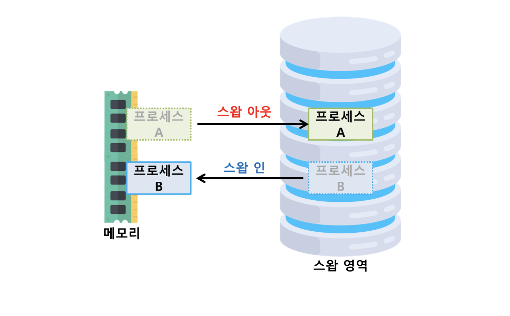
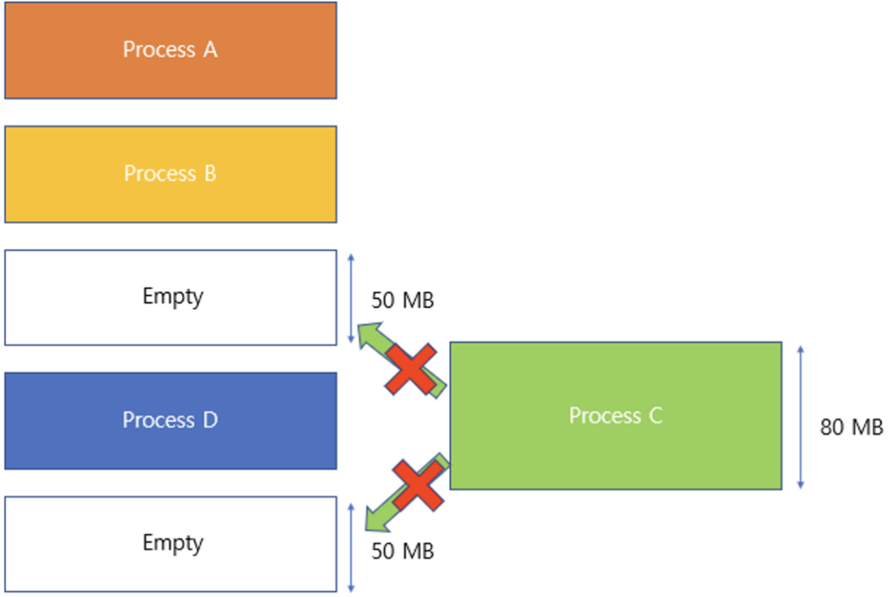
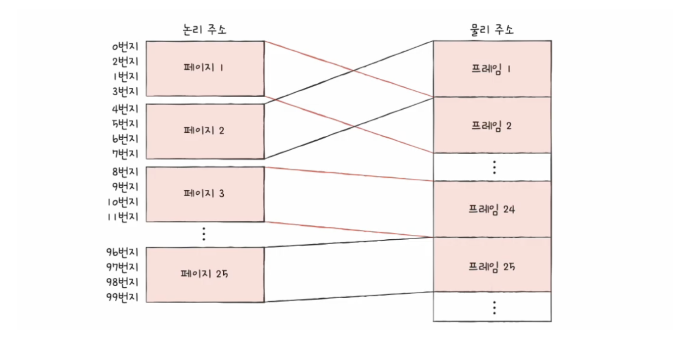
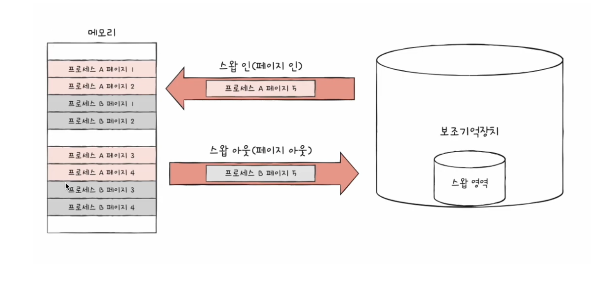
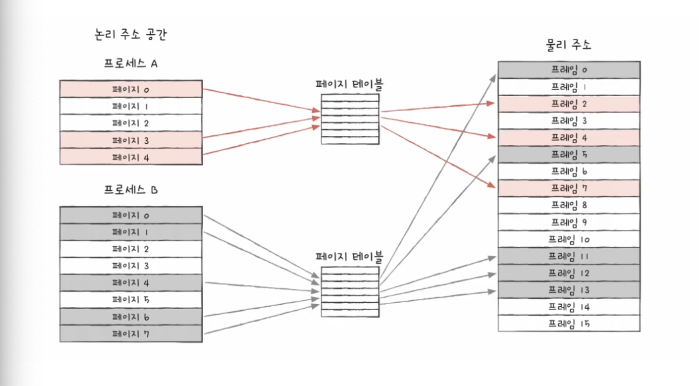
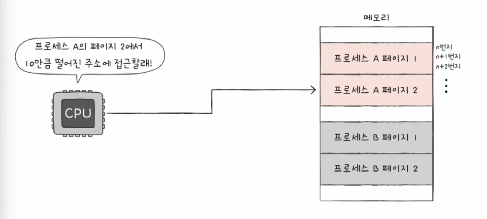
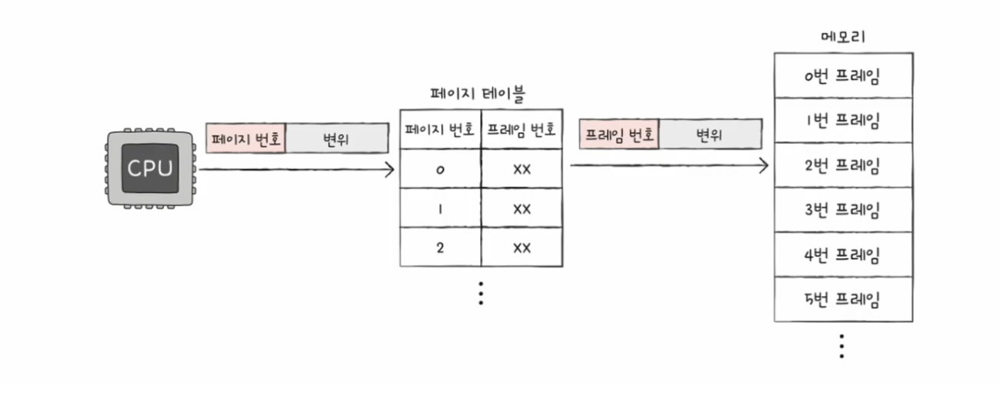
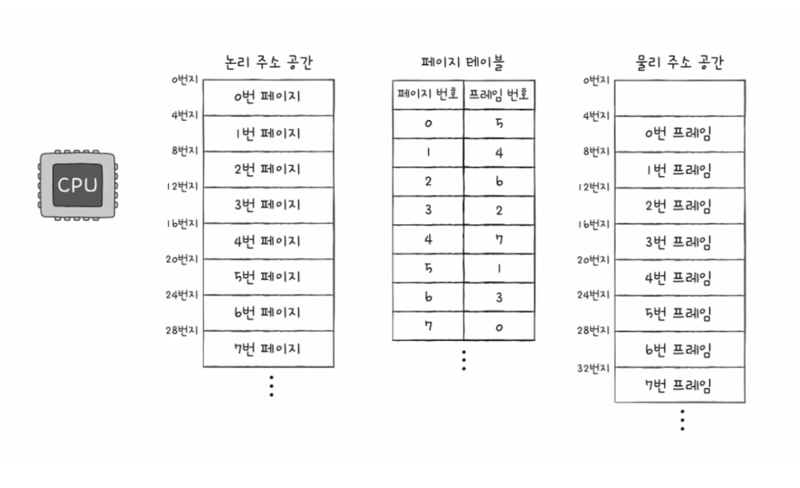

겉보기에 프로세스들은 특별한 내부 동작없이 단순하게 메모리내에서 연속적으로 배치되는 구조처럼 보일 수 있다. 하지만, 프로세스는 연속적으로 메모리에 배치될 때 스와핑(Swapping), 단편화(Fragmentation) 이라는 고려사항들을 신경쓰며 배치된다. 

## 스와핑(Swapping)

메모리에 적재된 프로세스들 중에는 현재 실행되지 않는 프로세스가 존재할 수 있다. 입출력 작업을 위해 대기 상태에 빠진 프로세스라던지, 오랫동안 사용되지 않는 프로세스가 이런 프로세스들에 속한다.  이렇듯 현재 (당장에) 실행되지 않는 프로세스들을 잠시 보조기억장치 일부 영역으로 쫓아내고, 그렇게 생긴 메모리상의 빈 공간에 또 다른 프로세스들을 가져와서 실행하는 방식을 `스와핑(Swapping)` 이라고 한다.

스와핑을 이용하면 프로세스들이 요구하는 메모리 주소 공간의 크기가 실제 메모리 크기보다 큰 경우에도 프로세들을 동시에 실행 가능하다. 

## 메모리 할당

스와핑 구조를 통해 메모리내에 새로운 빈 공간에 생기고, 그렇게 생긴 빈 공간이 여러개라면 프로세스를 어디에 배치해야할까? 이에 대한 3가지 기법이 있다.

아래와 같은 메모리 공간에 2칸의 공간을 차지하는 데이터는 저장하는 상황을 가정해보자.

### First Fit

최초 적합(First Fit) 은 OS 가 메모리내의 빈 공간을 앞에서부터 `순차대로` 검색하다가 적재할 수 있는 공간을 발견하면 그 공간에 프로세스를 배치하는 방식이다. 

- 장점 : 프로세스가 적재될 수 있는 공간을 발견하는 즉시 메모리를 할당하므로, 검색을 최소화할 수 있고 결과적으로 빠른 할당이 가능하다.
- 단점 : Best Fit 방식에 비해 메모리 공간에 낭비가 심해질 수 있다.

### Best Fit

최적 적합(Best Fit) 은 빈 공간을 모두 검색해 본 후, 프로세스가 적재될 수 있는 공간 중 `가장 작은 공간`에 프로세스를 배치하는 방식이다. 

- 장점 : 메모리 낭비가 가장 적다. 
- 단점 : 처음부터 끝까지 모두 탐색하여 최적의 공간을 찾아내야 하므로, 시간이 오래걸린다.

### Worst Fit

최악 적합(Worst Fit) 은 OS 가 빈 공간을 모두 검색해 본 후, 프로세스가 적재될 수 있는 공간 중 가장 큰 공간에 프로세스를 배치하는 방식이다. 

- 단점 : Best Fit 방식처럼 처음부터 끝까지 모두 탐색해야 하므로 시간이 오래걸린다. 또한 메모리 낭비까지 심하기 떄문에 가장 사용되지 않는 방식이다.

## 외부 단편화 (Exteral Fragmentation)

프로세스를 메모리에 연속적으로 배치하는 연속 메모리 할당은 사실 효율적으로 사용하는 방법이 아니다. 연속 메모리 할당은 `외부 단편화` 라는 문제를 내포하고 있기 때문이다. 외부 단편화란 **프로세스를 할당하기 어려울만큼 작은 메모리 공간들로 인해 메모리가 낭비되는 현상**을 의미한다. 

위 상황에선 프로세스 C가 스와핑이 되어 메모리에 적재되어야 하지만, 공간 여유가 마땅치않아 적재되지 못하고 있는 상황이다. 빈 공간 2개는 더했을 때 총 100MB 로, 프로세스 C가 80MB 로 더 작음에도 불구하고 할당되지 못하고 있다. 이렇듯 외부 단편화 문제는 이곳저곳에 작게 흩어진 빈 공간들이 많아져서, 낭비되는 공간이 많아지는 현상을 야기한다. 

### 해결안1. 메모리 압축 (Compaction)

외부 단편화를 해결할 수 있는 대표적인 방안으로 메모리를 압축하는 방법이 있다. 압축이란 여기저기 흩어져 있는 작은 빈 공간들을 하나의 공간으로 모으는(압축하는) 방식을 뜻한다. 

하지만 압축 방식은 단점이 많다. 작은 빈 공간들을 하나로 모으는 동안 시스템은 하던 일을 중지해야하고, 메모리에 있는 내용을 옮기는 작업은 많은 오버헤드를 야기한다. 또한 애당초애 어떤 프로세스를 어떻게 움직여야 오버헤드를 최소화하며 압축할 수 있는지에 대한 방법도 명확하지 않는다.

### 해결안2. 페이징(Paging)

메모리 압축 방법도 비효율적이기 떄문에, 외부 단편화 해결을 위한 더 효율적인 방안이 고안되었다. 그것은 바로 `페이징(Paging)` 이라는 기법이다. 페이징이란  오늘날에 가장 효율적으로 많이 사용되는 가상 메모리 기법이다.

---

## 페이징(Paging)

연속적인 메모리 할당 구조, 즉 프로세스를 메모리에 연속적으로 할당하는 방식은 2가지 문제점을 내포하고 있다. 우선 앞서 말했던 `(1)` 외부 단편화 문제이며, `(2)` 물리 메모리보다 큰 프로세스를 실행할 수 없다는 점이다.

`가상 메모리` 는 실행하고자 하는 프로그램을 일부만 메모리에 적재하여 실제 물리 메모리 크기보다 더 큰 프로세스를 실행할 수 있게 하는 기법이다. 이를 가능케 하는 가상 메모리 관리 기법으로는 `페이징` 과 `세그먼테이션` 이 있는데, 현대 대부분의 OS 가 사용하는 기법은 페이징이다. 페이징 기법을 사용하면 큰 프로세스를 실행할 수 있을 뿐만 아니라, 외부 단편화 문제도 해결할 수 있다.

### 페이징이란

연속 메모리 할당 방식에서 외부 단편화가 생긴 근본적인 이유는, 각기 다른 크기의 프로세스가 메모리에 연속적으로 할당되었기 때문이다. 

만약 메모리와 프로세스를 `일정한 단위` 로 자르고, 이를 메모리에 불연속적으로도 할당할 수만 있다면 외부 단편화는 발생하지 않는다. 이에 대한 기법이 바로 페이징이다. **페이징은 프로세스의 논리 주소 공간을 페이지(Page) 라는 동일한 크기의 일정한 단위로 자른 뒤, 페이지를 프레임에 할당하는 가상 메모리 관리 기법이다.**

#### 페이징 핵심 요약

> - 프로세스의 논리 주소공간을 페이지라는 일정한 단위로 자른다.
> - 메모리의 물리 주소공간을 프레임이라는, 페이지와 동일하고 일정한 단위로 자른다.
> - 페이지를 프레임에 할당하는 가상 메모리 관리 기법이다.

### 페이징에서의 스와핑(Swapping) : Page In, Page Out

페이징에서도 스와핑을 사용할 수 있다. 페이징을 사용하는 시스템에선 프로세스 전체가 `스왑 아웃(Swap Out)`, `스왑 인(Swap In)` 된다. 즉, 메모리에 적재될 필요가 없는 페이지들은 보조기억장치로 Swap Out 되고, 실행에 필요한 페이지들은 메모리로 Swap In 된다. 페이징 시스템에서의 Swap Out 은 `페이지 아웃(Page Out)`, Swap In 은 `페이지 인(Page In)` 이라고 부르기도 한다.

메모리에 적재될 필요가 없는 페이지들을 내쫓고, 실행에 필요한 페이지들을 메모리내에 유입한다. 또한 **프로세스를 실행하기 위해, 모든 페이지가 꼭 메모리에 적재되어야 할 필요는 없다.** 프로세스를 이루는 페이지 중 실행에 필요한 일부 페이지만을 메모리에 적재하고, 당장 실행에 필요하지 않은 페이지들은 보조기억장치에 남겨둘 수 있다. 이를 통해 물리 메모리보다도 큰 프로세스도 실행될 수 있다. 정말 큰 프로세스라고 한들, 해당 프로세스를 구성하는 각 페이지를 메모리에 적재하여 실행 가능하기 때문이다.

### 페이지 테이블 (Page Table)

그런데 문제가 있다. 프로세스가 메모리에 불연속적으로 배치되어 있다면 CPU 입장에서 이를 순차적으로 실행할 수가 없다. 프로세스를 이루는 페이지가 어느 프레임에 적재되어 있는지 CPU 가 모두 알고 있기란 어렵기 때문이다. 즉, 프로세스가 메모리에 불연속적으로 배치되면 CPU 는 "다음에 실행할 명령어 위치" 를 찾기가 어려워진다.

이를 해결하기 위해 페이징 시스템은 (실제 메모리 내의 주소인) 물리 주소에 불연속적으로 배치되더라도 (CPU 가 바라보는 주소인) 논리 주소에는 연속적으로 배치되도록 `페이지 테이블(Page Table)` 을 이용한다. 페이지 테이블이란 페이지 번호와 프레임 번호를 매핑하여 짝 지어주는 일종의 이정표다. 즉, **페이지 테이블은 현재 어떤 페이지가 어떤 프레임에 할당되었는지를 알려준다.** 

이 방식을 통해, **비록 물리 주소상에서는 프로세스들이 분산되어 저장되어 있더라도 CPU 입장에서 바라본 논리 주소는 연속적으로 보이게끔 할 수 있다.** 즉, 프로세스들이 메모리에 분산되어 저장되어 있더라도, CPU 는 논리 주소를 그저 순차적으로 실행하면 된다.

### 페이징시 발생하는 내부 단편화(Internal Fragmentation)

페이징은 외부 단편화 문제를 해결할 수 있지만, 내부 단편화라는 문제를 야기할 수 있다. 페이징은 프로세스의 논리 주소 공간을 페이지라는 일정한 크기 단위로 자른다. 그런데 모든 프로세스가 페이지 크기에 딱 맞게 잘리는 것은 아니다. 즉, 페이지 내부에서 아주 작은 빈 공간이 발생할 수 있다. 

내부 단편화는 하나의 페이지보다 작은 크기로 발생한다. 따라서 하나의 페이지 크기가 작다면 발생하는 내부 단편화 크기는 작아질 가능성이 크다. 하지만, 그렇다고 한 페이지의 크기를 너무 작게 설정해도 그마늠 페이지 테이블의 크기도 커지기 때문에, 페이지 테이블이 차지하는 공간이 낭비된다. 따라서 내부 단편화를 적당히 방지하면서, 너무 크지 않은 페이지 테이블이 만들어지도록 페이지의 크기를 조정하는 것이 바람직하다.

## 페이징에서의 주소 변환

그렇다면, 페이징을 활용하는 구조에서 특정 주소에 접근하려면 어떤 정보가 필요할까? 아래 2가지 정보가 필요하다. 

> - Page Number(페이지 번호) : 어떤 페이지, 프레이메 접근하고 싶은지 (접근하려는 특정 페이지의 시작 주소)
> - Offset : 접근하려는 주소가 해당 페이지 또는 프레임 시작 주소로부터 얼마나 떨어져 있는지

페이지 번호는 말 그대로 접근하고자 하는 페이지의 번호로, 해당 페이지의 시작주소가 된다. 페이지 테이블에서 해당 페이지 번호를 찾으면 어떤 프레임에 할당되었는지를 알 수 있다. offset 은 접근하려는 주소가 프레임의 시작 번지(주소) 로 부터 얼만큼 떨어져있는지를 알기 위한 추가 주소값이다. 

즉, <Page Number, Offset> 를 가진 논리 주소는 위처럼 페이지 테이블을 거쳐서 <Frame Number, Offset> 으로 변환된다.

참고로 페이지의 offset 과 프레임의 offset 값은 항상 같다. 페이지와 프레임의 크기는 항상 같기 떄문이다.

예를들어 논리주소, 즉 <페이지 주소, offset> 이 <5, 2> 인 곳에 접근하려고 한다. 이때 5번 페이지 번호에서 2만큼 떨어진 곳을 찾으면 될 것이다. 5번 페이지를 확인해보면, 프레임 번호 1과 매핑된다. 즉, 1번 프레임의 시작 주소값은 8번지 이므로, 이에 offset 값인 2를 더한 10번지에 바로 CPU 가 접근하게 될 물리주소값이 된다.

## 페이지 테이블 엔트리 (PTE)

페이지 테이블에 담기는 정보는 페이지 번호, 프레임 번호 이외에도 부가적인 정보가 조금 더 감긴다. 

### 유효 비트 (Valid Bit)

현재 해당 페이지에 접근 가능한지 여부를 알려주는 정보다. 유효 비트가 1이라면 메모리에 적재되어 있는 페이지이고, 유효비트가 0이라면 적재되지 않은 페이지를 의미(스왑 영역에 존재) 한다.

### 보호 비트 (Protection Bit)

페이지 보호를 위해 존재하는 비트다. 보호 비트를 통해 해당 페이지가 읽고 쓰기(Read and Write) 가 모두 가능한지, 또는 읽기만 가능한 페이지인지를 나타낼 수 있다. 보호 비트가 0이면 읽기 전용, 1이면 읽기 및 쓰기 전용으로 설정할 수 있다.

### 참조 비트 (Reference Bit)

CPU가 이 페이지를 접근한 적이 있는 지의 여부를 기록한다.

### 수정 비트 (Dirty Bit)

CPU 가 이 페이지에 데이터를 쓴 적이 있는 지의 여부를 기록한다.

수정 비트가 존재하는 이유는 스와핑과 관련이 있다. 페이지가 메모리에서 사라질 때, 보조 기억장치에 쓰기를 해야할 지 말 지 여부를 판단한다. 만약 쓰기 작업 했다면 수정된 페이지가 스왑 아웃될 때 보조 기억장치에도 쓰기 작업을 해야한다. 이를 수정 비트를 확인하여 판단한다.

## 세그먼테이션(Segmentation) vs Paging

지금까지 살펴본 페이징 방식은 프로세스를 일정한 크기의 페이지 단위로 분할하여 메모리에 적재하는 방식이었다. 반면 `세그먼테이션(Segmentaion)` 방식은 가상 메모리를 서로 크기가 다른 논리적 단위로 분할한 것을 뜻한다. 세그먼테이션은 프로세스를 물리적 단위인 페이지가 아닌, 논리적 단위인 `세그먼트(Segment)` 로 분할해서 메모리에 적재하는 방식이다. 

페이징은 한 프로세스를 페이지라는 같은 크기로 분할해서 보관하는 방식이라면, 세그먼테이션은 부위 별로 잘라서 보관한다고 이해하면 된다. **세그먼트는 의미가 같지 않은 논리적 내용을 기준으로 프로그램을 분할하기 때문에  분할된 각 세그먼트의 크기가 같지 않다.**

### 장단점

- 장점 : 내부 단편화 문제가 해소된다. 또한 보호화 공유 기능을 수행할 수 있다. 프로그램의 중요한 부분과 중요하지 않은 부분을 분리하여 저장할 수 있고, 같은 토드 영역은 한 번에 저장할 수 있다.
- 단점 : 외부 단편화 문제가 발생할 수 있다.

