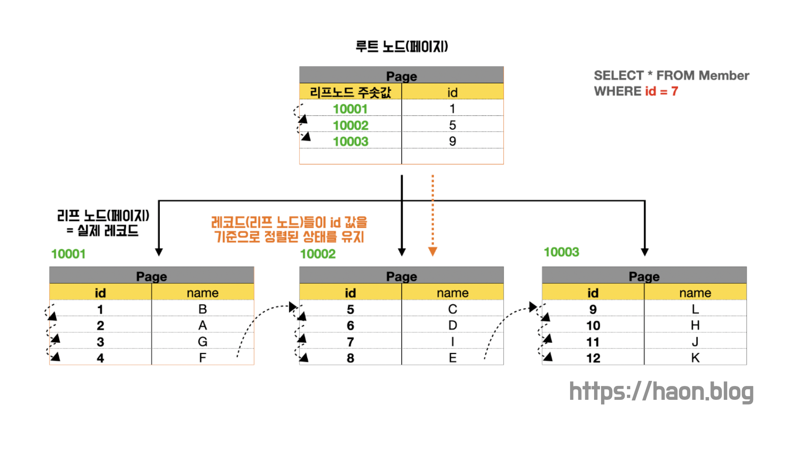
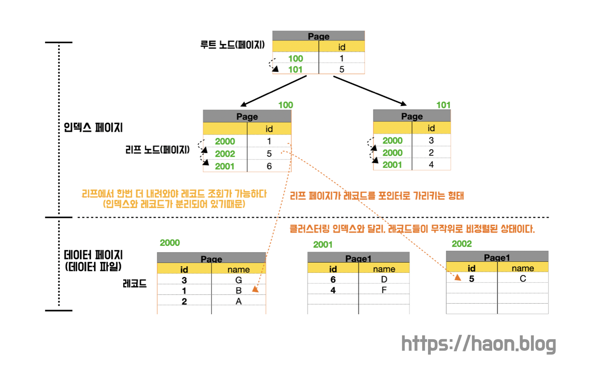
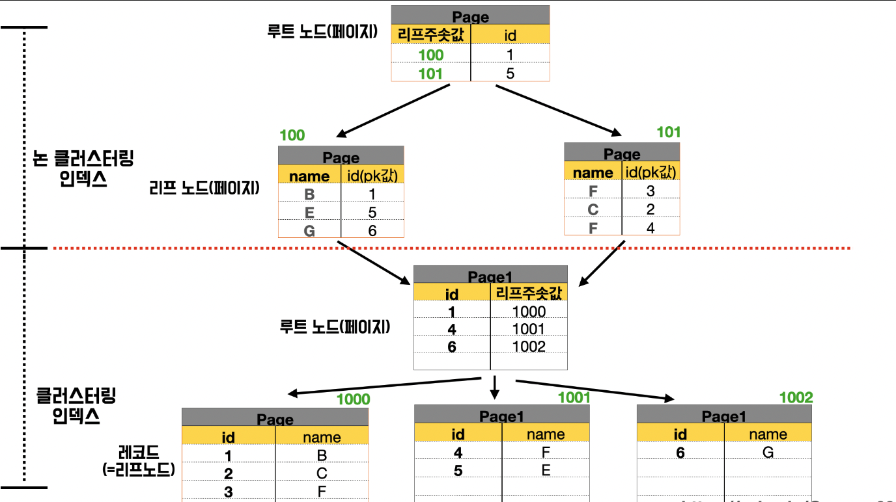

만약 인덱스가 없었더라면, `테이블 풀 스캔(Table Full Scan)` 이 발생하여 원하는 데이터를 찾는데 꽤 오랜 시간이 걸릴것이다. 인덱스가 없는 경우엔 데이터가 단순히 삽입된 순서대로 담기게 된다. 이 떄문에 순차 탐색을 해야하고, 최악의 경우 O(n) 시간이 소요된다.

이를 개선하기 위해 인덱스가 등장했다고 여러 포스팅에 걸쳐 설명했었다. 이 인덱스는 사실 2종류로 나뉜다. 이번 포스팅에선 인덱스의 2가지 종류인 클러스터링 인덱스와 비클러스터링 인덱스에 대해 다루어본다.

## 클러스터링 인덱스 (Clustering Index)

클러스터링 인덱스는 데이터가 테이블에 물리적으로 저장되는 순서를 정의하는 인덱스이다. 즉, **클러스터링 인덱스는 특정 컬럼을 기준으로 데이터들을 정렬**시킨다. 이때, **클러스터링 인덱스는 실제 데이터와 무리(Cluster) 를 지어 인덱싱** 되므로 클러스터링 인덱스라고 부른다. 클러스터링 인덱스의 주 목적은 실제 데이터를 정렬하는 것이다. 실제 데이터들은 클러스터링 인덱스를 기준으로 하여 함께 묶여서 정렬되기에, 원하는 데이터를 탐색시 더 빠르게 정렬된 구조에서 데이터를 찾을 수 있게 해준다.

클러스터링 인덱스는 **테이블당단 1개만 생성할 수 있다.** 다시말해, 테이블 당 데이터는 오직 1가지의 클러스터링 인덱스로 정렬 기준을 갖고 실제 데이터들이 정렬된다. 정렬 기준으로 오직 1개의 컬럼만을 선택할 수 있다는 뜻이다. 

따라서 정렬 기준으로 가장 적합한 컬럼 하나만을 클러스터링 인덱스로 지정할 수 있는데, 대표적으로 PK(Primary Key) 가 클러스터링 인덱스로 자동 지정된다. 만약 PK 가 아니라 다른 컬럼을 지정하고 싶다면, **Unique + Not NULL** 제약조건을 부여한 컬럼은 클러스터링 인덱스가 자동 생성된다. 만약 PK 와  **Unique + Not NULL** 을 부여한 컬럼이 동시에 존재한다면, PK 를 우선순위로 하여 클러스터링 인덱스를 생성한다. (클러스터링 인덱스는 단 1개의 컬럼만 허용하기 떄문에, 어떤 것을 선택할지 우선순위를 두고 결정한다.) 만약 이 2가지 모두 없는 경우, InnoDB 는 내부적으로 `GEN_CLUST_INDEX` 라는 컬럼을 생성하여 클러스터링 인덱스를 생성한다. `GEN_CLUST_INDEX` 는 행이 생성된 순서대로 값을 부여한다.

클러스터링 인덱스는 **B+ Tree** 형태로 구성되어 있는데, 각 페이지(노드) 는 고유의 페이지 번호(Page ID)를 가지고 있다. 페이지 번호는 마치 집 주소 번지값이라고 생각하면 쉽다.

위 예제를 살펴보자. 각 데이터는 리프 페이지에서 PK 를 기준으로 정렬되어 있다. 루트 페이지는 Key 로 각 페이지에 대한 고유 페이지 번호를 갖고 있으며, Value 로 각 페이지가 보유한 PK 중 가장 앞단의 PK 를 가지고 있다. (간단한 예시를 들기위해, 루트와 리프 페이지 중간 계층의 페이지가 있는것은 생략했다.) 보듯이 PK 를 기준으로 정렬되어 있으며, 리프 페이지엔 인덱스가 실제 데이터와 함께 군집(Cluster) 를 이루어 저장된다. 클러스터링 인덱스를 기준으로 실제 데이터들이 정렬된다. 

~~~sql
SELECT * FROM MEMBER
WHERE id = 7
~~~

PK 값을 WHERE 절에 넣어 데이터틑 탐색하는 과정을 생각해보자. PK 값은 7이기 떄문에, 루프 페이지에서 5 와 9 사이에 존재하는 값임을 알 수 있다. 앞서 설명했듯이 각 루프 페이지는 각 페이지가 보유한 PK 중 가장 앞단 (가장 작은) PK 를 저장한다고 했으므로, id = 5 를 가진 10002번지에 대한 리프 페이지로 내려간다. 그러고 원하는 데이터를 해당 리프 페이지에서 찾아낼 수 있게된다.

### 단점

클러스터링 인덱스를 기준으로 실제 데이터들이 함께 군집을 이루어 정렬 된 상태를 유지하기 떄문에 검색 속도가 매우 빨라진다. 하지만, 순서는 오직 하나의 컬럼을 기준으로 정렬되기 떄문에 중간에 새로운 데이터가 삽입된다면 이후의 모든 컬럼을 한 칸씩 이동(재정렬) 해줘야 한다. 즉, 데이터를 삽입, 변경, 삭제할 떄 마다 전체 데이터 페이지에 재정렬이 필요하므로 속도가 매우 느리다는 점을 유의해야 한다.

만약 PK = 2 를 가진 신규 데이터를 삽입한다고 해보자. 그리고 데이터 이후에 1만개의 데이터가 존재한다고 해보자. 그렇다면 기존의 PK = 3 ~ 10001 까지의 데이터들은 모두 한 칸씩 뒤로 이동시켜줘야하는 셈이다. 인덱스가 군집(Cluster) 를 이루기 떄문이다. 이렇듯 새로운 데이터를 삽입할 떄는 많은 비용이 소모된다는 점을 유의하자.

## 비클러스터링 인덱스 (Non Clustering Index)

비클러스터링 인덱스(Non Clustering Index) 는 **보조 인덱스(Secondary Index)** 라고도 불리며, 클러스터링 인덱스와 달리 인덱스들이 실제 데이터들과 함께 군집을 이루어 저장되는 방식이 아니다. 그 대신에 정렬된 별도의 인덱스 페이지로 저장되고 관리된다. **실제 데이터와 함꼐 군집을 이루지 않고, 별도의 분리된 인덱스 페이지 저장 공간에서 실제 데이터 페이지들을 포인터로 가리키는 구조를 취한다.** 만약 `UNIQUE` 제약 조건을 걸은 컬럼이 있다면, 해당 컬럼은 자동으로 비클러스터링 인덱스가 생성된다. 또는 `INDEX` 쿼리를 넣어서 직접 인덱스를 생성하는 방법도 있다. 아래 3가지 방법은 모두 비클러스터링 인덱스가 생성된다.

~~~sql
ALTER TABLE member
ADD CONSTRAINT name UNIQUE(name); // unique 제약 조건

CREATE UNIQUE INDEX name // 중복을 허용하지 않는 인덱스를 생성
ON member (name)

CREATE INDEX name; // 중복을 허용하는 인덱스 생성
ON member (name)
~~~

인덱스 페이지를 항상 정렬된 상태를 유지하지만, 실제 데이터 페이지는 정렬되지 않아서 클러스터링에 비해 삽입, 수정, 삭제 작업이 더 느리다. 데이터 페이지를 무작위로 삽입하고, 정렬 순서를 유지하지 않기 떄문이다. 

루트 페이지는 클러스터링 인덱스와 비슷하게 인덱스로 지정한 컬럼들과 페이지 번호를 갖고 있다. 반면 리프 노드에서 인덱스는 **RID(데이터 페이지의 번호 + offset)** 을 조합한 값을 저장하여, 특정 데이터 페이지의 특정 행을 가지킨다. (RID = RowID, 데이터 주소) 이 방식을 통해 인덱스 페이지에서 특정 데이터 페이지로 이동하고, 원하는 실제 데이터를 찾을 수 있다.

## 클러스터링 인덱스와 비클러스터링 인덱스의 혼합

그런데 현실적으로, 기본적으로 생성되는 클래스터링 인덱스 외에도 비클러스터링 인덱스를 생성해야하는 경우가 대다수일 것이다. 즉, 하나의 테이블에 클러스터링 인덱스와 비클러스터링 인덱스가 혼합되어 있는 경우가 많다. **PK 는 기본적으로 항상 존재하며, 추가로 조회가 자주 발생하는 컬럼에 대해 인덱스를 추가**하기 떄문이다. 

이렇게 혼합된 경우에선 **비클러스터링 인덱스를 먼저 거치고, 이어서 클러스터링 인덱스를 거쳐서 실제 데이터를 찾는 방식**으로 동작한다. 이때, 비클러스터링 인덱스의 리프노드는 실제 데이터에 대한 주소값(데이터 위치 값) 대신, 클러스터링 인덱스에 대한 컬럼 값(PK 값) 을 갖는다. 실제로 위 예시를 보면 비클러스터링 인덱스의 인덱스 페이지는 앞서 살펴봤던 **RID(데이터 페이지의 번호 + offset)** 대신에 PK 값을 가지고 있다. 이 PK 값에 매핑되는 클러스터링 인덱스를 찾아내고, 이후 앞서 살펴본 클러스터링 인덱스에서의 동작과정이 동일하게 일어난다.

### 비클러스터링 인덱스는 왜 PK 값을 들고 있어야할까?

그런데 이상하다. 왜 비클러스터링 인덱스는 PK 값을 가지고 있는 것일까? 그냥 RID 값을 들고있고, 바로 원하는 실제 데이터를 찾아내도록 구조를 취하면 안될까? 만약 그렇게 된다면, 테이블에 데이터가 추가, 변경 및 삭제될 때 마다 테이블 데이터의 페이지 번호와 페이지 내 순서가 모두 변경되어야 한다. 클러스터링 인덱스는 데이터를 직접 가지고 있고, 테이블 전체가 정렬된 인덱스라고 했었다. 이런 구조에서 비클러스터링 인덱스가 RID 값을 직접 들고 있다면, 비클러스터링 인덱스를 모두 수정해야하는 문제가 발생한다. 그래서 비클러스터링 인덱스가 PK 값을 가지고 있는 구조를 취해야하는 것이다.

## 참고

- https://www.youtube.com/watch?v=edpYzFgHbqs
- https://www.youtube.com/watch?v=NkZ6r6z2pBg
- https://gwang920.github.io/database/clusterednonclustered/#%EA%B7%B8%EB%9E%98%EC%84%9C-%EC%99%9C-clustered-%EC%9D%B8%EA%B0%80-
- https://developers-haven.tistory.com/55
- https://golf-dev.tistory.com/67