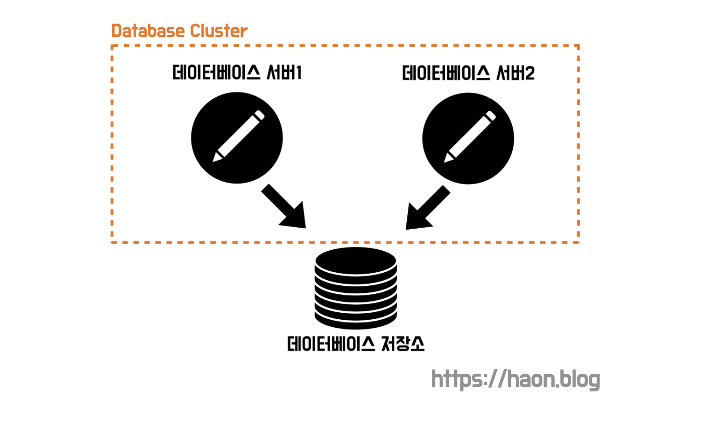
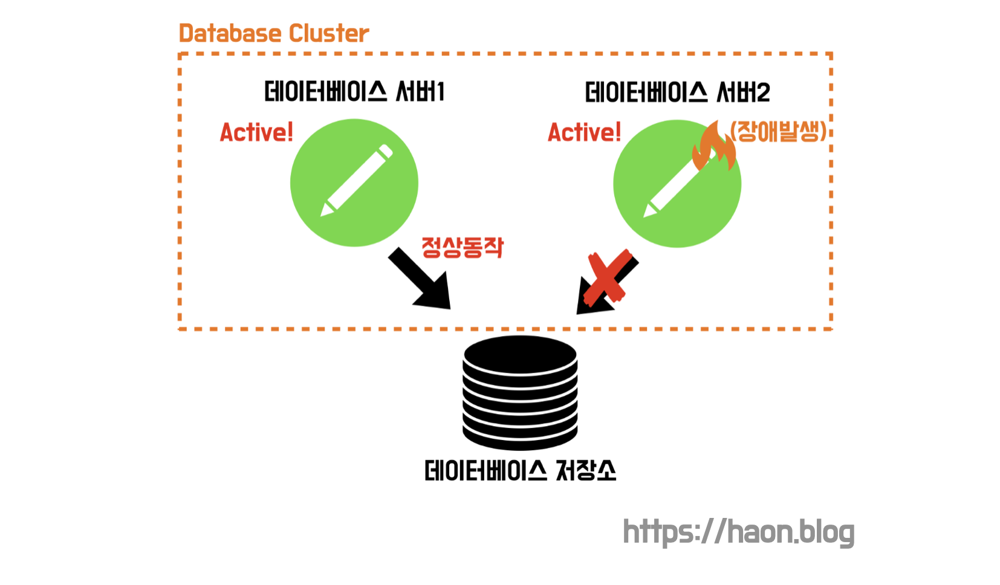
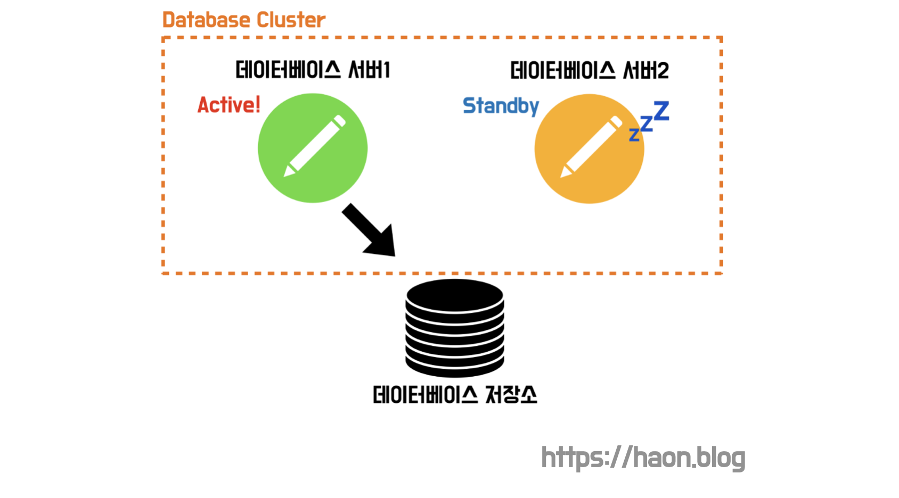

## 학습배경

하모니 팀의 모행 서비스는 높은 가용성과 확장성을 확보하기 위해 다양한 성능 개선을 시도하고 있다. 톰캣 서버 튜닝, HikariCP 사이즈, N+1 문제 해결, 인덱스 적용등 여러 시도를 하고 있지만, **결국 데이터베이스에서 병목이 발생하면 시스템 전체 성능 저하가 발생**할 수 있다는 것을 알게되었다. 특히 인덱스 적용, N+1 해결등으로 쿼리 성능이 많이 개선되었지만, 더 최적화할 수 있는 방법은 데이터베이스를 다중화하여 읽기/쓰기 성능을 개선할 수 있다는점을 알게되었다. 즉, 데이터베이스 아키텍쳐를 개선하여 부하 분산 처리가 가능하다. 또 이와 관련한 내용이 바로 클러스터링, 레플리케이션, 샤딩등이 있었다.

막무가내로 데이터베이스 아키텍처를 개선하는 것은 좋지 않기떄문에, 데이터베이스 다중화에 관련하여 하나씩 특징을 학습하여 우리 팀에 가장 효율적인 DB 다중화 환경을 구성하고자 한다. 이번에는 데이터베이스 다중화  아키텍처 구성방식 중 하나인 클러스터링에 관해 학습해보고자 한다.

## 데이터베이스 클러스터링

일반적인 WAS 애플리케이션은 요청에 대한 로직을 처리중일 떈 일시적으로 데이터를 보존하기도 하지만, 처리가 끝난 후 까지 데이터를 계속 보존할 필요가 없다. 그래서 데이터를 유지하는 매체의 신뢰성이나 다중화에 그다지 신경 쓸 필요가 없다.

하지만 데이터베이스는 **영속 계층(Persistence Layer)** 에 위치하여 필요 요건이 WAS 에 비해 많다. 데이터베이스는 대량의 데이터를 영구적으로 보존해야 하고, 그에 따른 성능도 요구되기 때문에 데이터를 보존하는 매체에 필요한 요건이 높은 것이다. 서버 내부의 메모리 계층, 간단한 로컬 저장소등으로는 영속성을 만족시킬 수 없기 때문에 **외부 저장소를 사용하게 된다.** 스토리지(저장소)란 간단히 HDD 나 SDD 등의 2차 메모리(Secondary Memory) 로 생각하자. **결국, 데이터베이스 서버의 아키텍쳐는 스토리지와 함께 묶여서 설계해야한다.** 

### DB 서버와 스토리지

필자가 학습하면서 혼동되었던 점은, DB 서버와 스토리지는 다른 개념이다. 데이터베이스 서버는 SQL 을 실행하고, 스토리지는 데이터를 보존하는 저장소이다. 가령 MySQL 을 사용한다면, MySQL 은 데이터베이스 서버이며, 실제로 데이터가 저장되는 스토리지는 별도로 존재한다. 

### 클러스터링

데이터베이스를 다중화하는 작업을 생각보다 까다로운 작업이다. 데이터베이스내의 데이터는 항상 추가, 수정, 삭제 등이 수시로 발생하기 떄문에 여러 서버에서 **데이터 정합성을 일관되게 보장**해야 한다. 만약 정합성 고려없이 마구잡이로 서버와 저장소를 늘렸다간, 어이에선 데이터가 추가도고 어디에선 데이터가 없어서 서비스에 장애가 발생할 것이다.

그렇다면 **데이터 스토리지를 딱 1개만 두고, 여러 데이터베이스 서버만을 다중화**하여 같은 스토리지를 바라보게 구성하면 어떨까? 이 경우 데이터가 보존되는 저장소가 단 1개라서 정합성을 신경 쓸 필요가 없어진다. 이런 방식을 데이터베이스 클러스터링이라 한다. 이떄, 클러스터란 하나의 기능을 수행하는 집합의 최소 단위를 뜻한다.

## 데이터베이스 클러스터링 종류

클러스터내의 데이터베이스 서버 여러대 모두를 동시에 활성화(active) 할지, 소수만 활성화하고 나머지는 대기(standBy) 할지에 따라 **Active-Active** 와 **Active-StandBy** 로 나뉜다.

### Active-Active

클러스터를 구성하는 컴포넌트를 동시에 활성화(active) 한 상태로 운영하는 방식을 **Active-Active** 라고 한다. 이렇게 모든 서버를 구동시켜 놓으면, 한 서버가 다운되어 불능 상태가 되더라도, 남은 서버가 대신 처리를 도맡아 계속하므로 다운타임이 거의 발생하지 않는다. 또한 **부하 분산이 되기 떄문에 처리 성능이 향상된다**. 요청을 처리하는 DB 서버 갯수가 증가할수록 동시간대에 가동하는 CPU 나 메모리도 증가하기 떄문에 성능이 향상되며, 부하도 분산된다.

### 한계점

하지만 여러 DB 서버가 하나의 스토리지를 공유하기 떄문에, **스토리지에서 병목 현상이 발생**할 수 있고 성능 저하의 원인이 될 수 있다. 이 떄문에 클러스터내에 서버 대수를 늘린다고해서 무조건 서버 대수가 정비례하여 처리 성능이 향상되는 것이 아니다.

게다가 Active-Active 구성이 가능한 DBMS 는 Oracle 과 DB2 뿐이라고 한다. 다른 DBMS 는 Active-StandBy 구성만 가능하다고 하니, 사용 가능 여부가 DBMS 에 따라서 제한된다.

### Active-StandBy

Active-StandBy 클러스터링 구성에선 일부 데이터베이스 서버를 **대기 상태(StandBy)** 로 둔다. 평상시 StandBy 상태의 DB 서버는 사용되지 않다가, Active DB 서버에서 장애가 발생했을 떄만 Active 상태로 변경되어 작업을 수행한다. 

StandBy 서버는 Active 서버가 주기적으로 정상 동작하는지 확인한다. 이 주기적인 확인 과정을 **하트비트(HeartBeat) 모니터링** 이라고 한다. 또한 장애가 터졌을 때 StandBy 가 신속히 장애를 대처하기 위해 상태가 변경되는데, 이를 **장애 극복 기능(FailOver)** 라고 한다. 말 그대로 실패(Fail) 을 끝내는(Over) 작업이다.

### 한게점

하지만, StandBy 상태에서 Active 로 전환되는데 까지 수초에서 수십분가량의 다운타임이 발생한다. 즉, **장애극복(FailOver)** 하는데까지 다운타임이 발생할 수 밖에 없기 떄문에 가용성이 떨어질 수 있다. 그 대신 Active-Active 방식보다는 비용 절감이 가능하다.

### Hot-StandBy, Cold-StandBy

Active-StandBy 방식은 또 다시 **Hot-StandBy** 방식과 **Cold-StandBy** 방식 2가지로 나뉜다. **Hot-StandBy** 방식은 StandBy 서버를 항상 활성화(Active) 상태로 두는 방식이다. Active 서버의 장애 발생시 즉각 FailOver 하여 다운타임을 줄일 수 이지만, 장애가 터졌을시의 다운타임을 최소화하기 위해 평상시 Active 서버를 항상 가동해야 한다는 점에서 비용이 많이 들기에 비효율적이다.

반면 **Cold-StandBy** 방식은 평소에 StandBy 를 가동(Active) 하지 않고, Active DB 서버가 장애가 발생하는 시점에 Active 하여 장애 극복하는 방식이다. Hot-StandBy 방식에 비해 비용이 절감디겠지만, 그만큼 장애 발생시 다운타임이 길 것이다.

## 정리

클러스터링 각 구성방식을 가용성과 성능이 좋은 순으로 정리하면 다음과 같다. (성능 관점에선 Hot-StandBy 와 Cold-StandBy 사이에는 큰 차이가 없다.)

- `(1)` Active-Active
- `(2)` Acitve-StandBy (Hot-StandBy)
- `(3)` Active-StandBy (Cold-StandBy)

반대로 말하면 가용성이 높을 수록 소요되는 라이센스 비용이 올라간다.

## 마치며

다음에는 데이터베이스 레플리케이션에 관하여 학습해보도록 한다. 

## 참고

- 데이터베이스 첫걸음 - 미크, 기무라 메이지
- https://hudi.blog/database-clustering/
- https://velog.io/@kwontae1313/DB-클러스터링DB-Clustering이란
- https://code-lab1.tistory.com/205