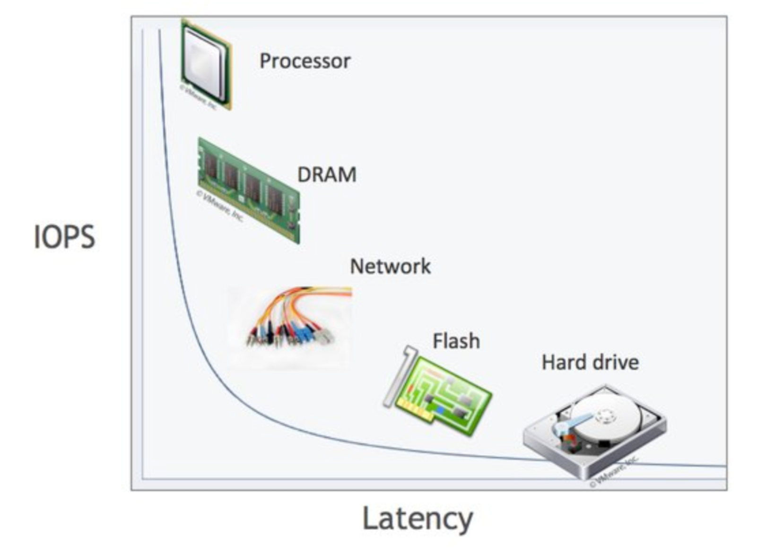

컴퓨터는 CPU 나 메모리처럼 전지적 특성을 띤 장치의 성능이 매우 빠른 속도로 발전했다. 하지만, 디스크와 같은 기계식 장치의 성능은 상당치 제한적으로 발전해왔다. 비록 최근에는 대부분 자기 디스크 원판에 의존하는 HDD 보다 SSD 드라이브를 채택하고 있지만, 여전히 데이터 저장 매체는 컴퓨터에서 가장 느린 부분이라는 것은 변함없는 사실이다. 즉, 데이터베이스 성능 튜닝은 디스크 I/O 를 어떻게 줄이는냐가 관건이다.

## HDD 와 SSD

HDD 는 특정 위치에 디스크 헤더를 위치시켜 플래터(원판)을 회전시켜서 읽거나 쓰는 원리로, 매우 성능이 느리다. 이 단점을 보완하고자 SSD가 등장하였다. SSD는 디스크 플레터를 사용하는 방식을 버리고, 플래시 메모리를 사용함으로써 더 빠른 성능을 보인다. SSD가 HDD 보다 더 빠른 이유를 깊게 이해하려면, 랜덤 I/O 와 순차 I/O 에 대해 알아야한다.

## 랜덤 I/O 와 순차 I/O

### HDD 의 I/O

HDD 관점에서 랜덤, 순차 I/O 동작 방식을 먼저 학습해보자. 랜덤 I/O 와 순차 I/O 모두 HDD의 플래더(원판)을 돌려서 읽어야 할 데이터가 저장된 위치로 디스크 헤더(Disk Arm)을 이동시킨 다음 데이터를 읽는 것이다. 그렇다면 무엇이 차이점일까? 

차이점은 바로 데이터의 물리적 위치에 따라 데이터 스캔 방식이 다르다는 점이다. 랜덤 I/O는 읽어야하는 **데이터가 물리적으로 불연속적으로 위치**해있기 떄문에 디스크 헤더를 이동시킨 다음 데이터를 읽는 것을 뜻한다. 이때 디스크 헤드를 이동시키는 시간을 Seek Time 이라고 한다. 반면 순차 I/O 는 읽어야하는 **데이터가 연속적으로 위치**해 있어서, 헤더를 이곳저곳 이동시킬 필요없이 순차대로 쭉 읽기만 하는 경우를 뜻한다.

디스크 헤더를 이동시켜야하는 횟수가 많아질수록 성능 저하가 심해진다. 이 떄문에 디스크 헤더를 여러번 이동시켜야하는 랜덤 I/O 가 순차 I/O 에 비해 성능이 꽤 느리다. 랜덤 I/O 가 자주 발생하는 상황에선 Seek Time이 길어지며, 많은 데이터를 찾고 저장하는데 걸리는 연산 비용이 커진다.

### SSD 의 I/O

앞서 설명했듯이, SSD는 HDD와 달리 디스크 원판(플래터)를 사용하지 않고 플래시 메모리를 대신 사용한다. 이 떄문에 일반적으로 SSD가 HDD에 비해 매우 빠른 성능을 보이고, 대부분의 DBMS에서 HDD 대신 SSD를 채택하고 있다.

그렇다면 SSD는 디스크 원판이 없기 떄문에 랜덤 I/O와 순차 I/O 의 연산 속도의 차이가 없을까? 기대와 달리 SSD 또한 랜덤 I/O 가 순차 I/O 에 비해 성능이, 즉 처리율(throughput)이 꽤 느리다. SSD 는 물리적으로 NAND 플래시 메모리에 저장된 데이터를 직접 쓰고 읽는 것이 아니라, 내부적으로 논리주소를 매핑하는 매핑 테이블을 사용한다. 매핑 테이블을 업데이트하려면 NAND 플래시 메모리의 물리적인 메모리를 찾아갸아 하므로, 랜덤 I/O의 경우 이 과정에 추가적으로 발생하기 때문에 성능이 느리다. 

## 쿼리 튜닝의 핵심은 랜덤 I/O 를 최소화하는 것

HDD의 성능 개선을 위해 SSD가 등장하였지만, 결국 SSD 또한 마찬가지로 랜덤 I/O 의 성능이 느리다. (몰론 HDD 의 랜덤 I/O 에 비해 SSD 의 랜덤 I/O 가 성능이 매우 빠르긴하다.) 그렇다면 랜덤 I/O 의 발생횟수를 최소화하는 방식으로 쿼리 성능 개선을 꾀하고 싶지만, 아쉽게도 사실상 이는 불가능에 가깝다.

### 대부분의 DBMS 서버는 랜덤 I/O 작업이 많이 발생한다

대부분의 DBMS 서버에선 순차 I/O 보다 랜덤 I/O 의 비율이 훨씬 높다. 우리의 바람사항은 데이터베이스 연산 수행시 순차 I/O 를 중심으로 연산이 발생하고, 가끔씩 꼭 필요한 경우에만 드물게 랜덤 I/O 가 발생하면 좋겠다는 것이지만, 그렇지 않다.

데이터베이스내의 대부분의 작업은 작은 데이터를 빈번하게 읽고 쓰는 작업이다. 그리고 읽기는 원하는 데이터의 물리적 위치는 항상 디스크내에서 자주 변하게 된다. 또한 우리가 연속된 데이터를 저장한다고 해도, 빈번하게 읽고 쓰기 때문에 비어있는 디스크 공간이 연속되지 않아 흩여저서 저장될 수도 있다. 결국 랜덤 I/O 는 데이터베이스에서 매우 빈번하게 발생한다. 

MySQL 8.0 InnoDB 엔진에선 쓰기 작업에서 이러한 단점을 극복하기 위해 바로바로 커밋을 디스크에 반영하는 것이 아니라, 버퍼에 저장해놓고 한 번에 디스크에 저장하는 버퍼 기능을 제공한다고는 한다.

### 랜덤 I/O 연산 횟수를 최소화할 것

랜덤 I/O 를 순차 I/O 로 바꿔서 성능 개선을 유도하고 싶지만, 이 방식 또한 데이터베이스 연산의 특성상 거의 불가능에 가깝다고 한다. 결국, **쿼리 튜닝을 하기 위해선 랜덤 I/O 연산 횟수 자체를 줄여야한다. 즉, 필요한 데이터만 읽도록하여 쿼리를 개선하는 것이 중요하다.**

인덱스 레인지 스캔은 데이터를 읽기위해 주로 랜덤 I/O를 이용하고, 테이블 풀 스캔 방식은 순차 I/O 를 사용한다고 한다. 이 떄문에 큰 테이블의 레코드 대부분을 읽는 작업에서는 인덱스를 사용하지 않고 테이블 풀 스캔을 사용하도록 MySQL 옵티마이저가 유도하는 경우도 있다고 하는데, 보통 전체 테이블 레코드의 20~25% 를 넘어서면 인덱스를 타는 것이 아니라 테이블 전체를 모두 읽어오는 풀 테이블 스캔을 유도한다. 

## 랜덤 I/O 를 최소화하기 위한 데이터베이스 인덱스

어떻게 하여 랜덤 I/O 횟수를 줄일 수 있을까? ? 일반적으로 랜덤 I/O 를 최소화하여 쿼리 성능을 높이기 위해서 사용하는 인덱스라는 개념을 사용한다. DBMS에서 DB 테이블의 모든 데이터를 검색해서 원하는 결과를 가져오려면 시간이 오래 걸리기 때문에 컬럼의 값과 해당 레코드가 저장된 주소를 키&값의 쌍으로 인덱스를 만들어 두고 원하는 데이터를 인덱스를 통해서 접근하여 조회 성능을 빠르게 해주게 된다.

## 더 학습해야 할 키웓,

- 클러스터링 인덱스
- 세컨터리 인덱스
- 인덱스 레인지 스캔
- 옵티마이저
- InnoDB 버퍼

## 참고

- Real MySQL 8.0 - 백은빈, 이성욱
- https://velog.io/@ddangle/순차Sequential-IO와-랜덤Random-IO
- https://velog.io/@tco0427/인덱스-이론-및-실전편-쿼리-개선기