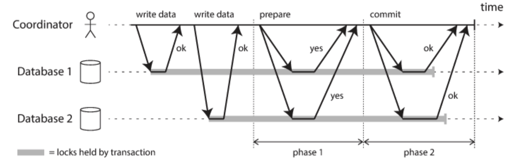

데이터베이스 레플리케이션에 대해 깊이있게 학습하던 중, `GTID(Global Transaction ID)` 에 대해 알게 되었다. 그런데, 이 중에 글로벌 트랜잭션이라는 키워드가 등장한다. 이 글로벌 트랜잭션이란 무엇인지에 대해 찾아보니, 레플리케이션에서 GTID 에 등장하는 글로벌 트랜잭션의 개념과 그냥 글로벌 트랜잭션은 전혀 다른 개념이었다. 글로벌 트랜잭션에 대해 글을 작성하며, GTID 에서 등장하는 개념과 무엇이 다른지 더 확실히 개념을 짚어보고자 한다.

## 글로벌 트랜잭션

지금까지 별다른 트랜잭션 처리가 없었던, 우리는 로컬 트랜잭션을 사용하고 있었던 것이 된다. **로컬 트랜잭션**이란 하나의 데이터베이스의 커넥션에서 만들어지는 트랜잭션을 뜻한다. 그렇다면, 얼핏 글로벌 트랜잭션은 여러개의 데이터베이스 커넥션에서 만들어지는 개념일까 생각해 볼 수 있지만, 그건 아니었다.

상황을 하나 생각해보자. 만약 하나의 트랜잭션으로 여러개의 데이터베이스에 접근하여 연산을 처리하고 싶다면 어떻게 해야할까? 이는 앞서 설명한 로컬 트랜잭션으로는 처리가 불가능하다. 로컬 트랜잭션은 단 하나의 데이터베이스에만 커넥션이 종속적으로 연결되어 있기 때문이다. 우리가 원하는 것은, 한 트랜잭션에서 여러 데이터베이스에 커넥션을 맺고 연산을 처리하는 것이다. 하지만, 한 트랜잭션에서 하나의 커넥션으로 여러 데이터베이스에 접근한다는 것은 말이 되지 않는다.

이를 해결하는 방법이 바로 글로벌 트랜잭션이다. **글로벌 트랜잭션은 실제 여러개의 데이터베이스와 커넥션을 맺고 통신하는 방식이 아니라, 별도의 트랜잭션 매니저를 활용해 트랜잭션을 관리**하는 방식이다. 즉, 트랜잭션에 참여중인 여러 독립적인 작업들 중에 하나라도 다른 데이터베이스에서 일어나는 경우를 처리하는 트랜잭션이다.

### JtaTransactionManager

> 💡 JTA 는 Java Transaction API 의 준말로, XA 리소스 (분산 리소스) 간의 트랜잭션을 처리하는 API 이다.

이때, 자바는 글로벌 트랜잭션을 위해 **JTA(Java Transaction API)** 라는 트랜잭션 매니저의 표준 API 를 제공하여 글로벌 트랜잭션을 관리할 수 있도록 한다. (트랜잭션 추상화를 학습할 때 등장하는 그 개념이 맞다.) `PlatformTransactionManager` 라는 추상 인터페이스의 구현체로는 JDBC 를 활용한다면 `DataSourceTransactionManager`, JPA 를 활용하는 경우라면 `JpaTransactionManager` 구현체를 사용하게 되는데, 여러 리소스(데이터베이스) 를 사용하는 경우에는 `JtaTransactionManager` 를 활용한다. `JtaTransactionManager` 라는 구현체를 통해 우리는 JTA 라는 API 를 사용하여 글로벌 트랜잭션으로 동작하게 되는 것이다.

글로벌 트랜잭션 매니저인 `JtaTransactionManager` 는 데이터베이스와 메시징 서버를 제어하고 관리하는 각각의 리소스 매니저와 XA 프로토콜을 통해 연결된다. 이를 통해 트랜잭션 매니저가 여러 리소스에 대해 종합적으로 트랜잭션을 제어할 수 있게된다.

## XA, 2PC

XA 란 2PC(Two-Phase Commit) 을 통한 분산 트랜잭션 처리를 위한 표준이다. 그리고 JTA 트랜잭션 매니저는 각 리소스 매니저간에 XA 프로토콜을 통해 통신한다고 했다. 보통 1PC 라면 begin, end, commit 의 절차로 수행되는 반면, 2PC는 begin, end, prepare, commit 의 절차로 수행된다. (이때, prepare 과정은 아마 트랜잭션에 참여한 리소스들이 서로 같은 리소스라고 확인하는 과정을 뜻하는 듯하다. 그 때문에 로컬 트랜잭션은 prepare를 안해도 되고, 1PC 로 처리된다. 정확한 개념은 추후 학습이 필요하다.)

2PC 는 둘 이상의 리소스에 대한 트랜잭션을 원자적으로(atomic) 처리하기 위한 알고리즘이다. 위에서도 다른 리소스 둘에 대한 요청을 원자적으로 처리하기 위해 1PC 에서 prepare, commit 이 추가되었다. 이 방법으로 서로 다른 데이터베이스간의 정합성을 보장할 수 있다고 한다.

## GTID vs 글로벌 트랜잭션

그래서 GTID 에서 등장하는 글로벌 트랜잭션과 무엇이 다른가? GTID 에서 등장한 글로벌 트랜잭션은 **레플리케이션 환경에서 트랜잭션을 전역적으로 유일하게 식별하고 추적한다는 점에 초점**이 맞춰진 개념이다. 즉, 출처가 식별되는 트랜잭션 개념에 가깝다. 반면 위에서 살펴본 일반적인 의미의 글로벌 트랜잭션은 분산 데이터베이스 환경에서 하나의 논리적 작업 단위로 실행되는 트랜잭션을 의미한다. (실제로 레플리케이션 환경에서, 지금까지 학습했던 트랜잭션들은 커넥션을 맺었고, 각기 다르게 처리되었다.)

## 참고

- https://hudi.blog/global-transaction/
- https://heni.tistory.com/10
- https://yeonyeon.tistory.com/279
- https://manhyuk.github.io/transaction/
- https://www.ibm.com/docs/ko/was-nd/8.5.5?topic=server-global-transactions
