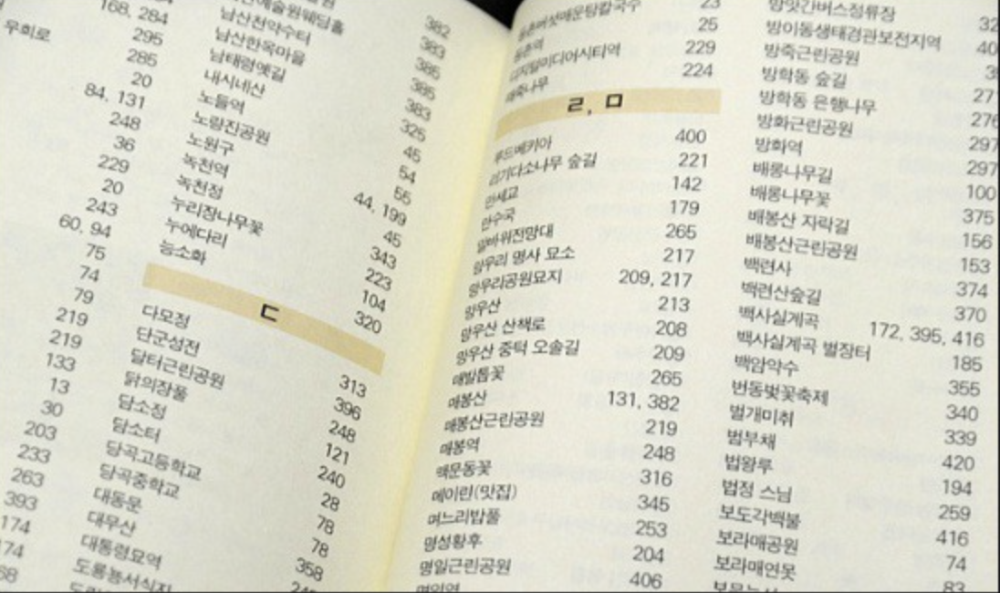

구매한 책을 읽기 시작할 때, 많은 사람들은 맨 앞 목차 부터 읽기 시작한다.

## 데이터베이스 인덱스

아마, 이 글을 읽고 있는 여러분들은 데이터베이스 인덱스를 설명하며 항상 책 뒷장의 찾아보기(index) 페이지에 비유하는 설명을 많이 들어봤을 것이다. 책 뒷편의 찾아보기 페이지에는 책의 핵심 키워드가 사전 기준으로 정렬되어 있다. 책에 찾아보기 페이지가 없다면, 우리는 몇백장이 되는 책에서 원하는 내용을 찾느라 반나절을 보내게 될지도 모른다.

책 뒷편의 찾아보기 페이지는 데이터베이스의 인덱스와 많이 닮아있다. 둘 다 추가적인 저장공간(책 페이지)에 미리 정렬된 정보를 저장하여, 원하는 데이터(책 내용)를 찾기 위해 사용된다.

즉 데이터베이스의 인덱스란, 추가적인 저장 공간을 사용해서 테이블 검색 속도를 향상시키기 위한 자료구조이다. 데이터베이스 인덱스에는 데이터의 키와 해당 데이터의 물리적 위치가 나타나있다. 예를 들면, '키가 10번인 데이터는 테이블 35번 행에 저장되어 있다' 와 같은 정보이다.

인덱스는 일반적으로 SELECT 쿼리의 WHERE 절에 사용될 컬럼에 대한 조회 성능을 개선할 때 사용된다.

