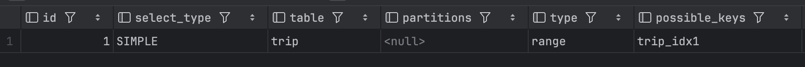
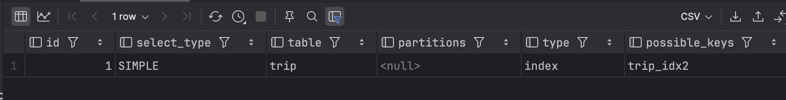
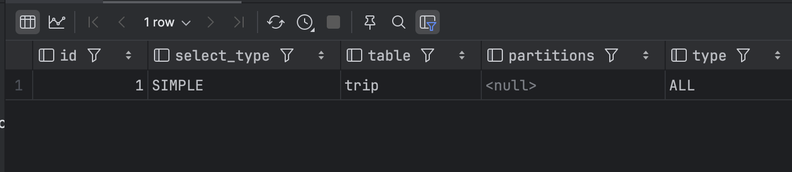

## 인덱스 레인지 스캔

인덱스 레인지 스캔이란 검색해야 할 인덱스의 범위가 결정됐을 떄 사용허는 방식이다. 과정을 먼저 정리하자면 아래와 같이 수행된다.

- `(1)` 인덱스 탐색 (Index Seek) : 조건을 만족하는 값이 저장된 위치를 찾는다.
- `(2)` 인덱스 스캔 (Index Scan) : `(1)` 에서 찾은 위치부터 필요한 만큼 인덱스를 쭉 읽는다.
- `(3)` 레코드 읽어오기 : `(2)` 에서 읽어온 인덱스가 키와 레코드 주소를 이용해 레코드가 저장된 페이지를 가져오고, 최종 레코드를 읽어온다.

리프 노드를 제외한 모든 계층의 노드는 인덱스 Key 값과 자식 노드의 주소값을 저장하고 있다. 반면 리프 노드는 인덱스 Key 값과 실제 레코드 데이터에 대한 주소값을 저장하고 있다(가리키고 있다). 인덱스 레인지 스캔은 루프 노드부터 시작하여 리프 노드로 쭉 내려가서 범위 탐색의 시작점을 찾는다. 이후 정렬된 인덱스 데이터를 범위 탐색의 끝점까지 순차대로 따라가며 원하는 데이터들만 쭉 읽는다(스캔한다). 

인덱스 B+ Tree 구조는 항상 정렬된 상태를 유지하기 떄문에 리프 노드의 탐색 시작점을 빠르게 찾을 수 있다. 또한 리프 노드끼리 서로 링크드 리스트로 연결되어 있기 떄문에, 인덱스 범위 탐색이 가능하다. (이 또한 B+ Tree 구조에서 리프 노드끼리도 서로 정렬된 상태를 구성하기 떄문에, 빠르게 범위 탐색이 가능하다.)

### 인덱스를 통해 랜덤 I/O 를 최소화하기

리프 노드에서 쭉 링크드리스트를 따라가며 검색 조건에 일치하는 인덱스 데이터를 찾으면, 그에 매핑되는 실제 레코드를 데이터 파일에서 읽어오는 과정이 필요하다. 이떄, 레코드를 읽어오는 과정에서 디스크 랜덤 I/O가 발생한다. 따라서 인덱스를 통해 데이터 레코드를 읽어오는 과정은 비용이 많이 발생하는 작업이다.

[쿼리 튜닝을 위한 HDD 와 SSD 의 순차 I/O 와 랜덤 I/O](https://haon.blog/database/db-index/storage-and-random-sequantial-io/) 에서 설명했듯이, 랜덤 I/O 의 발생횟수를 줄여야만 쿼리 속도가 높아진다. 또한 랜덤 I/O 에 비해 순차 I/O 가 연산 속도가 더 빠르다고 설명했었다. 인덱스 레인지 스캔 방식은 실제 레코드를 읽어올 때 랜덤 I/O 가 발생하는 반면, 테이블 풀 스캔 방식은 순차 I/O 가 발생한다. 따라서 읽어야 할 실제 데이터 레코드 수가 20~25%를 넘는다면, 테이블의 레코드를 직접 읽는 테이블 풀 스캔 방식이 더 효율적이다.

### 커버링 인덱스

쿼리내에 수행되는 모든 컬럼을 인덱스가 모두 가지고 있는 인덱스를 커버링 인덱스라고 한다. 이 경우 인덱스가 쿼리에서 필요로 하는 모든 데이터를 이미 가지고 있기 떄문에, 실제 레코드에 접근하여 데이터를 읽어오는 랜덤 I/O 가 수행되지 않는다. 따라서 성능이 매우 빨라진다. 

### 인덱스를 적용 후 실행계획으로 확인하기

MySQL 의 실행계획(Execution Plan) 을 통해 실제로 쿼리가 실행될 떄 인덱스 레인지 스캔이 발생하는지 확인해보자. 실행계획은 MySQL 의 옵티마이저가 쿼리를 최적화하여 수행한 작업 절차를 뜻한다. 우리는 `EXPLAIN` 을 사용하여 특정 쿼리에 대한 옵티마이저의 실행 계획을 확인할 수 있다. 아래와 같이 trip 테이블에 대해 인덱스를 추가해보자.

~~~sql
ALTER TABLE trip
add index trip_index (name);
~~~

그리고 아래와 같이 `WHERE` 조건절에 `name` 필드에 대한 인덱스 스캔이 발생하도록 쿼리문을 작성해보자. 그리고 `EXPLAIN` 을 통해 이 쿼리의 실행계획을 조회해보자.

~~~sql
EXPLAIN 
SELECT * from trip
where name between 'a' and 'b';
~~~

그러면 신기하게도 아래와 같이 `type` 이 `range` 로 조회되는 것을 확인할 수 있다. `range` 라는 것은 인덱스 레인지 스캔이 발생함을 뜻한다.

## 인덱스 풀 스캔

인덱스 풀 스캔은 인덱스 레인지 스캔처럼 범위 탐색을 수행하지만, 이 방식에선 **전체 인덱스를 모두 탐색**한다. **쿼리 조건절이 인덱스의 첫 컬럼이 아닌 경우에 인덱스 풀 스캔 방식이 적용**된다. 예를들어 인덱스를 `(name, place_name, coorindate_x)` 으로 설정해줬는데, 조건절에서 `name` 이 아니라 `place_name` 또는 `coorindate_x` 가 사용되는 경우이다.

**커버링 인덱스인 경우에만 이 방식이 사용**된다. 즉, 쿼리가 인덱스에 명시된 컬럼만으로 조건을 처리할 수 있는 경우에만 사용되는 스캔 방식이다. 만약 반대로 인덱스에 있는 컬럼만으로 처리할 수 없는 경우에 인덱스 풀 스캔이 사용된다면 랜덤 I/O 가 발생한다. 이는 비효율적이기 떄문에 절대 사용되지 않는다.

인덱스의 크기는 테이블 크기보다 작기 떄문에 테이블 풀 스캔 보다는 효율적이다. 인덱스 풀 스캔이 테이블 풀 스캔보다는 적은 디스크 I/O 가 사용되기 때문이다. 

### 실행계획으로 확인하기

name, place_name, coordinate_x 이 3가지 컬럼에 대해 인덱스를 걸어준다.

~~~sql
ALTER TABLE trip
ADD INDEX trip_idx2 (name, place_name, coordinate_x);
~~~

그리고 아래처럼 인덱스의 첫번째 컬럼인 name 가 아닌, 그 외의 컬럼 place_name 컬럼을 조건문에 넣어준다. 

~~~sql
EXPLAIN
SELECT name, place_name, coordinate_x
FROM trip
WHERE place_name between 'a' and 'b';
~~~

실행계획으로 확인해보면 아래와 같이 `type` 이 `index` 로 조회된다. `index` 는 인덱스 풀 스캔을 뜻한다. 즉, 인덱스의 모든 범위를 탐색한 것이다. 

한편 커버링 인덱스가 아닌 경우로 쿼리를 실행시켜보자. 즉, 쿼리에서 인덱스를 구성하고 있지 않는 컬럼까지 포함시켜서 실행시켜보자. 

~~~sql
EXPLAIN
SELECT *
FROM trip
WHERE place_name BETWEEN 'a' AND 'b';
~~~

그 결과는 아래와 같이 `type` 이 `ALL` 로 조회되고 있다. `ALL` 은 테이블 풀 스캔을 뜻한다. 즉, 커버링 인덱스가 아닌 상황에서는 인덱스 풀 스캔보다 테이블 풀 스캔을 하는 것이 더 효율적이라고 옵티마이저가 판단한다.

## 루스 인덱스 스캔

인덱스 레인지 스캔과는 비슷하게 동작하지만, 중간중간에 필요없는 인덱스 Key 값을 건너뛰고(Skip) 다음으로 넘어가는 형태로 처리한다. 일반적으로 `GROUP BY` 또는 집합 함수 가운대 `MAX()` 또는 `MIN()` 함수에 대해 최적화하는 경우에 사용한다. 실행계획을 통해 살펴보자. 

~~~sql
ALTER TABLE trip
ADD INDEX trip_idx (name, coordinate_x);
~~~

위와 같이 인덱스를 생성했다.

~~~sql
EXPLAIN
SELECT name, MIN(coordinate_x)
FROM trip
WHERE name BETWEEN 'a' AND 'e'
GROUP BY name;
~~~

위 쿼리를 살펴보자. `trip` 테이블은 `(name, coordindate_x)` 두 컬럼 조합으로 인덱스가 정렬된 상태이다. `GROUP BY` 를 통해 `name` 컬럼을 기준으로 그룹화하고, `MIN` 집계 함수를 사용하여 그룹별로 가장 작은 `coordindate_x` 를 가져온다. 인덱스는 항상 정렬된 상태를 유지하므로, `name` 그룹별로 첫 번째 레코드의 `coordinate_x` 값만 읽으면 된다. 옵티마이저는 인덱스에서 `WHERE` 조건을 만족하는 범위 전체를 모두 스캔할 필요가 없다는 것을 알고있기 때문에, 조건에 만족하지 않는 레코드는 무시하고 다음 레코드로 이동한다.

인덱스 레인지 스캔 중 그룹에서 가장 작은 `coordinate_x` 를 찾으면, 해당 그룹에서는 더 이상 인덱스 스캔을 할 필요가 없어진다. 이때 필요없는 인덱스를 건너뛰게되고, 이를 루스 인덱스 스캔이라고 한다.

## 인덱스 스킵 스캔

인덱스는 컬럼 순서를 기준으로 정렬된다. 따라서 인덱스를 생성시 컬럼의 순서는 꽤 중요하다. 아래처럼 인덱스를 생성했다고 가정해보자. 

~~~sql
alter table member
add index member_idx (gender_type, nick_name);
~~~

그리고 아래 쿼리를 실행한다고 해보자.

~~~sql
EXPLAIN
SELECT gender_type FROM member
WHERE nick_name > 'g';
~~~

위 쿼리는 인덱스를 탈 수 있을까? 앞서 인덱스 풀 스캔에서 학습한바에 따르면, 인덱스의 첫번째 컬럼이 조건절에 존재하지 않으므로 인덱스를 타지 않을 것 같다. 따라서 이 경우 `coordindate_x` 로 시작하는 새로운 인덱스를 생성해야한다.

하지만 MySQL 8.0 부터는 인덱스 스킵 스캔이라는 최적화 기능이 도입되었다. 한번 위 쿼리에 대한 실행 계획을 살펴보면 `Extra` 에 `Using index for skip scan` 이 포함될 것이다. 이는 무슨 뜻일까? MySQL 8.0은 쿼리를 아래처럼 2개의 쿼리로 최적화하여 실행해준다.

~~~sql
SELECT gender_type FROM member WHERE gender_type='MEN' AND nick_name > 'g';
SELECT gender_type FROM member WHERE gender_type='WOMEN' AND nick_name > 'g';
~~~

우리가 직접 추가하지 않는 `gender_type` 컬럼이 조건절에 추가되었다. 인덱스에 대한 첫번쨰 컬럼과 그 컬럼이 가질 수 있는 모든 값 `MEN`, `WOMEN` 에 대해 옵티마이저가 임의로 조건절에 추가한 것이다. 이렇게되면 조건절이 인덱스에 첫번쨰 컬럼을 포함하여 쿼리가 인덱스를 탈 수 있다. 다만, 인덱스 스킵 스캔은 아래 2가지 제약 조건을 충족하였을 때 실행된다.

> - WHERE 조건절에 조건이 없는 인덱스의 선행 컬럼의 유니크한 값의 개수가 적어야 함.
> - 쿼리가 인덱스에 존재하는 컬럼만으로 처리 가능해야 함(커버링 인덱스).

## 참고

- Real MySQL 8.0 (8.3.4) - 백은빈, 이성욱
- https://hudi.blog/mysql-index-scan/
- https://jojoldu.tistory.com/476

