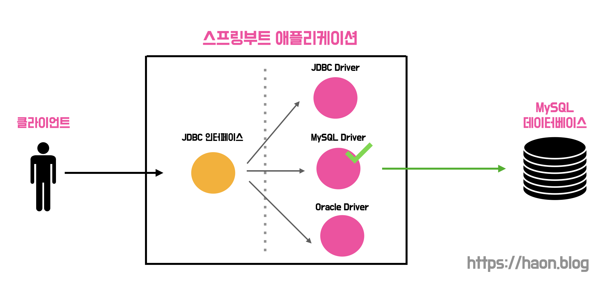
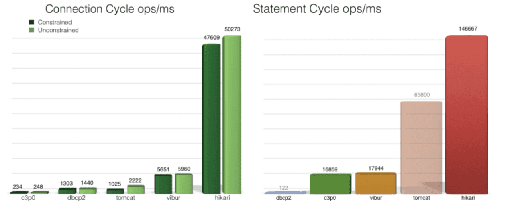

지난 [HikariCP 와 데이터베이스 커넥션 풀(Connection Pool)](https://haon.blog/database/hikaricp-theory-1/) 에 이어서, 이번 포스트에선 스프링부트에서 제공하는 JDBC 로 DB 커넥션 풀을 간단한 실습과 함께 직접 다루어보고자 한다. 

## 각 데이터베이스 벤더마다 각기 다른 스팩 불일치 문제

일반적으로 스프링부트 애플리케이션에서 데이터베이스에 커넥션을 맺고 접근하기 위한 과정은 아래와 같이 수행된다.

- `(1)` TCP/IP 소켓을 활용하여 DB 와 커넥션 연결
- `(2)` DB 에게 원하는 연산을 위해 SQL 을 전송 
- `(3)` SQL 수행 결과를 응답받음

하지만, 문제는 각 데이터베이스 벤더마다 커넥션을 연결하는 방법과, SQL 을 전달하는 방법, 그리고 SQL 수행 결과를 응답받는 방법이 각기 다르다는 점이다. 이로 인해 발생하는 문제점은 아래와 같다.

- `(1)` 데이터베이스를 다른 종류의 데이터베이스로 변경하면 애플리케이션 서버에 개발된 데이터베이스 사용 코드도 함께 변경해야 한다.
- `(2)` 개발자가 각각의 데이터베이스마다 커넥션 연결하는 방법, SQL 전달 방법, 그리고 그 결과를 응답받는 방법을 일일이 새롭게 학습해야 한다.

## JDBC Driver 표준 인터페이스 

각 DB 벤더마다 스팩이 다른 문제를 해결하기 위해, **자바 애플리케이션과 데이터베이스 시스템 사이에서 각기 다른 DB 벤더 연산 문제를 해결하며 둘을 상호 연결하기 위한 어댑터가 필요함을 느낄 수 있다.** 실제로 자바 진영에선 어댑터로 JDBC Driver 를 제공한다. 즉, **JDBC Driver 란 다양한 DB 벤더를 사용할 수 있도록 자바 애플리케이션 요청(SQL 포함한 요청)을 각 DBMS 가 이해할 수 있는 프로토콜로 그때그때 알맞게 변환해주는 어댑터이다.**

개발자는 JDBC Driver 에만 의존하여, 각 벤더마다 다른 사용법과 스팩을 학습하고 다루지않아도 된다. 각 벤더에서 제공하는 Driver 는 MySQLDriver, OracleDriver 와 같이 구체타입이 정의되어 있는데, 어떤 벤더의 Driver 를 선택할지는 간단한 설정만 변경해주면 문제없이 동작한다. 설정과 관련한 내용은 이따가 자세히 다루도록 한다.

JDBC Driver 는 크게 다음 3가지 기능을 수행하는 표준 인터페이스 객체를 제공한다.

- `Connection` : DB 와 커넥션 연결을 추상화한 객체
- `Statement` : DB 에 SQL 전달하는 방법을 추상화한 객체
- `ResultSet` : DB 로 부터 응답을 전달받는 방법을 추상화한 객체

JDBC Driver 에서 제공하는 위 3가지 객체를 사용하여 데이터베이스와 커넥션을 맺고, SQL 을 전달하고, DB 로 부터 응답을 전달받을 수 있다. 모두 추상화된 표준 인터페이스로, 그 어떠한 데이터베이스 벤더로 변경되더라도 코드 변경사항 없이 커넥션을 맺고 연산을 수행할 수 있다. 만약 MySQL 벤더를 사용한다면 위 Connection 객체의 구체 타입으로 MySQLConnection 구체 타입 객체가 자동으로 주입되며, Statement 의 경우 MySQLStatement, ResultSet 은 MySQLResultSet 구현체가 주입된다.

### DriverManager

`DriverManager` 는 자바 애플리케잇녀에서 사용할 수 있는 JDBC Driver 집합을 관리하는 클래스다. 즉, MySQLDriver, OracleDriver, ... 등 다양한 벤더의 Driver 를 그떄그떄 알맞게 제공해주는 클래스이다. 이 클래스를 통해 앞선 3가지 객체 중 `Connection` 객체로 데이터베이스 커넥션을 얻어오는 방법을 학습해보자.

JDBC API 4.0 부터 `DriverManager.getConnection()` 메소드로 JDBC Driver 구체 타입을 자동으로 로드할 수 있다. 만약 우리 애플리케이션이 MySQL 을 사용한다면 Driver 는 MySQL 드라이버가 선택될 것이며, 아래의 경우 MySQL 벤더의 커넥션이 얻어와 질 것이다. 

~~~java
Connection connection = DriverManager.getConnection(URL, USER, PASSWORD);
~~~

하지만 `DriverManager` 는 아쉽게도 커넥션 풀, 분산 트랜잭션을 지원하지 않아 잘 사용되지 않는다고 한다. 이 외에도 `Statement` 와 `ResultSet` 이 존재하나, 이번 포스팅의 가장 큰 목적인 JDBC 를 이해하고 커넥션 풀을 다루는 것이 초점을 맞췄으므로 다루지 않도록 한다.

### 커넥션을 얻어오는 방법이 각기 다름으로 인해 발생한 문제점

커넥션을 얻기 위해 앞선 JDBC DriverManager 로 매번 새로운 커넥션을 얻어오는 방법도 존재하나, 커넥션 풀에서 이미 생성된 커넥션을 얻어오는 방법이 존재한다. 만약 우리 애플리케이션에서 DriverManager 로 신규 커넥션을 생성하는 방식에서 커넥션 풀을 활용하는 방식으로 마이그레이션 하고 싶다면 어떻게할까? 반대로 DBCP 종류도 HikariCP 외에 다양한 커넥션 풀이 존재하는데, 기존에 사용하던 DBCP 벤더에서 다른 벤더로 마이그레이션 하고 싶다면? 아쉽게도 자바 애플리케이션내의 커넥션을 얻어오는 코드를 모두 변경해야한다.

**자바 애플리케이션에서 커넥션을 얻어오는 방법은 매우 다양하기 떄문에, 커넥션을 얻어오는 방법을 추상화했다.** 우리는 DataSource 라는 커넥션을 얻어오는 방법을 추상화한 인터페이스로 자바 애플리케이션 코드 변경없이도 커넥션을 얻는 코드를 유지할 수 있다. (이 떄문에 앞선 DriverManager 는 사실상 현재 거의 사용하지 않을 방법이며, DataSource 를 사용하여 커넥션 관련 연산을 편하게 처리할 것이다.)

### DataSource

`DataSource` 인터페이스는 데이터베이스의 커넥션을 얻어오기 위해 사용된다. 각 벤더는 자신의 DBMS 에 알맞는 `DataSource` 구현체를 생성한다. 구현체라 함은, DriverManager, HikariCP, 기타 DBCP 등이 해당된다. **DataSource 는  단일 커넥션, 커넥션 풀링, 분산 트랜잭션 등 다양한 커넥션 기능을 제공한다.**

실제로 아패와 같이 HikariCP 커넥션 풀에 대한 `DataSource` 를 제공해준다. 아래처럼 `setJdbcUrl()`, `setUser()`, `setPassword()` 로 커넥션을 얻는 벤더에 접근하기 위한 설정을 할 수 있다. 

~~~java
HikariDatasource dataSource = new HikariDatasource();
dataSource.setJdbcUrl(DBCP_URL);
dataSource.setUser(USER);
dataSource.setPassword(PASSWORD);
~~~

커넥션은 아래처럼 `getConnection()` 을 통해 가져올 수 있다. 

~~~java
Connection connection = dataSource.getConnection();
~~~

만약 HikariCP 외에도 다른 벤더를 사용하고 싶다면 그에 맞는 `DataSource` 를 사용할 수 있다. 아래는 H2 데이터베이스에서 제공하는 `DataSource` 구현체인 `JdbcDataSource` 이다.

~~~java
Datasource dataSource = new JdbcDataSource();
// ...
~~~

## 커넥션 풀링 

이번 포스트의 목적인 JDBC 를 이해하고, 커넥션 풀을 어떻게 직접 다룰 수 있는지 자바 애플리케이션 코드를 직접 작성하며 학습하는 것 이었다. 이를위해, 지금부터 커넥션 풀링에 대해 학습해보도록 하자.

**커넥션 풀링이란 미리 다수의 커넥션 객체를 DBCP 에 생성해둔 뒤, 해당 커넥션을 재사용하는 방식을 뜻한다.** DBCP 와 관련한 내용은 [HikariCP 와 데이터베이스 커넥션 풀(Connection Pool)](https://haon.blog/database/hikaricp-theory-1/) 에서 다루었다. 앞서 학습한 DriverManager 로 매번 새로운 커넥션을 생성하는 것은 매우 비효율적이므로, 커넥션 풀링을 통해 애플리케이션 성능을 최적화할 수 있다.

### HikariCP 커넥션 풀링

기본적으로 별다른 설정이 없다면 스프링부트 애플리케이션은 `HikariCP` 을 디폴트 `DataSource` 로 채택하고 있다. 이전에 다루었듯이, HikariCP 는 바이트코드 레벨 수준까지 극단적으로 최적화 되어있기에, 다른 DBCP 풀링 프레임워크에 비해 압도적으로 빠른 성능을 보이기 떄문이다. 지금부터 `HikariCP` 로 커넥션 풀링을 하는 방법을 학습해본다.

`HikariCP` 를 DataSource 로 사용하려면 기본적으롷 `datSourceClassName` 또는 `jdbcUrl`, `username`, `password` 3가지 설정이 필수라고 한다. 아래와 같이 `HikariConfig` 로 HikariCP 설정값을 부여할 수 있다.

~~~java
HikariConfig dataSourceConfig = new HikariConfig();
dataSourceConfig.setJdbcUrl(DB_URL);
dataSourceConfig.setUsername(USER);
dataSourceConfig.setPassword(PASSWORD);
~~~

또한 아래처럼 최대 커넥션 풀 사이즈로 설정 가능하며, 커넥션 풀 이름도 설정할 수 있다.

~~~java
dataSourceConfig.setMaximumPoolSize(10);
dataSourceConfig.setPoolName("Hikari Pool");
~~~

그리고 `DataSource` 의 구현체로 `HikariDataSource` 를 획득할 수 있다.

~~~java
HikariDataSource dataSource = new HikariDataSource(dataSourceConfig);
~~~

또한 직접 `Connection` 객체, 즉 커넥션을 직접 꺼내오고 싶다면, HikariCP 커넥션 풀로부터 이미 생성된 커넥션을 `getConnection()` 으로 꺼내올 수 있을 것이다.

~~~java
Connection connection1 = dataSource.getConnection();
Connection connection2 = dataSource.getConnection();
// ...
~~~

### HikariCP 설정하기

HikariCP 커넥션 풀링 세부 설정값은 `application.yml` 에서 간단히 설정할 수 있다.

~~~java
spring:
  datasource:
    hikari:
      pool-name: haon-pool 
      jdbc-url: jdbc:h2:./test;DB_CLOSE_DELAY=-1
      username: devhaon
      password: moheng
      maximum-pool-size: 10 
      minimum-idle: 5
      connection-timeout: 3000
~~~

눈 여겨 볼만한 곳은 웃헌 `maximum-pool-size` 이다. 이는 HikariCP 풀 내에 미리 생성해 둘 커넥션 갯수를 설정하는 것이다. 다음은 `connectio-timeout` 인데, 이는 커넥션을 구하기 위해 대기하는 최대 시간이다. 만약 풀에서 모든 커넥션을 사용중이라면, 지정된 시간만큼 최대로 계속 대기하게된다. 기본값은 30초이다.

우리 하모니 팀의 최적의 HikariCP 사이즈 값은 다음 포스트에서 다루어볼까 한다.

추가적으로 만약 DB Replication 등 여러 `DataSource` 에 대한 다중 설정이나 세부적인 설정을 하고싶다면 직접 DataSource 설정 관련 빈을 생성하고 설정해주도록 한다.

~~~java
@Configuration
public class DataSourceConfig {

    public static final int MAXIMUM_POOL_SIZE = 5;
    private static final String DB_URL = "jdbc:h2:./test;DB_CLOSE_DELAY=-1";
    private static final String USER = "devhaon";
    private static final String PASSWORD = "moheng";

    @Bean
    public DataSource hikariDataSource() {
        final DataSource dataSourceConfig = new HikariConfig();
        dataSourceConfig.setPoolName("haon-pool");
        dataSourceConfig.setJdbcUrl(DB_URL);
        dataSourceConfig.setUsername(USER);
        dataSourceConfig.setPassword(PASSWORD);
        dataSourceConfig.setMaximumPoolSize(MAXIMUM_POOL_SIZE);
        // ...

        return new HikariDataSource(hikariConfig);
    }
}
~~~

## 참고

- 스프링 DB 1편 - 데이터 접근 핵심 원리, 김영한
- https://velog.io/@miot2j/Spring-DB커넥션풀과-Hikari-CP-알아보기
- https://hudi.blog/java-db-connection-pooling/
- https://escapefromcoding.tistory.com/712