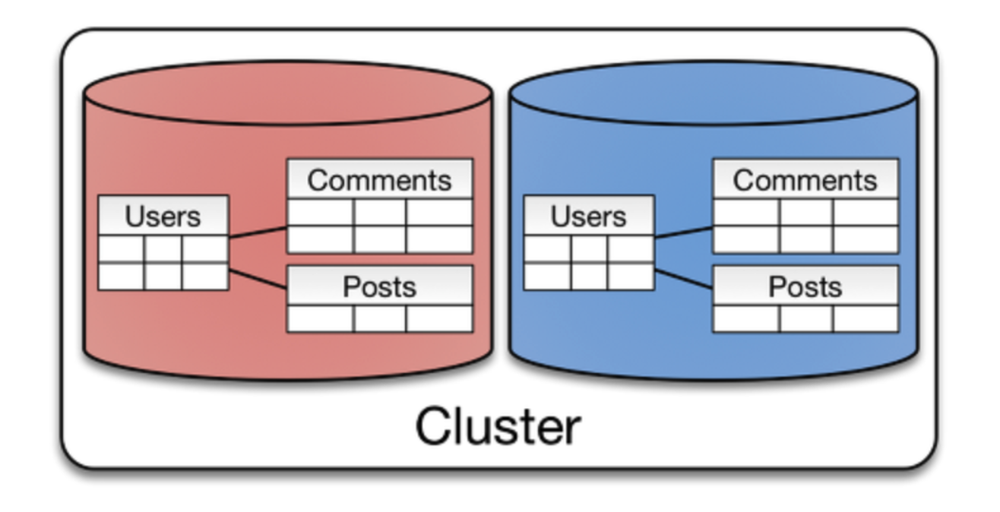

## 데이터 분산 환경의 필요성

높은 가용성과 확장성을 확보하기 위해 다양한 인덱스 생성, N+1 문제 해결등 여러 성능 튜닝을 시도할 수 있다. 하지만, 결국 단일 데이터베이스 하나에서 병목이 발생하면 시스템 전체에 성능 저하가 발생한다. 즉, **SPOF(Single Point Of Failure)** 로 가 발생하여 **HA(High Availability)** 를 확보할 수 없다. 이를위해 우리 모행 서비스에선 데이터베이스 레플리케이션을 통한 부하 분산 환경을 구축한 적이 있다. 이와 관련한 내용은 [고가용성과 확장성을 위한 데이터베이스 레플리케이션(DB Replication)](https://haon.blog/database/replication-theory/) 에서 다룬적이 있다.

그런데, 이 레플리케이션 방법 외에도 다양한 방식으로 데이터를 분산 저장할 수 있다는 사실을 알게 되었다. 이번 포스팅에선 데이터를 분산화하여 저장하는 방법 중 파티셔닝과 샤딩에 대해 학습하도록 한다.

## 데이터베이스 파티셔닝

파티셔닝은 데이터베이스내의 **큰 테이블이나 인덱스를 여러개의 작은 테이블(파티션) 으로 분할**하는 기법이다. 이때 큰 테이블 여러 작은 단위로 쪼갰을 때, 이 작은 하나의 단위를 **파티션(Partition)** 이라고 한다.  큰 테이블을 여러 테이블로 나누어 저장하기 떄문에 쿼리 성능이 개선될 수 있다. 이때, 데이터는 물리적으로 여러 테이블에 분산하여 저장된다. 파티셔닝은 MySQL 에서 InnoDB 와 NDB 에서 지원하고 있지만, MyISAM 은 지원하지 않는다.

파텨셔닝은 테이블을 수직 또는 수평으로 분할하는가에 따라 **수직 파티셔닝**과 **수평 파티셔닝**으로 구분된다. 테이블을 수직과 수평으로 분할한다는 것이 무슨 뜻일까? 

### 수직 파티셔닝 (Vertical Partitioning)

수직 파티셔닝은 한 테이블을 수직 방향으로 쪼개어, 한 테이블의 각 행을 작은 테이블 여러개에 분산시키는 방법이다. 즉, 테이블을 컬럼 기준으로 분할하여 여러개의 작은 테이블로 분할한다.

#### 장점

**자주 사용하는 컬럼만으로 구성한 작은 테이블**을 만들어서 성능을 개선할 수 있다. 만약 한 테이블을 SELECT 하면 모든 컬럼들을 메모리에 올리게 될 것이다. 이 때문에 필요없는 컬럼까지 올라가서 한 번에 읽을 수 있는 ROW 의 수가 감소하게 된다. 따라서 수직 파티셔닝을 통해 필요한 컬럼만 올린다면, 훨씬 많은 수의 ROW 를 메모리에 올릴 수 있으니 성능상 이점이 된다. 또한 같은 타입의 데이터가 저장되기 떄문에 그룹화 되어서, 데이터의 응집성을 높일 수 있게된다.

#### 단점

데이터를 찾는 과정이 복합해져서 **Latency 가 증가한다.**

### 수평 파티셔닝 (Horizontal Partitioning)

수평 파티셔닝은 말 그대로 수평으로 파티션을 생성한다. 즉, **하나의 테이블의 각 행을 다른 테이블에 분산하는 방법**이다. 이 방법은 아래에서 학습해볼 **샤딩(Sharding)** 과 비슷한 점이 많다. 스키마를 복제한 후 샤드키를 기준으로 데이터를 분할하는 방식으로 동작한다. 다시말해, 스키마가 같은 두 데이터를 여러 작은 테이블에 분산 저장한다. 

예를들어 위와 같은 User 테이블에서 유저 PK 를 샤드키로 사용하여 샤딩하기로 했다면, 0 ~ 999번 PK 를 가진 유저 정보는 샤드1에 저장하고, 1000 ~ 1999번 PK 에 대한 유저 정보는 샤드2에 저장한다.

#### 장점

한 테이블의 데이터들을 `개수` 를 기준으로 나누어 분할하기 떄문에 데이터 개수가 작아진다. 따라서 인덱스의 개수도 작아지고, 성능이 개선된다.

#### 단점

마찬가지로 데이터를 찾는 과정이 복합해져서 Latency 가 증가한다. 또한 여러 데이터베이스 서버들 중에 한 서버에 장애가 발생하면 데이터 무결성이 깨질 수 있다.

## 파티셔닝의 분할 기준(범위)

DBMS 는 파티셔닝에 대해 다양한 데이터 분할 기법을 제공한다. 분할은 **분할 키(Partitioning Key)** 를 사용한다.

### List Partitioning (목록 분할)

**데이터 값이 특정 목록에 포함된 경우** 데이터를 분리한다. 분포도가 비슷하며, 많은 SQL 에서 해당 컬럼에 조건이 많이 들어오는 경우에 유용하게 사용된다. 위처럼 특정 지역별로 데이터를 분할할 때 사용할 수 있다.

### Range Partitioning (범위 분할)

데이터를 특정 범위를 기준으로 분할할 떄 사용한다. 연속적인 숫자나 날짜를 기준으로 파티셔닝 하는 방식이다. 위처럼 1 ~ 2월, 3 ~ 4월, 5 ~ 6월, .. 으로 데이터를 분리할 떄 사용할 수 있다.

### Hash Partitioning (해시 분할)

해시 함수를 사용하여 데이터를 분할하는 방식이다. **특정 컬럼의 값을 해싱하여 저장할 파티션을 선택**한다. 데이터의 균등 분할하고 싶을 떄 사용할 수 있다. 

공식문서에 따르면, 여러 컬럼으로 해싱하는 이 방법은 그리 권장하지 않는 방법이라고 한다. 만약 이 방법을 활용한다면, 유저 PK 처럼 유일성이 높고 데이터 분포가 고른 컬럼을 파티션 키로 선정해야 효과적이다.

### Composite Partitioning (합성 분할)

위 파티셔닝 기법들 중에 여러 방식을 혼합하여 사용하는 방식이다. 단, 파티션을 나누는 기준이 너무 많아지면 파티션 개수가 너무 많아지고, 인덱스의 경합이 너무 심해져서 잘 사용하지 않는 방법이라고 한다.

## 데이터베이스 샤딩

샤딩은 동일한 스키마를 가지고 있는 여러 데이터베이스 서버들에 데이터를 **작은 단위로 나누어 분산 저장하는 기법**이다. 이때, 작은 단위를 **샤드(Shared)** 라고 한다. 어떻게 보면 샤딩은 수평 파티셔닝의 일종이다. 그러나 차이점은, 수평 파티셔닝의 경우 데이터를 동일한 서버에 저장하지만 샤딩은 서로 다른 서버에 분산하여 저장한다는 점이다. 따라서 쿼리 성능 개선 뿐만 아니라 부하 분산되는 효과도 얻을 수 있다. 즉, 샤딩은 데이터베이스의 **Scale-Out** 이다.

샤딩은 물리적으로 분산된 환경에서 사용되는 기법으로, 데이터베이스 차원이 아닌 애플리케이션 레벨에서 구현하는 것이 일반적이다. 다만, 샤딩을 플랫폼 차원에서 제공하는 시도가 많다고 한다.

### 샤드 키 (Shared Key)

샤드 키란 분할 된 여러 샤드중에 어떤 샤드를 선택할지 결정할 떄 사용하는 Key 값이다. 또한 이 샤드키를 어떤 방식으로 생성할지에 따라서 샤딩의 방법이 구분된다. 샤딩의 종류에는 **해시 샤딩(Hash Sharding), 동적 샤딩(Dynamic Sharding), 엔티티 그룹(Entity Group)** 등이 있다.

### Hash Sharding

Hash Sharding 은 해시함수를 사용한 방식으로, PK 값을 나머지 연산하여 그 결과값으로 어떤 샤드에 들어갈지 결정하는 방식이다. 이 방식은 구현 자체가 샤드의 수만큼 해싱을 하면 되기 떄문에 간단하다.

다만, **총 데이터베이스 수가 고정적으로 정해져있을 때만 유용**하다. 데이터베이스 개수가 줄어들거나 늘어나면 해시 함수내의 modular 값도 변경해야한다. 따라서 데이터의 재정렬이 필요하다.

### Range Sharding (Dynamic Sharding)

Range Sharding 은 Dynamic Sharding 이라고도 불린다. 이 샤딩은 PK 를 범위로 지정하여 샤드를 결정하는 방식이다. 예를들어 PK 값이 1 ~ 999 번인 데이터라면 1번 샤드에 저장하며, 1000 ~ 1999번인 데이터는 2번 샤드에 저장한다. Hash Sharding 대비 **데이터베이스 증설 작업에 큰 비용이 소모되지 않는다.** 따라서 자주 데이터베이스가 증감할 수 있는 상황에선 Range Sharding 을 사용하는 것이 유리하다. 이 때문에 Range Sharding 은 Dynamic Sharding 이라고도 불린다.

대신 단점은, **특정 샤드에만 부하가 몰릴 위험이 있다.** 예를들어 최근 게시글 조회 API 가 있다고 해보자. 최근에 작성된 게시글은 마지막 샤드에만 위치하게 될텐데, 최근 게시들을 조회하기 위해 많은 사용자들의 요청이 마지막 샤드에만 몰릴 수 있다. 따라서 부하 분산을 위해 데이터가 몰리는 DB는 다시 재 샤딩(re-sharding)하고, 트래픽이 저조한 데이터베이스는 다시 통합하는 작업이 필요할 것이다.

### Entity Group

위 샤딩 기법들이 key-value 타입의 NoSQL 에 더 적합한 방식이라면, 이 방식은 RDBMS 에서 더 유리한 방식으로 쓰인다. **관계가 매핑되어 있는 엔티티들을 같은 샤드에 저장하도록 만든 방식이다.** 따라서 유저가 작성한 게시글이나 댓글을 같은 샤드에서 가지고 있도록 작성할 수 있다.

따라서, 한 샤드내에서 강한 응집도를 가질 수 있다. 그 덕분에 동일한 그룹에 대한 SQL 문에 대해서 매우 빠른 응답 속도를 받을 수 있다. 하지만 다른 그룹에 대한 SQL 문에 대해서는 매우 비효율적인 방식이 될 것이다.

## 참고

- https://techblog.woowahan.com/2687/
- https://aiday.tistory.com/123
- https://akku-dev.tistory.com/68