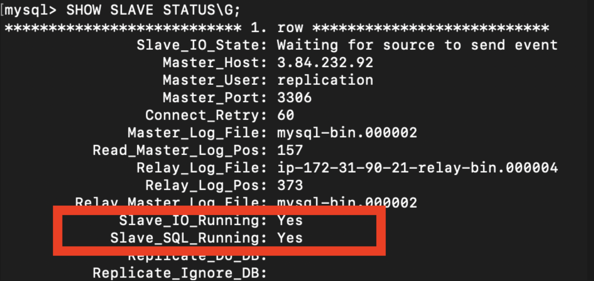

> 💡 데이터베이스 레플리케이션에 대한 자세한 이론은 [고가용성과 확장성을 위한 데이터베이스 레플리케이션(DB Replication)](https://haon.blog/database/replication-theory/) 을 참고하자.

## 실습 환경

지난 레플리케이션 이론에 이어서, 이번엔 직접 레플리케이션을 실습해보고자 한다. 실습이 끝나다면, 우리 하모니 팀 모행 서비스에서 TPS 분석과 동시에 쿼리 성능 개선을 직접 확인해 볼 예정이다. 실습 환경은 다음과 같다.

- AWS EC2, Ubuntu 22.04 LTS
- SpringBoot 3.xx
- MySQL 8.0

## MySQL 

우분투 서버에 MySQL 을 설치해주도록 한다.

~~~sql
$ apt update
$ apt install mysql-server
~~~

### 외부 접속허용

별다른 설정이 없다면 MySQL 은 로컬 호스트내에서만 호출이 가능하다. 소스, 레플리카 서버 바인딩 가능한 주솟값을 로컬 호스트 외에도 모두 외부에서 접속이 가능하도록 설정해주자. 이 설정이 없다면 레플리카 서버에서 소스 서버로 동기화를 위해 접근해야 하는데, 이 행위가 불가능하다.

~~~java
vi /etc/mysql/mysql.conf.d/mysql.cnf

# bind-address = 127.0.0.1
# mysqlx-bind-address = 127.0.0.1
~~~

## 소스 서버 구축

소스, 레플리카 서버 각기 다른 작업을 진행해 줄 것이다. 우선 소스 서버부터 작업을 시작해주자. repliation 이라는 네이밍을 가진 데이터베이스 서버를 하나 생성해주고, 해당 DB 서버 작업 내용들이 레플리카 서버에 동기화되도록 할 것이다.

~~~sql
$ sudo mysql -u root -p // 또는 sudo mysql 
$ create database replication; // replication 데이터베이스 생성
$ show databases; // replication 데이터베이스가 생성되었는지 확인
~~~

또한 소스 서버에서 이벤트(변경사항)이 발생했을 떄 레플리카 서버가 소스 서버에 접근하여 바이너리 로그 파일내에 기록된 이벤트를 읽어와야 한다. 이처럼 소스 서버에 접근하고 복제를 하기 위해선 아무 서버에서 접근할 수 있는 것이 아니라, 레플리케이션 전용 계정을 통해서만 접근이 가능하다. 레플리케이션 전용 MySQL 계정을 하나 생성하고, 레플리케이션 권한을 부여하도록 하자.

~~~sql
$ CREATE USER 'replication'@'%' IDENTIFIED WITH mysql_native_password BY 'password';
$ GRANT REPLICATION SLAVE ON *.* TO 'replication'@'%';
~~~

MySQL 5.8 버전 이상부터는 Password Auth 방식이 `caching_sha2_password` 방식으로 변경되었다. 따라서 위와 같이 유저를 생성할 때 `IDENTIFIED WITH mysql_native_password BY` 로 생성해야한다. 그렇지 않으면 애러가 발생한다.

### mysqld.cnf 소스 서버 설정

이제 `mysqld.cnf` 파일을 수정하여, MySQL 설정을 변경해보자. 현재 서버를 레플리케이션 환경으로 구축하기 위해 소스 서버를 활성화하기 위한 설정 작업이다. 

~~~sql
$ vi /etc/mysql/mysql.conf.d/mysqld.cnf

[mysqld]
max_allowed_packet=1000M
server-id = 1
log-bin = mysql-bin
binlog_format = ROW
max_binlog_size = 500M
sync_binlog = 1
expire-logs-days = 7
binlog_do_db = replication
~~~

- `[mysqld]` : MySQL 서버의 전역설정 정보를 나타낸다.
- `max_allowed_packet` : 클라이언트와 서버간에 교환되는 최대 네트워크 패킷 크기로, 패킷의 최대 크기를 1000MB 로 설정했다.
- `server-id` : 레플리케이션을 위해 서버에 할당된 고유한 식별자이다. 하나의 레플리케이션 토폴로지 환경을 구성하는 각 서버는 고유한 서버 ID 값을 가져야한다. 따라서 레플리카 서버와 다른 값을 가져야한다.
- `log-bin` : 바이너리 로그 파일의 위치(경로) 를 지정한다. (`/var/lib/mysql/mysql-bin.XXXXXX` 형식으로 저장 될 것이다.)
- `binlog_format` : 바이너리 로그 파일에 저장되는 데이터의 저장 형식을 지정하는 것이다. `STATEMENT`, `ROW`, `MIXED` 이 3가지 중 하나를 선택할 수 있다.
- `max_binlog_size` : 바이너리 로그 파일의 최대 크기로, 지정된 크기에 도달하면 새로운 파일이 생성된다.
- `sync_binlog` : N개의 트랜잭션 마다 바이너리 로그를 디스크에 동기적으로 기록되도록 지정한 것이다. 위 설정 값 1은 가장 안정적이지만, 가장 느린 설정이다.
- `expire-logs-days` : 바이너리 로그 파일의 만료기간으로, 위 경우 7일이 지나면 파일이 제거된다.
- `binlog_do_db` : 레플리케이션을 적용할 데이터베이스 이름을 지정한다. 앞서 만든 replication 데이터베이스의 이름을 지정했다. 별도의 설정이 없다면 모든 데이터베이스를 대상으로 복제가 진행된다.

### 소스 서버 상태 조화

모든 설정이 끝났다면, MySQL 서버를 다시 재가동해보자.

~~~java
$ service mysql restart
~~~

그리고 소스 서버의 상태를 조회해보자. 여기서 `File` 과 `Position` 가 중요하다. 레플리케이션은 `File` 과 `Position` 값을 기반으로 동기화가 진행되니, 이 값을 기억해두자. 또한 이 값들은 데이터베이스에서 이벤트가 발생할 때 마다 매번 변경된다. 레플리카 서버는 항시 동기화를 위해 소스 서버의 File 과 Position 값을 바라보며 추적한다. 

~~~sql
mysql> SHOW MASTER STATUS;
+------------------+----------+--------------+------------------+-------------------+
| File             | Position | Binlog_Do_DB | Binlog_Ignore_DB | Executed_Gtid_Set |
+------------------+----------+--------------+------------------+-------------------+
| mysql-bin.000001 |      157 | replication  |                  |                   |
+------------------+----------+--------------+------------------+---------------
~~~

#### Position

> 💡 Position : 바이너리 로그 파일 내에서 레플리카 서버가 어떤 위치부터 읽어야할지에 대한 위치 값을 뜻한다. 즉, 레플리카 서버는 Postiion 을 상시로 추적해가며 최근에 소스서버에서 이벤트가 발생한 위치에서부터 이벤트를 읽어들인다.

## 레플리카 서버 구축

앞선 소스 서버와 마찬가지로 replication 이라는 데이터베이스를 생성해주자.

~~~sql
$ CREATE DATABASE replication;   // 슬레이브 서버도 동일한 명으로 DB 를 생성해준다
$ show databases;                // 잘 생성되었는지 확인
~~~

### mysqld.cnf 레플리카 서버 설정

레플리카 서버도 `mysqld.cnf` 파일을 수정하여 레플리케이션을 위한 설정을 진행해준다.

~~~java
$ vi /etc/mysql/mysql.conf.d/mysqld.cnf

[mysqld]
server-id = 2
replicate-do-db = replication
read_only = 1
~~~

- `server_id` : 동일한 레플리케이션 토폴로지에선 각 서버가 유일한 ID 값을 지녀야한다고 했기 떄문에, **server-id = 2** 로 부여해준다. 
- `replicate-do-db` : 소스 서버의 어떤 데이터베이스를 대상으로 동기화할 것인지 지정한다. 앞서 소스 서버에서 생성한 replication 데이터베이스를 지정해주었다.
- `read_only` : 레플리카 서버는 읽기전용으로 구축하기 위해 **read-only = 1** 을 부여해준다. 

설정이 끝났다면 MySQL 서버를 재실행해준다.

~~~sql
$ service mysql restart
~~~

### 라우팅할 소스 서버 설정

아직 레플리카 서버에는 어떤 소스 서버로 라우팅해야하는지에 대한 정보가 없다. 아래 쿼리를 순차적으로 실행하여, 라우팅에 대한 설정을 진행해준다.

~~~sql
RESET SLAVE;

CHANGE MASTER TO
MASTER_HOST='xx.xxx.xx', # 소스 서버 Host IP
MASTER_USER='replication', # 레플리케이션 전용 계정 
MASTER_PASSWORD=`password`,
MASTER_LOG_FILE=`mysql-bin.000001`,
MASTER_LOG_POS=157,
~~~

- `MASTER_HOST` : 소스 서버의 IP 주소를 입력한다.
- `MASTER_USER` : 앞서 생성한 레플리케이션 전용 계정을 입력한다.
- `MASTER_PASSWORD` : 레플리케이션 전용 계정의 비밀번호를 입력한다.
- `MASTER_LOG_FILE`, `MASTER_LOG_POS` : 앞서 소스 서버에서 기억해두었던 FILE 값과 POSITION 값으로 설정한다.

마지막으로 레플리카 서버를 활성화한다.

~~~sql
START REPLICA;
~~~

### 레플리케이션 동작 확인

~~~sql
SHOW SLAVE STATUS\G;
~~~

레플리카 서버에서 레플리케이션이 잘 동작하는지 확인해보자. `Slave_IO_Running` 과 `Slave_SQL_Running` 이 둘다 "Yes" 가 되어야 정상 동작하는 것이다. 만약 하나라도 "No" 인 경우라면 에러 로그를 확인 후 처리해줘야한다.

만약 레플리케이션이 동작하지 않아서 설정을 다시 해야한다면, 아래 명령어로 레플리카를 잠시 비활성화시키고 재설정 해주자.

~~~sql
STOP REPLICA;  
# 에러를 해결하고나서 "RESET SLAVE;" 부터 다시 활성화시킬때, 레플리케이션을 먼저 종료해야한다
~~~

#### 트러블슈팅1 - 소스 서버에 연결이 되지 않는다면?

~~~sql
Slave_IO_Running: Connecting
Slave_SQL_Running: YES
// ...
~~~

필자가 마주했던 트러블슈팅으로, 만약 `Slave_IO_Running` 이 계속 Connecting 상태로 연결을 계속 시도하는 중이라면 라우팅할 소스 서버 설정을 위한 쿼리를 잘못 작성했을 가능성이 크다. 또는 잘못된 방화벽 설정으로 인해 레플리카 서버가 소스 서버에 접근하지 못하는 가능성도 존재한다 따라서 이와 관련한 쿼리를 제대로 작성했는지 다시 점검해보거나, 방화벽 설정등을 다시 확인해보자.

#### 트러블슈팅2 - POSITION 값을 추적하지 못하는 경우

레플리카 서버는 소스 서버의 POSITION 값을 추적해가면서 동기화를 수행할텐데, 매번 달라지는 POSITION 값을 제대로 추적하지 못하여 발생하는 에러도 마주했다. 즉, ``Read_Master_Log_Pos` 와 `Exec_masterlog_pos` 값이 서로 달라서 레플리케이션이 수행되지 않는 상황이다.

~~~sql
Slave_IO_Running: YES
Slave_SQL_Running: NO
// ...
Last_Errno: 1062
Last_Error: Error ‘Duplicate entry ‘116069-10002826′ for key 1’ on query. 
Default database: ‘THEEYE’. Query: ‘INSERT INTO TABLE ( IDX, NAME, REG_DATE ) VALUES ( 3, “GOOD”, NOW() )’
~~~

에러가 발생한 에러 코드를 확인해보자.

~~~sql
show slave status\G; 에서 errno 확인
Last_Errno: 1062 # 또는 1164, 1053 가 발생했을 수도 있다.
~~~

이를 해결하기 위해, `mysqld.cnf` 파일에 **slave-skip-error** 옵션을 추가하고 에러가 발생한 코드가 Skip 되도록 설정한 후, 레플리카 서버의 MySQL 서버를 재시작하자.

~~~java
[mysqld]
// ...
slave-skip-errors = 1053,1062,1146
~~~

그러고 다시 MySQL 에 접속하여 상태를 확인하면, 레플리케이션이 정상 동작하는 것을 확인할 수 있을 것이다. 그동안 맞춰지지 않았던 Exec_Master_Log_Pos 값이 점점 올라가면서 Read_Master_Log_Pos 값과 동일하게 맞춰지면 동기화 완료된 것이다.

~~~sql
mysql> show slave status\G;
*************************** 1. row ***************************
Slave_IO_State: Waiting for master to send event
// ...
Slave_IO_Running: Yes
Slave_SQL_Running: Yes
~~~

## 스프링부트에서 라우팅 환경 구축

앞선 과정으로 MySQL 서버를 소스, 레플리카로 이중화하였으므로, 스프링부트에서 사용하는 DataSource 도 이에 알맞게 라우팅해줘야한다. `readOnly=true` 인 트랜잭션은 레플리카 DataSource 를 사용하고, `readOnly=false` 트랜잭션은 소스 DataSource 를 사용하도록 처리해주자.

### application.yml 설정

일단 2개의 DataSource에 대한 설정을 application.yml 에 적어준다. 하나의 DataSource에 대해서는 스프링부트가 자동으로 빈으로 만들어 관리해줬지만, 2개 이상의 DataSource를 사용할 때에는 우리가 직접 빈을 만들어 사용해야한다. 일단 아래와 같이 설정하자.

~~~java

spring:
  datasource:
    master:
      username: haon
      password: password
      driver-class-name: com.mysql.cj.jdbc.Driver
      jdbc-url: jdbc:mysql://111.111.111:.11:3306/replication
    slave:
      username: haon
      password: password
      driver-class-name: com.mysql.cj.jdbc.Driver
      jdbc-url: jdbc:mysql://222.222.222.22:3306/replication
// ...
~~~

### 다중 DataSource 를 위한 빈 등록

DataSource 가 여러개로 다중화되면서, 직접 빈을 생성하고 등록해주어야한다. 이와 관련한 전체 코드는 아래와 같다. 천천히 살펴보자.

~~~java
@Configuration
public class DataSourceConfig {
    private static final String master = "master";
    private static final String slave = "slave";

    @Bean @Qualifier(master)
    @ConfigurationProperties(prefix = "spring.datasource.master")
    public DataSource masterDataSource(){
        return DataSourceBuilder.create().build();
    }

    @Bean @Qualifier(slave)
    @ConfigurationProperties(prefix = "spring.datasource.slave")
    public DataSource slaveDataSource(){
        return DataSourceBuilder.create().build();
    }

    @Bean
    public DataSource routingDataSource(
            @Qualifier(master) DataSource masterDataSource,
            @Qualifier(slave) DataSource slaveDataSource){
        RoutingDataSource routingDataSource = new RoutingDataSource(); // 쿼리 요청을 적절한 서버로 분기할 때 활용됨

        HashMap<Object, Object> targetDataSourceMap = new HashMap<>();

        // targetDataSourceMap 객체에 분기할 서버들의 DataSource 빈을 저장
        targetDataSourceMap.put("master", masterDataSource);
        targetDataSourceMap.put("slave", slaveDataSource);

        routingDataSource.setTargetDataSources(targetDataSourceMap); // DataSource 타깃을 설정한다.
        routingDataSource.setDefaultTargetDataSource(masterDataSource);

        return routingDataSource;
    }

    @Bean
    @Primary
    public DataSource dataSource(){
        DataSource determinedDataSource = routingDataSource(masterDataSource(), slaveDataSource());
        return new LazyConnectionDataSourceProxy(determinedDataSource);
    }
}
~~~

`@ConfigurationProperties` 를 사용하면 `application.yml` 에서 특정 prefix 에 해당하는 설정 값만을 자바 Bean 에다 매핑할 수 있다. 즉, 2개의 DataSource 타입의 빈에 대해 서로 다른 prefix 설정 값을 불러와 빈이 생성되도록 할 수 있다.

### 소스 서버, 레플리카 서버를 위한 DataSource 빈 등록

소스, 레플리카에 대한 2개의 DataSource 타입 빈을 등록해주도록 한다. `@Quaifier` 를 사용한 것을 볼 수 있다. 기본적으로 의존관계 주입은 타입 을 기준으로 빈을 등록하고 매핑되기 떄문에 동일한 타입이 있을때 별도의 처리가 없다면 **NoUniqueBeanDefinitionException** 이 발생한다. 이를 해결하도록 동일한 DataSource 타입을 가지는 2개의 빈에 대해 @Quaifier 로 추가 구분자명을 부여해서 2개의 빈이 구분되어 등록되도록 해주었다.

~~~java
private static final String master = "master";
private static final String slave = "slave";

@Bean @Qualifier(master)
@ConfigurationProperties(prefix = "spring.datasource.master")
public DataSource masterDataSource(){
	return DataSourceBuilder.create().build();
}

@Bean @Qualifier(slave)
@ConfigurationProperties(prefix = "spring.datasource.slave")
public DataSource slaveDataSource(){
	return DataSourceBuilder.create().build();
}
~~~

### AbstractRoutingDataSource 상속

DataSourceConfig 내에 RoutingDataSource 라는 오브젝트가 보인다. 이 구현체는 무슨 역할을 할까?

스프링은 `AbstractRoutingDataSource` 라는 추상 클래스를 제공하여, Multi DataSource 환경에서 여러 DataSource 를 묶고 분기해준다. `determineCurrentLookupKey()` 를 오버라이드 했는데, **여러개의 DataSource 중에서 실제로 사용될 DataSource 를 결정하는 역할**을 한다. 즉, 소스와 레플리카 서버중에서 어떤 DataSource 로 라우팅할지 결정한다. 

어떤 DataSource 로 라우팅할지는 `TransactionSynchronizationManager` 를 통해 결정한다.  `TransactionSynchronizationManager` 현재 요청에 대한 트랜잭션이 읽기전용인지 쓰기전용인지를 구분하고, 그에 따른 DataSource 서버 Key 값 (문자열)을 리턴한다.

~~~java
//  AbstractRoutingDataSource : Multi DataSource 환경에서 여러 DataSource 를 묶고 분기해줄 때 사용한다.
public class RoutingDataSource extends AbstractRoutingDataSource {
    // determineCurrentLookupKey 메소드 : 여러 datasource 중에서 실제로 사용될 DataSource 를 결정하는 역할
    // 현재 트랜잭션의 속성에 따라 targetDataSourceMap 의 조회 Key 를 결정하기위해 AbstractRoutingDataSource 를 상속받아서 determineCurrentLookupKey 를 구현했다.
    @Override
    protected Object determineCurrentLookupKey() {
        boolean isReadOnly = TransactionSynchronizationManager.isCurrentTransactionReadOnly();
        logger.info("현재 트랜잭션 속성이 ReadOnly인가?:" + isReadOnly);
        return isReadOnly ? "slave" : "master";
    }
}
~~~

### routingDataSource() 로 Multi DataSource 빈들을 라우팅 타깃으로 등록

`DataSourceConfig` 로 다시 돌아와서, `routingDataSource()` 에 대해 살펴보자. 앞서 정의한 RoutingDataSource 를 사용해서, 트랜잭션 요청을 읽기/쓰기에 따라 적절한 DataSource 로 라우팅하기 위해 선언된 메소드이다.

`(1)` 과 `(2)` 에서 HashMap 을 생성하고 앞서 정의한 소스, 레플리카 서버에 대한 DataSource  빈을 저장하고 있다. 이때 소스, 레플리카 서버에 대한 DataSource 빈을 각각 `"master"` 와 `"slave"` 라는 key 값과 매핑하여 key-value 형태로 저장한다. 이후 `(3)` 에서 DataSource 빈들을 `RoutingDataSource` 에 등록한다. `(4)` 에서는 기본으로 라우팅할 DataSource 를 소스 서버로 지정했다.

~~~java
@Bean
public DataSource routingDataSource(
	@Qualifier(master) DataSource masterDataSource,
	@Qualifier(slave) DataSource slaveDataSource) {

   RoutingDataSource routingDataSource = new RoutingDataSource(); // 쿼리 요청을 적절한 서버로 분기할 때 활용됨
   HashMap<Object, Object> targetDataSourceMap = new HashMap<>(); // (1)

   // targetDataSourceMap 객체에 분기할 서버들의 DataSource 빈을 저장
   targetDataSourceMap.put("master", masterDataSource); // (2)
   targetDataSourceMap.put("slave", slaveDataSource);

   routingDataSource.setTargetDataSources(targetDataSourceMap); // (3) => DataSource 타깃을 설정한다.
   routingDataSource.setDefaultTargetDataSource(masterDataSource); // (4)

	return routingDataSource;
~~~

### dataSource()

앞선 `routingDataSource()` 로 만든 DataSource 를 스프링부트 전반에서 사용될 DataSource 로 등록하기 위해, `dataSource()` 빈에서 사용해줘야한다. 

이때 `LazyConnectionDataSourceProxy` 을 사용하였다. 스프링은 기본적으로 트랜잭션에 진입하자마자 즉시 `DataSource` 를 가져오고 커넥션을 맺는다. 그러고나서 트랜잭션의 현재 상태(읽기/쓰기 상태)가 설정된다. 이 떄문에 RoutingDataSource 내에서 `TransactionSynchornizationManager` 에 트랜잭션 정보를 동기화 하는 작업, 즉 트랜잭션의 현재 상태(읽기/쓰기) 를 파악하고 라우팅할 DataSource 를 결정하는 작업은 DataSource 로 부터 이미 커넥션을 맺은 이후에 뒤늦게 동작한다. 따라서 우리는 커넥션을 획득하는 시점을 지연(Lazy) 시킬 필요가 있다. **현재 트랜잭션의 Read/Write Only 상태가 설정되고난 뒤에 그에 따른 DataSource 가 결정되면서 커넥션을 획득하도록 해야한다.**

이 문제를 해결하기 위해 `LazyConnectionDataSourceProxy` 를 사용해야한다. `LazyConnectionDataSourceProxy` 를 사용하면 트랜잭션 진입 시점에 실제 커넥션을 리턴하는 대신에 프록시 커넥션 객체를 대신 리턴한다. 이를통해 커넥션이 실제로 사용되는 시점까지 커넥션 획득을 지연시켜서, 정상적으로 AbstractRoutingDataSource 가 트랜잭션 현재 읽기/쓰기 상태를 정상적으로 읽어올 수 있게 된다.

~~~java
@Bean
@Primary
public DataSource dataSource(){
	DataSource determinedDataSource = routingDataSource(masterDataSource(), slaveDataSource());
	return new LazyConnectionDataSourceProxy(determinedDataSource);
}
~~~

## 마치며

이렇게까지 설정해주면, 트랜잭션의 readOnly 상태에 따라 DataSource 가 정상 분기된다. 사실 MySQL 에서 레플리케이션을 구축하는 것 보다 스프링부트 내에서 Multi DataSource 라우팅을 구축하는 것이 훨씬 어려웠다 🤔 스프링이 DataSource와 Transaction을 관리하는 방법에 대해서 깊게 공부해봐야겠다.

## 참고

- Real MySQL 8.0 2권, 백은빈 , 이성욱 저자(글)
- https://hudi.blog/database-replication-with-springboot-and-mysql/
- http://faq.add4s.com/?p=469
- https://velog.io/@inhwa1025/MySQL-Replication