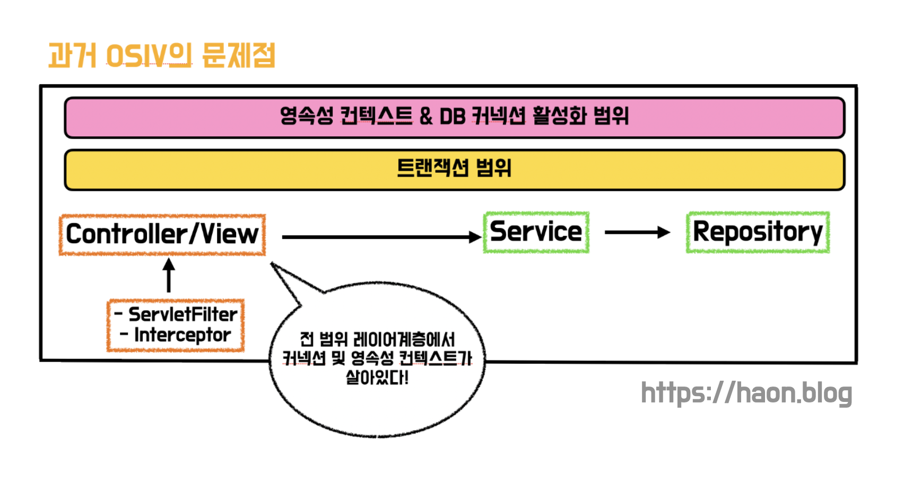
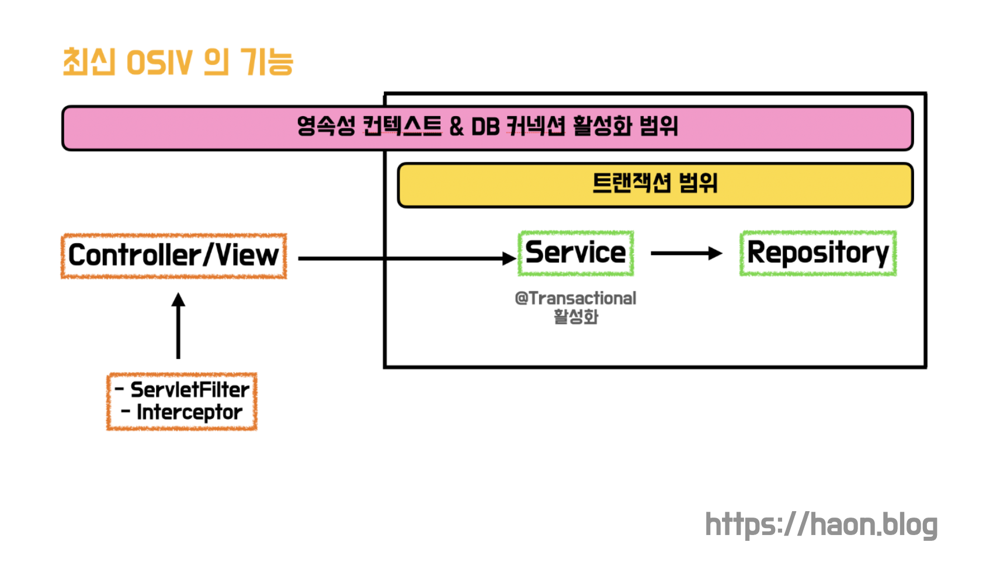
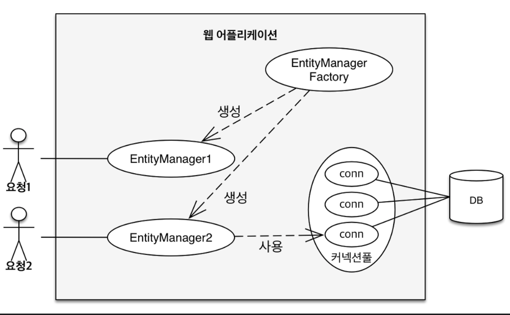
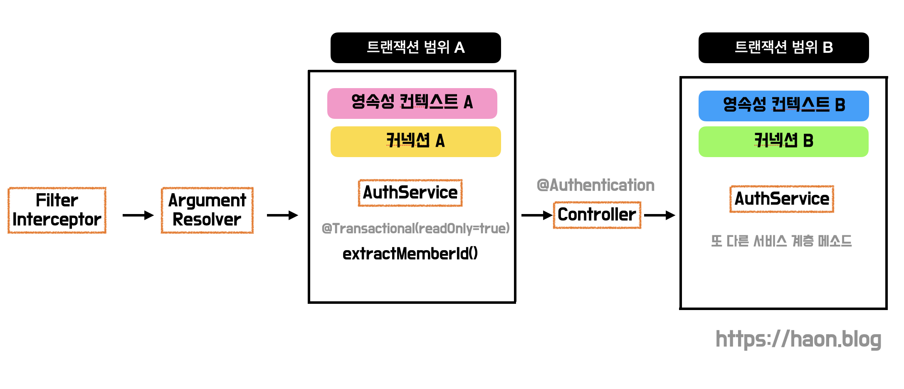

> 💡 현재 포스트는 [하모니 팀 기술 블로그](https://kakaotech-harmony.netlify.app/backend/replication-osiv-issue/) 에 게시된 글 입니다.

최근에 [MySQL 8.0 레플리케이션과 스프링부트 DataSource 라우팅을 통한 부하 분산](https://haon.blog/database/replication-mysql-springboot/) 에서 MySQL 과 스프링부트 환경으로 레플리케이션 환경을 구축하는 방법에 대해 실습을 다루었다. 레플리케이션을 직접 우리 서비스에 구축하기 전까지는 크게 어려움이 없을 것이라고 생각했다.

하지만, 막상 우리 모행 서비스에 레플리케이션을 적용할 때 DataSource 라우팅이 되지 않아서 생각보다 많은 트러블슈팅을 만났다. 하나는 `TransactionSynchronizationManager` 동기화 이슈문제이었고, 다른 하나는 `JPA OSIV` 관련 이슈이다. 이번 포스팅에선 후자인 OSIV 관련 DataSource 라우팅에 대해 다루어보고자 한다.

## 문제 상황

위 포스팅을 작성할 때는 간단한 새로운 프로젝트를 별도로 만들어서 학습을 진행했기 떄문에 큰 문제없이 레플리케이션 적용에 성공했다. 문제는 레플리케이션을 모행 서비스에 적용할 때 DataSource 라우팅이 안된다는 점이다. **기대와 달리 트랜잭션 내의 쿼리들이 Source, Replica 서버로 분산되지 않고,** `readOnly=false` **로 설정된 서비스 메소드 트랜잭션 쿼리가 레플리카(읽기 전용) 서버로 날아갔다.** DataSource 라우팅이 되지 않는 상황으로, 무엇이 문제였을까? 

## 🤔 그렇다고 DataSource 라우팅이 모든 메소드에서 안되는건 아니다!? 

여러 시도를 해보던중, 재밌는 점 하나를 발견했다. 요상하게도 모든 서비스 메소드에서 DataSource 라우팅이 안되는 것은 아니고, 일부 로직에선 라우팅이 정상 수행되고 있다는 점이다. **신기하게도, 로그인이 필요없이 비회원도 이용할 수 있는 API 콜에 대해선 DataSource 타깃이 정상적으로 선택되고 라우팅이 수행되었다.** 다시말해, 로그인이 필요한 대부분의 로직에선 DataSource 분기 처리가 되지 않고있었다.

### 서비스(애플리케이션) 계층의 메소드를 사용하는 Argument Resolver

우리 팀은 스프링에서 제공하는 `HandlerMethodArgumentResolver` 를 사용하여 인가(Authorization) 로직을 처리하고 있다. 서비스 계층내의 AuthService 에 선언된 `extractMemberId()` 메소드로 엑세스 토큰으로 부터 멤버의 ID 를 추출하고 있다. 마지막으로 `Accessor` 라는 DTO 를 컨트롤러에게 전달한다. 

~~~java
@Component
public class AuthenticationArgumentResolver implements HandlerMethodArgumentResolver {
    private final AuthService authService;
    private final AuthenticationBearerExtractor authenticationBearerExtractor;

    // ...

    @Override
    public Accessor resolveArgument(
            final MethodParameter methodParameter,
            final ModelAndViewContainer modelAndViewContainer,
            final NativeWebRequest nativeWebRequest,
            final WebDataBinderFactory webDataBinderFactory) {
        final HttpServletRequest request = nativeWebRequest.getNativeRequest(HttpServletRequest.class);

        if (request == null) {
            throw new BadRequestException("잘못된 HTTP 요청입니다.");
        }

        final String accessToken = authenticationBearerExtractor.extract(request);
        final Long id = authService.extractMemberId(accessToken);
        return new Accessor(id);
    }
}
~~~

### Argument Resolver 는 트랜잭션을 사용하고 있다

앞서 설명했듯이 Argument Resolver 는 `AuthService` 의 `extractMemberId()` 를 사용한다. `extractMemberId()` 는 아래와 같이 멤버 ID 를 추출하고, 회원 존재여부를 검증을 수행한다. 여기서 중요한 점은 `@Transactional(readOnly = true)` 로 선언되었다는 점이다.  **Argument Resolver 의 코드는 트랜잭션을 사용한다는 점을 알 수 있다.** 

그리고 여러 시도와 실험을 통해 `extractMemberId()` 의 트랜잭션 `readOnly` 설정 값에 따라 DataSource 가 동일하게 다른 트랜잭션에서도 사용되고 있다는 점을 알게 되었다. `extractMemberId()` 를 `readOnly=false` 로 설정했을 땐 DataSource 로 쓰기 전용인 소스(Source) 서버를 선택하게 되고, 반대로 `readOnly=true` 라면 읽기 전용인 레플리카 서버를 선택하게 된다. **즉, 로그인 인증을 요구하는 동일한 API 호출내의 다른 트랜잭션에서도 항상** `extractMemberId()` **와 동일한 DataSource 로 라우팅 된다는 점을 발견하게 되었다 🤔**

~~~java
@Transactional(readOnly = true)
public class AuthService {
    // ...

    public Long extractMemberId(final String accessToken) {
        final Long memberId = tokenManager.getMemberId(accessToken);

        if(!memberService.existsById(memberId)) {
            throw new NoExistMemberException("존재하지 않는 멤버입니다.");
        }
        return memberId;
    }
}
~~~

## 🎯 JPA OSIV 로 인해 문제가 발생했다

### 🔑 DataSource 라우팅이 안되는 근본적인 원인을 찾기위해

Argument Resolver 에서 호출되는 `extractMemberId()` 의 트랜잭션 읽기/쓰기 옵션에 따라 DataSource 가 결정된다는 요상한 사실은 발견했으나, 근본적인 문제 해결에 대한 해결책을 찾지 못하여 며칠동안 많은 삽질을 했다. 끝내 문제를 해결하지 못하고 끙끙 앓던 중, 카카오테크 교육자인 퍼실리테이터 맥(mac) 을 통해 도움을 요청했다. 그 결과, **DataSource 라우팅이 되지 않는 근본적인 원인은 JPA OSIV(Open Session In View) 라는 점을 알게 되었다.** 도대체 JPA OSIV 가 무엇이길래 DataSource 라우팅이 안되도록 괴롭힌것일까? 🤔

### OSIV (Open Session In View) 란 무엇인가? 

JPA 에서 사용되는 개념인 **OSIV(Open Session In View) 란 영속성 컨텍스트를 프레젠테이션(뷰와 컨트롤러) 레이어까지 열어두는 기능**이다. 즉, OSIV 가 활성화되면 프레젠테이션 계층부터 레포지토리 계층까지 전 구간에서 영속성 컨텍스트가 제거되지 않고 활성화되어 살아있게 된다. 이를 통해 **영속성 컨텍스트가 한 API 요청 내내 죽지않고 계속 유지된다.** (영속성 컨텍스트의 생명주기가 더 넓어진 것이다.) 별도의 설정이 없다면 스프링은 OSIV 를 기본적으로 활성화시킨다.

그렇다면, OSIV 왜 필요할까? 스프링에선 왜 기본값으로 OSIV 를 활성화하는 것일까? 바로 **프레젠테이션 계층에서 지연 로딩(Lazy Loading) 을 사용하기 위함이다.** OSIV 가 활성화되어 있다면, 서비스 계층에서 컨트롤러 계층으로 직접 엔티티를 반환(노출)하더라도, 프레젠테이션 계층에서 지연 로딩을 통해 엔티티 내부 필드를 정상적으로 읽어올 수 있게 된다. **즉, OSIV 활성화하면 엔티티를 프레젠테이션에서 노출하는 (흔치않은) 일부 상황에서 예외 발생없이 영속성 컨텍스트로 부터 꺼내와서 사용할 수 있게된다.** 다만 우리 모행 서비스는 서비스 계층에서 엔티티를 DTO 로 반환하기 때문에, 엔티티를 프레젠테이션 계층까지 위험하게 노출시키지 않지 떄문에 OSIV 가 활성화되지 않아도 전혀 무관했다. 이 때문에 OSIV 를 깊게 학습할 일도 없었다.

### 과거 스프링 OSIV 의 문제점

잠시 OSIV 에 대해 더 깊게 이해해보자. 스프링에서 제공하는 과거 OSIV 는 클라이언트 요청이 들어오자마자 그 즉시 **서블릿 필터, 스프링 인터셉터에서 영속성 컨텍스트와 트랜잭션을 생성했다. 그리고 이들을 API 요청 처음부터 끝까지 계속 유지하여 살아있게되는 방식으로 동작했다**. 유저의 요청 내내 영속성 컨텍스트가 살아있으므로, 엔티티도 영속상태를 끝까지 유지할 수 있게 된다. 즉, 지연 로딩을 사용할 수 있다.

하지만 이 방식의 과거 OSIV 는 문제점이 존재했다. 영속성 컨텍스트가 프레젠테이션에서 유지되면, 엔티티도 영속상태를 유지한다는 점이 문제가 된다. 이 상황에서 트랜잭션까지 함께 유지되다보니, **엔티티를 프레젠테이션 계층에서 변경할 수 있게 된다.** 만약 아래처럼 DTO 를 사용하지 않고 컨트롤러에서 응답으로 엔티티를 직접 수정하고 응답해준다면 어떻게 될까?

~~~java
@RestController
public class TripController {
    @Autowired
    private TripService tripService;

    @GetMapping("/trips/{id}")
    public Trip getTrip(@PathVariable Long id) {
        Trip trip = tripService.findTripById(id);
        trip.setName("변경된 여행지 엔티티 이름");
        return trip;
    }
}
~~~

위와 같이 `setter()` 를 컨트롤러에서 호출하면 문제가 발생한다. 과거 OSIV 방식에선 트랜잭션이 컨트롤러에서도 살아있게 된다고 했었다. 이 특징때문에 위 코드에서 JPA 더티 체킹(Dirty Checking) 이 발생하여 트랜잭션이 커밋되고, 수정된 내용이 의도치 않게 실제 DB 에 반영된다. **즉, 과거 OSIV 방식에선 트랜잭션이 프레젠테이션 계층에서도 활성화되어  JPA 더티체킹이 발생함으로인해 엔티티 수정이 가능하다는 문제점이 발생했다.**

### 현재 스프링 OSIV 동작 방식

위와 같이 과거 프레제젠테이션 계층에서 엔티티를 수정할 수 있다는 문제를 막으려면 어떻게 해야할까? 생각보다 해결안은 간단하다. 트랜잭션 생명주기를 전 계층이 아니라, 프레젠테이션 계층을 제외한 비즈니스 계층에서만 살아있도록 만들면 될 것이다. 실제로 현재 OSIV 는 **엔티티를 프레젠테이션에서 수정이 불가능하도록 막았다.** 엔티티를 프레젠테이션 계층에서 수정하려고 시도하면 `LazyInitializationException` 예외가 발생한다. **즉, 현재 OSIV 방식은 프레젠테이션 계층을 제외한 비즈니스 계층에서만 트랜잭션의 생명주기가  살아서 유지된다.** 프레젠테이션 계층에선 엔티티 수정이 불가능하고, 단순히 엔티티 조회만 가능하도록 변경되었다.

여기서 가장 중요한 점은, 과거/현재 OSIV 방식 그 무엇이던간에 OSIV 활성화시 한번 생성된 영속성 컨텍스트는 전 계층에서 계속 살아서 유지된다는 점을 기억하자. 

## JPA OSIV 가 왜 문제가 될까?

이러한 OSIV 로 인해 왜 DataSource 라우팅이 안된것일까? 앞서 설명했듯이, OSIV 를 사용하면 영속성 컨텍스트가 한 API 요창내내 전 계층에서 살아있게 된다.

### EntityManager, 영속성 컨텍스트, DB 커넥션

알아야 할 점이 있다. JPA 환경에선 기본적으로 한 요청당 하나의 `EntityManager` 를 사용하게 된다. 또한, 각 EntityManager 는 자신만의 고유한 영속성 컨텍스트를 생성하고 이 안에 본인에게 필요한 엔티티를 관리하고, 영속화하게 된다.

이러한 `EntityManager` 는 데이터베이스 연결이 필요한 시점에(보통 트랜잭션을 시작할 때) DB 커넥션 풀로부터 커넥션을 획득하고, DB 에 쿼리를 날려 얻어낸 엔티티 결과를 영속성 컨텍스트에 저장(영속화)한다. 이때 EntityManager 는 **커넥션 풀에서 커넥션 풀을 획득해오니, 우리가 지정한 DataSource 를 선택하고 사용한다.** 

### 😡 OSIV 로 인해 초기에 획득한 커넥션이 끊어지지 않고 그대로 유지된다

문제가 여기서 발생한다. 과거 OSIV, 현재 OSIV 그 무엇이던간에 별개로 근본적인 문제가 발생한다. **OSIV 덕분에 한 번 생성된 영속성 컨텍스트와 DB 커넥션은 프레젠테이션 계층부터 레포지토리 계층 전 계층에서 죽지않고 그대로 살아 유지된다는 점이다.** 우리는 아래와 같이  `AbstractRoutingDataSource` 를 사용한 구현체를 사용하여 각 서비스 트랜잭션 메소드마다 매번 새로운 커넥션을 획득하여 분산처리를 의도했었다.

~~~java
@Profile({"dev"})
@Configuration
public class DataSourceConfig {
    // ...

    @Bean
    public DataSource routingDataSource(
            @Qualifier(SOURCE) DataSource sourceDataSource,
            @Qualifier(REPLICA1) DataSource replica1DataSource,
            @Qualifier(REPLICA2) DataSource replica2DataSource) {
        RoutingDataSource routingDataSource = new RoutingDataSource();

        HashMap<Object, Object> dataSources = new HashMap<>();

        dataSources.put("SOURCE", sourceDataSource);
        dataSources.put("REPLICA1", replica1DataSource);
        dataSources.put("REPLICA2", replica2DataSource);

        routingDataSource.setTargetDataSources(dataSources);
        routingDataSource.setDefaultTargetDataSource(sourceDataSource);

        return routingDataSource;
    }

    @Bean
    @Primary
    public DataSource dataSource(){
        DataSource determinedDataSource = routingDataSource(sourceDataSource(), replica1DataSource(), replica2DataSource());
        return new LazyConnectionDataSourceProxy(determinedDataSource);
    }
}
~~~

하지만 OSIV 로 인해 영속성 컨텍스트는 전 계층에서 계속 살아서 유지되고, **한번 커넥션을 얻어온** `EntityManager` 가 또 다시 새로운 커넥션을 생성하지 않는다. 앞서 살펴봤듯이 우리는 Argument Resolver 내에서 `AuthService` 내의 `extractMemberId()` 메소드를 호출하는데, 이때 EntityManager 가 영속성 컨텍스트를 생성하고 계속 유지한다. **즉, Argument Resolver 가 AuthService 를 호출한 시점에서 이미 영속성 컨텍스트는 커넥션을 획득하고 계속 해당 커넥션을 유지하여 사용하는 상태이다.** 이 떄문에 `extractMemberId()` 실행 후 컨트롤러가 본격적으로 다른 서비스 메소드를 실행하는 시점엔 영속성 컨텍스트가 새로운 커넥션을 획득하지 않는다.

결론적으로, **OSIV로 인해 Argument Resolver 호출 시점에서 생성된 시점에 영속성 컨텍스트가 생성되고 계속 살아서 유지된다. 이에 따라 커넥션도 계속해서 끊지않고 유지하므로 DataSource 의 선책도 Argument Resolver 가 호출되는 시점에 단 1번만 이루어진다.** 이러한 이유로 DataSource 라우팅이 정상 수행되지 않았던 것이다.

### ♻️ OSIV 비활성화를 통한 DataSource 라우팅 문제 해결

OSIV 를 비활성화하면 DataSource 분기 문제가 해결된다. OSIV 를 비활설화시 영속성 컨텍스트의 생명주기는 트랜잭션 시작부터 종료까지로 좁혀진다. 이를통해 영속성 컨텍스트가 매 트랜잭션(서비스 메소드)을 실행할 때 마다 새롭세 생성되고, 커넥션도 매번 새롭게 획득하게 된다. **결국 DataSource 로 매번 트랜잭션이 실행될떄마다 새롭게 하게 된다.**

우리 팀은 아래와 같이 `application.yml` 에서 OSIV 를 비활성화여, Multi DataSource 라우팅 문제를 해결할 수 있게 되었다. 😎

~~~java
spring:
  jpa:
    open-in-view: false
~~~

## 참고

- https://velog.io/@haron/Spring-Connection-Pool-이-부족하다고요
- https://ykh6242.tistory.com/entry/JPA-OSIVOpen-Session-In-View%EC%99%80-%EC%84%B1%EB%8A%A5-%EC%B5%9C%EC%A0%81%ED%99%94
- https://eastc.tistory.com/entry/DataSource-%EB%9D%BC%EC%9A%B0%ED%8C%85%EC%9D%B4-%EC%95%88%EB%90%98%EB%8A%94-%EC%9D%B4%EC%9C%A0-OSIV
- https://cornswrold.tistory.com/337

