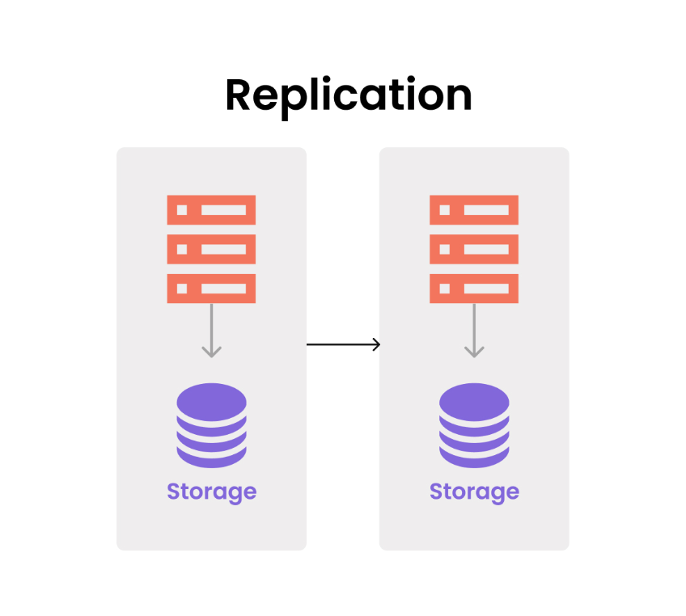
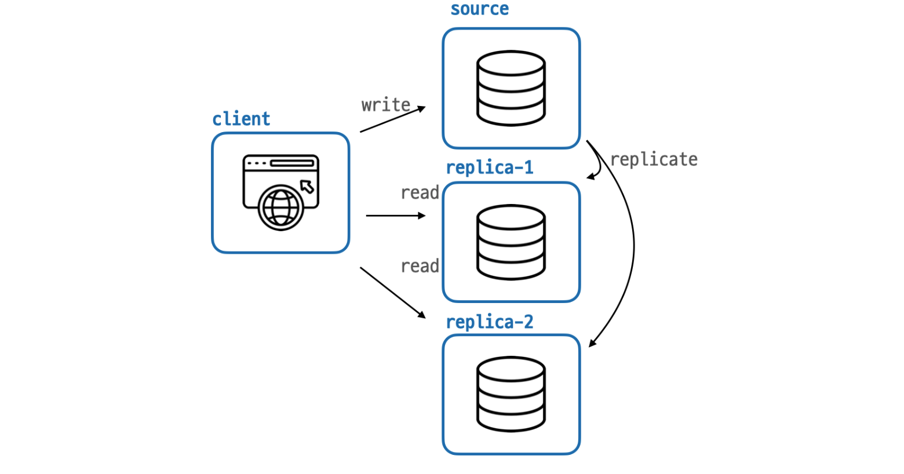
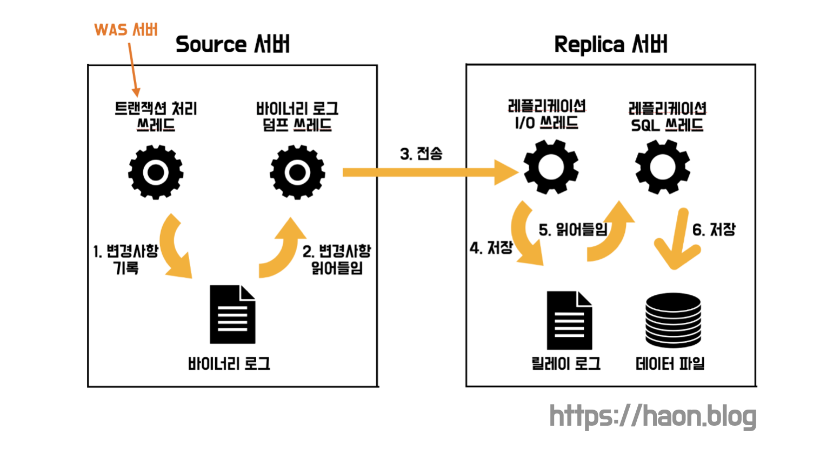

## 학습배경

> 💡 데이터베이스 클러스터링에 대한 이론은 [고가용성과 확장성을 위한 데이터베이스 클러스터링(DB Clustering)](https://haon.blog/database/clustering/) 을 참고하자.

지난 클러스터링에 이어, **데이터베이스를 다중화하여 가용성을 높이는 방법으로 레플리케이션에 대한 학습이 필요함을 알게 되었다.** 레플리케이션이 처음에는 단순히 부하 분산 처리 용도로만 사용되는 것인줄 알았는데, 학습해보니 레플리케이션을 구축함으로써 얻는 이점이 꽤 많다는 것을 알게 되었다. 이번 포스팅에선 레플리케이션을 통해 얻는 이점과 사용 이유에 대해 학습해보도록 한다. 또한 MySQL 기준으로 레플리케이션 구조 원리에 대해 정말 간단한 이론을 다루어보고자 한다. (더 자세한 MySQL 레플리케이션 이론은 향후 포스팅에서 다루어보겠다.)

## 레플리케이션 (Repliation)

레플리케이션을 번역하면 복제이다. 데이터베이스 복제란 뜻 그대로 한 서버의 데이터를 다른 서버에 그대로 동기화시키는 것을 의미한다. 이때 원본 데이터를 보유하고 복제(동기화)시키는 측의 데이터베이스를 **마스터(master) 서버**, 복제를 당하는(동기화되는) 측의 데이터베이스를 **슬레이브(slave) 서버** 라고한다. 즉, 마스터(주인) 과 슬레이브(노예) 서버간에 주인과 노에의 관계가 생긴다. 하지만, 마스터와 슬레이브라는 명칭은 최근부터 윤리적인 이유로 사용되고 있지 않다. 대신 마스터를 **소스(Source) 서버**, 슬레이브를 **레플리카(Replica) 서버** 라고 명칭하고 있다. 

## 레플리케이션의 이점

### 부하 분산 💦

일반적인 웹 애플리케이션과 마찬가지로 데이터베이스 다중화도 **수평 확장(Scale Out)** 의 개념이다. 수평적으로 확장된 상태에서 하나의 서버가 읽기 연산 쿼리만을 처리하고, 다른 서버가 쓰기 연산 쿼리만을 처리함으로써 요청을 분산하여 쿼리 성능 향상을 기대해볼 수 있다.

쓰기를 담당하는 소스(Source) 서버 1대와 읽기를 담당하는 레플리카(Replica) 서버 여러대를 배치하여 부하를 분산하는 것이 일반적인 레플리케이션 방식이다. 일반적인 애플리케이션이라면 통계상 쓰기 연산에 비해 읽기 연산의 비중이 매우 높기 떄문에, 읽기 연산을 처리하는 서버를 여러대 배치하는 것이다. **즉, 상대적으로 비중이 낮은 쓰기 연산을 처리하는 서버는 1대만이 담당하고, 비중이 높은 읽기 연산에 대해선 여러 서버가 요청을 분산하여 부하를 줄인다.** 이를통해 읽기 연산에 대한 부하를 분산하여 성능을 개선할 수 있다.

### 백업 ♻️

레플리케이션은 데이터를 동기화하는 작업이므로, 백업에도 매우 유용하게 사용된다. 백업 프로그램을 통해 정기적으로 데이터베이스를 백업하는 방식을 사용하면 서비스에 영향을 줄 수 있다. 반면 **레플리케이션은 데이터베이스가 애플리케이션의 요청을 분산하는 것은 몰론 백업 과정 또한 동시에 수행할 수 있다.**

하지만 레플리케이션 단독으로만 DB 아키텍쳐를 구성해선 완벽한 백업을 수행할 순 없다. 만약 Source 서버에 개발자가 실수로 모든 데이터를 제거하는 경우, 레플리케이션 실시간 동기화로 인해 다른 서버들 모두의 데이터가 동일하게 제거될 것이다. 따라서 백업을 위해서 레플리카 서버는 실시간으로 동기화되도록 하고, 이와 별개로 레플리카 서버에 스캐쥴러를 실행하여 일정 주기로 별도의 백업하는 설계 구조를 갖추는 것이 필요하다.

### 지리적 분산 🌍

구글과 같이 전세계적으로 사용되고 있는 서비스들은 DB 서버를 어떤 곳에 위치시킬지 고려해야한다. 만약 특정 키워드를 구글링한 결과, 내가 서칭한 데이터가 다른 나라 데이터베이스 저장소에 위치한다면 어떻게 될까? 대한민국에서 구글링을 시도했는데 검색한 데이터가 미국 데이터베이스 서버에 존재한다면? 대한민국은 미국과 지리적으로 멀리 떨어져있기 떄문에 느린 응답을 받을 수 밖에 없다. 따라서 각 국가별로 DB 복제 서버를 배치한 후, 실시간으로 데이터를 동기화시켜서 지리적 이슈를 해결할 수 있다. 

### 장애 극복(FailOver) 과 재해대책 🚒

지리적 분산을 통해 빠른 재해대책과 FailOver 를 극복할 수 있다. 만약 지진이나 태풍으로인해 DB 하드웨어가 설치된 시설이 파괴되었다면 어떻게 될까? 단일 데이터베이스라면 모든 데이터가 유실된 위험은 몰론 서비스 이용이 장기간 불가능하다. 만약 DB 서버가 다른 지역에 골구로 여러곳에 분산되어 있다면 데이터 유실 방지는 몰론, 서비스를 계속해서 운영할 수 있을 것이다.

## MySQL 의 레플리케이션 방식

MySQL 의 복제 방식은 **바이너리 로그 기반 복제** 방식으로 이루어진다. MySQL 내에서 발생하는 **모든 변경사항(이벤트)** 들은 소스 서버의 **바이너리 로그(binary log)** 파일에 순차적으로 기록된다. 레플리케이션은 레플리카 서버가 소스 서버의 로그를 읽어와서(복제) 레플리카 본인 서버의 바이너리 로그 파일에 순차적으로 로그를 기록한다.

트랜잭션 처리 쓰레드를 제외했을 때, 복제 과정에는 3가지 종류의 쓰레드가 참여한다. 그 중 레플리케이션 쓰레드는 소스 서버에서, 나머지 레플리케이션 I/O 쓰레드와 레플리케이션 SQL 쓰레드는 레플리카 서버에서 실행된다.

우선 소스 서버의 **바이너리 로그**에 이벤트가 발생하면 **바이너리 로그 덤프 쓰레드** 가 이 이벤트를 읽고 레플리카 서버로 해당 이벤트에 대한 바이너리 로그를 전송한다. 레플리카 서버의 **레플리케이션 I/O 쓰레드** 는 이 변경사항을 **릴레이 로그 파일** 에 저장한다. 아직까지는 변경사항이 레플리카 서버에는 반영되지 않은 상태인데, 이를 반영하기 위해 **레플리케이션 SQL 쓰레드** 가 변경내용을 **데이터 파일** 에 저장한다.

각 쓰레드의 역할을 자세히 정리해보자면 다음과 같다.

### 바이너리 로그 덤프 쓰레드 (Binary Log Dump Thread)

**레플리케이션 작업이 레플리카 서버로부터 요청 되었을 때 소스 서버로부터 생성되는 쓰레드이다.** 이 쓰레드는 바이너리 로그에 기록된 이벤트를 읽고, 레플리카 서버로 전송하는 역할을 수행한다. 

### 레플리케이션 I/O 쓰레드 (Replication I/O Thread)

레플리카 서버로부터 레플리케이션 작업이 시작되면, 레플리케이션 I/O 쓰레드를 생성하고 소스 서버로부터 바이너리 로그를 가져온다. **가져온 바이너리 로그내에 기록된 이벤트들은 레플리카 서버의 릴레이 로그(relay log) 에 저장한다.** 릴레이 로그는 소스 서버와 레플리카 서버를 중계하는 로그라는 뜻을 내포하고 있다.

이 과정에서 **레플리케이션 I/O 쓰레드는 소스 서버로부터 전달받은 바이너리 로그를 읽고(Input), 읽어들인 내용을 릴레이 로그에 쓰는(Output) 작업**을 수행한다.

### 레플리케이션 SQL 쓰레드 (Replication SQL Thread)

레플리케이션 I/O 쓰레드가 릴레이 로그를 작성하면, **레플리케이션 SQL 쓰레드는 로그에 기록된 이벤트를 읽고 실행**하는 역할을 한다.
 
## 모행 서비스에 적합한 DB 아키텍쳐 구조 : 레플리케이션 vs 클러스터링

이번 레플리케이션을 학습하면서 이전에 [고가용성과 확장성을 위한 데이터베이스 클러스터링(DB Clustering)](https://haon.blog/database/clustering/) 에서 학습한 클러스터링 내용을 비교했다. 우리 하모니 팀이 개발중인 모행 서비스에는 어떤 데이터베이스 아키텍쳐 구조가 적합할까?

클러스터링을 사용하는 이유는 데이터베이스 서버를 다중화하여 성능을 개선하고, FailOver (장애 대응) 를 하기 위함이다. 하지만, 이는 레플리케이션에서도 충분히 지원하는 기능이다. 또한 클러스터링의 취약점은 여러 DB 서버에서 스토리지를 단 1대만 사용하기 떄문에, 병목 현상이 발생하고 성능 저하로 이어질 가능성이 크다. 반면 레플리케이션은 스토리지를 여러대 사용하고 데이터를 실시간으로 복제하므로, 각 스토리지에서 병목이 발생할 위험이 적다. 클러스터링과 달리 병목 현상이 발생하지 않고, 부하 분산이 가능하여 쿼리 성능이 개선되며, 백업까지 가능하고, 지리적 분산을 통해 재해대책을 쉽게 수립 가능하다. 

필자가 생각하기에 레플리케이션에 비해 클러스터링이 갖는 이점을 뽑자면 장애 대응이 조금 더 유연하다는 점이다. 하지만 레플리케이션도 소스 서버에서 장애가 발생시 이를 탐지하고, 레플리카 서버를 소스 서버로 빠르게 승격시켜서 충분히 장애대응을 할 수 있다고 한다. 

우리 팀은 클러스터링의 모든 이점을 갖고 있으며, 더 나아가 많은 이점을 보유하는 레플리케이션을 적용하는 것을 생각중이다. 레플리케이션 외에 성능 개선을 위해 샤딩이나 파티셔닝도 존재하지만, 이들은 빠른 데이터 탐색을 위한 용도이지, 장애 대응이나 부하 분산을 위한 용도로 등장한 기법은 아니라고 생각한다. 레플리케이션으로 높은 가용성을 구축한 뒤, 샤딩과 파티셔닝의 도입을 고려하도록 한다.

## 참고

- 데이터베이스 첫걸음 - 미크, 기무라 메이지
- https://hudi.blog/mysql-replication/
- https://www.youtube.com/watch?v=GmGxY93pizc
