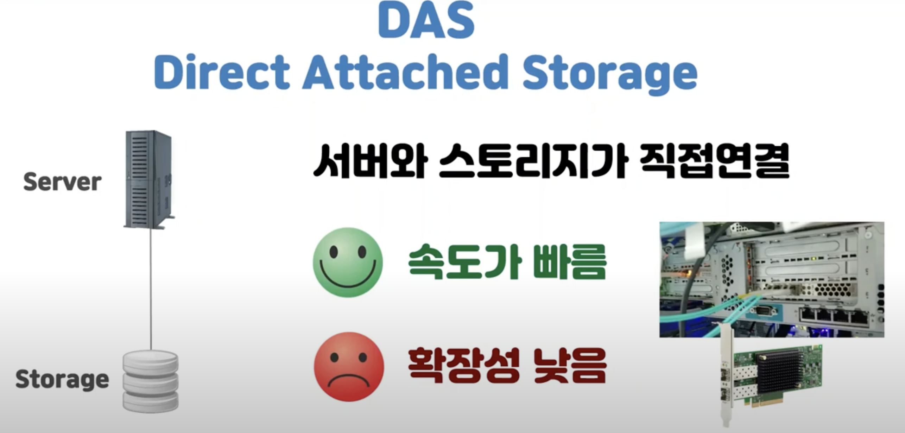
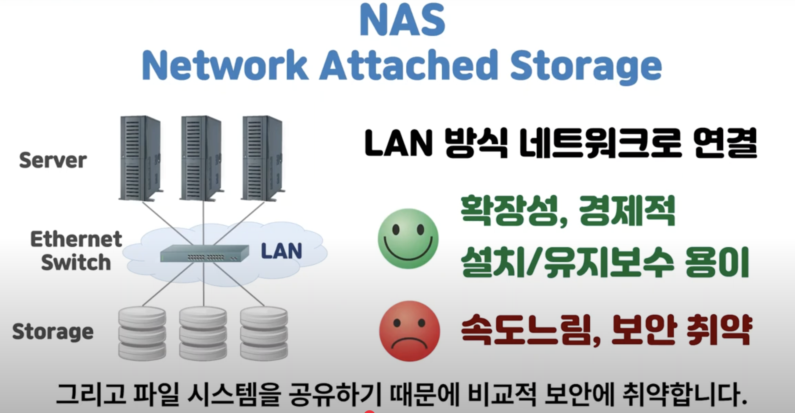
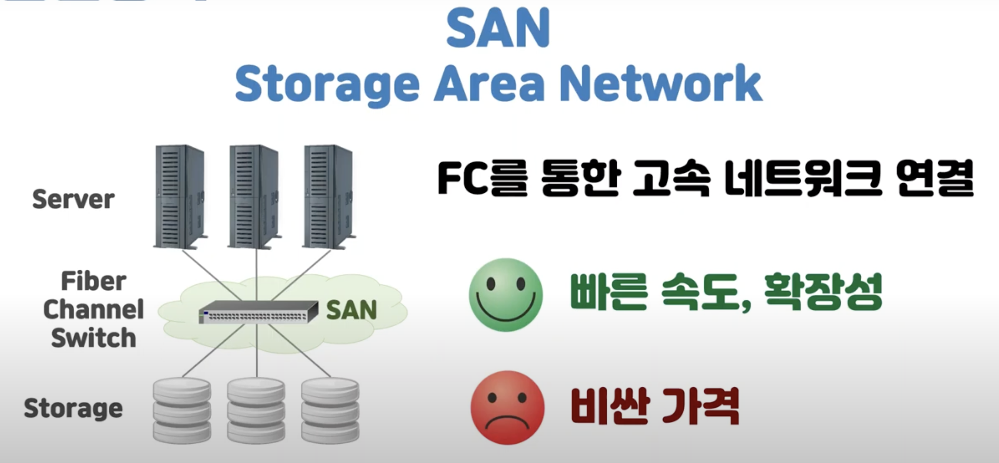
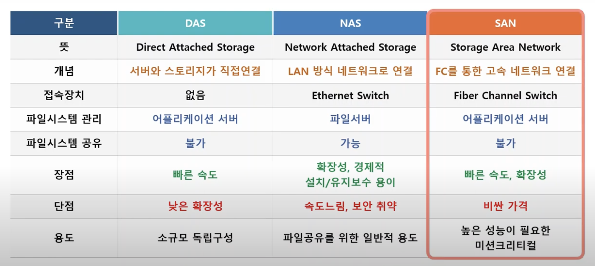
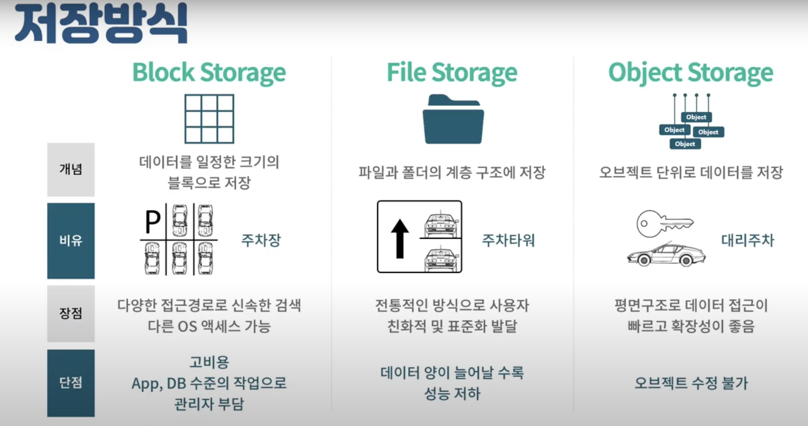

## 스토리지 연결방식

스토리지는 연결방식에 따라 DAS, NAS, SAN 으로 구분할 수 있다.

### DAS(Direct Attached Storage)

DAS 란 직접 연결 저장장치라는 뜻을 가지고 있다. 서버와 스토리지를 1:1로 직접 연결하며 사용하는 방식이다.

#### 장점

전용 케이블로 직접 연결해서 속도가 빠르다.

#### 단점

직접 연결하는 만큼 단점도 있다. 연결 포트가 제한되어 확장성에 한계가 있다. 또한 서버와 스토리지 직접 연결되다보니 각 서버가 파일시스템을 관리해야한다. 그러다보니 DAS 는 여러 서버가 스토리지를 공유해서 사용하는 경우에는 적합하지 않다.

### NAS(Network Attached Storage)

NAS 는 네트워크 결합 스토리지이다. 서버와 스토리지가 LAN 방식의 네트워크로 연결된 방식이다. (LAN : Local Area Network, 근거리 통신망)

NAS 는 서버와 스토리지 사이에 중계역할을 하는 파일 서버가 필요하고, 이 파일 서버가 파일 시스템을 관리한다.

#### 장점

DNS 와 반대로 포트수에 제한이 없어 스토리지 확장에 더 유연하다. 여러 서바가 공통 스토리지를 사용해야 할 때 적합하다. 경제적으로 유리하고 설치와 유지보수가 용이하다.

#### 단점

스위치를 통해 네트워크로 연결되다보니 DAS 보다 비교적 속도가 느리고, 접속이 많아지면 성능이 저하된다. 그리고 파일 시스템을 공유하기 때문에 비교적 보안에 취약하다.

### SAN(Storage Area Network)

SAN 은 저장 지역 통신망이라는 뜻이다. FC(Fiber Channel), 즉 광채널 스위치로 연결하는 고속데이터 네트워크 스토리지이다.

#### 장점

SAN 은 DNS 와 NAS 의 단점을 보완한 스토리지이다. DAS 처럼 광케이블을 사용하고, NAS 처럼 네트워크로 연결하는 방식으로 FC 스위치를 사용하여 빠른 속도로 연결되게 한다. 따라서 속도가 빠르고 확장성이 높다.

#### 단점

가격이 비싸다.

### DAS vs NAS vs SAN

소규모 독립 구성에는 DAS를 사용하고, 파일공유를 위한 일반적인 용도에는 NAS를, 높은 성능이 필요한 용도에는 SAN 을 선택하는 것이 좋다.

## 저장방식

### 블록 스토리지

데이터를 일정한 크기의 덩어리(블록)으로 나누어 저장하는 방식이다. 블록(Block)이란 파일보다는 작은 단위로써, 조각으로 나누어 저장한다고 이해하면 쉽다.

나누어진 각 블록들은 고유한 주소값을 가지고 있다. 해당 주소들을 통해 블록들을 하나의 덩어리로 재구성하여 데이터를 불러올 수 있다.

SAN 또는 가상머신의 디스크로 사용하며, 정형화된 데이터를 빠르게 처리하는 용도로 많이 사용환다. 또한 블록 스토리지는 주차장에 비유된다. 주차장의 한 구획이 블록으로 비유되며, 특정 공간에 차를 주차하듯이 정해진 블록에 데이터를 저장한다.

#### 장점

데이터의 고유 주소가 있기 떄문에 다양한 경로를 가지고 있다. 그만큼 다양한 접근 경로를 통해 데이터를 신속하게 검색할 수 있다. 또한 파티션으로 분할될 수 있어, 서로 다른 운영체제에서 엑세스할 수 있다. 자유롭고, 효율적이며, 안정적이기 때문에 대규모 DB 운영에 잘 맞는다.

#### 단점

비싸다. 메타데이터 처리가 제한적이기 때문에 데이터 단위가 아닌, 애플리케이션 또는 데이터베이스 수준에서 작업을 진행하며 관리자의 부담이 있다.

### 파일 스토리지

파일 스토리지는 파일과 폴더의 계층구조로 이루어진 방식이다. 윈도우 탐색기처럼 폴더 안에 하위 폴더를 만들고, 파일을 저장할 수 있다.

파일을 찾으려면 경로를 알아야 할 것이다. 파일들은 이름, 위치, 생성일, 수정일, 크기 등의 제한적인 메타데이터를 가지고 있다. 파일이 늘어나면 데이터도 늘어나고, 파일을 찾는것도 그만큼 힘들어지기 때문이다.

참고로 파일 스토리지는 NAS 에서 많이 사용된다. 그리고 파일 스토리지는 주차 타워에 비유된다. 주차 타워에 차가 많아지면 차를 1층부터 2층, 3층, ... 까지 차곡차곡 점점 쌓게되고, 차를 되찾으려면 시간도 그만큼 오래 걸릴것이다.

#### 장점

옛날부터 사용되온 전통적인 방식으로, 그 만큼 사용자가 사용하기 편하고, 표준화가 잘 되어있다.

#### 단점

데이터가 많아질수록 파일과 폴더를 찾기위해 리소스가 많이 들기 때문에 성능이 저하된다.

### 오브젝트 스토리지

오브젝트 스토리지란, 오브젝트라는 개별 데이터 단위로 데이터를 저장하는 유형의 스토리지이다. 오브젝트는 비디오, 오디오 뿐만 아니라 텍스트, 기타 다른 파일 유형 등의 모든 데이터를 포괄하는 유형이다.

#### 장점

파일 스토리지와는 다르게 게층구조 없이 평면(flat) 구조로 데이터를 저장한다. 그만큼 접근이 쉽고, 빠르고, 확장성이 좋다. 또한 오브젝트에도 메타데이터가 포함된다. 파일 스토리지의 제한적인 메타데이터와는 달리, 사용자는 본인이 원하는 상세한 정보를 추가할 수 있다. 그만큼 데이터 검색이 용이하다. 이처럼 오브젝트 스토리지는 폭증하는 대량의 데이터를 저장하고 관리하기 좋은 최신형 스토리지이다.

대리 주차에 비유되곤한다. 자동차 키만 대리 운전기사에게 건내면 어디에 주차하는지 알 필요없이 알아서 공간을 효율적으로 활용하여 빈틈없이 주차해준다. 찾을 때도 보관증만 건내면 쉽게 가져다준다.

#### 장점

데이터 구조가 파일 스토리지처럼 계층 구조가 아니고 평면(flat) 구조이라서 데이터 접근이 빠르고, 확장성이 좋다. 또한 메타데이터가 오브젝트 그 자체로 저장되므로 접근과 검색이 쉽다.

#### 단점

오브젝트 수정이 불가능하므로, 수정을 원하면 덮어씌워야 한다. 따라서 자주 변경되는 데이터는 잘 맞지 않고, 수정이 잘 일어나지 않는 이미지나 영상 데이터가 적합하다.

### 정리

- 블록 스토리지는 데이터를 블록으로 나누어 저장하는 스토리지로, SAN 으로 많이 사용환다.

- 파일 스토리지는 전통적인 방식으로, 파일과 폴더의 계층 구조로 저장하는 계층형 스토리지이며, 일반적으로 NAS 에 사용된다.

- 오브젝트 스토리지는 오브젝트(객쳬) 단위로 데이터를 저장하므로 확장성이 좋고, 비정형(잘 수정되지 않는) 데이터를 저장하기에 적합하다.
