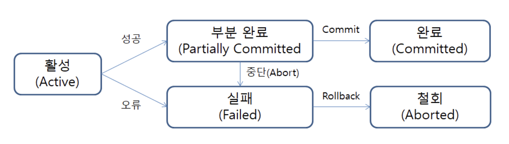

## 학습동기

최근 카카오테크 교육과정의 실습 미션을 진행하면서, 이전부터 사용해왔던 `@Transactional` 어노테이션을 다시금 사용하게 되었다. 사실 트랜잭션을 다시 깊게 학습하라면 트랜잭션 격리수준, 전파, 동기화 및 추상, HikariCP 등 학습할 내용이 무긍무진하지만, 점진적으로 천천히 학습을 이어가도록 한다. 이번 본 과정에 참여하면서 결심했던 마음가짐 중 하나이니깐 🙂

## 트랜잭션이란?

`트랜잭션(Transaction)` 이란 **데이터베이스의 하나의 논리적 기능을 수행하기 위해 여러개의 쿼리를 하나로 묶은 작업의 단위**를 뜻한다. 다시말해, 데이터베이스의 무결성이 보장되는 상태에서 요청된 작업을 완수하기 위한 작업의 기본 단위를 뜻한다.

트랜잭션은 `ACID` 라는 특징을 가진다. 이는 **원자성(Atomicity), 일관성(Consistency), 격리성(Isolation), 지속성(Durability)** 4가지 특성의 앞 글자를 따서 만들어진 용어이다. 이러한 ACID 각 특징에 대해 알아보자.

## ACID

### 원자성(Atomicity)

한 트랜잭션내에 담긴 모든 연산들은 데이터베이스에 모두 정상 반영되던지, 또는 전혀 반영되지 않는 것을 보장하는 특징이다. **즉, 트랜잭션을 구성하는 모든 연산 전체가 성공(commit) 또는 실패하는 것(rollback)을 보장하는 특징이다.** 만약 연산중에 단 하나라도 오류가 발생하면 트랜잭션 전부가 롤백되어야 한다.

### 일관성(Consistency)

트랜잭션이 실행을 성공적으로 완료(commit) 시 언제나 일관성있는 데이터베이스로 상태가 변환된다는 것을 뜻한다. **즉, 시스템에 가지고있는 고정 요소는 트랜잭션 수행전과 트랜잭션 수행 완료후에 상태가 일관적으로 같아야한다.**

### 격리성(Isolation)

둘 이상의 트랜잭션이 동시에 수행되는 경우, **실행중인 트랜잭션의 중간 결과에 또 다른 트랜잭션이 접근할 수 없다는 특징이다.** 

기본적인 개념은 위와 같으나, 각 DBMS 의 트랜잭션 `격리수준`에 따라 수행 결과 참조 가능 여부가 달리잔다. 트랜잭션 격리수준에는 **Read Uncommited, Read Commited, Repeatable Read, Serializable** 등이 존재하는데, Serializable 쪽으로 갈수록 트랜잭션 간의 고립성 정도가 높아지고 성능이 저하된다. 격리수준에 대한 내용은 추후에 자세히 다루도록 한다.

### 영구성(Durability)

성공적으로 완료(Commit)된 트랜잭션의 결과는 시스템이 고장나더라도 영구적으로 반영되어야 한다는 뜻이다.

## 트랜잭션 상태

트랜잭션의 연산과정 단계를 도식화하고 각 단계의 상태를 아래와 같이 정리할 수 있다. 각 상태에 대해서도 알아보자.

### 활성(Active)

트랜잭션이 정상적으로 실행중인 상태를 의미한다. 트랜잭션이 시작되면, 해당 트랜잭션의 상태는 활성(Active) 상태가 된다. 해당 상태는 설계자가 설계한 대로 연산들이 정상적으로 실행중인 상태를 뜻한다.

### 부분 완료(Partially Commited)

트랜잭션의 마지막까지 실행되었지만, 커밋 연산이 실행되기 직전이 상태다. 

설계된 트랜잭션대로 명령들을 성공적으로 수행하면, 그 다음 상태는 부분적 완료(Partially Commited) 상태가 된다. 즉, 설계된 작업대로 작업이 성공하였다고 하여 무조건 반영하는 것이 아니라, 설계자의 최종 승인이 있을 때 까지 실제 데이터베잇에 작업 내용을 반영하지 않고 대기하는 상태가 된다.

### 실패(Failed) 와 철회(Aborted)

트랜잭션이 비정상적으로 종료되었을 때 실패(Failed) 상태가 되며, 그로 인해 작업 내용을 롤백하는 상태를 철회(Aborted) 라고 한다.

## 더 학습해볼 키워드

- 트랜잭션 격리수준
- 트랜잭션 동기화 및 추상화

## 참고

- https://hudi.blog/transaction/
- https://inpa.tistory.com/entry/MYSQL-%F0%9F%93%9A-%ED%8A%B8%EB%9E%9C%EC%9E%AD%EC%85%98Transaction-%EC%9D%B4%EB%9E%80-%F0%9F%92%AF-%EC%A0%95%EB%A6%AC
- https://velog.io/@yu-jin-song/DB-트랜잭션Transaction