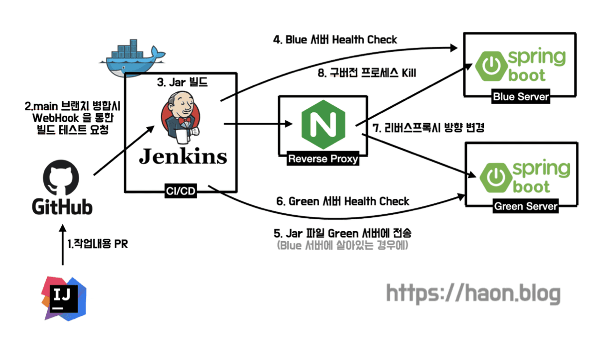

> 현재 포스팅은 하모니 팀 크루 [하온(haon)](https://github.com/msung99) 이 작성했습니다.

## 현재 무중단 배포 환경의 문제점

지난 [Jenkin와 Nginx를 활용한 Blue/Green 무중단 배포 도입기](https://kakaotech-harmony.netlify.app/backend/blue-green/) 에서도 다루었듯이, 무중단 배포 전략을 도입하여 다운타임을 최소화했다. 무중단 배포 프로세스를 다시 정리하자면 아래와 같다.



- `(1)` 깃허브 브랜치에 코드가 병합되면, 깃허브는 Jenkins 에 Webhook 요청을 보낸다.

- `(2)` Jenkins는 새로운 버전 코드를 pull 해오고 jar 파일을 빌드한다.

- `(3)` 빌드한 jar 파일을 배포 서버로 전송한다.

- `(4)` Blue 서버에 구버전 애플리케이션이 띄워져있는지 Health Check 하고, 그 결과에 따라 Blue 또는 Green 서버에 신버전 애플리케이션을 띄운다.

- `(5)` (Blue 서버에 구버전 프로세스가 띄워져있다는 가정하에) Green 서버에 신버전 애플리케이션이 잘 띄워졌는지 지속적으로 Health Check 한다.

- `(6)` Green 서버에 애플리케이션이 잘 떴다면, 리버스 프록시로 사용중인 Nginx의 프록시 방향을 Blue 에서 Green 스위칭한다.

- `(7)` 곧바로 Blue 에 띄워져있던 구버전 애플리케이션 프로세스를 즉시 kill 한다.

그런데 위 과정에서 문제가 하나있다. 7번 과정에서 즉시 애플리케이션을 kill 한다는 점이 문제가 된다는 점이다. 만약 7번 과정을 수행하는 도중에 구버전 애플리케이션에 요청이 들어와 처리중인 작업이 있다면, 해당 요청은 어떻게 처리가 될까? 만약 별다른 처리가 없다면, **해당 시점에 유입된 유저의 요청은 아직 정상적으로 처리 완료가 되지 않았음에도 애플리케이션이 강제 종료되어 문제가 될 것이다.** 이를 해결하기 위한 방법이 바로 Graceful Shutdown 이다.

## 강제로 구버전 프로세스를 kill 하던 스크립트

기존에 구성했던 무중단 배포 스크립트 일부를 보자면 아래와 같다. 구버전 프로세스를 강제로 Kill 하는 모습을 볼 수 이다. 문제는 `-k` 옵션은 `kill` 명령어를 축약한 것으로, 별다른 지정이 없다면 `-15` 옵션으로 실행된다. 이는 무엇이 문제가 될까?

```sql
if [ "${deployment_target_port}" == "${blue_port}" ]
then
    ssh root@${BACKEND_DEV_IP} "fuser -s -k ${GREEN_PORT}/tcp"
else
    ssh root@${BACKEND_DEV_IP} "fuser -s -k ${BLUE_PORT}/tcp"
fi

echo " ✅ 구버전 프로세스를 종료하고, 신버전 프로세스로 교체합니다."
```

### Unix 시그널(SIGNAL)

유닉스는 **시그널(SIGNAL)** 을 사용하여 프로세스에 **인터럽트(Interrput)**를 건다. 시그널의 종류는 매우 다양하지만, 그 중 눈여겨 봐야할 시그널은 바로 `9 - SIGKILL` 과 `15 - SIGTERM` 으로, 이 둘은 프로세스를 종료하기 위해 사용하는 시그널이다.

`9 - SIGKILL` 의 경우, 프로세스의 의사와 상관없이 프로세스를 강제로 종료해버린다. 프로세스는 이 시그널을 무시하거나 차단할 수 없다는 특징이 있어, 항상 강제로 즉시 종료된다. 또한 `SIGKILL` 시그널을 받은 프로세스는 자식 프로세스를 종료하라는 시그널을 보낼 수 없다. 따라서 `SIGKILL` 은 정상적으로 프로세스를 내릴 수 없을 때 강제로 즉시 중단하도록 사용하는 최후의 수단이다.

그에 반면, `15 - SIGTERM` 은 **프로세스를 정상적으로 종료시킨다.** 프로세스는 현재 사용중인 리소스를 해제하거나, 데이터를 저장하는 등 **현재 처리중인 모든 작업을 안전하게 처리한 뒤 종료된다.** `-k` 옵션의 경우, 디폴트로 `SIGTERM` 이 수행된다.

```sql
"fuser -s -k ${GREEN_PORT}/tcp"
```

### SIGTERM 의 문제점

앞서 살펴보았듯이, 우리 팀은 구버전 프로세스를 `-k` 을 통해 종료하며, 기본 시그널인 `SIGTERM` 를 이용해 종료한다. 그런데 이때 또한 문제가 존재한다. `SIGTERM` 시그널을 사용시 애플리케이션에 별다른 설정이 없다면, 애플리케이션을 어떻게 종료해야 할지 몰라서 강제 종료가 되버린다는 점이다. 즉, SIGKILL 과 같이 강제로 종료되버리므로 애플리케이션에 별다른 설정이 필요하다는 점인데, 이때 사용하는 것이 바로 `Graceful Shutdown` 이다.

## SpringBoot Graceful Shutdown

Graceful Shutdown 은 스프링부트 2.3.0 부터 제공하는 기능이다. Graceful Shutdown 을 활성화 하면, 스프링부트는 프로세스 종료 요청인 `SIGTERM` 이 들어왔을 때 **더 이상 새로운 요청을 받지 않으면서, 처리중인 요청은 모두 처리한 뒤 프로세스를 종료하게 된다.** (반면 `SIGKILL` 이 들어온다면 Graceful Shtudown 활성화는 무의미하다.)

### Graceful Shutdown 활성화

설정은 간단하다. 아래처럼 application.yml 에서 활성화시켜주면 끝이다.

```sql
server:
  shutdown: graceful
```

### 타임아웃 추가 설정

그런데 만약 현재 진행중인 요청이 데드락에 빠져서 영원히 작업을 끝내지 못한다면, 스프링부트 프로세스는 영원히 종료되지 않고 대기할 것이다. 이러한 미연의 상황을 방지하기 위해 우리는 아래와 같이 타임아웃을 추가 설정할 수 있다.

```sql
spring:
  lifecycle:
    timeout-per-shutdown-phase: 5s
```

## 참고

- https://docs.spring.io/spring-boot/docs/current/reference/html/web.html#web.graceful-shutdown
- https://velog.io/@dongvelop/Springboot-Graceful-Shutdown
- https://effectivesquid.tistory.com/entry/JVM의-종료와-Graceful-Shutdown
