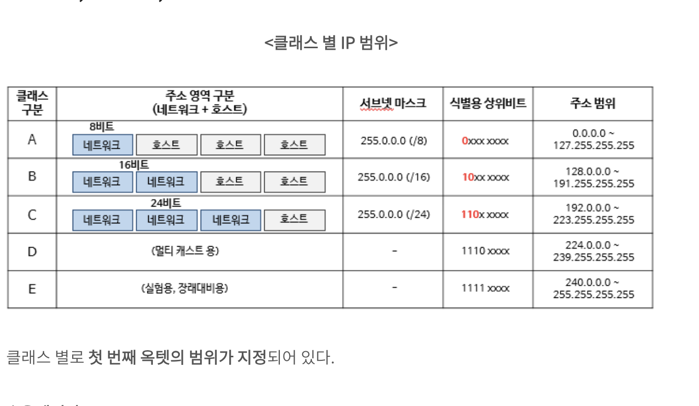
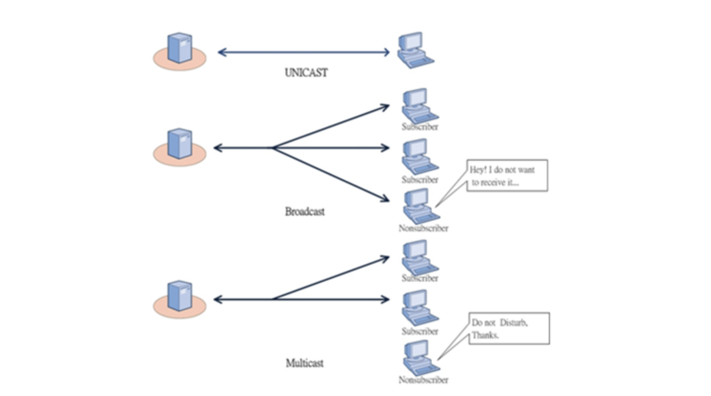
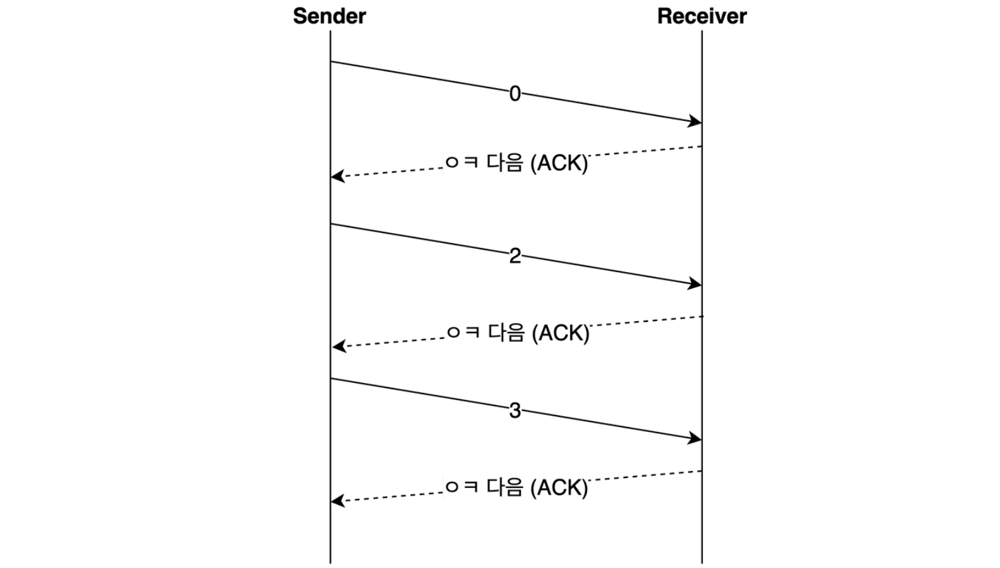
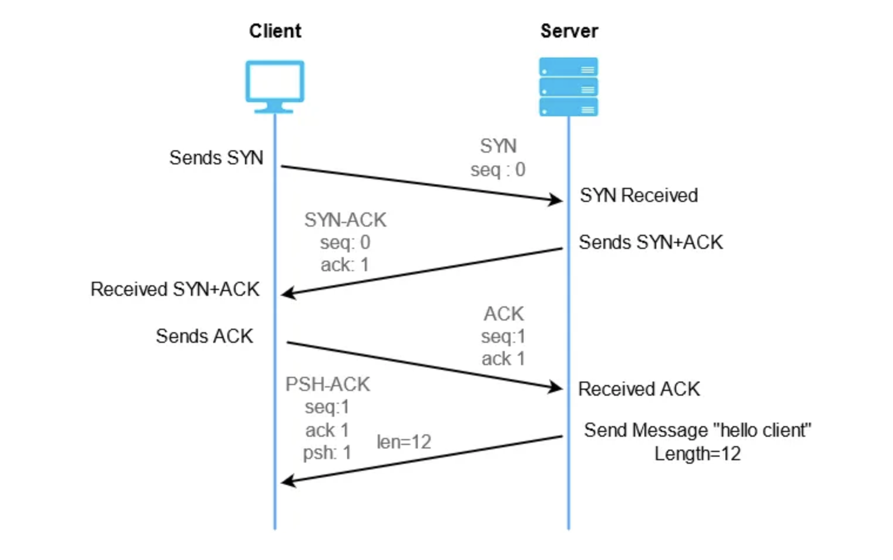
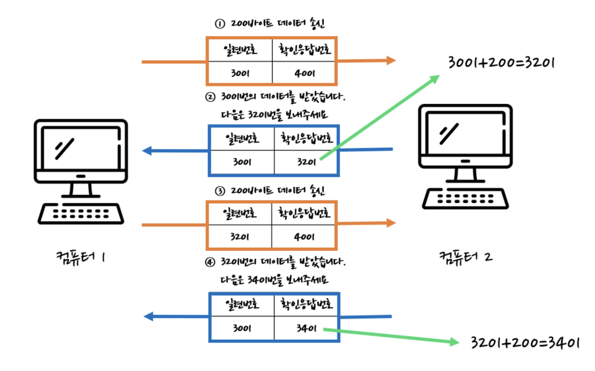

> OSI 에 대한 전반적인 개요는 [OSI 7계층, TCP/IP 프로토콜의 기본 규약 정리](https://haon.blog/haon/network/intro/) 를 참고하자.

## 네트워크 계층(Network Layer)

### 라우터

가령 학교A 에서 학교B 로 이메일을 보내야하는 상황을 가정해보자. 이 상황에선 이전에 다루었던 2계층 장비인 스위치로는 전송이 불가능하다. 스위치로 전송할 경우, 연결되어 있는 컴퓨터들중에 어떤 컴퓨터로 보내야할지 MAC 주소를 물어야한다. 하지만 어떤 MAC 주소로 보내야할지 알아내는 것은 같은 스위치로 연결된 경우에만 가능하다. 정리하자면, 스위치는 연결되어 있는 컴퓨터들중에 특정 컴퓨터에게만 MAC 주소를 알아내고 데이터를 전송할 수 있다는 특징이 있었기 떄문에, 이와 같이 연결되지 않은 네트워크 상의 지역끼리는 통신이 불가능하다.

그래서 필요한 것이 3계층 장비인 `라우터`이다. **2계층 장비인 스위치가 LAN 단위의 근거리 통신을 담당할 수 있다면, 3계층 장비인 라우터는 WAN 단위의 광범위 네트워크 통신을 담당한다.** 라우터는 데이터가 어떤 경로로 전달되어야 하는지를 알려주는 내비게이션과 같은 역할을 한다. 어떤 길이 가장 빠른지 결정하는 것이다. 그리고 어떤 길이 가장 빠른 길인지 찾는 과정을 `라우팅(Routing)` 이라고 한다. 또한 라우터는 스위치와는 다르게 IP 주소를 이용해서 통신을 한다.

OSI 7계층의 네트워크 계층에서 추가되는 헤더 정보는 IP 주소이다. 네트워크 계층에서 헤더가 추가될때 다양한 정보가 추가되지만, 우리가 가장 주목해서 봐야할 부분은 **송신자와 수신자의 IP 주소**이다.

---

### IP 주소

LAN 환경에서는 스위치를 이용하여 MAC 주소로 통신한다. 하지만 여기에는 치명적인 단점이 있다. 인터넷이 바로 접속할 수 없고, 우리 회사(근거리 통신망) 이외의 컴퓨터와 통신이 불가능하다. 그래서 필요한 것이 바로 IP 주소이다. `IP(Internet Procotol)` 이란 인터넷상에 있는 컴퓨터의 고유한 주소이다.

#### 공인, 사설 IP

공인 IP 는 인터넷 서비스 제공자(SKT, KT, ...) 에 의해 전 세계적으로 고유하게 할당되는 IP 주소이다. 이 공인 IP 주소는 주기적으로 변경된다는 특징을 지닌다.

반면 사설 IP 는 주로 기업 내부에서만 사용되는 IP 주소로, 기업밖에 위치한 컴퓨터와는 통신이 불가능하다.

#### IP 주소 체계

IP 주소의 길이는 4바이트, 즉 32 비트로 구성된다. 마지막 1바이트의 가장 작은 수인 0과 작은 큰 수인 255는 용도가 정해져있기 떄문에 컴퓨터의 IP 주소로 사용하지 않는다. 아래와 같이 **마지막 1바이트가 0인 주소를 네트워크 주소**라고 한다. `네트워크 주소` 는 네트워크를 통칭하기위해 사용되는 주소이다. 또한 **마지막 1바이트가 255인 경우를 브로드케스트 주소**라고 한다. `브로드케스트 주소`는 네트워크에 연결된 컴퓨터에 데이터를 한 번에 일괄적으로 전송할 때 사용하는 주소다.

```java
192.168.2.0 // => 마지막 1바이트인 "0" 이 네트워크 주소임.
192.168.2.255 // => 마지막 1바이트인 "255" 이 브로드케스트 주소임.
```

#### IP 주소의 구조

IP 주소에는 많은 정보가 포함되어 있다. IP 주소는 `네트워크 ID` 와 `호스트 ID` 로 구분할 수 있다. `호스트 ID` 는 라우터에 연결된 개별 컴퓨터들을 관리하기 위해 사용된다. 즉, 호스트 ID 는 개별 컴퓨터들이 사용하는 것이고, `네트워크 ID` 는 컴퓨터가 많을 경우 관리의 어려움이 있기 떄문에 네트워크의 범위를 지정해(컴퓨터들의 집합) 관리를 쉽게 하기위해 사용한다.

예를들어 네트워크 A에 포함된 컴퓨터 A, B, C 의 IP 주소가 다음과 같다고 해보자. 이때 컴퓨터 A의 네트워크 ID 와 호스트 ID 는 다음과 같다.

```java
// NetWork A
컴퓨터 A: 192.168.1.2  // 네트워크 ID: 192.168.1 / 호스트 ID: 2
컴퓨터 B: 192.168.1.3  // 네트워크 ID: 192.168.1 / 호스트 ID: 3
컴퓨터 C: 192.168.1.4  // 네트워크 ID: 192.168.1 / 호스트 ID: 4
```

---

### IP 주소의 클래스



공인 IP 주소에는 A~E 까지의 5개의 클래스가 있다. 또한 **클래스 A 에서 E 로 내려갈수록 호스트 ID 의 개수가 줄어든다.** 클래스의 A의 경우 IP 주소의 4바이트 중에서 첫 바이트가 네트워크 ID 를 의미하고, 나머지 3개의 바이트는 호스트 ID 를 뜻한다. 즉, 클래스 A에선 하나의 네트워크가 가질 수 있는 호스트 ID 가 가장 많은 클래스로써, 컴퓨터들에게 할당할 IP 가 가장 많다는 것이된다.

반면 B 클래스의 경우 A 클래스에서 네트워크 ID 가 하나 줄어든 형태이다. 앞의 2개의 바이트가 네트워크 ID 를 나타낸다. 이와 같은 동일한 원리로 C 클래스는 B 클래스에서 네트워크 ID 가 하나씩 줄어든다.

또한 각 클래스의 맨 앞 비트들은 각각 A, B, C 순으로 "0, "10", "110", ... 의 순으로 고정되어 있다.

---

### 브로트캐스트, 유니캐스트, 멀티캐스트

네트워크에서 데이터를 주고받는 방식에는 브로드캐스트, 유니캐스트, 멀티캐스트가 있다. 이들에 대해서도 정리해보자.



#### 브로드캐스트 (BroadCast)

브로드캐스트는 같은 네트워크에 속한 모든 컴퓨터에게 데이터를 전달하는 방식이다. 허브와 비슷한 방식이다. 그런데 수신자 입장에선 내가 원하지 않더라도 일방적으로 배느는 정보를 받아야한다. 따라서 데이터를 수신하는 컴퓨터는 그 정보가 필요한지 판단해야하는 번거로움이 있다.

##### 유니캐스트 (Unicast)

반면 유니캐스트는 `1:1 통신` 이다. 같은 네트워크에 여러대의 컴퓨터가 있을 때 특정한 1대의 컴퓨터에만 데이터를 보내고자 할때 사용한다. 이때 유니케스트로 통신하기 위해선 당연하게도 상대방의 MAC 주소를 알아야만 통신이 가능하다.

#### 멀티케스트 (MultiCast)

멀티케스트는 브로드캐스트와 유니캐스트를 섞어놓은 방식이다. 같은 네트워크에서 데이터를 보내고 싶은 컴퓨터가 1대라면 상대방의 MAC 주소를 확인하는 것은 어렵지않다. 하지만 그 대상이 2대 이상이라면 꽤 번거롭다. 이떄 사용하는 것이 멀티캐스트다. 멀티캐스트란 특정 그룹을 지정해서 그 그룹에 해당하는 컴퓨터에게만 데이텅를 보내는 방식이다.

---

### 서브넷, 서브넷 마스크

`서브넷`이란 하나의 네트워크 주소를 작은 단위로 쪼개서 사용하는 것이다. 또한 서브넷과 서브넷 마스크는 앞서 살펴봤던 `네트워크 ID` 와 `호스트 ID` 를 이용한다.

그런데 A 클래스, B 클래스, C 클래스를 각각 하나의 네트워크로 사용하는 것은 비효율적인 방법이다. 하나의 네트워크에 속한 모든 컴퓨터는 브로드캐스트 주소로 오는 데이터를 모두 수신해야하고, 그것이 내가 필요한 정보인지 필터링해야한다. 그래서 하나의 네트워크를 좀 더 효율적인 방법으로 사용해보고자 등장한 개념이 바로 `서브넷`이다. **서브넷은 하나의 네트워크가 분할된 작은 네트워크다. 이때 작은 네트워크로 나누는 작업을** `서브넷팅(Subneting)` **이라고 한다.**

#### 서브넷팅의 원리

서브넷팅의 원리는 간단한다. IP 주소에는 네트워크 ID 과 호스트 ID 가 있을텐데, 네트워크 ID 는 그대로두고 호스트 ID 를 쪼개는 방식이다. 이때 호스트 ID 를 쪼개는 개수가 적을수록 사용 가능한 호스트(컴퓨터) 주소가 많아진다.

서브넷팅을 네트워크 맥락에서 표현하면 다음과 같다.

> 호스트 ID 를 서브넷 ID 와 호스트 ID 로 나누는 작업

즉, 호스트 ID 를 서브넷 ID 와 호스트 ID 로 분리하는 작업이 서브넷팅이다.

#### 서브넷 마스크

IP 주소를 서브넷팅하면 네트워크 ID 와 호스트 ID 의 경계를 판별하기가 어려울 때가 많은데, 이때 서브넷 마스크를 사용한다. 즉, `서브넷 마스크`**란 IP 주소에서 네트워크 ID 와 호스트 ID 를 구분하기 위한 구분자이다.**

다음 2가지 표현을 보자. 아래에서 "/24" 와 "255.255.255.0" 은 표현만 다를 뿐 모두 같은 의미의 서브넷 마스크에 대한 표현이다.

```java
192.168.1.1/24
255.255.255.0
```

그럼 위와 같은 "/24" 혹은 "255.255.255.0" 은 어떻게 얻을 수 있을까? 서브넷 마스크는 1과 0의 조합으로 구성되긴 하지만 아래처럼 1이 연속적으로 나온 이후 0이 연속적으로 나오는 형태를 취한다. 또한, 서브넷 마스크를 구하기 위해서는 네트워크 ID 는 모두 1로 채우고 호스트 ID 는 0으로 채운다.

예를들어 아래 그림과 같이 C 클래스의 경우 24비트가 네트워크 ID 이다. 따라서 24비트 1의 값을, 나머지 8비트에 해당하는 호스트 ID는 0으로 채워주면 다음과 같이 255.255.255.0 의 값이 나온다. 그리고 "/24" 가 의미하는 것은 네트워크 ID 의 비트 수이다. 24비트가 모두 1의 값을 가지기 떄문에 "/24" 라고 표현하는 것이다.

```java
// C 클래스의 서브넷 마스크
2진수: 11111111 11111111 11111111 00000000   // => 네트워크 ID 비트 수가 24개이다.
10진수: 255     255      255      0
```

---

### 라우터의 동작 방식

앞서 간단히 살펴봤듯이, 라우터는 이름 그대로 **데이터의 전송을 위해 가장 빠른 길을 찾아 네트워크 간의 경로(route) 를 설정하는 장비**이다.

2계층의 장비인 스위치는 같은 네트워크 (LAN 범위) 내에서만 통신이 가능한 장비라고 했다. 즉, 서로 다른 네트워크 간의 통신은 불가능했다. 그래서 **서로 다른 네트워크 간의 통신을 위해서는 라우터를 사용해야 한다.** 예를들어 "172.16.1.0/24" 네트워크와 "172.16.2.0/24" 네트워크는 서로 다른 네트워크이다. 이 둘 간에 통신이 가능하려면 라우터가 필요하다.

##### 라우팅

그런데 서로 다른 네트워크 간에는 1개 이상의 라우터가 존재할 수 있다. 이러한 경우, 어떤 경로로 이동해야 빠른 통신이 가능한지 확인해야한다. 즉, **네트워크와 네트워크 간의 데이터 이동시 가장 빠른 경로(route) 를 설정해야 하는데, 이를 라우팅**이라고 한다. 다시 말해서, 라우팅은 한 네트워크에서 다른 네트워크로 데이터를 전달하는 과정이다.

#### 라우팅 테이블

그런데 라우팅시 경로는 어떻게 설정할까? 스위치에서 MAC 테이블을 이용했던 것과 같이 라우터에서는 라우팅 테이블이라는 것을 이용한다. **라우팅 테이블은 데이터를 목적지까지 보내기 위한 거리과 방법등을 명시한 테이블**이다.

라우팅 테이블에는 데이터를 목적지로 전달하기 위해 어떤 방향(인터페이스라고도 부름)으로 가야 하는지에 대한 정보를 가지고 있다. 따라서 라우터가 데이터를 목적지로 보내려고 하면 라우팅 테이블을 찾아보게 된다.

예를들어 컴퓨터 A가 컴퓨터 B에게 데이텅를 보내려는 간단한 상황을 가정해보자. 먼저 라우터 A는 컴퓨터 B의 네트워크 주소를 확인한다. 그러고 컴퓨터 B로 가는길이 정의되어있는지 라우팅 테이블을 검색한다. 그랬더니 라우팅 테이블에 컴퓨터 B 네트워크로 가려면 E1 경로로 가라는 내용이 있다면, 이제 라우터 A는 라우터 B에게 컴퓨터 B의 IP 주소가 무엇인지 물어보기만 하면된다.

---

## 전송 계층 (Transport Layer)

전송 계층은 기본적으로 `(1)` **오류를 점검하는 기능(즉 데이터를 목적지에 문제없이 전달하는 기능)** 과 `(2)` **컴퓨터가 제대로 데이터를 받았을 경우 어떤 애플리케이션으로 전달해야 하는지를 식별하는 기능**을 담당한다. 이전에 2계층에서 살펴봤던 오류 점검 방식이 현재 전송 계층에도 존재한다.

### 혼잡 제어

혼잡 제어(Congestion Control) 은 **네트워크로 들어가는 정보량을 조절하여 네트워크가 혼잡해지지 않게 조절하는 방법**이다. 이를위해 **송신자는 먼저 하나의 데이터만 보내고 수신자 측에서 ACK 가 오면 전송량을 2배씩 증가시켜 나간다.**

그러다가 타임아웃이 발생하면 여러개 보냈던 데이터를 줄여서 보낸다. 또는 동일한 ACK 을 여러번 받는 경우에도 데이터를 줄여서 보내는 방식을 취한다. (타임아웃이나 ACK 을 여러번 받았다는 것은 네트워크가 데이터를 실어 나르느라 바쁘다는 뜻이니) 이후 정상적인 ACK 을 받게되면 또 다시 데이터를 배수로 전송함으로써 데이터 전송량을 조절한다.

### 흐름 제어



흐름 제어는 데이터 링크 계층에서 사용했던 `정지-대기(Stop & Wait)` 방식과 완전히 동일하다. 정지-대기 방식은 송신자가 하나의 데이터를 전송한 후 다음 데이터를 전달하기 전에 확인 응답을 기다리는 방법이다. 예를들어 수신자 측에서 ACK 이라는 메시지가 송신자 측에 전달되어야만 다음 데이터를 보내는 방식이다.

### 오류 제어

오류 제어도 마찬가지로 데이터 링크 계층의 오류 제어 방식과 동일하다. 하지만 방법은 조금 다르다. 오류를 검출하기 위해서는 `확인 응답`과 `시간 초과 방법` 을 사용한다.

> - (1) 확인 응답: 수신자 측으로부터 ACK 이라는 응답을 받아야하지만 ACK 이 없다면 오류로 판단한다.
> - (2) 시간 초과 방법: 특정 시간 내에 ACK 이 없으면 세그먼트에 오류가 있다고 판단한다.

---

### 3-way handshake

전송 계층은 데이터를 목적지에 문제없이 전달하는 것을 목표로 한다. 이떄 데이터를 전달하는 목적에 따라 연결형과 비연결형 통신으로 나뉜다.

> - 연결형 통신: 데이터를 정확하게 전달하는 것을 목표로 하는 통신. TCP 프로토콜을 사용한다.
> - 비연결형 통신: 효율적으로 데이터를 보내는 통신. UDP 프로토콜을 사용한다.

TCP 프로토콜은 3-way handshake 방법을 통신을 시작한다. TCP 프로토콜이 데이터를 전달하는 것을 목표로하기 때문에 상대방이 내 신호를 받을 수 있는 상태인지 확인하고 전송하는 방식이다. 즉, 3-way handshake 는 TCP 통신을 하는 장치(컴퓨터)간에 서로 통신할 준비가 되었는지를 확인하는 과정이다.

3-way handshake 의 과정은 다음과 같은 수행된다.



- `(1)` 송신자는 연결 요청을 위해 임의의 SYN 번호를 수신자에게 보낸다.
- `(2)` 수신자는 요청을 잘 받았다는 의미로 송신자에게 받은 SYN 번호에 1을 더해 ACK 을 보낸다. 또한, 수신자도 연결을 요청하는 의미로 SYN 에 임의의 번호를 보낸다.
- `(3)` 송신자는 연결이 수립되었다는 의미로 수신자로부터 받은 SYN 에 1을 더해서 수신자에게 ACK 을 보낸다. 그럼 이제 통신을 위한 연결이 수립된 것이다.

위와 같은 3 way handshake 를 이용하면 송신자와 수신자 양츩 모두 데이터를 전송할 준비가 되었다는 것을 보장한다.

---

### TCP 의 구조

전송 계층에선 헤더 정보에서 포트 번호를 포함한 다양한 정보들이 포함된다. 각 정보들을 상세하게 살펴보자.

#### 1. 포트 번호

가장 중요한 포트번호이다. 전송 계층은 어떤 애플리케이션과 통신하는지 정의하는 곳이라고 했다. 그 기능을 하는것이 포트 번호이다.
포트 번호의 각 카테고리는 다음과 같다.

> - 0 ~ 1023번: `잘 알려진 포트(well-known port)` 로, 말 그대로 특정한 쓰임을 위해 사용된다.
> - 1024 ~ 49151번: 기관이나 기업들이 사용하는 포트로, `사전 등록된 포트(registered port)` 라고도 한다.
> - 49152 ~ 65535번: 일반 사용자들이 자유롭게 사용할 수 있는 포트로, `다이나믹 포트(dynamic port)` 라고도 한다.

#### 2. 일련번호와 확인 응답 번호



포트번호 외에도 일련번호, 확인 응답 번호가 헤더에 추가된다. `일련번호` 는 **송신자가 수신자에게 보내려는 데이터가 몇 번째인지** 알려주는 것이고, 반대로 `확인 응답 번호` 는 **수신자가 몇 번째 데이터를 받았는지 송신자에게 알려주는 역할**을 한다. 이 둘을 이용해서 수신한 데이터가 순서는 맞는지, 오류는 없는지 검사할 수 있다.

예를들어 다음과 같은 송신자가 수신자에게 데이터르 보내는 상황을 가정해보자.

- 보내야 할 총 데이터 크기 : 1500바이트
- 패킷의 크기: 500바이트

이떄 패킷의 크기란 한번에 보낼 수 있는 데이터의 최대 크기이다. 즉, 한번에 보낼 수 있는 최대 크기가 500 바이트라는 것이다. 따라서 1500바이트의 데이터를 보내기 위해서는 총 3번에 걸쳐 보내야한다. (500바이트씩 3번이면 1500바이트가 되므로) 따라서 일련번호는 이렇다. 처음의 일련번호가 1이라고 가정할 떄 다음의 일련번호는 501, 또 다음은 1001 이다.

`확인 응답 번호`는 수신자가 몇번쨰 데이터를 받았는지 송신자에게 알려주는 역할을 한다.

#### 3. 윈도우 크기

설명에 앞서, 상황을 하나 가정해보자. 수신자가 받을 수 있는 데이터의 양은 적은데, 송신자가 그것을 공려하지 않고 많은 양의 데이터를 보낸다면 어떤 일이 발생할까? 송신자는 모든 데이터를 보냈다고 생각하곘지만, 수신자는 송신자가 보낸 데이터를 받아들이지 못하고 일부는 거절당한다. 그러면 정상적인 통신이 불가능해질 것이다. 그래서 등장한 것이 윈도우 크기다.

**윈도우 크기(Window Size) 란 송신자가 한 번에 보낼 수 있는 데이터의 최대 크기이다.** 즉, 수신자가 얼마나 데이터를 받아들일 수 있는지 확인한 후, 그 크기를 고려해서 데이터를 보내겠다는 의도인 것이다.

수신자의 윈도우 크기는 3-way handshake 과정에서 알아낼 수 있나. 헨드쉐이크 과정에서 SYN, ACK 외에도 Window Size 라는 정보를 주고받게 도니다. 이렇게 확인된 윈도우 크기를 이용하면 더 효윯적인 데이터 전송이 가능하다. 매번 데이터를 보내고 ACK 을 기다리는 것이 아니라, 수산자가 받을 수 있을만큼 데이터를 한 번에 보내면 된다.

#### 4. 코드 비트

코드 비트는 헨드쉐이크 과정에서 세부 상태를 표현하낟. 모두 기본값은 0이며, 비트가 활성화되면 1이 된다.

- TURG: 긴급 처리 데이터가 있음
- ACK: 확인 응답 번호 사용
- SYN: 연결을 초기화하기 위해 순서 번호를 동기화
- FIN: 데이터 송신 종료
- ... (이하 생략)

---

### UDP 프로토콜

UDP 는 TCP 와 달리 신뢰성이 보장되지 않으며, 데이터 전송 속도가 빠른 프로토콜이다. 데이터를 수신자 측에서 오류없이 받던간에 상관없이 데이터를 보내기만 하면 되며, 브로트캐스트시 사용되는 프로토콜이 UDP 이다.

UDP 프로토콜에서 사용되는 헤더는 TCP 와 비교했을 때 상당이 축약된 정보만 포함하고 있다. 신뢰성을 보장하지 않기 때문이다. UDP 헤더내에 `송.수신자의 포트번호` 와 `헤더 길이`, `검사 합(CheckSum)` 정도의 정보만 포함한다.

---

## 응용 계층

> 응용 계층은 평소 서버 개발시 자주 사용하기에, 이미 잘 알고이는 지식들이 대부분이다. 따라서 다른 계층에 비해 설명은 많이 생략하도록 한다.

### HTTP 프로토콜

HTTP(HyperText Transfer Protocol) 은 클라이언트와 서버가 어떻게 데이터를 교환할지 정해놓은 규칙으로, 80번 포트를 사용한다.

#### HTTP 버전

현재 HTTP 버전은 1.0, 1.1, 2.0 순서로 진화했다. HTTP 프로토콜에는 자체적으로 정의한 헤더가 있어서 HTTP 버전 정보, 상태 정보등 여러 정보를 서버로 보낼 수 있게 되었다. 하지만 매 요청마다 연결을 수립하는 과정을 반복하다 보니, 이것을 처리하는 서버의 성능이 저하되는 문제점이 있었다.

그래서 등장한 것이 HTTP 1.1 이며 현재 가장 많이 사용하는 버전이다. HTTP 1.1 부터는 `keep-alive` 기능이 추가되어 연결이 1번 수립되면 데이터 교환을 마칠 때까지 연결을 유지하고, 데이터 교환이 끝나면 연결을 끊는 구조이다. 한편 HTTP 2.0 부터는 응용 계층이 `바이너리 프레임(Binary Frame)` 을 추가하여 기존의 일반 텍스트 데이터를 바이너리로 변환한 후 데이터를 분할하여 보낸다. 이렇게 하면 전송 속도가 빨라지고 오류 발생 가능성도 낮아진다.

### DNS 서버

IP 주소를 도메인 주소로 변경해주는 것이 DNS 서버이다. 사용자가 가령 Google 웹 브라우저에서 랜더링을 요청하며, 해당 요청은 DNS 서버로 전송된다. 만약 이떄 DNS 서버가 google 의 IP 주소를 모른다면 또 다른 DNS 서버에 질의해서 IP 주소를 전달받는다.

#### DHCP 서버

DHCP 서버는 IP 주소를 자동으로 관리하기 위해 등장했다. DHCP(Dynamic Host Configuration Protocol) 서버는 사용자들에게 IP 주소를 할당하거나 회수하는 것을 자동으로 해주는 서버다.
