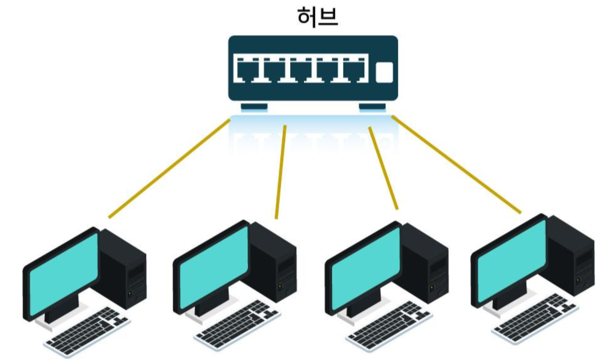
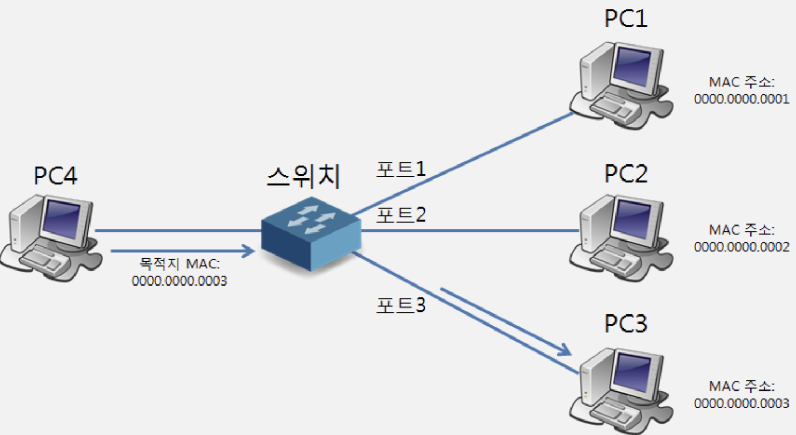

> OSI 에 대한 전반적인 개요는 [OSI 7계층, TCP/IP 프로토콜의 기본 규약 정리](https://haon.blog/haon/network/intro/) 를 참고하자.

---

## 물리 계층(Physical Layer)

OSI 7계층에서 최하위에 위치한 물리 계층은 **컴퓨터들을 물리적으로 연결하거나 데이터를** `전기 신호` \*_로 변환하고 제어하는 역할을 한다._ 이때 전기 신호에는 아날로그, 디지털 신호 2가지 종류가 존재한다.

송신자가 수신자에게 데이터(문장)를 전송하는 과정은 먼저 `(1)` 문장을 0과 1로 구성된 비트로 변환하고 `(2)` 해당 비트를 전기 신호(디지털 신호)로 변환한 후 `(3)` 수신자에게 해당 디지털 신호를 전달한다. 이후 `(4)` 수신자 측에서는 전기 신호(디지털 신호)를 다시 0과 1로 구성된 비트로 변환한다.

### 랜 카드(LAN Card)

이때 직전에 설명한 과정속에서 `(1)` 에서 `(2)` 로 넘어갈 때, 즉 전기 신호를 변환하는 것은 랜 카드가 해주는 것이다. 즉, 랜 카드란 전기 신호를 변환하는 역할로써, 데이터가 내 컴퓨터 밖을 나가는 출발점이라고 할 수 있다.

정리하자면, **랜 카드란 0과 1의 비트를 전기 실호로 변환하여 밖으로 내보내는 출발점 역할을 한다.**

### 케이블

한편 케이블은 랜 카드가 내보내는 전기 신호를 다른 곳으로 전달하는 역할을 수행한다. **즉, 케이블이란 컴퓨터, 서버, 라우터 및 다른 네트워크 장치간에 데이터 신호를 전달하는 역할을 한다.**

케이블은 구리선과 광섬유로 구성되며, `동축 케이블` 이 가장 많이 사용되는 케이블 종류다. 동축 케이블은 중앙의 구리선에 흐르는 전기 신호로 데이터를 주고받는다. 한편 컴퓨터에서 사용되는 `꼬임선 방식` 으로도 케이블을 구성할 수 있는데, 이는 말 그대로 몇 개의 전선들을 꼬아서 만든 케이블이다. 이 꼬임선 방식을 이용하는 케이블의 종류로는 `UTP`, `FTP`, `STP` 가 존재한다.

꼬임선 방식에 대해 더 자세히 설명하는 것은 현재 나에겐 불필요한 지식이라고 판단되어 설명을 생략한다.

### 리피터 vs 허브

#### 리피터 (하위호환)

물리 계층에서 사용하는 장비로는 `리피터` 와 `허브` 가 있다. `리피터(Reapter)` 란 **전기 신호를 "증폭"** 하는 기능을 가진 장치이다. 전기 신호를 전송할 때 거리가 멀어지면 신호가 감쇠되는 성질이 있느데, 이때 감쇠도니 신호를 다시 재생하여(증폭시켜서) 전다랗는 장치가 리피터다. 하지만 요즘 시대에선 리피터를 거의 사용하지 않는데, 이 기능을 허브라는 장치에서 대신해주기 때문이다.

#### 허브 (상위호환)

허브는 리피터의 확장 버전이라고 보면된다. 즉, 허브는 전송되는 `(1)` **데이터 신호를 정형하고 증폭**하여 데이터 왜곡을 보정하며, 하나의 입력 신호를 여러 디바이스로 복제하여, `(2)` **데이터에 대한 분배 및 네트워크 확장을 지원한다.**

리피터가 1:1 통신만 가능하다면, 허브는 포트를 여러개 가지고 있기 때문에 여러대의 컴퓨터와 연결할 수 있다. 그래서 요즘 시대에는 리피터가 아닌 허브를 사용하고 있다.

#### cf) 더미 허브

허브는 다음과 같은 특징이 있다.

> - 각 컴퓨터가 허브로 데이터를 보낼 수 있다.
> - 그러면 허브에 연결된 모든 컴퓨터가 데이터틀 받는다. 이와같잉 허브는 특정 컴퓨터를 지정하여 데이터를 보낼 수 없다고 하여 `더미 허브(Dummy Hub)` 라고도 부른다.

### 1계층(물리 계층) 설명 요약

지금까지 설명한 것을 요약하면, 1계층에서는 랜 카드를 이용해서 데이터를 전기 신호(디지털 신호)로 변환한 후 케이블을 통해 데이터를 전송한다. 또한 1계층에 사용하는 장비로는 리피터와 허브가 있으며, 요즘 리피터는 잘 사용하지 않는다.

---

## 데이터 링크 계층(Data Link Layer)

데이터 링크 계층은 `(1)` **데이터를 작은 프레임 단위로 분할하고, MAC 주소를 활용하여 장비를 식별**한다.

또한 `(2)` 오류를 탐지하고 수정하는 역할을 하며, 데이터를 원활한 흐름과 네트워크 매체에서 충돌 관리도 수행한다. 네트워크에서 여러 기기가 동시에 데이터를 전송하려고 하면 신호 충돌이 발생할 것이다. 이 상황에서 데이터를 동시에 전송하면 여러 데이터가 충돌하게 되어 제대로 전달되지 않는데, 그래서 이러한 오류 탐지 및 수정 역할을 수행하는 것이다.

오류를 감지하거나 수정하는 방법에는 크게 3가지가 있는데, `회선 제어`, `오류 제어`, `흐름 제어` 에 대해 알아보자.

---

### 회선 제어

회선 제어는 **오류를 감지하기 보다는 `회피` 하는 방법으로, 신호 간 충돌 현상이 발생하지 않도록 제어하는 기법이다.** 그러기위해 신호의 시작을 의미하는 `ENQ(Enquiry)` 와 끝을 의미하는 `EOT(End of Transmission)` 를 명시적으로 지정한다. 수신자는 송진자로부터 신호를 받으면 "응! 문제없이 잘 받았어." 라는 `ACK` 을 송신자에게 보내서 신호를 정상적으로 수신헀음을 알린다. 이러면 신호 간 충돌을 피할 수 있다.

즉, 송신자와 수신자 사이에선 다음과 같은 플로우로 회선 제어가 적용된다. 송신자 입장에서의 플로우는 다음과 같다.

> ENQ 를 전송 -> ACK 받음 -> 데이터 전송 -> ACK 받음 -> EOT 전송

---

### 오류 제어

오류 제어는 송수신 데이터가 외부 간섭, 시간 지연등에 의해 데이터가 변형되거나 순서가 어긋나는 등 통신 장애가 발생하지 않도록 **오류를 검출하고 정정하여 통신에 대한 신뢰성을 확보**하는 기법이다.

#### 패리티 검사

오류 검사로 사용되는 것 중에 패리티 검사하는 것이 있다. `패리티 검사(parity check)` 란 수신자에게 보내는 최종 데이터의 1의 개수를 짝수개로 보낼지, 홀수개로 보낼지 송.수신자가 미리 약속하고 **여분의 비트(패리티 비트) 를 채워서 보내는 방법**이다.

예를들어 송.수신자가 1을 짝수개로 보내겠다고 미리 약속한다. 그리고 데이터에 1이 4개라면 송신자는 전송하려는 데이터 내부에서 남은 여분의 비트(패리티 비트)에다 0을 추가적으로 첨부해서 보내는 것이다. 수신자는 전달받은 데이터에서 패리티 비트를 조회하여 0이라면 문제가 없다고 판단하게 되고, 반대로 1이 조회된다면 통신간에 문제가 발생헀다고 판단할 수 있다. 이런 방법으로 송.수신에 사용된 데이터가 문제없음을 보장할 수 있다.

#### CRC, 검사 합(Check Sum), 해밍 코드(Hamming Code)

패리티 검사 외에도 CRC(Cyclic Redundancy Check) 나 검사합(Check Sum) 등의 기법도 있다.

`CRC` 는 데이터에 CRC 코드를 추가하여 오류를 감지하는 방법으로, 송신자가 CRC 코드를 생성하고 수신자 측에서도 동일한 계산을 수행하여 일치 여부를 확인하는 방법이다.

`검사 합` 은 데이터의 각 바이트 값을 더하거나 연산하여 생성되는 값이다. 송신자가 데이터와 관련된 검사합을 계산하고 수신자 측에서도 동일한 계산을 수행하여, 두 검사합 값이 일차하면 데이터가 오류없이 전송된 것으로 간주하게 된다.

`해밍 코드` 는 데이터가 추가적인 패리티 비트 여러개를 포함시킨다. 이 패리티 비트들은 데이터 비트와 조합되어 특별한 방식으로 구성된다. 패리티 비트들을 분석하여 오류가 발생한 비트를 식별하고, 해당 비트의 값을 수정함으로써 오류를 정정한다.

### 흐름 제어

흐름 에저는 송신자와 수신자의 데이터 처리 속도 차이를 해결하기 위해 **수신자 상황에 따라 송신자의 데이터 전송량을 조절하는 기법이다.**

#### 정지-대기(Stop & Wait)

흐름 제어로 사용되는 방법 중 하나가 정지-대기 기법이다. 송신자가 하나의 데이터를 전송한 후 다음 데이터르 전달하기 전에 확인 응답을 기다리는 방법이다.

예를들어 수신자가 ACK 메시지를 송신자에게 완전히 전달하고 난 뒤에서야 다음 데이터를 천천히 보내는 방법이 정지-대기 기법에 해당한다.

---

### 이더넷

이더넷(Ethernet) 이란 **다수의 컴퓨터, 허브, 스위치 등을 하나의 인터넷 케이블에 연결한 네트워크 구조다.** LAN 과 WAN 에서도 이더넷을 사용한다.

#### CSMA/CD 프로토콜

이더넷은 CSMA/CD 라고 하는 프로토콜을 사용한다. 2대 이상의 여러 컴퓨터가 동시에 데이터(프레임) 을 보내면 충돌이 발생할 수 있을 것이다. 이런 충돌 현상을 방지하기 위해 이더넷에서는 `전류의 강도`를 확인해 케이블이 사용 중인지 여부를 확인하는 CSMA/CD 방식을 사용한다. **즉, 송신전에 케이블이 사용 가능한지 확인하고(Carrier Sense), 사용 가능하면 데이터를 전송(Multiple Access)한다.** 또한 전송 이후에도 여전히 발생할 수 있는 충돌을 수시로 확인한다.

정리하자면, 이 기법은 `(1)` 전류의 강도를 확인하여 송신전에 케이블이 사용 가능한지 확인한다. 그러고 `(2-1)`전류의 강도 세기가 높다면 데이터를 전송하지 않고 강도가 낮아질 떄까지 대기했다가 천천히 데이터를 송신하게 된다. `(2-2)` 반대로 강도가 낮다면 데이터를 바로 송신한다.

마치 비유를 하자면 CSMA/CD 는 각 컴퓨터끼리 충돌을 방지하기 위해, 데이터를 전송하기 전에 서로 `눈치 게임`을 하고 있는것이다.

다만 `스위치(Switch)` 장비가 충돌 방지 역할을 대신 해주고 있기 때문에, CSMA/CD 는 현재 잘 사용되지 않는 기법이다.

---

### MAC 주소

`MAC(Media Access Control)` 주소는 랜 카드에 할당된 값이며, 전 세계에서 하나밖에 존재하지 않는 고유한 값이다.

#### 비트 체계

MAC 주소는 48비트로 표현된다. 상위 24비트는 `OUI` 라고 해서 랜 카드 제조사에 부여된 코드이며, 하위 24비트는 `UAA` 라고하여 제조사가 랜 카드에 부여한 고유 번호이다.

#### 이더넷 헤더 구성요소

발신자 컴퓨터가 데이터를 전송할 때 **2계층에서 MAC 주소를 헤더에 넣어 프레임을 생성**하게 된다. 이때 헤더가 추가되는 MAC 주소는 송신자의 MAC 주소뿐 아니라 발신자의 MAC 주소도 모두 함께 프레임에 추가된다. 또한 `유형(type)` 이라는 프로토콜 정보도 이더넷 헤더에 추가된다. 유형이란 IPv4, IPv6, ARP 프로토콜 중에서 어떤 프로토콜인지에 대한 정보이다.

정리하자면, 2계층에서 이더넷 헤더에 추가되는 정보는 `(1)` 발신자 MAC 주소, `(2)` 수신자 MAC 주소, `(3)` 프로로콜 유형(type) 이렇게 3가지가 된다.

### ARP 프로토콜이란?

이때 ARP(Address Resolution Protocol) 이란 IP 주소와 MAC 주소를 매핑하기 위한 프로토콜이다. **즉, ARP 프로토콜은 IP 주소에 해당하는 MAC 주소를 매핑하기 위한 프로토콜**이다.

ARP 프로토콜을 이용해서 MAC 주소를 알아내는 과정을 다음과 같다.

> - (1) ARP 요청(브로드캐스팅): 컴퓨터 A는 허브에 묶여있는 모든 컴퓨터에게 192.168.0.3 이라는 IP 주소에 대응하는 MAC 주소를 묻는다. 이렇게 모든 컴퓨터에게 질의하는 것을 `브로드캐스트` 라고 하며, MAC 주소를 묻는 것을 `ARP 요청` 이라고 한다.
> - (2) ARP 응답: 그러면 모든 컴퓨터는 자신의 IP 를 192.168.0.3 과 비교한다. 결국 192.168.0.3 IP 를 사용하는 컴퓨터 B가 A의 요청에 응답할텐데, 이때 컴퓨터 B의 MAC 주소를 전달한다. 이를 `ARP 응답` 이라고 한다. 이후 컴퓨터 A는 컴퓨터 B의 IP 와 MAC 주소를 메모리에 저장하는데, 이것을 `ARP 테이블` 이라고 한다. 앞으로 컴퓨터 A가 B와 통신하고자 할 떄는 일일이 물어보는 것이 아니라, 자신의 ARP 테이블을 참조한다.
> - (3) 이제 컴퓨터 A는 B의 MAC 주소를 알게 되었으므로 이 2대의 컴퓨터는 통신이 가능한 상태가 된다.

이때 중요한 것은 MAC 주소 확인은 LAN 환경(우리 집이나 학교등에서만) 안에서만 확인 가능하므로, WAN 환경에서의 MAC 주소는 `라우터` 장비를 거쳐야만 확인 가능하다.

---

### 스위치(Switch)

스위치는 2계층에서 사용되는 장비로, 허브와 유사한 특징을 지니고 있다. 허브의 경우, 해당 허브에게 연결되어 있는 모든 컴퓨터에게 데이터가 전송된다. 반면 스위치는 연결되어 있는 컴퓨터들 중에서 데이터를 받아야하는 특정 컴퓨터에게만 전달할 수 있다.

정리하자면, 스위치란 **소규모 네트워크 안에서 모든 장치(컴퓨터)를 서로 연결해서 데이터를 쉽게 공유할 수 있도록 하는 장비로, 허브와 달리 특정 장치에만 데이터를 송.수신할 수 있어 효율성이 높다.**

### 스위치에서 MAC 테이블 관리하기

스위치는 허브처럼 데이터를 공유하는 기능 외에도, **스위치 포트에 연결된 컴퓨터의 MAC 주소를 관리하는 기능**도 있다. MAC 테이블이란 "1번 포트의 MAC 주소는 무엇이다" 와 같이 스위치에서 각 포트에 대한 MAC 주소를 매핑하는 역할을 한다.

스위치는 처음부터 모든 컴퓨터의 MAC 주소를 MAC 테이블에 보유하고 있는 것이 아니기 떄문에, MAC 테이블에 필요한 컴퓨터의 MAC 주소를 추가한다. 스위치에 물려있는 모든 컴퓨터에게 데이터를 보내서 MAC 주소를 얻어내고, 그 정보들을 MAC 테이블에 업데이트하는 `플러딩(Flooding)` 과정이 발생한다. 또한 업데이트된 MAC 테이블을 정보를 기반으로, 스위치에 연결된 특정 컴퓨터에게만 데이터를 송.수신하는 `MAC 주소 필터링` 과정이 발생한다.

---

### 단방향 통신과 앙방향 통신

##### 단방향 통신(Simplex Transmission)

앞서 말헀듯이 여러대의 컴퓨터가 동시에 데이터를 보내면 충돌이 발생할 수 있다. 충돌이 발생하는 이유는 컴퓨터간에 단방향 통신을 하기때문이다. `단방향 통신(Simplex Transmission)` 은 선로(채널)가 하나만 있기 떄문에 일방 통행만 가능하다.

##### 앙방향 통신(Duplex Transmission)

단방향 통신은 생각해보면 한 번애 여러개의 데이터를 주고받지 못하기 때문에 비효율적이다. 그래서 등장한 통신방식이 양방향 통신으로, 하나의 통신 채널에서 송수신이 모두 가능한 방시기다. 이에는 `반이중 방식` 과 `전이중 방식` 2가지 종류가 있다.

#### 반이중 방식(Half Duplex)

반이중 방식은 양쪽 방향에서 통신이 가능하지만 동시에 통신할 수는 없다. 한쪽에서 데이터를 보내면 다른 쪽에서는 수신만 가능하다. 하지만 아쉽게도 반이중 방식도 충돌 현상이 여전히 발생한다. 채널을 여전히 1개만 사용하기 떄문에 충돌이 발생할 수 밖에 없다.

#### 전이중 방식(Full Duplex)

반이중 방식의 충돌 현상을 방지하고자 등장한 방식이다. 이 방식은 **채널(선로) 를 2개 두어서 양쪽 방향에서 동시에 데이터를 주고받을 수 있는 방식이며, 스위치에서 사용된다.** 채널을 2개나 사용하므로 얖선 충돌 문제를 해결할 수 있다.

---

## 마치며

다음에는 OSI 3~5계층에 대해 다루고자 한다.
