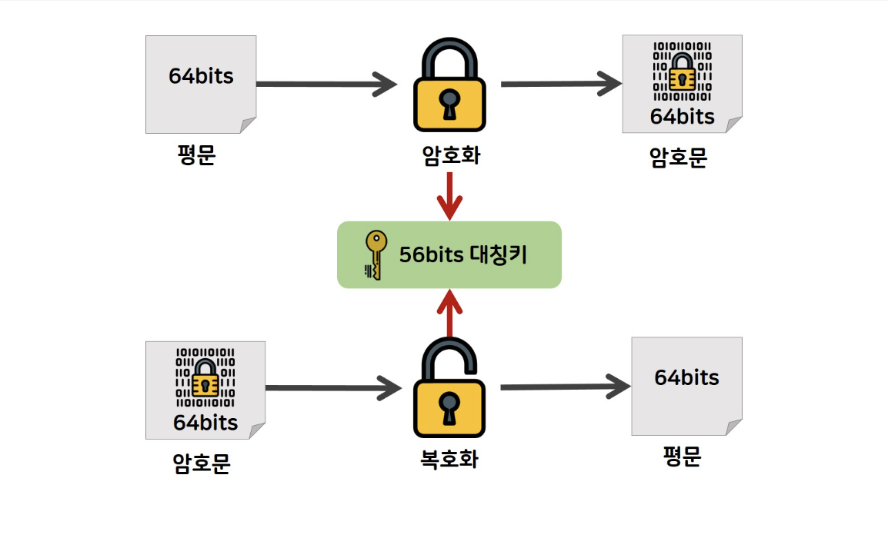
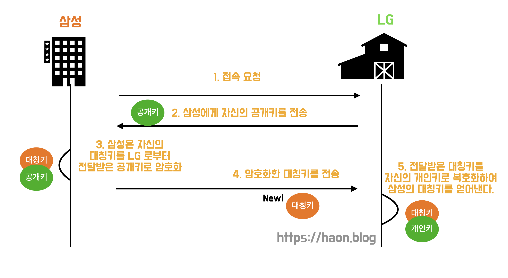
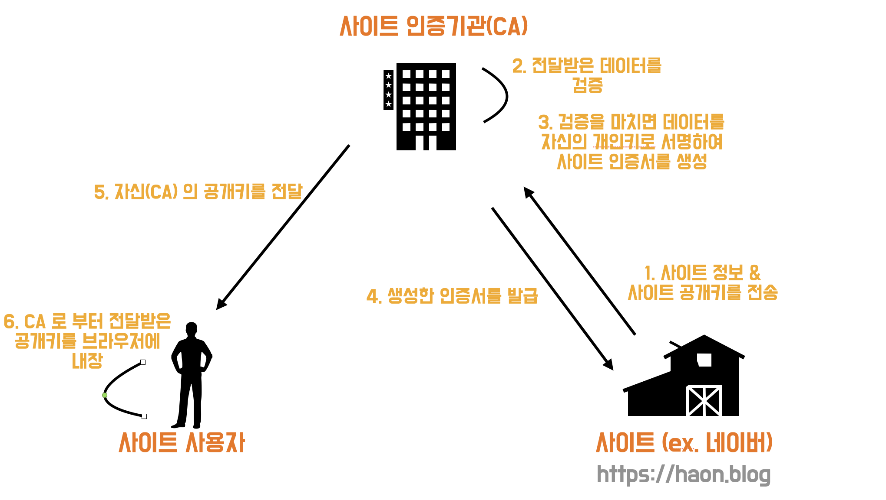
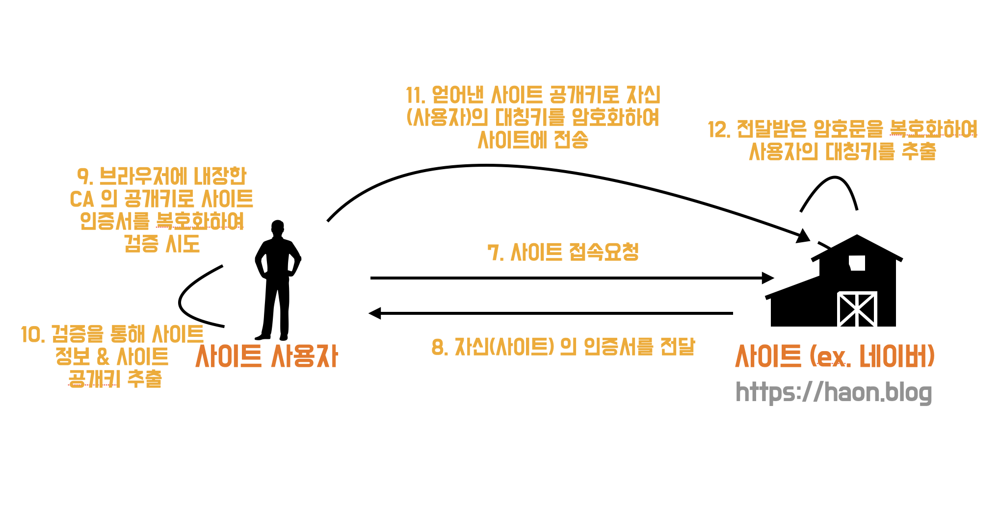

## HTTP vs HTTPS

### HTTPS 는 HTTP 프로토콜에 SSL 을 추가로 덧붙였다.

`HTTP(Hypertext Transfer Protocol)` 은 서버에서 브라우저로 데이터를 전송시 가장 널리 사용되는 프로토콜이지만, 전송되는 정보가 암호화되지 않아 보안에 취약하다는 문제점이 있다. 그로인해 등장한 프로토콜이 `HTTPS(Hypertext Transfer Procotol Secure)` 로, 기존 HTTP 프로토콜에 `SSL` 을 추가적으로 덧붙여 사용한 프로토콜이다.

### HTTP 그 자체를 암호화하진 않는다.

그렇다고 HTTPS 는 HTTP 그 자체를 모두 암호화하는 것은 아니다. HTTP 를 사용해서 운반하는 내용, 즉 HTTP 의 Message Body 를 암호화하지만 HTTP Header 는 아쉽게도 암호화하지 않는다.

---

## SSL 과 TLS

그렇다면 SSL 은 무엇일까? `SSL(Secure Socket Layer)` 의 약자로, Netscape 사에서 보안성이 강화된 통신을 위해 만든 프로토콜이다. 가장 큰 특징은 `공개키(public key) 와 개인키(private key)`, 즉 공개키 방식과 대칭키 방식을 혼합해서 함께 사용한다는 것이다.

### 대칭키 (Symmetric Key)

대칭 키란 데이터 송.수신자 사이에 동일한 Key 값을 기반으로 암호화 및 복호화를 수행하는 기법이다. 그래서 이 암호화.복호화에 활용할 대칭키값만 탈취한다면, 해당 데이터를 쉽게 복호화할 수 있다. 이 떄문에 대칭키 방식은 Key 값이 탈취되면 암호화 복호화가 매우 쉽게 진행된다는 취약점이 존재한다.

### 공개 키 (Public Key)

#### 대칭 키 방식과 비교

대칭 키(Symmetric Key) 방식이 통신의 양방향측에서 서로 동일한 Key 값으로 암호화하는 방식이라면, 공개 키는 서로 다른 Key 값으로 암호화.복호화를 수행하는 기법이다. **즉, 대칭키와 공개키 방식은 동일한/서로 다른 Key 값으로 암호화(복호화)를 수행하는가에 따라 차이가 나는 기법이라고 정리할 수 있다.** 이 때문에 공개 키 방식은 `비대칭키(Non Symmetric Key)` 방식이라고도 불린다.

#### 공개 키

더 자세히는 **데이터를 암호화할 땐 공개키를 사용하고, 데이터를 복호화할 떄는 개인키를 사용한다. 공개키로 암호화한 데이터는 오직 개인키로만 복호화할 수 있기 떄문에, 그 누구던지 공개키를 탈취해도 문제가 없다.** 즉, 공개키는 말 그대로 공개된 키로써 중간에 누군가에게 탈취되어도 문제가 발생하지 않는다.

데이터의 송.수신자 입장에서 다시 정리해보자. 데이터 송신자는 전달할 데이터를 공개키를 기반으로 암호화하여 전송한다. 암호화된 데이터를 전송받은 수신자는, 해당 데이터를 복호화하기 위해 개인키를 활용하여 복호화를 진행한 후 데이터를 열람할 수 있게된다. 도중에 제 3자가 공개키를 탈취하고 데이터 복호화를 시도하려고 한들, 개인키 또한 탈취하지 않는 이상 복호화가 불가능하다.

하지만 이 또한 단점이 있다. 공개키 방식은 대칭키 방식에 비해 **암호화 연산 시간이 더 오래걸린다.**

최종적으로 정리해보자면, 공개 키 방식은 통신 양측간에 서로 다른 Key 값을 사용하여 전달받은 암호문을 복호화한다고 했다. 이떄 **서로 다른 Key 값이란 개인 키(private key) 를 의미한다.**

### 공개키 vs 대칭키

결국 공개 키가 가진 단점을 대칭키에선 장점으로 누리고 있으며, 반대로 대칭키에서 가진 단점을 공개키에선 장점으로 활용하고 있다.
이 때문에 SSL 은 2가지 방식이 가진 장.단점 떄문에 이 둘을 모두 적절히 활용한다.

---

## SSL 의 통신 과정

SSL 은 2가지 방식을 적절히 섞어 활용한다고 했다. 더 정확히는 SSL 은 공개키 방식으로 대칭키를 얀전하게 전달하여, 서로가 동일한 대칭키 값을 기반으로 통신하는 방식이다. 이 대칭키를 활용하여 암호화, 복호화를 하며 통신을 진행한다.

우선 송신자는 수신자에게 접속 요청을 보내서 수신자의 공개키를 전달받는다. 그러면 송신자는 전달받은 공개키를 기반으롷 본인의 대칭키를 암호화한다. 암호화된 결과(대칭키)를 수신자에게 전달하면, 수신자는 전달받은 대칭키를 자신의 개인키로 복호화하여, 그 복호화 결과로 송신자의 대칭키를 얻어낼 수 있게된다.

즉, 데이터 암호화 및 복호화를 위한 한 쪽의 대칭키를 다른쪽의 공개키로 암호화하여 전송하면, 반대편에서 자신의 개인키로 복호화하여 그 반대편의 대칭키를 알아내고, 이 동일한 대칭키 값을 바탕으로 서로 안전하게 통신할 수 있게된다.

---

## SSL 의 유효한 사이트 판별 방법

그렇다면 사용자가 접속한 사이트가 유효한 사이트인지 어떻게 확인할 수 있는가? 즉, 특정 사이트가 HTTPS 프로토콜을 사용하여 사이트 사용자에게 안전한 사이트임을 알리기 위해선 `사이트 인증기관(CA)` 로 부터 `SSL 인증서 (사이트 인증서)` 를 발급받아야 한다. 이 과정을 자세히 살펴보자.

### 1. CA 인증기관 과의 협력

이해를 돕기위해, 사이트를 네이버에 비유하겠다. 가장 먼저 네이버는 본인이 안전한 사이트임을 사용자에게 알리고, HTTPS 프로토콜을 지원하기 위해 SSL 인증서를 발급받아야한다. 이를위해 네이버 본인의 사이트 정보와 Public key 를 CA 인증기관에게 전송하여 SSL 인증서를 발급받기를 시도한다. 이 기대에 따라 CA 인증기관은 전달받은 데이터를 검증하여 (CA 기관 본인의 private key 로 데이터를 서명하는 과정 발생) 네이버에게 SSL 인증서를 발급해준다.

또한 CA 인증기관은 네이버 사용자에게 본인의 public key 를 전달하고, 이 공개키는 사용자 브라우저내에 자동으로 내장된다.

### 2. 사용자가 웹 사이트 접속 요청시

위 까지는 사용자가 사이트에 접속하기 전까지 내용이다. 이어서 사용자가 사이트 접속을 요청했을 때 어떤 일이 일어날까?

우선 사용자가 네이버에 접속을 요청하면, 네이버는 앞서 CA 인증기관으로 부터 발급받은 SSL 인증서를 사용자에게 전달하여 자신이 신뢰할 수 있는 사이트임을 증명한다.

그러면 사용자는 앞서 브라우저 내에 내장한 CA 인증기관의 public key 로 전달받은 네이버의 SSL 인증서를 복호화하여 검증한다. SSL 인증서 복호화에 성공했다면, 네이버에 대한 사이트 정보와 공개키를 얻을 수 있게된다. 이렇게 얻은 네이버 사이트의 public key 를 활용하여 사용자는 본인의 대칭키를 암호화하고, 그 암호화한 대칭키를 네이버에게 전달한다.

이어서 네이버는 본인의 private key 로 전달받은 암호문을 복호화하여 사용자의 대칭키를 얻어내고, 이제 이렇게 얻은 대칭키를 활용하여 사용자와 네이버 사이트는 서로 암호문을 주고받을 수 있게 된다. 즉, SSL 통신을 할 수 있게된다.

---

## 참고

- https://www.youtube.com/watch?v=wPdH7lJ8jf0&t=623s
- https://nuritech.tistory.com/25
- https://wayhome25.github.io/cs/2018/03/11/ssl-https/
