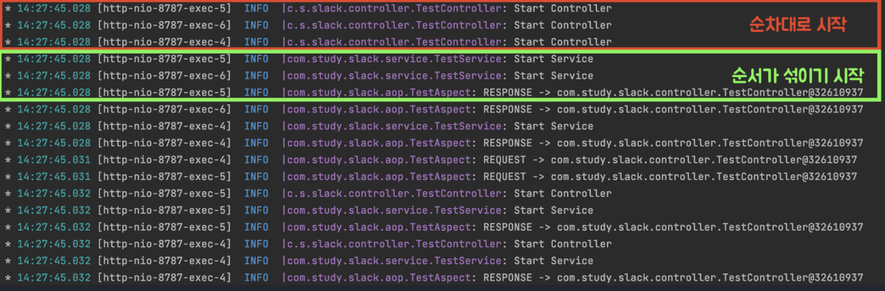
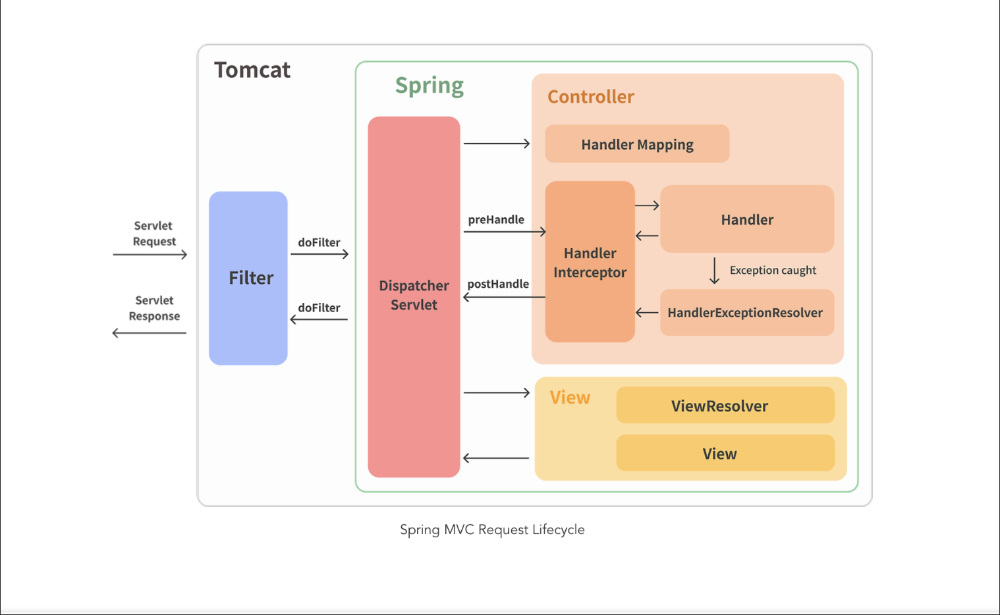

> 현 포스트의 학습 동기는 [Slf4j logback 이란 무엇이며, 왜 로깅을 해야할까? 💁‍♂️](https://haon.blog/spring/logging-slf4j/) 에서 이어지는 내용이다.

## 로그가 뒤섞이는 문제 상황

서비스를 운영하다보면 로그를 통해 모니터링을 하고, 발생한 애러에 대응하기 위해 로그를 추적하고, 기록을 남긴다. 이떄 문제점은 멀티 쓰레드 환경에서 여러 쓰레드의 동시 요청이 유입되는 경우 로그가 뒤죽박죽 쌓인다는 점이다. 가령 회원가입을 위한 요청이 동시다발적으로 유입된다면 아래와 같이 로그가 쌓일 것이다.)



위 로그는 파악하기 쉬운가? 로그를 보면 1개의 요청에 대한 로그가 순차적으로 나열되는 것이 아닌, 여러 사용자의 요청에 대한 로그가 뒤섞여서 파악하기가 힘들다. 우리는 요청별로 로그를 확인해야 로그를 추적하기에 편할 것이다. 자연스레 각 요청별 식별자가 필요함을 느낄 수 있다.

---

## MDC (Mapped Diagostic Context)

우리는 클라이언트 요청별로 고유 값을 부여한 후 로그에 함꼐 출력되기를 기대한다. 이때 사용되는 것이 MDC 이다. `MDC(Mapped Diagnostic Context)` 란 **현재 실행중인 쓰레드에 메타 정보를 넣고 관리하는 공간**이다. MDC 는 내부적으로 Map 을 관리하고 있어 key-value 형태로 값을 저장할 수 있다. 메타 정보를 각 쓰레드 별로 관리하기 위해 내부적으로 `ThreadLocal` 을 사용하고 있다. 아래와 같이 key-value 메타 데이터에 대해 저장, 조회, 초기화가 가능하다.

```java
MDC.put("my-key", "my-value")
MDC.get("my-key")
MDC.clear()
```

### ThreadLocal

ThreadLocal 이란 **오직 하나의 쓰레드에 의해서 읽고 쓰여질 수 있는 고유한 변수다.** 두 쓰레드가 같은 코드를 실행하고 이 코드가 하나의 ThreadLocal 변수를 참조한다고 한들, 서로가 ThreadLocal 변수를 볼 수 없다. 이 점에서 ThreadLocal 변수를 활용하면, 멀티 쓰레드 환경에서 각 쓰레드마다 독립적인 변수로 접근할 수 있음을 보장할 수 있게된다.

이런 특징 때문에 MDC 라는 일종의 독립적인 ThreadLocal 공간에 메타정보를 저장하여 고유 ID 를 부여하고, 문맥(Context) 를 저장함으로써 식별 가능해지게 되는 것이다.

---

## 멀티쓰레드 환경에서 MDC 로 고유 ID 로그 남기기

백문이불여일타. 직접 MDC 로 로그를 남기는 코드를 구현하면서 이해해보자. 우리는 스프링에서 제공하는 `Filter` 를 구현하여 MDC Filter 를 만들 수 있다.

### Filter



Filter 는 스프링 컨테이너와 별개인 `Servlet Container` 에서 제공하는 기능으로, 스프링 컨텍스트가 아닌 웹 컨텍스트에 속한다. **즉, 스프링 컨테이너가 아닌 웹 컨테이너(Tomcat)에 의해 관리된다.** 이는 [스프링에서 Argument Resolver 기반 커스텀 어노테이션으로 인증 책임을 분리해보자! (vs Interceptor)](https://haon.blog/spring/argument-resolver/) 에서 다루었던 `Interceptor` 와도 다소 혼동되는 개념일 수 있다.

`Filter` 는 `Interceptor` 와 관리되는 주체가 다르다. 인터셉터가 일반적인 스프링 컨테이너에 의해서 관리된다면, Filter 는 서블릿 컨테이너라는 주체에 의해 관리된다. 이로써 또 한가지 특징을 알아낼 수 있는데, Filter 는 인터셉터보다 더 앞단에서 요청을 먼저 처리한다. 이 둘은 `DispatcherServlet` 전후로 처리 작업을 지원한다. `DispatcherServlet` 이 호출되기전에 Filter 가 전처리 작업을, 후처리는 인터셉터가 수행한다.

#### 오해하지 말 것

나는 Filter 를 사용하는 방식으로 구현했다. 하지만 Filter 외에도 인터셉터에도 MDC 를 구현할 수 있다는 점을 유의하자.

스프링에서 MDC에 고유 식별값을 만들어 넣을만한 곳은 필터, 인터셉터 등이 있는데 가장 앞단인 필터에 적용하는 것이 좋다. 그리고 필터들 중에서도 가장 먼저 등록되도록 해주면 좋을 것이다.

### Servlet Filter 구현

그러면 Filter 를 구현할 떄 어떤 방식으로 구현해야할까? 이야기했듯이 MDC 는 각 쓰레드별 고유 식별값(ID)을 저장해야한다. 고유 ID 를 부여하는 방법엔 여러가지가 있겠지만, 나는 `UUID` 를 활용하여 부여하겠다.

구현 방법은 어렵지 않다. 우선 `Filter` 인터페이스를 구현한 구현체를 만들고 Bean 으로 등록해준다. 이 안의 `doFitler()` 에서 `MDC.put()` 을 사용해서 UUID 를 넣어준다. 이렇게 구현되면 가장 앞단에서 요청을 처리하는 Servlet Filter 구현체인 MDCFilter 에 의해 요청이 처리되고, MDC 공간내의 Key 값에 UUID 식별자 값이 저장된다.

```java
@Component
@Order(Ordered.HIGHEST_PRECEDENCE)
class MDCLoggingFilter implements Filter {

    @Override
    public void doFilter(final ServletRequest servletRequest, final ServletResponse servletResponse, final FilterChain filterChain) throws IOException, ServletException {
        final UUID uuid = UUID.randomUUID();
        MDC.put("req_id", uuid.toString());
        filterChain.doFilter(servletRequest, servletResponse);
        MDC.clear();
    }
}
```

주의할 점은 `doFilter()` 가 끝나서 나오면 clear 를 해준다는 것이다. Spring MVC 는 `쓰레드 풀` 에 쓰레드를 여럿 만들어두고, 유입된 요청을 처리하고 다시 쓰레드 풀에 반납된다. 그런데 MDC 는 각 쓰레드 별로 `ThreadLocal` 을 사용하므로, 요청이 완료될 때 `clear()` 를 해주지 않으면 다른 요청이 이 쓰레드를 재사용할 때 이전 데이터가 남아있을 수 있다. 마치 통장 비밀번호 같은 데이터를 MDC 에 저장하고 삭제하지 않을 경우 다른 사용자가 조회할 수 있는 상황과 유사하다.

### 로그에 고유 ID 출력하기

Filter 를 구현했다면 고유 UUID 를 출력해보자. 간단히 `INFO` 레벨로 출력해본다.

```java
int uuid = MDC.get("req_id");
logger.info("[${req_id}] $name 회원 가입 요청 받음");
```

#### logback-spring.xml

간단히 xml 파일을 통해 logback 을 설정하여 모든 로그에 MDC 맥락을 적용할 수도 있을것이다. 아래와 같이 작성해보자. xml 에 대한 상세한 설정 방법은 추가 학습이 필요하다.

```xml
<?xml version="1.0" encoding="UTF-8"?>
<configuration scan="true">
    <springProfile name="prod">
        <include resource="org/springframework/boot/logging/logback/defaults.xml"/>

        <include resource="stdout-appender.xml"/>
        <include resource="info-appender.xml"/>
        <include resource="error-appender.xml"/>
        <!-- ... -->

        <root level="info">
            <appender-ref ref="STDOUT"/>
            <appender-ref ref="FILE-INFO"/>
            <appender-ref ref="FILE-ERROR"/>
            <!-- ... -->
        </root>
    </springProfile>
</configuration>
```

MDC는 단순히 콘솔에서만 출력되고 휘발되는 것이 아니라 Appender에 따라 파일, 데이터베이스등 다양한 소스에 로그 메시지와 함께 맥락을 남길 수 있으므로 유용하게 사용될 수 있다.

---

## 더 학습해볼 키워드

- 코루틴 (아직 멀었지만 언젠가는 🤣)
- FilterChain

---

## 참고

- https://mangkyu.tistory.com/266
- https://yeonbot.github.io/java/ThreadLocal/#threadlocal
- https://hudi.blog/slf4j-mapped-diagnotics-context/#MDC-%EC%A0%84%ED%8C%8C%EA%B0%80-%EC%95%88%EB%90%98%EB%8A%94-%EC%BC%80%EC%9D%B4%EC%8A%A4
- https://medium.com/@yukeon97/spring-filter-interceptor-aop-%EC%A0%95%EB%A6%AC-247125b4acac
- https://velog.io/@soyeon207/Spring-Filter-Interceptor-AOP
