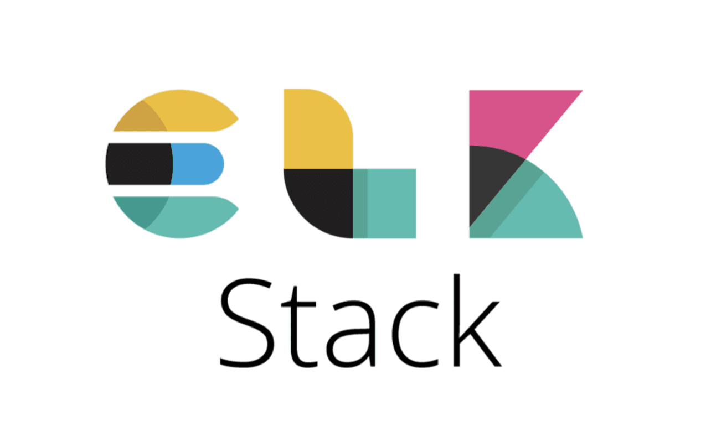
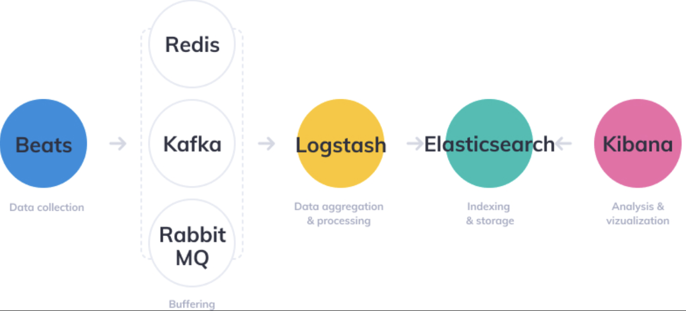
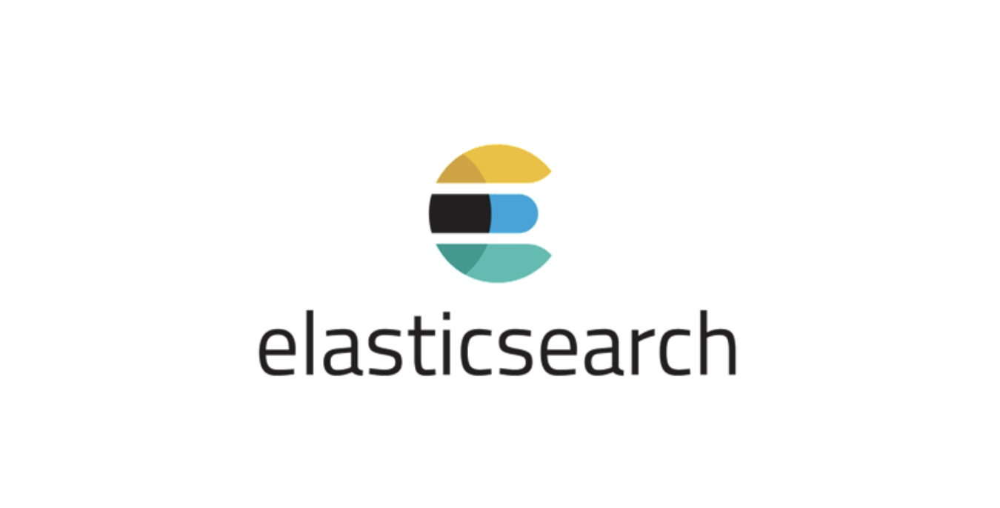
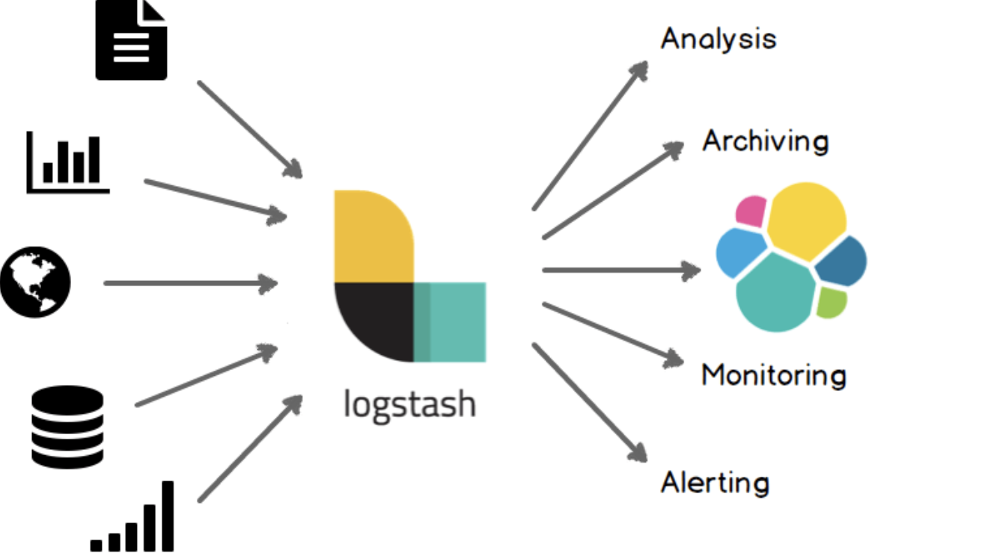
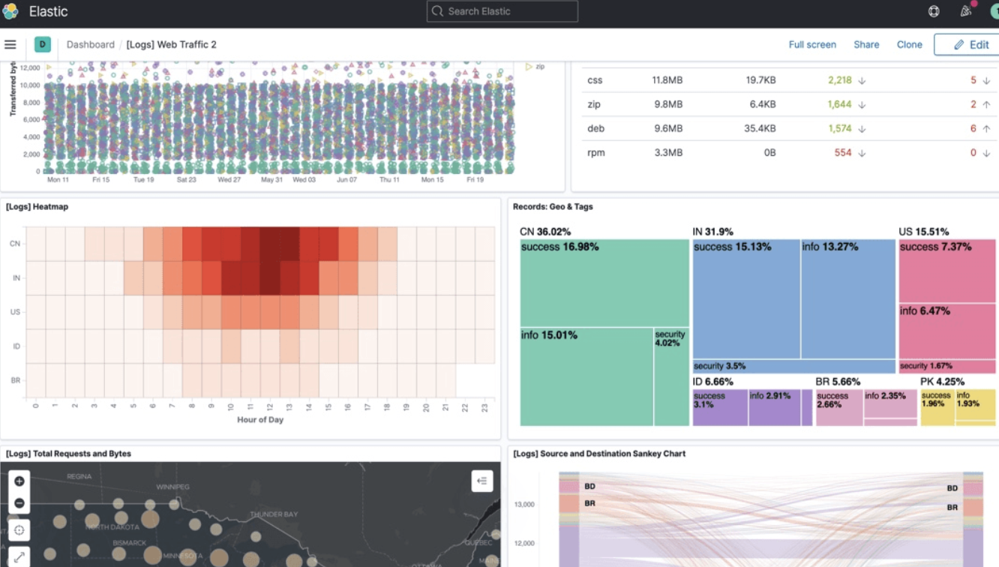
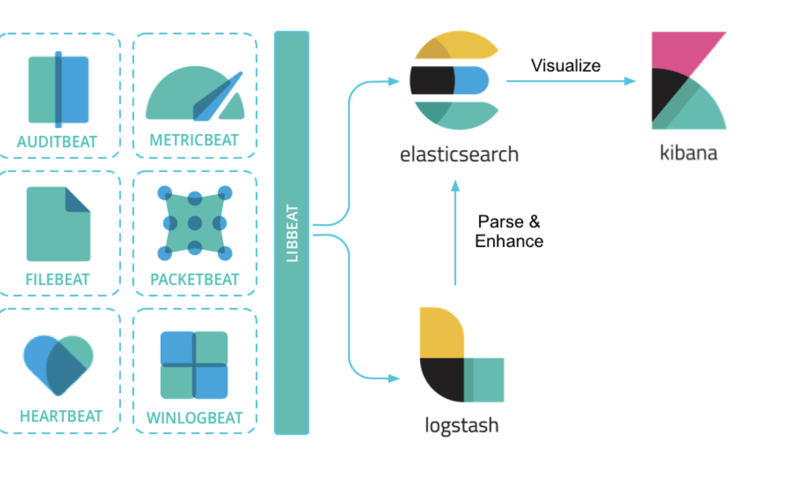

회사에서 ELK 스택을 통해 애플리케이션을 로깅하고, 애러를 검출하고 있다. ELK 스택에 관련한 설명을 들을 때 기술에 대한 이해도가 낮아서 학습의 필요성을 느끼게 되었다. ELK 스택에서 각각의 컴포넌트가 어떠한 역할을 수행하며, 데이터가 어떻게 흐르고, 처리되고, 검색되고, 저장되고, 시각화 되는 것인지 전반 개요를 간단히 살펴봐야 겠다는 생각이 들었다. 

이번 포스팅에서는 ELK 스택 하나하나에 대한 기술을 깊게 공부하는 목적 보다는, 어떤 역할을 수행하고, 어떤 데이터 처리 흐름을 수행하는 것인지 개요를 학습해보도록 한다. 또한 [참고1](https://hudi.blog/elk-stack-overview/) 을 다수 참고.인용하여 빠르게 학습을 해보도록 하겠다.

## 로그는 왜 필요할까?

ELK 스택은 로그 수집, 처리 및 분석에 사용되는데, 왜 로그를 수집하고 처리하는 것일까? 그 이유를 정리해보자면 다음과 같다.

- **장애시 원인 파악** : 로그를 분석하여 장애가 터진 경우 빠르게 원인을 파악하고 해결할 수 있다. 비슷한 원리로, 대용량 배치 작업의 경우 작업 개수가 굉장히 많고 오랜 시간이 걸릴텐데, 전체 배치 작업 중에 실패한 작업에 대해 로깅을 하여 원인을 파악하고 복구하기가 쉬워진다.

- **사용자 패턴 분석** : 이슈가 발생하여 CS 가 인입되었을 때를 대응하기 위해서, 해당 사용자가 어떤 액션을 취했는지, 어떤 데이터가 요청되었는지를 확인할 필요가 있다. 

-  **시스템내 성능.병목.취약 구간 파악** : 사용자의 Request 가 들어오고 Response 가 나가기까지의 시간을 기록하여, 시스템내 성능 저하 및 병목 구간을 파악할 수 있다. 

##  ELK 스택 기반 아키텍처

ELK 는 `Elastic Search`, `Logstash`, `Kibana` 를 합친 약자로, 로그 데이터를 수집하고 분석하는 도구 모음을 뜻한다. 여기에 `Beats` 라는 경량 데이터 수집 도구가 추가되어서, 이를 묶어 ELK Stack 이라고 부른다. `Elastic Search` 는 검색 엔진, `Logstash` 는 데이터 처리 파이프라인 도구, `Kibana` 는 데이터 시각 대시보드, `Beats` 는 경량 데이터 수집기이다. 그렇다면 ELK 스택에서 데이터는 어떻게 발생하고, 흐르고, 처리되고, 저장되며, 검색되고, 시각화되는 것일까?

> 💡 에이전트(Agent) 란? : 시스템에서 특정 작업을 수행하도록 설계된 SW 프로그램이다. 일반적으로 백그라운드에서 실행되고, 사용자의 개입없이 자동으로 특정 데이터를 수집하거나 작업을 처리한다. 

- `(1)` `Beats` 는 로그 또는 메트릭이 발생하는 서버에 에이전트로 설치되어 데이터를 수집하고, 이 데이터를 `LogStash` 로 전송한다. 위 다이어그램에는 `Beats` 는 `LogStash` 사이에 메시지 큐가 위치하는 것을 확인할 수 있는데, 이는 안정성 또는 확장성 등을 위함이다.

- `(2)` `Beats` (혹은 메시지 큐) 로 부터 데이터를 전달받은 `LogStash` 는 데이터를 적절히 필터링 및 가공하여 `Elastic Search` 로 전달한다.

- `(3)` `LogStash` 로 부터 데이터를 전달받은 `Elastic Search` 는 데이터를 굉장히 빠른 속도로 검색될 수 있도록 역 인덱싱(Inverted Indexing)한다.

- `(4)` `Kibana` 는 REST API 를 통해 `Elastic Search` 로 부터 데이터를 가져와서 유저에게 시각화와 간편한 데이터 검색 기능등을 제공한다.

## Elastic Search

> 💡 Elastic Search 에 대한 자세한 내용은 [Elastic Search 역 인덱스(Inverted Index) 구조 살펴보기](https://haon.blog/database/elastic-search-basic/) 에서 다룬적이 있으니 참고하자.

ELK 스택은 Elastic Search 로 부터 시작된다. Elastic Search 는 Lucene 기반 검색엔진 (경우에 따라 NoSQL DB 로 분류하기도 한다) 이며, 대용량 데이터를 빠르게 저장하고 검색할 수 있게 해주는 툴이다. 데이터를 빠르게 검색하기 위해 **역 인덱싱(Inverted Indexing)** 하여 저장한다. 역 인덱싱과 관련한 내용은 위 포스팅에서 다룬적이 있으므로 생략한다.

Elastic Search 는 클러스터 구조로 분산되어 구성되어 있다. 이 덕분에 높은 가용성과 확장성이라는 특징을 갖는다. 또한 일반적인 관계형 DB 와 다르게 SQL 을 지원하지 않고, **REST API 를 통해서 데이터를 추가하고 검색해야 한다.** SQL 의 SELECT, INSERT, UPDATE, DELETE 명령은 REST API 기반의 Elastic Search 에서 GET, POST, PUT, DELETE 에 대응된다.

관계형 DB 의 데이터베이스, 테이블, row, 컬럼, 스키마는 각각 Index, Type, Document, Field, Mapping 에 대응된다.

또한 엘라스틱 서치는 일반 관계형 DB 와 다르게 JOIN 절을 지원하지 않고, 트랜잭션을 지원하지 않는다는 점이 단점이 될 수 있겠다.

## LogStash

Elastic Search 를 사용하면서 데이터를 손쉽게 수집할 방법이 필요해졌다. 따라서 데이터 처리 파이프라인 툴인 LogStash 가 등장했다. LogStash 는 `Input`, `Filter`, `Output` 순서로 데이터를 수집하고, 가공하고, 전달한다.

### Input

Logstash 는 다수의 데이터 소스로부터 동시에 로그 또는 메트릭 데이터를 수집한다. 수집하는 데이터 소스는 Beats, File, TCP, HTTP, Kafka, Redis 등이 있다.

### Filter

Logstash 는 Input 를 Output 로 변환하는 사이에 데이터를 Filter 하는 과정을 거치는데, Filter 과정을 통해 아래와 같은 일을 수행할 수 있다. Filter 란 Input 데이터를 필터링하거나, 원하는 형식으로 가공하는 작업이다.

- grok 플러그인을 사용해서 정규 표현식을 통해 비정형 데이터로부터 구조를 도출해낼 수 있다.
- IP 주소로부터 위치 자표를 얻어올 수 있다.
- 개인 식별 정보를 익명화하거나 완전히 제거할 수 있다.

위와 같은 데이터 가공.필터링 작업은 Logstash 자체에서 제공하는 다양한 플러그인들로 코딩없이 간단히 작업할 수 있다.

### Output

Input 과 마찬가지로 Logstash 는 다양한 데이터 소스로 출력할 수 있다. Output 의 예시로는 Elastic Search, Email, File, TCP, HTTP, Kafka, RabbitMQ, Redis, S3, WebSocket 등이 있다. 

## Kibana

Elastic Search 만으로 데이터를 검색하는 것은 가능하긴 하지만, Elastic Search 만 단독으로 사용하면 Rest API 를 호출해야만하기 때문에 불편하다. 따라서 Elastic Search 에 저장된 데이터를 보기 쉽도록 시각화 할 도구가 필요한데, 이를 위해 Kibana 를 사용한다. Kibana 는 HTML + JavaScript 엔진으로 사용자가 Elastic Search 에 저장된 데이터를 쉽게 검색하고, 분석하는데 도움을 준다.

Kibana 는 일반적인 텍스트 데이터를 비롯하여, 히스토그램, 차트, 위치 데이터, 시계열, 그래프 등 다양한 시각화를 제공한다. 또한 사용자가 쉽게 데이터를 검색하고 필터링할 수 있는 기능을 제공한다. 추가적으로 Kibana 는 데이터를 모니터링하여 사용자에게 경고 알림을 제공하는 기능도 존재한다.

## Beats

마지막으로 Beats 는 로그, 메트릭 등의 다양한 데이터 소스에서 다양한 유형의 데이터를 수집하고 전달하는 경량 데이터 수집기이다. 일반적으로 Beats 는 Logstash 또는 메시지 큐에다 수집한 데이터를 전달한다. 

Beats 는 수집하는 데이터 소스, 형태에 따라 아래와 같이 종류가 구분된다.

- **FileBeat** : 서버의 로그 파일을 수집한다. 

- **MetricBeat** : 서버의 CPU, 메모리, 디스크 용량과 같은 시스템 메트릭이나 MySQL, Nginx 같은 서비스 메트릭 정보를 수집한다.

- **PacketBeat** : 서버와 클라이언트 간의 트래픽을 실시간으로 모니터링해서 네트워크 상태 정보를 수집한다. HTTP, DNS, MySQL 과 같이 다양한 프로토콜에서 트래픽 정보를 수집한다.

- **WinlogBeat** : 윈도우 시스템에서 발생하는 이벤트 로그를 수집한다.

- **AuditBeat** : 리눅스 시스템에서 발생하는 이벤트 로그를 수집한다.

- **Hearbeat** : 주기적으로 지정된 URL 로 요청을 보내서 서비스 상태를 모니터링한다.

- **FunctionBeat** : AWS Lambda, Google Cloud Functions 등의 FaaS (Function-as-a-Service) 플랫폼에서 데이터를 수집한다.

## 참고

- https://hudi.blog/elk-stack-overview/
- https://aws.amazon.com/ko/what-is/elk-stack/