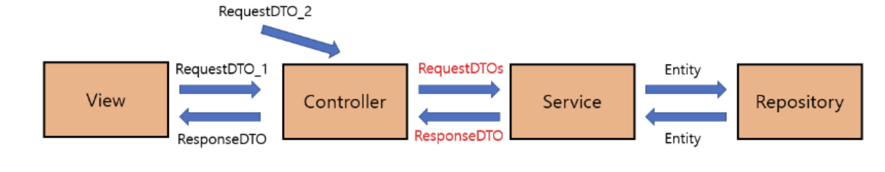
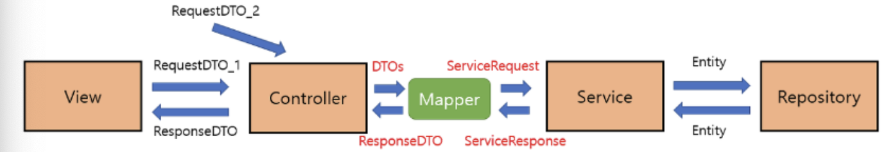

## 학습배경

이전부터 자바 및 스프링부트로 프로그래밍을 하면서 밥 먹듯이 DTO 를 많이 들어왔고, 사용해왔다. 하지만 DTO 를 올바른 정의대로 바람직하게 사용하고 있다는 확신이 들지 않았다. 오늘 카카오테크 교육과정에서 맥(mac) 코치님의 서버 기초 강의를 들으면서 DTO 를 다시금 배웠는데, 이번 기회에 확실히 정리해보고자 글을 작성한다.

## DTO (Data Transfer Object)

`DTO` 란 **계층 간 데이터를 전송하기 위해 도메인 모델 대신에 사용하는 객체**를 뜻한다. DTO 는 순수하게 데이터르 ㄹ저장하고, 데이터에 대한 getter 와 setter 만을 가져야 한다. 그 어떠한 비즈니스 로직을 가져서도 안되며, 오르지 저장, 검색등의 로직만을 보유할 수 있다.

~~~java
publci class UserInfoDto {
    private final String id;
    private final String password;

    public UserInfoDto(String id, String password) {
        this.id = id;
        this.password = password;
    }

    public String getId() {
        return this.id;
    }

    public String getPassword() {
        return this.password;
    }
}
~~~

위와 같이 작성한 클래스는 DTO 라고 할 수 있겠는가? 적어도 앞서 정의한 내용에 따르면 맞는 말이다. 어떠한 비즈니스 로직을 갖고있지 않으며, 단순히 값을 저장하고 제공하는 로직만을 포함하고 있다. 오로지 데이터를 전송하는 단순 캡슐화 객체 그 자체로써 동작할 것이다.

## DTO 를 왜 사용하는가?

### 도메인 모델을 캡슐화하여 보호할 수 있다.

DTO 를 사용하는 가장 큰 목적은 **도메인 모델을 보호하는 것 이다.**. 만약 DTO 가 아닌 도메인 모델을 계층간의 데이터 송수신에 직접 활용하면 어떤 문제가 발생할까? 당연하게도, Business 계층을 비롯한 Persistence 계층, Presenataion 계층 모두에게 도메인 모델을 노출시키기 떄문에 다른 계층과의 강한 결합 및 의존성이 발생하게 된다. 즉, 추후 요구사항 변화로 인해 다른 계층에 전송해야하는 데이터 스팩이 변경되어야 하면, 매번 도메인 코드를 변경해야하는 상황이 발생할 수 있다. **즉, DTO 를 활용하면 도메인 모델을 계층간의 전송에 직접 활용하지 않으므로 보호할 수 있다.**

### 도메인 서례를 외부에 직접 유출시키지 않는다.

앞서 서술했듯이, DTO 는 도메인 모델을 보호하는 것에 목적이 있다. 비슷한 이유로, **도메인 모델 대신 DTO 를 활용함으로써 보안 문제를 한층 해결할 수 있다.** 만약 DTO 가 아닌 도메인 모델을 계층 간 전달에 사용하면, 프레젠테이션 계층에서 도메인 모델의 상태를 변경시킬 수 있고, 중요한 내부 필드들이 불필요하게 모두 노출된다. 이 떄문에 DTO 를 대신 활용하여 필요한 일부 데이터 만을 외부에 노출시킴으로써 도메인을 보호할 수 있다.

### 3. 검증(Validation) 코드를 도메인 코드와 분리 가능하다.

Domain Layer 의 역할을 다시 복습해보자. 이 계층은 비즈니스 로직을 처리하는 핵심 계층으로, 시스템의 핵심 로직이 담겨있다. 주요 역할로 데이터의 유효성 검증, 엔티티 간의 관계처리, 비즈니스 로직 수행등을 수행한다고 했다. > 💡 Domain Layer 에 대한 역할은 [스프링의 독립적인 계층화 아키텍처 (Layered Architecture)](https://haon.blog/spring/layered-architecture/) 을 참고하자.

따라서 도메인 모델은 매우 중요한 정책, 비즈니스 정책이 흐르는 모델로, 외부에서 받아온 필드에 대한 자잘한 유효성 검증 로직은 DTO 에서 처리하는 것이 바람직하다. 여기서 유의할 점은 도메인 모델에서 데이터 필드 검사를 수행 안한다는 것이 아니다. 도메인 모델에선 시스템의 비즈니스 정책(ex. 유저의 비밀번호는 최대 10자를 허용하는 정책) 에 대한 유효성 검증을 수행한다. 반면 DTO 는 이 외의 자잘한 데이터 검증을 처리한다.

## DTO 를 어떤 계층에서까지 사용할 수 있을까?

적어도 대다수의 의견은 DTO 가 영속성 계층까지 도달하는 것은 지양한다. 그렇다면, 우리가 집중해서 살펴봐야할 부분은 비즈니스 계층과 프레젠테이션 계층이다.

> A Service Layer defines an application's boundary [Cockburn PloP] and its set of available operations from the perspective of interfacing client layers. It encapsulates the application's business logic, controlling transactions and coor-dinating responses in the implementation of its operations. - 마틴 파울러 -

마틴 파울러는 Service 계층은 도메인을 보호하는 계층이라고 말한다. 적어도 그의 말에 따르면, 프레젠테이션 계층까지 도메인을 유출해선 안되며, **도메인은 서비스 계층에서 DTO 로 변환되어 프레젠테이션 계층으로 넘겨지는 것이 올바르다.** 반대로 프레젠테이션 계층에서 비즈니스 계층으로 데이터가 전달될 떄도 DTO 형태로전달되는 것이 바람직하다.

## DTO, Entity 변환 방식 

그렇다면 DTO 와 도메인 객체(엔티티) 간의 변환은 어떤 방식으로 이루어질까?

## DTO Mapper

첫번째로 DTO와 도메인 모델의 변환은 별도의 Mapper 객체를 사용하는 것이다.

일반적인 상황에선, 대부분 위처럼 컨트롤러는 DTO 형태의 데이터로 요청을 서비스 계층에 넘기고, 서비스는 DTO 를 엔티티(도메인 모델) 로 변환하는 구조를 지닌다. 만약 View 계층으로 부터 전달받은 데이터가 DTO 타입이 아니라면, DTO 로 변환후 서비스 계층에 전달해야한다.

반면 서비스 요청/응답시 서비스 계층의 메소드가 사용하는 서비스 DTO 를 별도로 만들고, DTO 와 서비스 DTO 를 매핑하는 Mapper(매퍼) 를 중간에 끼워넣는 방식도 있다고 한다. Mapper 를 사용하면 컨트롤러와 서비스 계층이 완전히 분리됨으로써 결함도가 낮아지는 효과를 볼 수 있다고 한다. 아직은 실제로 Mapper 를 활용하면서 까지 코드를 작성해본 경험이 없기 떄문에 공감대가 없어서, 추가 학습이 필요하다.

스프링부트 JPA 에선 `ModelMapper`, `MapStruct` 라는 매퍼 기능을 이미 제공하고 있다는 점을 처음 알았다. 이들도 시간이 된다면 학습해보도록 한다. 

### toEntity, toDto

사실 지금까지 내가 사용했던 방식이다. 아래처럼 DTO (또는 Entity) 내에 변환 메소드를 구현하는 방식이다.

~~~java
public class UserDto {
    private final String id;
    private final String password;

    // ...

    public User toEntity() {
        return new User(id, password);
    }
}
~~~

이런 방식으로 매퍼 역할을 수행하는 변환 메소드를 구현하는 것이다. 그런데 DTO 의 엄밀한 정의에 따르면 올바르지 않은 코드다. 

그럼에도 뛰어난 개발자분들 코드를 살펴보면 대부분 Mapper 를 별도로 구현하지 않고도 위처럼 간단히 변환 메소드를 간단히 구현한다. 이 이유는 많은 고민을 해봤지만 아직  결론을 내리지 못했다. 추가 학습이 필요하다.

## 참고

- https://tecoble.techcourse.co.kr/post/2021-04-25-dto-layer-scope/
- https://tecoble.techcourse.co.kr/post/2020-08-31-dto-vs-entity/
- https://www.baeldung.com/java-dto-pattern
- https://creampuffy.tistory.com/188
- https://hudi.blog/data-transfer-object/

