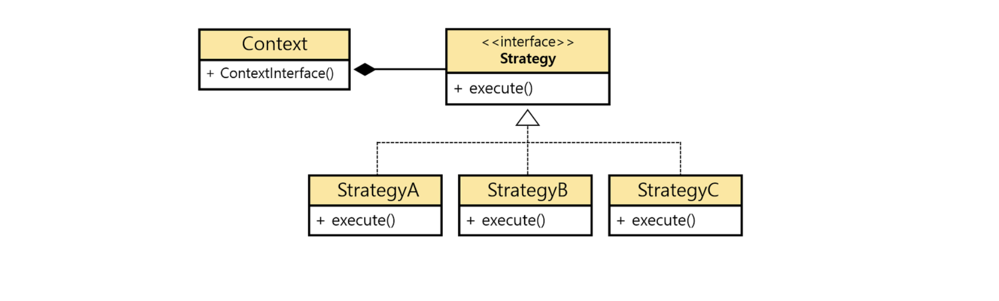

## 학습동기

이번 카카오테크 교육과정 실습 미션은 `상품 할인 관리 시스템 구현하기` 이다. 디자인패턴을 학습하고 코드를 구현하는 것이 요구사항인데, 이 과정에서 전략패턴에 대해 학습하게 되었다. 전략 패턴에 대한 생각의 정교화를 위해 글을 작성해본다.

## 전략패턴

**전략 패턴이란, 유사한 행위(알고리즘)를 수행하는 여러 전략들에 대해 공통의 인터페이스를 정의해두고, 각각의 구체적인 전략에 대한 클래스로 캡슐화하고, 언제든 동적으로 전략을 교체할 수 있도록하는 디자인패턴이다.** 이때 전략이라는 말이 다소 와닿지 않을 수 있는데, 전략을 "알고리즘" 이라고 생각해도 좋다. 

우리에게 주어진 특정한 문제를 해결하기 위한 여러 전략(알고리즘) 을 미리 클래스로 설계하여 캡슐화해둔다. 즉, 전략을 클래스로 캡슐화해둔다. 이후 요구사항 및 상황에 따라 유연하게 전략을 교체하는 방식으로 동작한다. 마치 A 에서 B 로 도달하는 알고리즘을 구현할 때 다익스트라 알고리즘으로 구현하기, 크루스칼 알고리즘으로 구현하기, DFS 로 구현하기 등으로 생각하면 쉽다. 

### 전략패턴을 사용하지 않았을 때

백문이불어일타. 코드를 직접 작성하면서 디자인패턴을 이해해보자. 이를위해, 우선 전략패턴을 사용하지 않은 일반적인 코드에 대해 살펴보자.

아래와 같은 `NumberConverter` 오브젝트가 있다고 해보자. 이 객체는 주어진 숫자를 증폭해주는 변환기 역할을 한다. 1은 10으로, 2는 100으로, 3은 1000으로 변환해준다. 

~~~java
public class NumberConverter {
    private long number;

    NumberGenerator(long number) {
        this.number = number;
    }

    public void generateRandomNumber() {
        if(number == 1) {
            System.out.println("10 으로 변환한다!");
        } else if(number == 2) {
            System.out.println("100 으로 변환한다!");
        } else if(number == 3) {
            System.out.println("1000 으로 변환한다!");
        }
    }
}
~~~

위와 같은 컨버터 클래스는 아래와 같이 사용할 수 있다.

~~~java
NumberConverter one = new NumberConverter(1);
NumberConverter two = new NumberConverter(2);
NumberConverter three = new NumberConverter(3);

one.generateRandomNumber();
two.generateRandomNumber();
three.generateRandomNumber();
~~~

하지만 이러한 구조는 어떤 문제점이 있을까? 예를들어 기존의 3가지 변환 규칙 이외에 새로운 전략으로 number 값이 4인 경우에 대해 코드를 작성하려면, 아래와 같이 4에 대한 코드를 추가함으로써, `generateRandomNumber()` 메소드 내에 변환이 발생한다. 

~~~java
public void generateRandomNumber() {
    if(number == 1) {
        System.out.println("10 으로 변환한다!");
    } else if(number == 2) {
        System.out.println("100 으로 변환한다!");
    } else if(number == 3) {
        System.out.println("1000 으로 변환한다!");
    } else if(number == 4) {
        System.out.println("10000 으로 변환한다!");
    }
}
~~~

이러한 구조는 `OCP(개방 폐쇄 원칙)` 을 위반하는 것이다. 결국 기존 코드에 영향을 주게되었고, 이는 상황에 따라 자칫 서비스 전체에 영향을 미칠 수 있다.

## 전략패턴을 적용한 경우

전략패턴은 **유사 행위(전략) 을 수행하는 단위별로 클래스를 나누어 캡슐화하고, 공통적인 인터페이스로 그룹화한다.** 이 경우 "숫자를 변환" 하는 행위가 공통 행위가 될 것이며, 어떻게 숫자를 변환시킬지에 대한 상세 행위가 "전략" 이 된다.

따라서 숫자 변환 결과를 반환하는 `generateNumber` 메소드를 갖는 `NumberGenerateStrategy` 인터페이스를 아래와 같이 추상화한다.

~~~java
public interface NumberGenerateStrategy {
    long generate();
}
~~~

다음으로 각 숫자별 세부 전략을 클래스로 캡슐화한다. 

~~~java
public class SmallNumberStrategy implements NumberGenerateStrategy {
    public long generate() {
        return 10;
    }
}

public class MediumNumberStrategy implements NumberGenerateStrategy {
    public long generate() {
        return 100;
    }
}

public class BidNumberStrategy implements NumberGenerateStrategy {
    public long generate() {
        return 100;        
    }
}
~~~

기존의 `NumberConveter` 는 아래와 같이 생성자 주입으로 인터페이스 타입의 전략을 주입받는다. 이로써 NumberConverter 는 상황에 따라 알맞은 전략 구체 클래스를 외부로 부터 주입받아서, 상황에 따라 알맞은 전략을 사용할 수 있다.

~~~java
public class NumberConverter {
    private NumberGenerateStrategy strategy;

    NumberGenerator(NumberGenerateStrategy strategy) {
        this.strategy = strategy;
    }

    public void generateRandomNumber() {
        System.out.println(strategy.generate() + " 으로 변환한다!");
    }
}
~~~

각 전략을 캡슐화함으로써, 각 전략에 미치는 영향력은 최소화되었다. 또한 NumberConverter 는 적절히 전략 객체를 주입받아 숫자를 변환하면 끝이다. 

## 전략패턴의 사용 효과 

코드 문맥이 특정한 구현체가 아닌 인터페이스에 의존한다. 즉, 문맥이 구체 컴포넌트에 의존하지 않고, 역으로 컴포넌트가 읜터페이스에 의존하는 `DIP(의존성 역전이 원칙)` 를 따르게 된다.

## 정리

간혹 코드를 짜다보면 **매우 비슷한 형태 또는 플로우를 지닌 여러 기능들이 존재할것이다.** 즉, 매우 비슷한 로직 또는 형태를 지닌 여러 기능 및 케이스가 존재할때 사용하면 매우 유용한 전략이 될것이다. 또는 기능이 완전히 동일한데 요구사항 및 세부정책에 따라 자그마한 분기처리만 처리해도 좋을 경우에도 활용하면 좋은 패턴이 될것이다.

## 참고

- https://diqmwl-programming.tistory.com/101
- https://hudi.blog/strategy-pattern/
- https://victorydntmd.tistory.com/292

