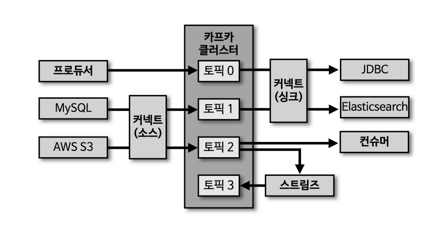
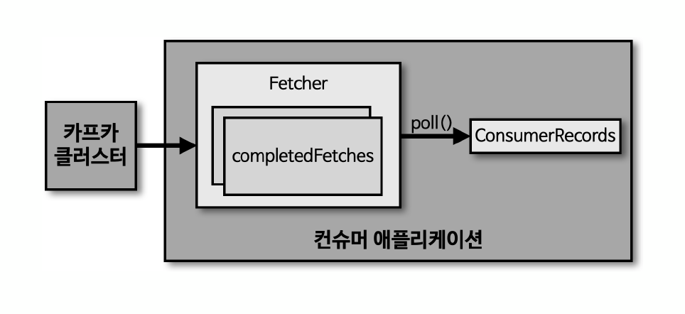
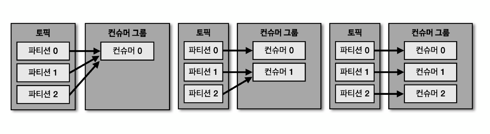
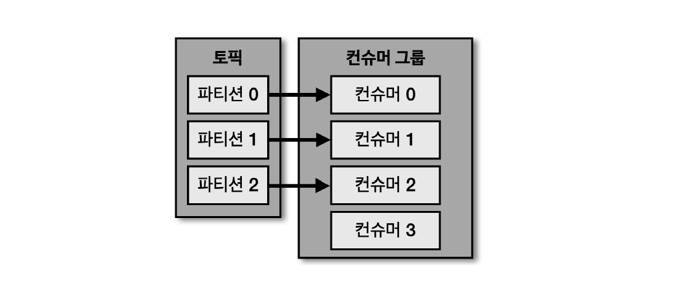
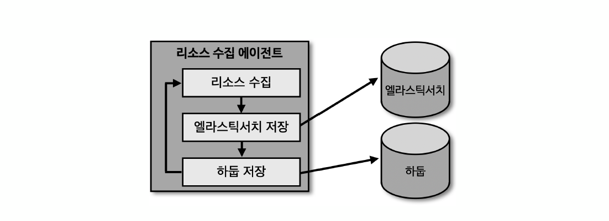
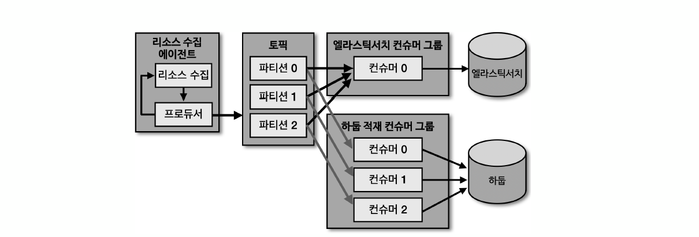
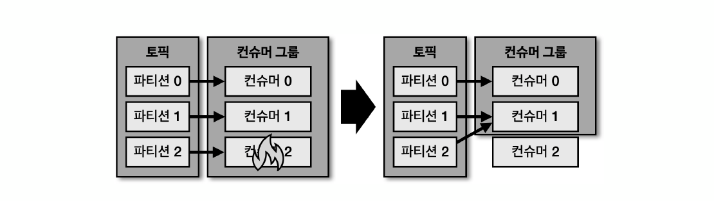
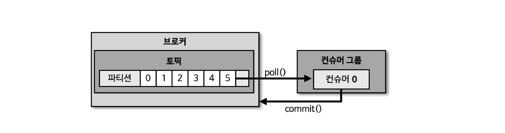

## 컨슈머

컨슈머는 카프카 클러스터 내부 특정 토픽에 데이터가 유입되면, 이 토픽을 구독하며 데이터를 가져오게 되는 주체이다. 프로듀서가 전송한 데이터는 브로커에 적재되며, 컨슈머는 적재된 데이터를 사용하고자 브로커의 특정 토픽으로부터 데이터를 가져와서 내부적으로 필요한 처리를 수행한다.

### 컨슈머 내부 구조

- `패쳐(Fetcher)` : 패쳐(Fetcher) 란 리더 파티션으로부터 레코드들을 미리 가져와서 대기시키는 역할을 한다. 카프카 클러스터에서, 즉 리더 파티션에 있는 브로커가 데이터를 컨슈머 애플리케이션에 보내게 되면, 가장 앞단에서 패쳐(Fetcher) 가 우선적으로 데이터를 전달받게 된다. 패쳐 내부적으로는 데이터를 충분히 전달받게 되면 `completedFetches` 상태로 변하게 되며, 이 상태일 때 `poll()` 메소드를 호출하게 되면 `ConsumerRecords` 라고 하는 객체로 변환하게 된다.

 - `ConsumerRecords` : 처리하고자 하는 레코드(ConsumerRecord)들의 한 묶음으로, ConsumerRecord 의 복수 형태이다.

- `poll()` : 패쳐에 있는 레코드들을 리턴하는 메소드이다. 

#### 데이터 처리 속도

특징 중 하나로, 이 `poll()` 메소드를 호출하기 전에 이미 패쳐는 데이터를 브로커로부터 가져온다. 따라서, 우리가 `poll()` 메소드를 조금 늦게 호출하더라도, 즉 레코드의 처리 속도가 조금 늦더라도 처리 완료 못한 레코드가 쌓여있다는 점에 대해 걱정할 필요가 없다. 이미 패쳐에서 알아서 충분히 데이터를 가져왔고 대기 시켜놓고 쌓아놓았기 떄문에 천천히 데이터를 꺼내와서 처리해도 된다.

비슷한 원리로, 브로커의 리더 파티션으로 부터 패쳐가 데이터를 가져올 때도 배치로 데이터를 미리 다 가져오는 형태이기 때문에, `poll()` 을 간혈적으로 호출하며 데이터 처리 속도가 매우 빠른 상황이더라도 크게 걱정할 필요가 없다.

#### ConsumerRecord 의 offset 과 커밋

프로듀서에서 보낸 레코드는 브로커에 저장될 때 offset 이 지정 된다고 했었다. 지정된 offset 값은 이 ConsumerRecord 에서 확인할 수 있게 되고, 해당 레코드에 대한 처리가 완료되었다면 `커밋(Commit)` 이라는 과정을 수행하게 된다. `커밋(Commit)` 정확히 어떤(몇번 offset 을 가진) 레코드까지 처리를 완료했음을 표식하는 과정이다. 즉, 커밋을 통해 어떤 레코드까지 처리 완료했는데 판단하게 된다.

다시 말하자면, 커밋이 정상적으로 수행 및 완료되어야지 컨슈머가 레코드를 정상적으로 처리 완료했다는 것을 보장할 수 있게된다.

## 컨슈머 그룹

컨슈머 그룹은 어떤 특정 토픽의 데이터를 처리하는 컨슈머들을 묶은 그룹이다. **즉, 컨슈머 그룹에 묶인 컨슈머들은 동일한 토픽을 구독하고 처리한다. 동일한 컨슈머 그룹을 가진 컨슈머들은 기본적으로는 다 동일한 내부 로직을 가지고 있는 컨슈머이다.**

**특정 하나의 토픽에 대해선 2개 이상의 여러 컨슈머 그룹에서 동일한 토픽을 구독할 수 있다.** 이전에 학습했기를, 파티션에 있는 데이터를 컨슈머가 가져간다고 해서 파티션에 쌓인 데이터가 사라지지는 않는다고 했었다. 이 원리에 따라서, 여러개의 컨슈머 그룹에서 특정 동일한 토픽을 구독하고 하는 상황이고, 이때 컨슈머 그룹 중 하나가 파티션에서 레코드를 가져간다고 한들 파티션에서 레코드가 사라지지 않기 때문에 다른 컨슈머 그룹에서도 해당 파티션에 있는 동일한 레코드를 가져갈 수 있게 되는 것이다.

### 컨슈머 개수와 파티션 개수 비율
 
컨슈머 그룹으로 묶인 컨슈머들은 구독하고 있는 특정 토픽 안의 여러개의 파티션들에 동시에 할당되어 데이터를 가져갈 수 있다. 반면 1개의 파티션은 최대 1개의 컨슈머에게만 할당될 수 있다. 이러한 특징에 따라, **컨슈머 그룹의 컨슈머 개수는 구독중인 토픽안의 파티션 개수보다 같거나 작게 만드는 것이 좋다. 가급적이면, 컨슈머와 파티션 개수가 1:1 로 매칭되도록 개수를 동일하게 맞춰주는 것이 베스트이다.**

#### 컨슈머 그룹의 컨슈머 개수가 파티션 개수보다 많을 경우

컨슈머가 4개, 파티션이 3개로 컨슈머가 더 많은 상황을 가정해보자. 파티션은 최대 1개의 컨슈머에게만 할당될 수 있다고 했었기 때문에, 파티션 3개에 컨슈머 3개가 1:1 으로 할당되고, 나머지 1개의 여분 컨슈머는 유휴 상태(idle) 가 된다. 

이러한 특징으로 보아, 계속 강조하였듯이 파티션 개수만큼만 컨슈머를 딱 맞추어 운영하는 것이 좋다. (정 필요하다면, 컨슈머 개수를 파티션 개수보다 더 늘려서 운영하는 것이 좋다.)

### 컨슈머 그룹을 활용하는 이유

컨슈머 그룹은 왜 등장하였으며, 언제 어떻게 활용하는 것일까? 이를 위해, 컨슈머 그룹이 없는 상황을 가정해보자. 운영 서버의 주요 리소스인 CPU, 메모리 정보를 수집하는 데이터 파이프라인을 구축한다고 가정해보자. 실시간 리소스를 시간 순으로 확인하기 위해서 데이터를 Elastic Search 에 저장하고, 이와 동시에 대용량 적재를 위해 하둡에 적재할 것이다. 

만약 카프카를 활용한 파이프라인이 아니라면, 서버에서 실행되는 리소스 수집 및 전송 에이전트는 수집한 리소스를 엘라스틱 서치와 하둡에 적재하기 위해 동기적으로 적재를 요청 할 것이다. 이렇게 동기로 실행되는 에이전트는 엘라스틱 서치 또는 하둡 둘 중 하나에 장애가 발생한다면 더 이상은 적재가 불가능할 수 있다.

이런 상황은 어떻게 해결할 수 있을까? 바로 카프카 토픽과 컨슈머 그룹으로 데이터를 나누는 것이다. 리소스를 수집하는 특정 에이전트(애플리케이션) 가 프로듀서(Producer) 역할을 하도록 만들고, 엘라스틱서치와 하둡 각각에 대해 컨슈머 그룹을 생성해두는 것이다. 프로듀서에선 데이터를 일단 카프카에 보내고, 카프카내 저장된 데이터를 서로 다른 목적을 가진 컨슈머 그룹들(엘라스틱 서치 적재 / 하둡 적재 컨슈머 그룹) 이 각각 데이터를 가져가도록 한다. 이렇게 구성하면 만약 장애가 터져도 문제가 없다. 가령 엘라스틱 서치에 장애가 텨져도 데이터를 조금 늦게 쌓고, FailOver 한 뒤에 마지막으로 적재된 예전 데이터부터 다시 천천히 적재를 수행하고 시계열화하면 되는 것이다.

그리고 이렇게 목적에 따른 컨슈머 그룹을 따로 구분해 운영하면 또 다른 이점이 생긴다. **위 예시처럼 컨슈머 애플리케이션 특성에 따라 컨슈머 개수를 조절하여 처리량을 각기 다르게 조절할 수 있다는 점이다.** 위의 경우 엘라스틱 서치에 데이터 적재시 처리량이 낮아도 되기 때문에 컨슈머를 1개만 운영하였고, 반면 하둡 적재시에는 처리량이 높아야해서 컨슈머를 3개로 여러개 운영하고 있다.

## 리밸런싱(rebalancing)

카프카 컨슈머는 리밸런싱이라는 FailOver 방식이 있다. 컨슈머 그룹에 속한 컨슈머 중에 특정 컨슈머에 장애가 터지면, 해당 컨슈머는 일시적으로 컨슈머 그룹에서 내쫓기며 파티션으로부터 유입되는 데이터를 처리하지 않고 유휴(idle) 상태로 넘어간 뒤에 회복이 완료되면 다시 컨슈머 그룹에 참여하여 파티션의 데이터를 처리하게 된다. (이때, 내쫓긴 컨슈머에 매핑되어 있던 파티션은 새로운 컨슈머에 임시적으로 매핑될 것이다.) 이렇게 컨슈머 그룹이 FailOver 하는 과정을 리밸런싱(rebalancing) 이라고 한다.

### 리밸런스 리스너(rebalance listener)

이런 리밸런싱은 컨슈머가 데이터를 처리하는 도중에 언제든지 발생할 수 있다. 따라서 이 리밸런싱 발생시 어떻게 내부적으로 동작할 것인지에 대한, 즉 리밸런싱에 대한 로직을 추가로 메소드로 구현할 수 있다. 이를 리밸런스 리스너(rebalance listener) 라고 한다. 

### 파티션 개수와 리밸런싱 소요시간

파티션 개수가 많아질수록, 그만큼 리밸런싱의 소요 시간은 길어진다. 가령 토픽에 파티션이 1천개 있고, 컨슈머 그룹에도 동일하게 컨슈머가 1천개 있는 상황을 가정해보자. 컨슈머 1개에 장애가 터지면, 토픽에 있는 파티션 1천개는 컨슈머 999개와 새롭게 매핑 관계를 성립해야하는 내부적인 리밸런싱 과정을 거치게 된다. 

따라서, 리밸런싱이 일어나는 상황 자체가 사실상 장애와 비슷한 상황이라고도 볼 수 있다. 따라서 리밸런싱이 자주 발생하지 않도록 운영하는 것이 가장 바람직하지만, 만에 하나 발생할 수도 있는 리밸런싱을 대비하여, 그에 대응하는 로직을 리밸런스 리스너(rebalance listener) 를 통해 미리 구성해두는 것이 좋다.

## 커밋(Commit)

**컨슈머는 카프카 브로커로부터 레코드를 어디까지 가져갔는지 커밋(commit) 을 통해 기록한다.** 즉, 컨슈머가 파티션으로 부터 레코드를 가져온 뒤 해당 데이터를 처리하고, 마지막으로 N번째 레코드까지 처리 완료 했음을 표식으로 남기는 과정이 커밋(commit) 이다. 커밋을 수행하면, 특정 토픽의 파티션을 어떤 컨슈머 그룹이 몇 번째 까지 가져갔는지를 카프카 브로커 시스템에 내장된 `__consumer_offsets` 이라는 토픽에 기록한다. 

다만, 컨슈머에 장애가 발생할 경우, `__consumer_offsets` 토픽에는 직전까지 수행된 커밋까지만 기록되기 때문에 데이터 처리에 중복이 발생할 가능성도 있다. 따라서, 데이터 처리에 중복이 발생하지 않도록 만들기 위해선, 즉 컨슈머 애플리케이션 로직을 구성할 떄 특정 레코드를 처리 완료했다고 하는 커밋을 직접 수행하는 로직(`commit()` 이라는 메소드를 직접 수동으로 호출)을 구성해두는 것이 좋다. 다시 정리하자면, 사실상 `__consumer_offsets` 이라는 카프카 시스템 내부 토픽에 커밋을 기록하기 하지만, 더 안전하게는 컨슈머에서 특정 레코드를 처리하고 난 뒤 맨 마지막 로직에서 `commit()` 메소드를 호출하여 기록을 확실하게 하는 것이 좋다.

> 💡 개발자가 `__consumer_offsets` 이라는 내부 토픽을 조회하거나 건들일은 사실상 없다. 이 내부 토픽에 read/write 하는 것은 온전히 컨슈머 라이브러리 내부 로직에 담겨있다. 

## Assginor

Assginor 는 컨슈머와 파티션을 어떻게 매핑할지에 대한 정책을 담고있는 주체이다. 카프카에선 `RangeAssignor`, `RoundRobinAssignor`, `StickyAssignor` 3가지를 제공하며, 카프카 2.5.0 기준으로는 `RangeAssignor` 가 디폴트 어사이너로 설정되어 있다.

- `RangeAssignor` : 각 토픽에서 파티션을 숫자로 정렬, 컨슈머를 사전 순서로 정렬하여 할당하는 방식
- `RoundRobinAssignor` : 모든 파티션을 컨슈머에서 번갈아가면서 할당하는 방식
- `StickyAssignor` : 최대한 파티션을 균등하게 배분하면서 할당하는 방식

## 참고
- 아파치 카프카 애플리케이션 프로그래밍 - 최원영
- https://kafka.apache.org/documentation/