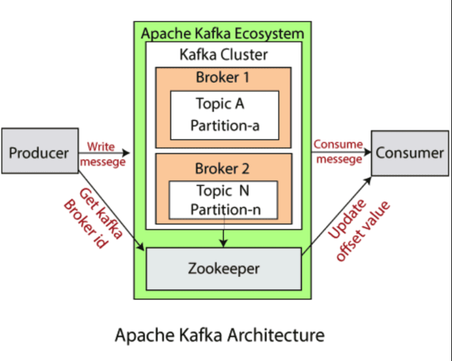
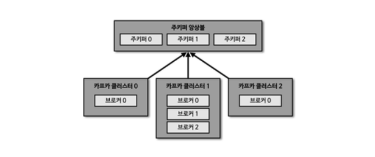
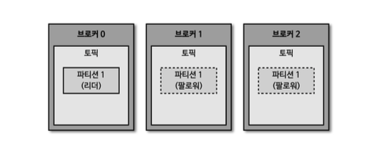
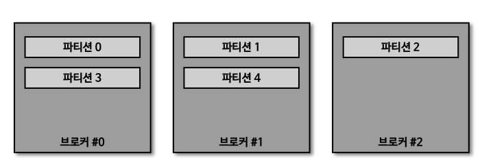

## 카프카 아키텍처 복습

지난 [포스팅](https://haon.blog/kafka/overview/) 에서 다루었던 카프카 아키텍처의 컴포넌트들에 대해 다시금 복습을 짧게 해본 뒤, 본격적으로 이번 포스팅의 주제로 넘어가보고자 한다.




- 카프카 클러스터(kakfa cluster) : 하나 이상의 카프카 브로커들의 집합이다. 카프카는 확장성과 내결함성을 위해 브로커들을 클러스터로 구성한다.

- **브로커(broker)** : 브로커는 개별 카프카 서버이다. 브로커는 프로듀서로부터 메시지를 전달받아서 토픽에 저장하고, 컨슈머에게 전달하는 역할을 한다. 브로커는 여러개의 토픽을 가질 수 있다.

- **토픽(topic)** : 토픽은 데이터가 저장되는 단위라고 할 수 있다. 마치 데이터베이스에서 테이블(table) 과 거의 유사한 개념이다. 토픽은 이름으로 식별되며, 토픽에 한 번 추가된 데이터는 수정될 수 없다.

- **파티션(partition)** : 카프카의 확장성을 위해서 토픽은 1개 이상의 여러 파티션으로 나뉠 수 있다. 레코드에 설정된 키(key) 가 없다면 라운드 로빈(round robin) 방식으로 파티션에 나뉘어 저장되고, 같은 키(key) 를 가진 레코드는 같은 파티션에 저장된다.

  - 반대로, 레코드에 설정된 키(key) 값이 있다면, 해당 키 값을 해싱(hashing) 한 결과값을 기반으로 저장된다.

  - 파티션의 내부 구조는 Queue 구조와 유사하게 이루어져 있다. 즉, FIFO 의 특징을 갖는다.

  - 컨슈머는 파티션에 적재된 데이터를 가져가저라도, 파티션에 적재된 레코드가 삭제되지 않는다. 즉, 컨슈머는 파티션에서 이미 가져온 동일한 데이터를 또 다시 가져오는 행위가 가능하다. (몰론, 어떤 특정 컨슈머가 어떤 데이터까지 읽었는지는 내부적으로 기록하고 있다. 이렇게 어떤 레코드까지 읽었는지 기록하는 행위를 '커밋' 이라고 한다. 컨슈머는 레코드는 읽어온 뒤 커밋을 하고, 앞서 커밋한 내용을 기반으로 어디서부터 새로운 레코드를 읽어오면 되는지 정보를 읽어온다.)

- **오프셋(offset)** : 파티션에 저장된 레코드는 증가하는 정수 ID 값을 갖고, 이 정수 ID 값을 오프셋이라고 부른다. 오프셋은 0부터 시작하며, 레코드가 파티션에 저장될 떄 마다 순차적으로 값이 증가한다. 특정 파티션의 각 레코드는 고유한 오프셋을 갖지만, 서로 다른 파티션 사이에는 고유하지 않다. 파티션에서 데이터를 읽을 때 작은 것 부터 큰 순서대로 읽는다.

- **레코드(record)** : 파티션에 저장되는 데이터이다. Key, Value, TimeStamp, Compression Type, Optional Headers, Partition and Offset Id 로 구성된다.

- **프로듀서(producer)** : 카프카에 요청을 날려서, 토픽에다 레코드를 추가하는 카프카 클라이언트이다. 카프카의 구성요소가 아니며, 카프카 외부에서 카프카에게 Request 를 전송하는 애플리케이션이다.

- **컨슈머(consumer)** : 하나 이상의 파티션과 토픽으로부터 데이터를 읽어오는 카프카 클라이언트이다. 기본적으로 사용 가능한 가장 낮은 오프셋부터 높은 오프셋까지 순서대로 레코드를 읽어온다. 하나의 토픽 내부의 여러 파티션으로부터 레코드를 읽어올 때는 순서가 보장되지 않는다. 파티션 0, 1, 2 로 부터 레코드를 읽어올 때 파티션 0 의 레코드만 바라봤을 때는 순서가 보장되지만, 읽어온 전체 레코드를 바라봤을 때는 파티션 0 ~ 2 의 레코드가 순서와 상관없이 섞여있을 수 있다.

- **컨슈머 그룹(consumer group)** : 동일한 컨슈머 인스턴스를 여러개 생성하여 컨슈머 그룹을 생성할 수 있다. 컨슈머 그룹을 구성하는 여러 컨슈머는 동일한 토픽의 각자 다른 파티션을 도맡아 메시지를 컨슘할 수 있다. 예를들어 토픽 A 에 파티션이 0, 1, 2 가 생성되어 있고, 컨슈머 그룹 A 에 컨슈머 a, b, c 가 있다고 가정하자. 이 경우 컨슈머 a 는 파티션 0 을, 컨슈머 b 는 파티션 1 을, 컨슈머 c 는 파티션 2 를 컨슘한다.

## 브로커(Broker)

### 1. 브로커란?

브로커는 개별 카프카 서버라고 설명했다. 브로커는 프로듀서로부터 메시지를 전달받아서 토픽에 저장하고, 컨슈머에게 전달하는 역할을 한다. 또한 브로커는 여러개의 토픽을 가질 수 있다.

- 브로커를 다시 표현하자면, 카프카 클라이언트(프로듀서, 컨슈머) 와 데이터를 주고받는 주체이다. 

- 데이터를 분산 저장하여 장애가 터지더라도 안건하게 사용할 수 있도록 도와주는 개별 카프카 서버이다. 

- 하나의 서버에는 한 개의 카프카 브로커 프로세스가 실행된다. 단, 카프카 브로커 서버 1대만으로도 기본 기능이 모두 제공되긴 하지만, 데이터를 안전하게 보관하고 처리하기 위한 가용성(availability) 를 보장하고자 브로커 서버를 여러개로 Scale Out 한다. 그리고 여러대의 브로커 서버를 하나의 카프카 클러스터 단위로 묶어서 운영한다.

- 카프카 클러스터로 묶인 브로커들은 프로듀서가 보낸 데이터를 안전하게 분산 저장하고, 복제(replication) 도 하며 고가용성(HA) 를 보장한다.

### 2. 브로커와 주키퍼(zookper)



여러대의 브로커 서버들을 하나의 카프카 클러스터 단위로 묶어서 서비스를 운영한다고 했다. 그런데 이떄, 카프카 클러스터를 실행하기 위해서는 **주키퍼(zookper)** 라는 컴포넌트가 카프카 클러스터에 필수로 연동되어 있어야 한다. 즉, 카프카 클러스터를 실행하기 위해선 주키퍼가 필요하다. (참고로, 카프카 Ver 3.0 부터는 주키퍼가 없어도 클러스러가 동작 가능해졌다.)

- 주키퍼 안에 znode 라는 단위를 생성하고, 각 znode 에다 카프카 클러스터를 매핑(연동) 해주는 과정이 필요하다. 즉, 주키퍼의 서로 다른 znode 각각에다 1:1 로 카프카 클러스터를 지정하면 된다.


### 3. 브로커의 세부 역할(기능)

#### 3-1. 컨트롤러(Controller) 의 FailOver 기능

카프카 클러스터의 여러 브로커 중에 한 대가 **컨트롤러(Controller)** 라는 역할을 수행한다. 컨트롤러는 다른 브로커들의 상태를 주기적으로 체크(Health Check) 하며, 문제가 발생한 브로커를 클러스터에서 빠르게 내쫓는다. (카프카는 지속적으로 데이터를 처리해야 하므로, 브로커의 상태가 비정상적이라면 빠르게 클러스터에 내쫓는다.)

문제가 된 브로커를 내쫓는 즉시, 내쫓긴 해당 브로커에 존재했던 **리더 파티션(leader partition)을 클러스터내 다른 브로커들에게 재분배**한다. 반대로 만약 컨트롤러 역할을 하는 브로커 본인에게 장애가 생겼다면, 본인은 내쫓기고 다른 브로커가 컨트롤러 역할을 대체한다. 

#### 3-2. 비휘발성 특징을 갖는 레코드를 삭제 가능한 주체

카프카는 다른 메시징 시스템과 다르게 컨슈머가 래코드를 가져가더라도 토픽 안의 래코드는 삭제되지 않는다. 즉, **토픽내 파티션에 쌓인 래코드는 비휘발성 특징을 갖는다.** 또한, 컨슈머나 프로듀서가 이러한 레코드에 대해 삭제를 요청할 수도 없다. 만약 비휘발성 특징을 갖는 레코드를 제거해버리고 싶더라도, **오직 브로커만이 레코드를 삭제할 수 있다.**

카프카에서 데이터 삭제는 파일 단위로 수행되는데, 이 하나의 파일 단위를 **로그 세그먼트(log segment)** 라고 부른다. 이 세그먼트에는 다량의 데이터가 담겨있기 때문에, 일반적인 DB 처럼 특정 데이터를 선별해서 삭제할 수 없다.

다시 정리하자면, **카프카에서 데이터는 세그먼트 단위로 삭제가 발생하기 때문에 로그 단위(레코드 단위) 로 개별 삭제는 불가능하다.** 또한, 로그(레코드) 의 메시지 키, 메시지 값, 오프셋, 헤더 등 이미 적재된 데이터에 대해서 수정 또한 불가능하기 떄문에 데이터를 적재할 때(프로듀서) 또는 데이터를 사용할 때(컨슈머) 데이터를 검증하는 것이 좋다.

#### 3-3. 컨슈머를 위한 오프셋 커밋

컨슈머 그룹이 특정 토픽의 특정 파티션으로부터 레코드를 가져가서 처리한 뒤에, **해당 파티션의 어느 레코드까지 읽고 처리했는지 기록하고자 오프셋을 커밋(commit)** 한다. 이렇게 오프셋을 커밋하는 주체가 바로 브로커이다.

커밋한 오프셋은 `__consumer_offsets` 이라는 토픽에 저장한다. 여기서 저장한 오프셋을 기반으로 컨슈머 그룹은 그 다음에 처리할 레코드 위치에 접근하여 레코드를 읽고 처리한다. 

#### 3-4. 코디네이터 역할 - 파티션 리밸런싱(rebalancing)

**코디네이터(coordinator)** 는 컨슈머 그룹내 각 컨슈머의 상태를 **체크(Health Check)**하고, 문제가 된 컨슈머를 내쫓은 뒤, 파티션을 다른 정상적인 컨슈머와 적절히 매핑되도록 재분배하는 역할을 한다. 이 코디네이터 역할을 브로커가 담당한다.

어떤 컨슈머가 문제가 터져서 컨슈머 그룹에서 내쫓기면, 매칭되지 않는 파티션을 정상 동작하는 다른 컨슈머로 재할당하여 흐름이 끊기지 않고 레코드가 처리되도록 돕는다. 이렇게 파티션을 컨슈머로 재할당하는 과정을 **'리밸런싱(rebalancing)'**  이라고 부른다.

### 4. 브로커의 데이터 저장 방식

#### 4-1. 데이터 저장 디렉토리

카프카를 실행할 떄 `config/server.properties` 의 `log.dir` 옵션에 정의한 디렉토리에 데이터를 저장한다. 토픽 이름과 파티션 번호의 조합으로 하위 디렉토리를 생성하며, 그 디렉토리 안에 데이터를 저장한다. 예를들면, 아래처럼 토픽 이름(hello.kafka) + 파티션 번호(0번) 조합으로 디렉토리가 생성되었으며, 해당 디렉토리 안에는 내부적으로 데이터가 저장되어 있다.

```
$ ls /tmp/kafka-logs
hello.kafka-0 
```

#### 4-2. 각 디렉토리별 저장되는 파일 데이터 종류(로그와 세그먼트)

또한 아래 예시를 보면, hello.kafka 이라는 토픽의 0번 파티션에 존재하는 데이터들을 상세히 조회할 수 있다.

- `log` 파일 : 메시지와 메타데이터를 저장한다. 
- `index` 파일 : 메시지의 오프셋을 인덱싱한 정보를 담은 파일이다.
- `timeindex` 파일 : 메시지에 포함된 timestamp 값을 기준으로 인덱싱한 정보가 담겨 있다.

```
$ ls /tmp/kafka-logs/hello.kafka-0
00000000000000000000.index 00000000000000000000.log
00000000000000000000.timeindex leader-epoch-checkpoint

00000000000000000010.index 00000000000000000010.log
00000000000000000010.timeindex leader-epoch-checkpoint

00000000000000000020.index 00000000000000000020.log
00000000000000000020.timeindex leader-epoch-checkpoint
```


### 5. 브로커의 데이터 복제(Replication) 기능



데이터 복제(replication) 기능은 카프카를 장애 허용 시스템(Fault Tolerant System) 을 고려해, 가용성을 확보할 떄 좋은 기능이다. 카프카의 **데이터 복제는 파티션 단위로 수행된다.** 토픽을 생성할 때 파티션의 복제 개수(replication factor) 도 같이 설정되는데, 직접 옵션을 선택하지 않으면 브로커에 설정된 옵션 값을 따라간다. 복제 개수의 최솟값은 1(복제 없음) 이고, 최댓값은 브로커 개수만큼 설정하여 사용할 수 있다.

복제된 파티션은 **리더(leader) 파티션** 과 **팔로워(follower) 파티션** 2가지 타입으로 구분한다. 프로듀서 또는 컨슈머와 직접 통신하는 파티션을 **리더 파티션**, 나머지 복제 데이터를 가지고 있는 파티션을 **팔로워 파티션**라고 부른다.

**팔로워 파티션** 들은 리더 파티션의 오프셋을 확인하여, 현재 자신이 가지고 있는 오프셋과 차이가 나는 경우 리더 파티션으로 부터 데이터를 가져와서 자신의 파티션에 저장한다. (마치, MySQL 레플리케이션 GTID 방식과 비슷한 느낌이 든다. GTID 값을 기반으로 어디까지 복제를 진행했는지 식별하는데, 카프카 레플리케이션 기능도 비슷한 것 같다.)

- 복제 개수 설정 : 참고로, 데이터 종류마다 다른 복제 개수를 설정할 수 있다. 상황에 따라서는, 각 토픽마다 복제 개수를 다르게 설정하여 운영 가능하는 것도 가능하다.

- 브로커에 장애가 터졌을 때 FailOver : 브로커가 다운되면, 해당 브로커에 있는 리더 파티션은 사용 불가능하기 때문에 팔로워 파티션 중 하나가 리더 파티션으로 빠르게 승격한다. 


---


## 토픽(Topic) 과 파티션(Partition)

### 토픽(Topic)

토픽은 데이터가 저장되는 단위로, 데이터를 타입별로 구분하기 위해 사용하는 단위이다. 앞서 설명했듯이, DB 에서 테이블과 유사한 개념이다. 또한 DB 테이블에서 각 테이블이 이름으로 식별되듯이, 각 토픽은 이름으로 식별되며, 한번 토픽에 추가된 데이터는 수정이 불가능하다고 했었다. 그리고 **토픽은 1개 이상의 여러개의 파티션을 보유할 수 있다.**  

### 파티션(Partition)

파티션에는 프로듀서가 보낸 데이터인 '레코드(Record)' 가 적재된다. 

#### 특징

- **FIFO & 삭제되지 않는 레코드** : 파티션은 내부 구조가 Queue 와 유사하게 FIFO 특징인 자료구조로 구성되어 있다. 단, 일반적인 자료구조 Queue 와 다르게 카프카의 파티션은 컨슈머가 레코드를 가져간다고 해서 삭제되지 않고, 계속 남아 있는다. 즉, 파티션에 저장된 레코드는 컨슈머가 가져가는 것과 별개로 저장되고, 라이프사이클이 관리된다. 이런 특징 때문에 토픽 내의 레코드는 다양한 목적을 가진 여러 컨슈머 그룹들이 토픽의 데이터를 여러번 가져갈 수 있다.

  - 앞서 설명했듯이, 파티션에 쌓인 레코드는 비휘발성 특징을 갖는다고 했었다. 오직 브로커만이 파티션내 레코드를 제거할 수 있다. 또한 브로커를 통해 레코드를 삭제할 때도, 삭제 단위가 세그먼트 단위로 발생하므로 개별 레코드 단위로 제거하는 것 또한 불가능하다고 했었다.

  - 또한, 로그(레코드) 의 메시지 키, 메시지 값, 오프셋, 헤더 등 이미 적재된 데이터에 대해서 수정 또한 불가능하다고 했었다. 따라서 데이터를 적재할 때(프로듀서) 또는 데이터를 사용할 때(컨슈머) 데이터를 검증하는 것이 좋다.

- **프로듀싱한 레코드가 어느 파티션에 저장될지에 대한 기준** : 특정 토픽에 프로듀싱한 레코드는 여러 파티션 중에서 어떤 파티션에 저장될까? 만약 레코드 설정된 키(key) 가 특별히 없다면 **라운드 로빈(round robin)** 방식으로 파티션에 나뉘어 저장된다. 반대로 키(key) 가 있다면 해당 키 값을 **해싱(hashing)** 한 결과값을 기반으로 저장될 파티션을 결정하게 된다. 이때, 같은 키(key) 값을 가진 레코드는 같은 파티션에 저장된다.


### 신규 토픽 생성시 파티션이 내부적으로 배치되는 방식 및 기준



신규 토픽을 생성한다면, 해당 토픽에는 신규 파티션들이 함께 여럿 생성될 것 이다. 만약 신규 토픽에 파티션을 5개 생성했을 경우를 가정해본다면, 위처럼 0번 브로커부터 시작하여 **라운드 로빈(round robin)** 방식으로 **리더 파티션(leader partition)** 들이 생성된다. **즉, 파티션들은 0번 파티션부터 시작하여 라운드 로빈 방식으로 각 브로커에 생성된다.**

라운드 로빈 방식으로 균등하게 생성됨으로써, 카프카 클라이언트는 여러 브로커에 골구로 균등하게 Request/Response 를 송.수신 할 수 있게된다. 이을 통해, **레코드가 특정 서버(브로커) 에 몰리는 현상(hot spot) 을 방지** 할 수 있다.

> 💡 그럼에도 불구하고, 만약 특정 브로커에 파티션이 몰리는 상황이 발생한다면 `kafka-reassign-partitions.sh` 명령어를 통해 파티션을 재분배 하여 해결할 수 있다.

### 파티션 개수와 컨슈머 개수의 처리량

파티션은 카프카의 병렬 처리의 핵심 컴포넌트로써, 그룹(컨슈머 그룹)으로 묶인 컨슈머들이 레코드를 동시간대에 병렬로 처리할 수 있도록 돕는다. 컨슈머의 처리량은 한정되어 있기에, 만약 많은 레코드를 병렬로 더 빠르게 처리하고 싶다면 컨슈머의 개수를 늘리는 것이 좋다. 그와 동시에, 컨슈머 개수만큼 정비례하여 파티션 개수도 늘리주면 처리량이 증가할 것이다. **즉, 컨슈머와 파티션의 개수를 함께 Scale-Out 하여 레코드 처리 속도를 늘릴 수 있다.**

### 파티션 개수를 줄이는 것은 불가능하다

단, 처리량 증가를 위해 파티션 개수를 늘릴 떄 한 가지 주의할 사항이 있다. 바로, 카프카에서 파티션 개수를 줄이는 기능은 지원하지 않는 점이다. 따라서 파티션을 늘리는 작업을 할 때는 그 개수를 다시 줄이는 작업이 불가능하므로 신중하게 파티션 개수를 정해야 한다.

**만약, 파티션 개수를 꼭 줄이고 싶다면 토픽을 삭제해버리고 다시 재생성하여 파티션을 새롭게 생성하는 방법이 유일하다.**

---

## 레코드(Record)


레코드는 **타임스탬프, 헤더, 메시지 키, 메시지 값(value), 오프셋으로 구성되어 있다.** 프로듀서가 생성한 레코드가 브로커로 전송되면 오프셋과 타임스탬프가 지정되어 저장된다. 브로커에 한번 적재된 레코드는 수정할 수 없고, **설정된 로그(레코드) 리텐션(retention) 기간 또는 용량 한도 설정 값에 따라서만 삭제된다.**

> 💡 오직 브로커만이 레코드를 삭제할 수 있는 주체로 이해했는데, 여기서 언급된 'retention 기간 또는 용량 설정값에 의해서만 삭제된다' 라는 표현이 있다. 이 설정에 의해 삭제하도록 만드는 주체가 브로커인지, 아니면 별건인지 추가 서칭이 필요하다. 

- **타임스탬프(timestamp)** : 레코드의 타임스탬프는 스트림 프로세시에서 활용하기 위한 시간을 저장하는 용로도 사용된다. 별다른 설정이 없다면, **기본 값으로 ProducerRecord 생성 시각(CreateTime)** 이 들어간다. 또는 이 필드에 **브로커 적재 시간(LogAppenTime)** 으로도 적재되도록 별도 설정할 수 있다. 이 옵션은 **토픽 단위로 설정 가능하다.**

- **오프셋(offset)** : 레코드의 오프셋은 프로듀서가 생성한 레코드에는 존재하지 않는다. 프로듀서가 전송한 레코드가 브로커에 적재될 때 오프셋이 지정된다. 오프셋은 0부터 시작되며, 순차적으로 1씩 증가한다. 컨슈머는 오프셋을 기반으로 처리가 완료된 데이터와, 앞으로 처리해야 할 데이터를 구분한다. 각 메시지는 파티션 별로 고유한 오프셋을 가지므로, 컨슈머에서 중복 처리를 방지하기 위한 목적으로도 사용한다.

- **헤더(header)** : 헤더에는 key-value 데이터를 추가할 수 있으며, 레코드의 스키마 버전이나 포맷과 같이 데이터 프로세싱에 간단히 참고할만한 정보를 담아서 사용할 수 있다.

- **메시지 키(message key)** : 메시지 키는 처리하고자 하는 메시지 값을 분류하기 위한 용도로 사용하며, 이를 **파티셔닝(partitioning)** 이라고 한다. 파티셔닝에 사용하는 메시지 키는 파티셔너(partitionor) 에 따라 토픽의 파티션 번호가 정해진다. 메시지 키는 필수가 아니며, 지정하지 않으면 null 로 설정된다. 메시지 키가 null 인 레코드는 특정 토픽의 파티션에 라운드 로빈으로 전달된다. 반대로, null 이 아닌 메시지 키는 **해싱(hashing)** 한 결과값에 의해서 특정 파티션에 매핑디어 전달된다. 

- **메시지 값(message value)** : 레코드의 메시지 값은 실질적으로 처리할 데이터가 담기는 공간이다. 메시지 값의 포맷(타입)은 제네릭으로, 사용자에 의해 구체 타입이 지정된다. Byte[], Float, String 등 다양한 타입을 지정 가능하다. 브로커에 저장된 레코드의 메시지 값은 어떤 포맷으로 직렬화되어 저장되었는지 알 수 없기 때문에, 컨슈머는 미리 역직렬화 포맷을 알고 있어야 한다. 


## 참고 및 인용

- 아파치 카프카 애플리케이션 프로그래밍 - 최원영
- https://kafka.apache.org/documentation/