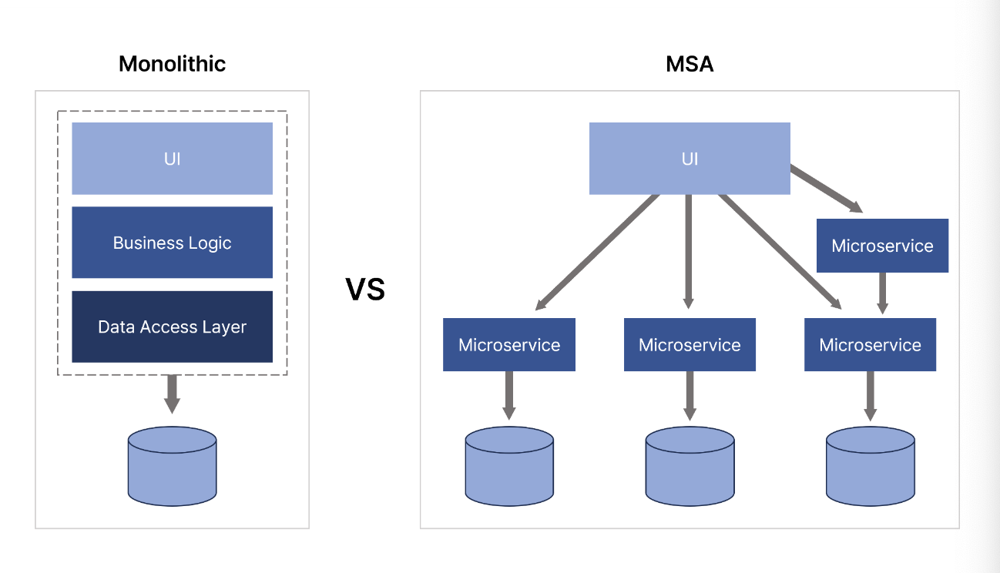

MSA 등장 배경과 이유는 어쩌면 다 풀어 설명할 수 있을 것 같지만, MSA 의 전반 오버뷰에 대해 다시 학습해보겠다는 차원에서 포스팅을 작성해본다.

## 모놀리식 아키텍처의 한계

MSA 에 대해 본격적으로 학습하기 전에, 우선 모놀리식 아키텍처 시스템에 대해 다시 짚어볼 필요가 있다. 모놀리식 시스템이란 웹 애플리케이션을 하나의 단일한 독립 시스템으로 구축하는 아키텍처이다. 즉, 하나의 애플리케이션에 모든 비즈니스 로직을 통째로 모아놓은 구조를 취한다.

이 특징 덕분에 모놀리식 아키텍처는 소규모 프로젝트에 적합하다. 개발, 빌드, 배포 및 테스트가 용이하다. 하지만, 기업의 시스템 규모가 점점 커지고 복잡해지는 경우 모놀리식 아키텍처의 한계점이 드러나기 시작한다. 무엇이 문제가 될까?

- `(1)` 작은 수정사항 하나에도 전체 빌드 및 재배포가 다시 일어나야 한다. 이 때문에 불필요하게 빌드 및 배포 시간을 잡아먹는 시간이 많아진다.

- `(2)` 많은 양의 코드가 몰려있어서 유지보수가 어려워진다.

- `(3)` 시스템내의 자그마한 한 부분에 장애가 발생하면 전파되어 시스템 전체에 영향을 미치고, 자칫 시스템의 모든 기능이 중단될 수도 있다.

- `(4)` 특정 부분에 대해서만 Scale Out 이 어렵다. 만약 배달의민족 서비스내의 여러 기능중에 주문 기능에 대해서만 요청의 빈도수가 매우 높아, 이에 대해서만 성능을 올리고 싶다 해보자. 즉, Scale Out 을 하고 싶은 경우인데, MSA 와 달리 주문 도메인 서버가 분리되어 있지 않으므로 부분 Scale Out 이 어렵다.

## MSA

MSA 는 이러한 모놀리식 시스템의 대안으로 등장했다. MSA 환경에서는 시스템을 여러 작은 독립적인 서비스로 분할하여 독립적으로 개발하고, 관리하고, 배포한다. 또한 장애 발생시 다른 서비스로 전파될 위험이 줄어든다. 발생한 해당 장애는 해당 마이크로 서버에서만 한정되고, 다른 마이크로 서버에는 영향을 미치지 않는다. 즉, 각 마이크로 서버는 서로에게 영향을 받지않고 독립적으로 확장(Scale Out) 가능하고, 관리할 수 있다.

### MSA 의 장점

- `(1)` 개발 유연성의 한계 극복 : 모놀리식 아키텍처는 모든 구성요소가 하나의 애플리케이션으로 구성되어 있어, 변화에 대한 대응이 어렵다. 만약 새로운 기능 추가를 하거나 자그마한 수정을 하나만 하고싶더라도 전체를 빌드, 재배포해야하는 문제가 있었다. 반면 MSA 는 꼭 필요한 독립적인 마이크로 서버만 수정 및 빌드/배포가 신속히 가능하다.

- `(2)` 배포/롤백 리스크 감소 : MSA 는 여러개의 서비스로 구성되어 있다. 이 중 수정이 필요한 부분만 빠르게 찾아 정확히 대응이 가능하다.

- `(3)` 장애 전파 방지 : 모놀리식은 특정 부분에 대한 장애가 시스템 전체로 전파될 수 있다. 반면 MSA 는 각각의 서비스가 약한 결합도를 가지므로 장애 전파를 최소화하거나 아예 막아버릴 수 있다. 이를 통해 장애 서비스만 빠르게 FailOver 할 수 있다.

- `(4)` 독립적인 Scale Out 가능 : 모놀리식에서 Scale Out 을 하고 싶다면 불필요한 서비스 및 도메인 코드까지 포함하여 함께 확장해야 한다. 반면 MSA 는 원하는 마이크로 서버만 Scale Out 이 가능하다. 이 덕분에 효율적인 리소스 사용이 가능해진다.

### 단점

하지만 당연하게 단점 또한 존재한다. MSA 는 만능이 아니다.

- `(1)` 모놀리식에 비해 복잡도가 매우 크다. 코드가 직관적이지 않기 때문에 단번에 코드를 이해하고 수정하는 것이 어려워서 유지보수가 자칫 어려워질 수 있다.

- `(2)` 성능이 저하될 수 있다 : MSA 의 각 마이크로 서버는 서로 네트워크 통신을 해야하므로 네트워크 지연 및 Latency 가 발생할 수 있다. 즉, 모놀리식 아키텍처에 비교한다면 성능이 더 느리다.

- `(3)` 데이터 일관성 : 서비스가 독립적으로 데이터를 가지고 있을 때 일관성을 유지하기 어려울 수 있다. 분산 시스템에서 트랜잭션 처리, 일관성 유지 등에 대한 처리 기법에 대한 높은 이해도가 요구된다.

- `(4)` 테스트가 어려워진다 : 모놀리식에 비해 여러 서비스간의 통합 테스트와 E2E 테스트를 수행하기 어려워진다.

## 참고

- https://metanetglobal.com/bbs/board.php?bo_table=tech&wr_id=38
- https://www.youtube.com/watch?v=H_DaPyUOeTo&t=54s
- https://www.youtube.com/watch?v=dSGnJWHuxtQ&list=PLkiWrI-TY1CepeQNZAySCu8NrhL_yjfZs
- https://www.youtube.com/watch?v=0lyrd5FlETQ
- https://www.youtube.com/watch?v=KNfNopXVYyc&t=18s
- https://hahahoho5915.tistory.com/71
- https://velog.io/@tedigom/MSA-제대로-이해하기-1-MSA의-기본-개념-3sk28yrv0e
