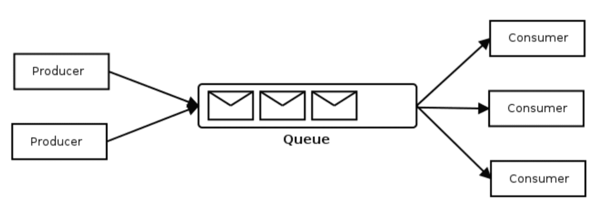
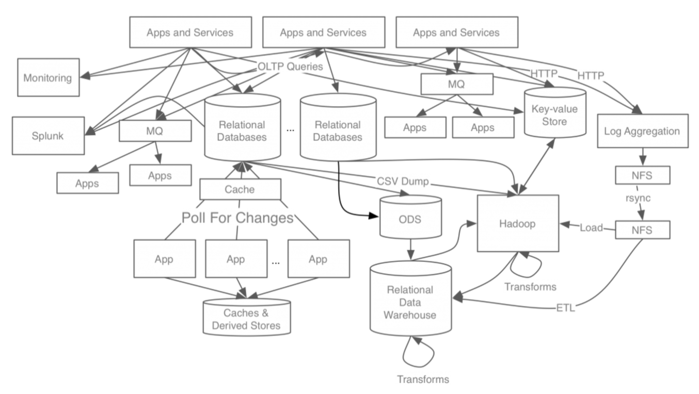
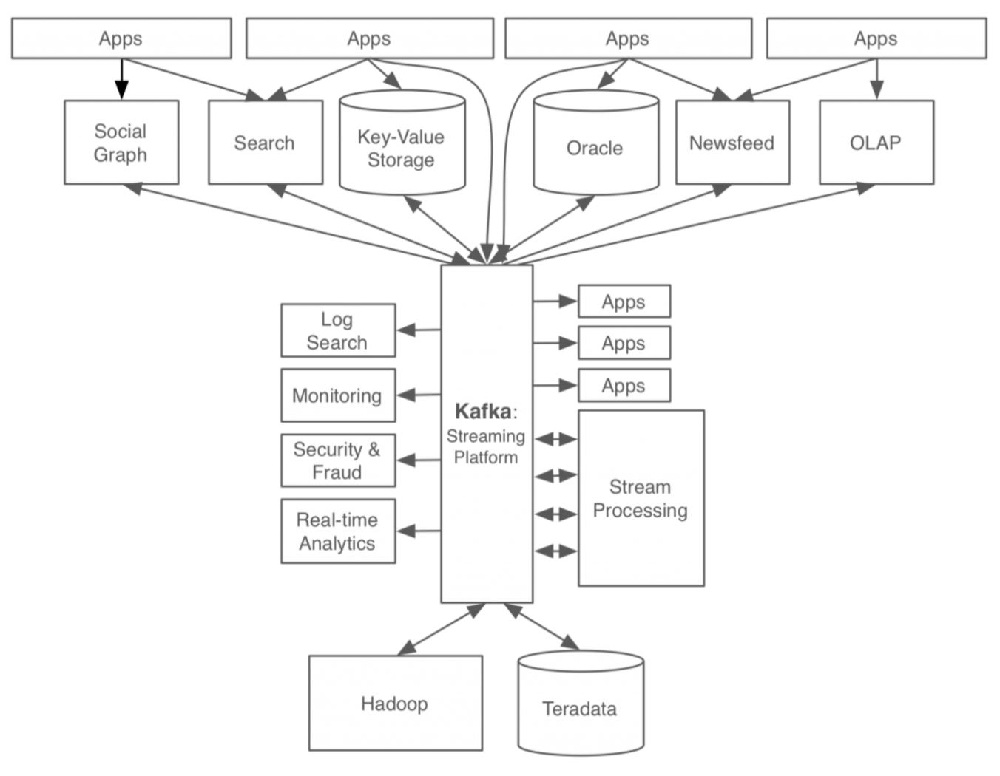
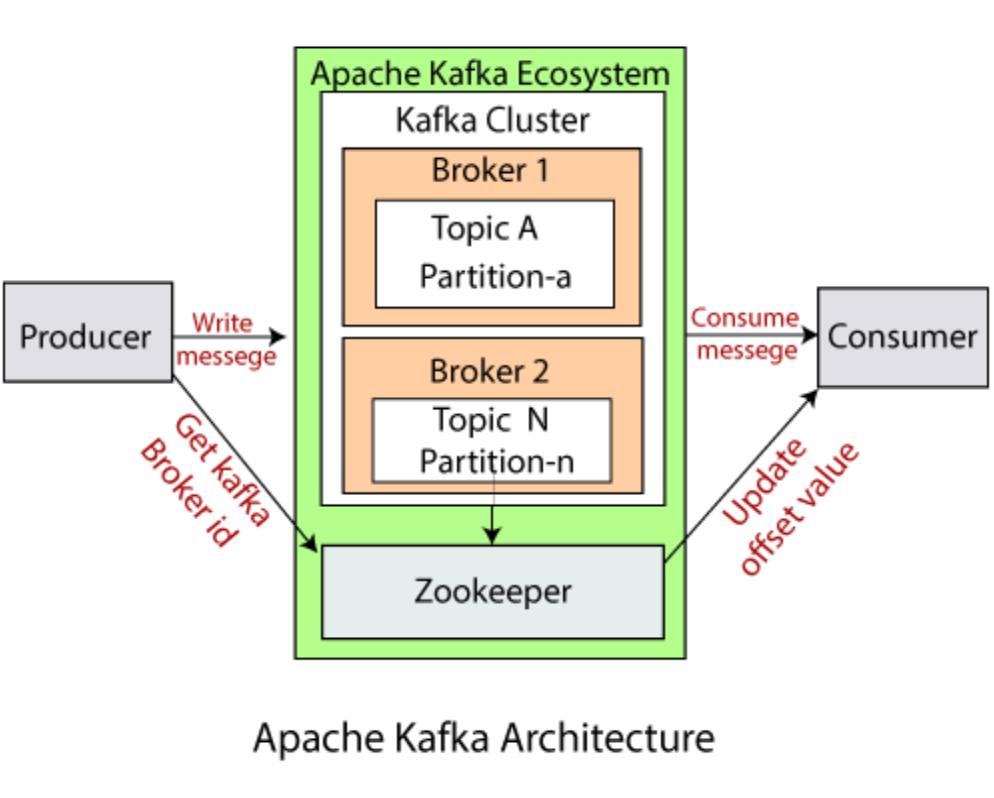

회사에서 카프카를 사용한다. OJT 를 듣고, 커뮤니케이션을 할때 카프카의 특징을 학습해두면 큰 도움이 될 것이라는 생각이 들었다. 이번 글에서는 카프카를 왜 사용하며, 어떤 특징이 있는지와, 간단한 내부 아키텍처에 대해 학습해보도록 한다. [참고1](https://hudi.blog/what-is-kafka/) 을 통해서 빠르게 학습을 해보도록 한다.

## 메시지 큐와 MOM 

메시지 큐를 사용하면 발신자와 수신자가 서로를 직접 참조하지 않고 메시지 큐를 통해서 통신한다. 즉, 서로를 직접 알 필요가 없기 때문에 **(1) 느슨한 결합(decoupling)** 관계를 만들어낼 수 있다. 발신자와 수신자는 서로가 의존하지 않으므로 **독립적으로 확장(Scale Out)** 할 수 있다. N:1:M 의 형태로 발신자, 수신자 사이에 메시지 큐가 메시지를 중개하기 때문이다. 이 덕분에 MSA 환경에서 메시지 큐는 빛을 발한다. 각 마이크로 서버는 메시지 큐를 활용하여 간접적으로 통신하고, 서로에게 미치는 영향을 최소화하며, 독립적으로 확장할 수 있기 때문이다.

또한 메시지 큐는 발신자(producer)가 발행한 메시지가 소비자(consumer) 에게 반드시 전달된다는 **(2) 보장성** 을 갖는다. 즉, 메시지는 유실되지 않는다. 이 덕분에 MSA 환경에서 각 마이크로 서버가 메시지 및 데이터 유실없이 안전하게 통신할 수 있음을 보장받게 된다.

또한, 메시지 큐를 사용하면 **(3) 비동기 통신(asynchoronous)** 를 구현할 수 있다. 만약 MSA 환경에서 마이크로 서버 A 와 B 가 통신하는 상황을 가정해보자. A 가 B 를 HTTP 통신을 통해 Request 를 날리는 경우에, 만약 메시지 큐가 없더라면 어떻게 될까? A 는 B 가 해당 Request 를 처리하고 동기적으로 Response 를 받을 때 까지 무한정 대기해야한다. 즉, 동기적 통신으로 인하여 A 는 B 에 대한 의존성이 커진다.

반대로 A 가 메시지를 메시지 큐에 발행하고, B 가 해당 메시지를 컨슘한다면? 즉, 비동기적으로 통신이 이루어진다면 어떻게 달라질까? 비동기 통신 덕분에 B 는 A 의 처리가 완료되기 전까지 대기하지 않아도 된다. B 는 다른 테스크를 수행하다가 메시지 큐로 부터 메시지가 발행되었다는 알림을 받을 때가 되었을 때, 상황에 알맞게 메시지를 꺼내오면 된다.

이러한 특성 덕분에 메시지 큐는 이미지 프로세싱, Batch 처리와 같이 **매우 무거운 작업을 처리하거나, 혹은 이벤트 드리븐 아키텍처에서 이벤트가 발생헀음을 알리기 위한 용도로 사용하기 적합하다.** 

### MQ 의 모델 : Point to Point 와 Pub/Sub

메시지 큐는 크게 **Point to Point(P2P)** 와 **Pub/Sub** 모델 2가지로 구분할 수 있다. P2P 모델은 한 대의 발신자가 한 대의 수신자에게 메시지를 보내는 방식이다. 즉, **메시지 전송 대상이 한 대로 고정되어 있다.** 반면 Pub/Sub 모델은 발신자가 **토픽(topic)** 이라고 불리는 공간에 메시지를 전송하면, 그 **토픽(topic)** 을 구독하고 있는 수신자 모두 메세지를 수신하는 방식이다. 즉, **전송 대상이 다수이다.**

그리고 **MOM(Message Oriented Middleware)** 이라고 하면 일반적으로 Kafka, RabbitMQ, ActiveMQ 를 뜻한다. Redis 는 Pub/Sub 을 지원하긴 하지만, MOM 으로는 부르지 않는다. 그리고 RabbitQMQ 와 ActiveMQ 는 P2P 와 Pub/sub 모델을 함께 지원하는 반면에, **Kafka 는 Pub/Sub 모델만을 지원한다.**

## 카프카

카프카는 RabbitMQ, ActiveMQ 대비 **높은 확장성과 내결함성, 대용량 데이터 처리, 실시간 데이터 처리에 특화**되어있는 메시징 시스템이다. 카프카는 어떤 문제를 해결하기 위해 등장했을까? 아래 그림은 카프카 등장 이전의 일반적인 대규모 아키텍처이다.  각 서비스 또는 데이터 저장소가 End-To-End 로 연결되어 아주 복잡하고, 의존.참조 관계를 파악하기 힘든 구조를 가지고 있다.

이렇듯 카프카가 없는 구조는 무엇이 문제가 될까? 당연하게도, 시스템을 확장하기 어려운 구조가 된다. 앞서 설명했듯이, 메시지 큐가 없다면 **(1) 강한 의존성** 이 생기고, **(2) 동기적 통신(synchoronous)** 이 발생하기 때문이다. 또한 앞선 그림처럼 **(3) 복잡한 참조.의존관계** 를 가지게 된다.

반면 카프카를 도입하면 위처럼 시스템 아키텍처가 매우 단순해진다. 모든 이벤트와 데이터 흐름이 카프카에 중앙화되어 있다. **생산자(Producer)** 는 이벤트 및 데이터를 카프카에 발행한다. 그리고 해당 이벤트 및 데이터를 필요한 곳(컨슈머) 에서 가져다 쓴다.

예를들어 카카오 모행 서비스가 MSA 로 전환되고, 카프카를 도입하는 상황을 가정해보자. 사용자가 여행지 정보를 조회할 경우 여행지 조회 마이크로 서버로 Request 를 날려서 여행지 정보를 조회할 수 있을 것이다. 동시에 해당 마이크로 서버는 여행지가 클릭되었다는 메시지를 카프카로 전달한다. 이후 해당 메시지를 여행지 추천 시스템 마이크로 서버가 컨슘하여, 회원에게 어떤 여행지를 향후에 추천할지 정보를 최신화한다. 동시에 Logstash(로그 수집기) 또한 해당 메시지를 컨슘하여 개발자가 디버깅하기에 용이하도록 로그를 생성해둔다.

만약 카프카가 없었더라념 각 서버의 통신은 어떻게 이루어졌을까? 여행지 조회 서비스가 추천 서버, Logstash 서버에게 각각 다른 데이터 파이프라인을 통해서 데이터를 전송해야 했을 것이다. 여기서 마이크로 서버가 더욱이 증설 된다면, 의존관계가 더욱이 복잡해 질 것이다. 이에 반해 카프카를 사용하여 데이터 흐름을 중앙화한하면, 복잡도와 성능이 극명히 개선될 것이다.

## 카프카의 특징 (vs. 다른 MOM)

그렇다면, 카프카가 다른 MOM 와 다르게 갖는 특징이 무엇일까? 

- **높은 처리량(throughput) 과 낮은 지연시간(latency)** : 카프카는 대용량 데이터를 실시간으로 처리할 수 있도록 설계되었다. 따라서 높은 TPS 처리량을 가지며, 실시간 스트림, 로그 집계, 이벤트 드리븐 아키텍처 구현에 적합하다.

- **메시지 내구성 (비휘발성)** : 카프카의 메시지는 휘발되지 않는다. 카프카의 메시지느 메모리가 아닌 디스크에 영구 저장된다. (이와 달리 Redis Pub/Sub 은 메시지가 디스크에 저장되지 않고, 구독자에서 장애가 터지면 메시지가 유실된다.) ActiveMQ, RabbitMQ 모두 디스크에 메시지를 영구 저장하는 옵션도 지원하지만, 기본적으로는 컨슘된 메시지를 유실된다. 반면, 카프카는 기본적으로 모든 메시지를 (이미 컨슘된 메시지까지) 디스크에 영구 저장한다.

- **분산 아키텍처** : 카프카는 카프카 클러스터 내부에 여러대의 브로커(broker) 서버를 구성하여, 높은 확장성과 내결함성(Fault Tolerance) 을 갖는다. 이는 RabbitMQ, ActiveMQ 와 비교했을 떄 카프카만이 갖고 있는 차별점이다.

- **Pull 기반 메시지 소비** : RabbitMQ 와 ActiveMQ 는 브로커가 컨슈머로 메시지를 Push 하는 방식인데 비해, 카프카는 컨슈머(consumer)가 능동적으로 알아서 브로커로부터 메시지를 가져오는 Pull 방식을 취했다. 이 덕분에 컨슈머(consumer)는 본인의 처리 능력에 따라서 메시지를 컨슘할 수 있기 때문에, 브로커 처리 능력에 연연하지 않고 본인만의 최적의 성능을 낼 수 있다.

## 카프카 아키텍처

- **카프카 클러스터(kafka Cluster)** : 하나 이상의 카프카 브로커들의 집합이다. 카프카는 확장성과 내결함성을 위해 브로커들을 클러스터로 구성한다.

- **브로커(broker)** : 브로커는 개별 카프카 서버이다. 브로커는 프로듀서로부터 메시지를 전달받아서 토픽(topic) 에 저장하고, 컨슈머에게 전달하는 역할을 한다. 브로커는 여러개의 토픽을 가질 수 있다.

- **토픽(topic)** : 토픽은 데이터가 저장되는 단위라고 할 수 있다. 토픽은 이름으로 식별된다. 토픽에 한번 추가된 데이터는 수정될 수 없다.

- **파티션(partition)** : 카프카의 확장성을 위해서 토픽은 1개 이상의 여러 파티션으로 나뉠 수 있다. 레코드에 키가 없다면 라운드 로빈으로 파티션에 나뉘어 저장되고, 같은 키를 가진 레코드는 같은 파티션에 저장된다.

- **오프셋(offset)** : 파티션에 저장된 레코드는 증가하는 정수 ID 값을 갖고, 이 정수 ID 를 오프셋이라고 부른다. 오프셋은 0부터 시작하며, 레코드가 파티션에 저장될 떄 마다 시퀀셜하게(순차적으로) 증가한다. 특정 파티션의 각 레콤드는 고유한 오프셋을 갖지만, 서로 다른 파티션 간에는 고유하지 않다. 파티션에서 데이터를 읽을 때 작은 것부터 큰 순서대로 읽는다.

- **레코드(record)** : 파티션에 저장되는 데이터이다. Key, Value, TimeStamp, Compression Type, Optional Headers, Partition and Offset Id 로 구성된다.

- **프로듀서(producer)** : 카프카에 요청하여 토픽에 레코드는 추가하는 클라이언트이다. 카프카의 구성 요소가 아니며, 카프카 외부에서 카프카에게 Request 하는 애플리케이션이다.

- **컨슈머(consumer)** : 하나 이상의 파티션과 토픽으로부터 레코드를 읽어오는 클라이언트이다. 기본적으로 사용 가능한 가장 낮은 오프셋부터 높은 오프셋까지 순서대로 레코드를 읽어온다. 하나의 토픽의 여러 파티션으로부터 레코드를 읽어올 때는 순서가 보장되지 않는다. 파티션 0, 1, 2 로 부터 레코드를 읽어올 떄 파티션 0의 레코드만 바라봤을 때는 순서가 보장되지만, 읽어온 전체 레코드를 바라볼 때는 파티션 0 ~ 2 의 레코드가 순서와 상관없이 섞여있을 수 있다.

- **컨슈머 그룹(consumer group)** : 동일한 컨슈머 인스턴스를 여러개 생성하여 컨슈머 그룹을 구성할 수 있다. 컨슈머 그룹을 구성하는 여러 컨슈머는 동일한 토픽의 각자 다른 파티션을 도맡아 메시지를 컨슘할 수 있다. 예를들어 토픽 A 에 파티션이 0, 1, 2 가 생성되어 있고, 컨슈머 그룹 A 에 컨슈머 a, b, c 가 있다고 가정하자. 이 경우 컨슈머 a 는 파티션 0을, 컨슈머 b는 파티션 1을, 컨슈머 c는 파티션 2를 컨슘한다.

## 참고

- https://hudi.blog/what-is-kafka/
- https://www.youtube.com/watch?v=catN_YhV6To
- https://tecoble.techcourse.co.kr/post/2021-09-19-message-queue/
