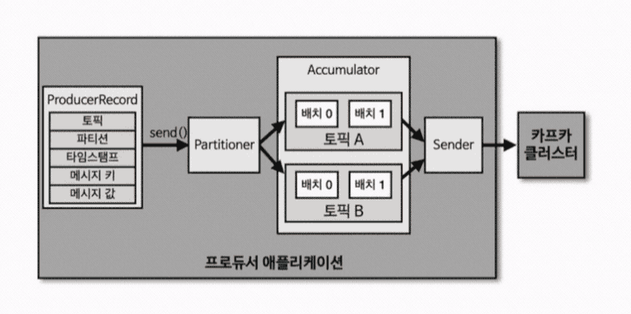
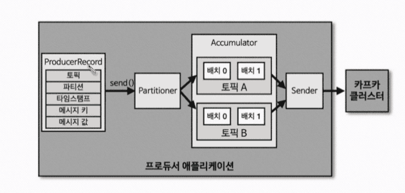

## 프로듀서



카프카에서 데이터의 시작점은 프로듀서이다. 프로듀서 애플리케이션은 카프카에 필요한 데이터를 선언하고, 브로커의 특정 토픽 안의 파티션에다 데이터를 전송한다. 프로듀서는 데이터를 전송할 때 리더 파티션을 가지고 있는 카프카 브로커와 직접 통신한다. 

- **이때, 프로듀서와 컨슈머 모두 이 카프카 클러스터에 있는 토픽에 접근할 때는 반드시 리더 파티션이 있는 브로커와 통신한다.** 이전에 학습했기를, 리더 파티션은 프로듀서가 보낸 데이터를 저장하는 역할을 수행하며, 팔로워 파티션은 리더에 있는 데이터를 실시간으로 복제(Replication) 하며, 장애 발생시 FailOver 하는 역할을 한다고 했었다. 즉, 프로듀서는 실질적으로 통신을 하는 브로커가 위치한 리더 파티션과 통신을 하게 된다.

- 프로듀서는 내부적으로 카프카 브로커와 통신할 때, **내부적으로 파티셔너(Partitioner), 배치 생성 단계를 거치게 된다.**

### 프로듀서 내부 구조

프로듀서 내부는 다음과 같은 컴포넌트들로 구성된다.



- `ProducerRecord` : 프로듀서가 전송하는 레코드 타입이다. 다시 말해, 이 클래스를 통해 선언된 레코드 객체를 프로듀서가 프로듀싱 할 수 있다. **내부적으로는 토픽(topic), 파티션(partition), 타임스탬프(timestamp), 메시지 키(message key), 메시지 값(message value) 으로 구성 및 정의할 수 있다.** 단, 오프셋은 별도로 존재(지정)하지 않는다. 오프셋은 카프카의 특정 파티션에 데이터가 저장된 이후에 지정된다. 그리고 기본적으로는, 프로듀서에서 레코드에 토픽과 메시지 값만 지정되어 있더라도 레코드를 전송할 수 있다. (나머지는 모두 Optional 하다.)

- `send()` : 레코드를 전송 요청하는 메소드이다. 즉, Producer Record 는 `send()` 메소드를 호출하여 전송할 수 있다. 이때 유의할 점은, 레코드를 send 를 호출하는 그 즉시 전송하는 것이 아니라, 내부적인 과정을 일부 거친 뒤 전송하게 된다. 

- `파티셔너(Partitioner)` : 파티셔너는 **어느 파티션으로 레코드를 전송할지 지정해주는 라우팅 역할을 담당한다.** (마치 로드밸런서의 역할이다.) 레코드의 메시지 키(message key) 를 해싱하여 도출된 해시 결과값을 기반으로 몇번 파티션에 전송할지를 내부적으로 결정해준다. 동일한 메시지 키를 가진 레코드는 항상 동일한 파티션으로 전송되는 특징이 있다.

- `Accumulator` : 파티셔너에 의해 어떤 파티션으로 전송될지 결정된다면, Accumulator 에서는 배치라는 단위로 레코드 여러개를 한 뭉텅이(배치)로 묶는 작업을 한다. 배치로 왜 묶는가라고 하면, 매번 모든 레코드 각각에 대해 send() 를 호출할 때 마다 레코드를 전송하게 되면 네트워크상의 병목과 리소스 낭비가 심해질 것이다. 따라서, 레코드 여러개를 배치로 묶고 전송하게 된다. 즉, Accumulator 를 활용하면 레코드가 많응 경우 최대한 레코드 여러개를 배치로 묶어서 전송하면 높은 데이터 처리량을 가질 수 있게된다. 다시 정리하자면, **Accumulator 에 의해 배치라는 단위로 묶여진 레코드 뭉텅이가 일정량 쌓이고 나면, Sender 배치를 브로커와 통신해서 전송하게 된다.**


## 파티셔너

프로듀서 API 를 사용하게 되면 2가지의 파티셔너를 제공받게 된다. 바로 `UniformStickyPartitioner` 와 `RoundRobinPartitioner` 이다. 이 중에 디폴트 파티셔너는 `UniformStickyPartitioner` 으로 설정되어 있다. 이 두 가지 파티셔너들은 각각 어떻게 동작할까? 이 파티셔너들은 레코드에 메시지 키가 있을 때와, 반대로 메시지 키가 없을 때 동작 방식이 조금씩 다른데, 한번 살펴보자.

### 메시지 키가 있을 경우 동작

메시지 키가 있을 경우, `UniformStickyPartitioner` 와 `RoundRobinPartitioner` 모두 메시지 키를 해싱한 결과 값을 특정 파티션에 매핑하고, 해당 파티션에다 레코드를 전송한다. **즉, 동일한 메시지 키를 갖는 레코드는 항상 동일한 파티션(파티션 번호) 에 전송된다.** 

단, 파티션 개수가 도중에 갑자기 변경될 경우, 기존에 매핑되었던 메시지 키와 파티션 번호간의 매핑 관계는 깨지게 된다. 즉, 파티션 개수가 변경되면 기존 레코드는 새롭게 해싱된 결과값을 기반으로 또 다른 파티션에 새롭게 매핑된다. (몰론 해시 결과값이 이전과 동일한 상황이라면, 해당 레코드는 동일한 파티션에 다시 매핑되는 케이스도 존재할 수 있다.)

**따라서, 만약 메시지 키를 활용해야 하는 상황이라면, 파티션 개수를 충분히 많은 개수로 지정하는 것이 좋다.** 프로듀서가 보내는 데이터량, 컨슈머가 처리하는 데이터량을 고민을 해서 파티션 개수를 충분히 크게 지정하자. 왜냐하면, 파티션 개수에 따라서 컨슈머의 처리량이 달라지기 때문이다. (파티션 개수만큼 컨슈머 개수를 늘려서 데이터를 처리하기 때문이다.) 따라서, 파티션 개수를 변경하는 일이 발생하지 않도록 만들기 위해선 파티션 개수를 충분히 큰 개수로 지정하고 운영하면 된다. 

예를들어 컨슈머가 초당 10개의 데이터를 처리하고, 프로듀서는 100개씩 처리(전송)하는 경우라면, 컨슈머를 10개씩 띄우면 되겠구나라는걸 알고 10개의 파티션을 생성하면 될 것이다. 그런데 문제는, 프로듀서가 보내는 데이터량이 언제든 더 많아질 수도 있을 것이다. 따라서 파티션 개수를 10개보다도 더 많이 미리 널널하게 늘려 놓고 운영하면 좋을 것이다.

### 메시지 키가 없을 경우 동작

반대로 메시지 키가 없을 경우는 앞서 살펴본 두 파티셔너의 동작 방식이 비슷하면서도 조금 다르다.

- 공통점 : 파티션에 라운드 로빈(Round Robin) 방식으로 데이터를 최대한 골구로 동일하게 분배시킨다.

- 차이점 : 파티셔너가 레코드를 전송하는 묶음 단위가 다르다. RoundRobinPartitioner 는 레코드를 단일(1개) 단위로 전송하며, UniformStickyPartitioner 는 레코드를 배치 단위로 묶어서 전송한다.
  - `RoundRobinPartitioner` : 단일(1개) 레코드(ProducerRecord) 가 유입되는대로 그 즉시 각 파티션에 라운드 로빈 방식으로 레코드를 전송한다. Accumulator 에서 묶이는 데이터 단위 정도가 적기 때문에 처리량(성능)이 낮다.
  - `UniformStickyPartitioner` : Accumulator 에서 레코드 여러개가 배치로 묶일 때 까지 대기했다가 라운드 로빈 방식으로 레코드를 전송한다. 배치 단위로 데이터를 전송하기 때문에 비교적 처리량이 뛰어나다.

`UniformStickyPartitioner` 는 그 특성상 `RoundRobinPartitioner` 에 비해 성능이 뛰어나다. 이 덕분에 `UniformStickyPartitioner` 는 현재 디폴트 파티셔너로 지정되어 있다.

## 커스텀 파티셔너

앞선 파티셔너 외의 파티셔너를 직접 구현하고 싶다면 `Partitioner` 인터페이스를 구현하면 된다. Partitioner 인터페이스 구현체 내부적으로 메시지 키 또는 메시지 값에 따라 매핑되는 파티션 로직을 구현해볼 수 있다.

## 프로듀서 API 코드 구현하기

카프카 프로듀서 API 코드는 어떻게 구현하는지 기본적인 스펙만 간단하게 알아보자.

### 카프카 설정

```java
Properties configs = new Properties();
configs.put(ProducerConfig.BOOTSTRAP_SERVERS_CONFIG, "kafka-test:9092"); // (1)
configs.put(ProducerConfig.KEY_SERIALIZER_CLASS_CONFIG, StringSerializer.class.getName()); // (2)
configs.put(ProducerConfig.VALUE_SERIALIZER_CLASS_CONFIG, StringSerializer.class.getName()); // (3)
```

`(1)` 에서는 Bootstrap 서버를 지정하였으며, `(2)` 와 `(3)` 에서는 메시지 키와 값에 대한 직렬화 옵션을 지정하였다. 여기서는 StringSerializer 으로 직렬화 옵션을 지정하였다.

### KafkaProducer Template

```java
KafkaProducer<String, String> producer = new KakfaProducer<>(configs);
```

카프카 프로듀서 인스턴스를 정의해주었다. 카프카 프로듀서 인스턴스를 만들 때는, 앞서 정의한 직렬화 옵션(StringSerializer)에 알맞게 템플릿 형태(<String, String>)를 지정해줘야 한다. 또한 앞서 생성한 카프카 Properties 를 파라미터로 지정해준다.

위와 같이 프로듀서 인스턴스를 정의하면, "kafka-test:9092" 에 있는 카프카 클러스터와 연동함년서 메시지 키와 값을 String 으로 직렬화하는 프로듀서 인스턴스가 되는 것이다.  

### ProducerRecord

#### ProducerRecord 기본 선언

```java
String messageValue = "test-messagge-value";
ProducerRecord<String, String> record = new ProducerRecord<>(TOPIC_NAME, messageValue); 
produdcer.send(record);
```

앞서 정의한 KafkaProducer 인스턴스의 `send()` 메소드를 호출하여 `ProducerRecord` 를 전송할 수 있다. `ProducerRecord` 는 토픽 이름과 메시지 값을 필수로 지정해야한다. 앞서 학습했듯이, ProducerRecord 는 Offset 이 없는 형태이며, 나중에 이 레코드가 브로커에 저장될 때, 즉 리더 파티션에 저장될 때 Offset 이 할당된다. 

또한, 앞서 살펴봤듯이 `send()` 를 호출한다고 해서 레코드가 바로 전송되지 않는다. Accumulator 가 배치로 레코드 여러개를 최대한 모은 뒤에 전송하게 된다.

#### 파라미터 개수에 따른 ProducerRecord 선언 여러가지 방법

```java
ProducerRecord<String, String> record1 = new ProducerRecord<>(TOPIC_NAME, "message key1", "message value1"); // (1)
ProducerRecord<String, String> record2 = new ProducerRecord<>(TOPIC_NAME, 3, "message key1", "message value1"); // (2)
```

- `(1)` 메시지 키를 가진 ProducerRecord 선언 :  파타미터 3개를 넣으면 순서대로 토픽, 메시지 키, 메시지 값을 지정하게 되는 것이 된다.

- `(2)` 파티션 번호를 지정한 ProducerRecord 선언 : 파라미터 4개를 넣으면 순서대로 토픽, 파티션 번호, 메시지 키, 메시지 값을 지정하게 되는 것이 된다.

### CustomPartitioner 구현하기

```java
public class CustomPartitioner implements Partitioner {
  
  @Override
  public int partition(String topic, Object key, byte[] keyBytes, Object value, byte[] valueBytes, Cluster cluster) {

    if(keyBytes == null) {
      throw new InvalidRecordException("Need message key");
    }

    if(((String)key).equals("key1")) {
      return 3;
    }

    List<PartitionInfo> partitions = cluster.partitionsForTopic(topic);
    int numPartitions = partitions.size();
    
    return Utils.toPostitive(Utils.murmur2(keyByte)) % numPartitions;
  }
}
```

위처럼 `Partition` 인터페이스를 구현한 커스텀 파티셔너 구현체를 정의할 수 있다. 위 파티셔너의 경우 "key1" 이라는 메시지 레코드 키를 전달받은 경우 3번 파티션으로 전송되도록 구현하였다. 반면 이 외의 레코드에 대해선, 다시 해시값으로 변환해서 데이터가 전송되도록 하였다.

## 참고

- 아파치 카프카 애플리케이션 프로그래밍 - 최원영
- https://kafka.apache.org/documentation/
