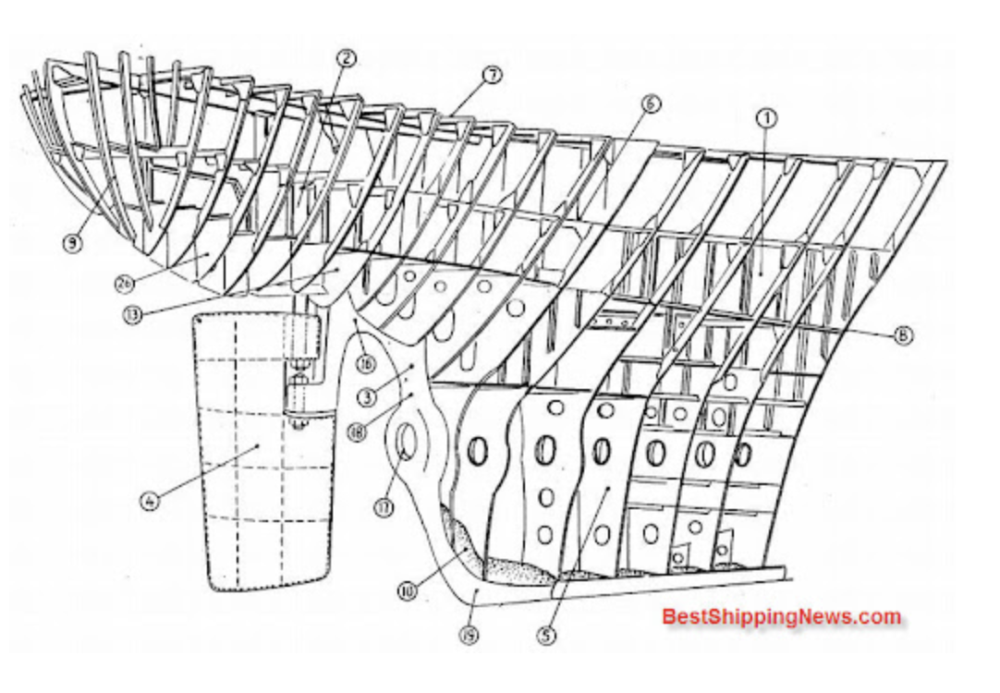

## BulkHead 패턴



벌크해드란 한국어로 번역하면 격벽을 뜻한다. 격벽이란 선박의 공간을 여러 구획으로 분할하고자 사용되는 벽을 의미한다.

벌크헤드 패턴은 선박의 격벽으로부터 영감을 받아 만들어졌다. 리소스를 격리하여, 일부 컴포넌트에 장애가 발생하더라도, 그 장애가 시스템 전체로 전파되는 것을 막게끔 하는 패턴이다.

## BulkHead 패턴 미사용시 장애 발생

빠른 학습을 위해 [참고1](https://internet-craft.tistory.com/77) 과 [참고2](https://hudi.blog/bulkhead-pattern/) 를 다수 참고하여 학습을 이어가보도록 하겠다. MSA 환경에서 서비스 A, B, C 가 존재한다고 해보자. 서비스 A 의 B-API 는 서비스 B 를 호출하여 응답을 만들고, C-API 는 서비스 C 를 호출하여 응답을 만들어낸다고 해보자.

그런데, 서비스 B에서 장애가 발생하여, 응답을 매우 느리게 주는 상황이라면 어떻게 할까? 이런 상황에서 서비스 A의 B-API 호출이 발생한다면, 서비스 A 는 서비스 B의 응답을 기다리느라 쓰레드를 계속 점유할 것이다. 장애 시간이 길어짐에 따라, 서비스 A의 톰캣 쓰레드 풀은 고갈될 것이다. 그렇다면 C-API 는 서비스 B에 의존하지 않지만, 톰캣 쓰레드를 할당받지 못하여 덩달아 장애 전파 영향력을 받게 된다.

### BulkHead 패턴을 적용하면?

여기에 BulkHead 패턴을 사용하게 된다면? 두 쓰레드 풀을 격리하면 어떻게 될까? 여전히 서비스 B에 의존적인 B-API 의 요청을 철하는 쓰레드 풀은 고갈 상태가 유지되지만, 서비스 C에 의존적인 C-API 의 요청을 처리하는 쓰레드 풀은 고갈 상태가 아니므로, 서비스 B 장애 여부와 무관하게 요청을 잘 처리할 것이다.

즉, BulkHead 패턴의 핵심 아이디어는 **"리소스 격리를 통한 장애 격리"** 이다. 앞서들은 예시에선 쓰레드 풀을 예로 들었지만, 커넥션 풀과 같은 다른 자원에도 이 패턴을 적용해서 장애 격리를 해볼 수 있다. 또한 꼭 리소스 풀을 물리적으로 분리하지 않고도, 세마포어 등의 `상호배제(Mutual Exclusion)` 기법을 사용해서 BulkHead 패턴을 구현해볼 수 있다.

## BulkHead 패턴 구현을 통한 장애 격리

백문이 불여일타. 간단한 실습을 통해 BulkHead 패턴을 적용해보자. 우리는 의도적으로 장애 전파가 발생하는 상황을 가정해보고, 이에 BulkHead 패턴을 적용하여 장애를 격리해볼 것 이다.

```java
import java.util.concurrent.ExecutorService;
import java.util.concurrent.Executors;

public class Main {
    public static void main(String[] args) {
        ExecutorService tomcatThreadPool = Executors.newFixedThreadPool(4);

        long startTime = System.currentTimeMillis();

        for (int i = 0; i < 4; i++) {
            tomcatThreadPool.execute(() -> callBService(startTime));
        }

        for (int i = 0; i < 4; i++) {
            tomcatThreadPool.execute(() -> callCService(startTime));
        }

        tomcatThreadPool.shutdown(); // 작업 완료 후 shutdown
    }

    public static void callBService(long callTime) {
        System.out.println("* 서비스 B 호출 완료 | 소요 시간: " + (System.currentTimeMillis() - callTime) + "ms");
    }

    public static void callCService(long callTime) {
        System.out.println("* 서비스 C 호출 완료 | 소요 시간: " + (System.currentTimeMillis() - callTime) + "ms");
    }
}
```

위 코드를 실행하면, `tomcatThreadPool` 의 쓰레드들은 서비스 B 를 호출하기 위해 모두 할당된 후, 작업을 잘 마치고 난 뒤 서비스 C 를 호출하기 위해 할당될 것이다. 그럼 아래와 같이 정상적으로 작업이 완료된다.

```
* 서비스 B 호출 완료 | 소요 시간: 1ms
* 서비스 B 호출 완료 | 소요 시간: 1ms
* 서비스 B 호출 완료 | 소요 시간: 1ms
* 서비스 B 호출 완료 | 소요 시간: 1ms
* 서비스 C 호출 완료 | 소요 시간: 6ms
* 서비스 C 호출 완료 | 소요 시간: 6ms
* 서비스 C 호출 완료 | 소요 시간: 6ms
* 서비스 C 호출 완료 | 소요 시간: 6ms

```

그런데 서비스 B의 데이터베이스에 장애가 발생하여, 서비스 B가 굉장히 느리게 응답을 하기 시작했다. 이를 아래처럼 `Thread.sleep()` 을 사용해서 표현한다.

```java
public static void callBService(long callTime) {
    try {
        Thread.sleep(20_000); // 데이터베이스 장애로 인해 응답이 매우 느림
    } catch (InterruptedException e) {
        Thread.currentThread().interrupt(); // 인터럽트 상태 복구
        System.out.println("서비스 B 호출 중 인터럽트 발생");
    }
    System.out.println("* 서비스 B 호출 완료 | 소요 시간: " + (System.currentTimeMillis() - callTime) + "ms");
}
```

이렇게 서비스 B 에 장애가 발생한 상황에서는. 서비스 B를 호출하기 위한 쓰레드를 비정상적으로 오래 보유한다. 그렇게 되면 서비스 C만 필요한 요청이 톰캣 쓰레드를 할당받지 못하고, 아래처럼 장애가 전파될 것이다.

```
* 서비스 B 호출 완료 | 소요 시간: 20008ms
* 서비스 C 호출 완료 | 소요 시간: 20026ms
* 서비스 C 호출 완료 | 소요 시간: 20027ms
* 서비스 C 호출 완료 | 소요 시간: 20027ms
* 서비스 C 호출 완료 | 소요 시간: 20027ms
* 서비스 B 호출 완료 | 소요 시간: 20008ms
* 서비스 B 호출 완료 | 소요 시간: 20007ms
* 서비스 B 호출 완료 | 소요 시간: 20007ms
```

서비스 C를 호출하는 함수는 호출 즉시 결과를 반환할 수 있었으나, 서비스 B 호출로 인해 쓰레드 풀이 밀려 정상적으로 쓰레드를 할당받지 못하게 되었고, 그 결과 서비스 C를 호출하는 함수의 응답까지 덩달아 굉장히 느려졌다. 장애가 전파된 것이다. 실제 스프링 애플리케이션이었다면, 타임아웃이 발생하여 아예 응답을 주지 못하고 예외가 발생했을수도 있다.

### BulkHead 를 적용해 장애 격리

```java
import java.util.concurrent.ExecutorService;
import java.util.concurrent.Executors;

public class Main {
    public static void main(String[] args) {
        ExecutorService bulkheadForB = Executors.newFixedThreadPool(4);
        ExecutorService bulkheadForC = Executors.newFixedThreadPool(4);

        long startTime = System.currentTimeMillis();

        // 서비스 B는 bulkheadForB에서 실행
        for (int i = 0; i < 4; i++) {
            bulkheadForB.execute(() -> callBService(startTime));
        }

        // 서비스 C는 bulkheadForC에서 실행
        for (int i = 0; i < 4; i++) {
            bulkheadForC.execute(() -> callCService(startTime));
        }

        // 작업 완료 후 자원 해제
        bulkheadForB.shutdown();
        bulkheadForC.shutdown();
    }

    public static void callBService(long callTime) {
        try {
            Thread.sleep(20_000); // DB 장애로 지연
        } catch (InterruptedException e) {
            Thread.currentThread().interrupt();
            System.out.println("서비스 B 인터럽트 발생");
        }
        System.out.println("* 서비스 B 호출 완료 | 소요 시간: " + (System.currentTimeMillis() - callTime) + "ms");
    }

    public static void callCService(long callTime) {
        System.out.println("* 서비스 C 호출 완료 | 소요 시간 : " + (System.currentTimeMillis() - callTime) + "ms");
    }
}
```

그럼 결과는 아래와 같을 것이다. 서비스 C를 호출하는 메서드는 더이상 서비스 B의 장애에 영향을 받지 않는다.

```
* 서비스 C 호출 완료 | 소요 시간: 2ms
* 서비스 C 호출 완료 | 소요 시간: 2ms
* 서비스 C 호출 완료 | 소요 시간: 2ms
* 서비스 C 호출 완료 | 소요 시간: 2ms
* 서비스 B 호출 완료 | 소요 시간: 20010ms
* 서비스 B 호출 완료 | 소요 시간: 20009ms
* 서비스 B 호출 완료 | 소요 시간: 20008ms
* 서비스 B 호출 완료 | 소요 시간: 20009ms
```

## Resilience4j Bulkhead

실무에선 위와 같이 직접 BulkHead 를 구현할 필요가 없다. Resilience4j 에선 이미 벌크헤드 패턴 기능을 제공하기 떄문이다. Resilience4j의 Bulkhead 는 쓰레드 풀 또는 세마포어를 사용하여 동시 호출 수를 제어하며, 이에 따라 특정 작업으로 인해 과도한 리소스를 차지하지 않도록 리소스를 격리할 수 있도록한다.

application.properties 에 아래와 같이 추가한다.

```
resilience4j.bulkhead.instances.backendA.maxConcurrentCalls=4
resilience4j.bulkhead.instances.backendA.maxWaitDuration=0
```

`maxConcurrentCalls` 는 허용할 최대 동시 호출 수, `maxWaitDuration` 은 최대 동시 호출 수에 도달했을 때 추가 요청이 들어온 경우 얼마나 기다려줄 것인지를 나타낸다. 지금과 같은 설정은 최대 4개의 동시 요청을 허용하며, 5번째 요청부터는 즉시 실패하도록 한다. backendA 는 벌크헤드의 이름이다.

```java
import io.github.resilience4j.bulkhead.annotation.Bulkhead;
import io.github.resilience4j.bulkhead.Bulkhead.Type;
import org.springframework.web.bind.annotation.GetMapping;
import org.springframework.web.bind.annotation.RestController;

@RestController
public class BulkheadController {

    @Bulkhead(name = "backendA", type = Type.SEMAPHORE)
    @GetMapping("/bulkhead")
    public String bulkhead() {
        try {
            Thread.sleep(10_000); // 10초 지연
        } catch (InterruptedException e) {
            Thread.currentThread().interrupt();
            return "INTERRUPTED";
        }
        return "DONE";
    }
}
```

위와 같이 간단하게 컨트롤러를 작성했다. `type` 은 `Bulkhead.Type.SEMAPHORE` 와 `Bulkhead.Type.THREADPOOL` 두가지가 있으며, 생략하면 기본값은 세마포어이다. 해당 엔트포인트로 4개를 초과한 동시 요청을 넣게 되면, `BulkheadFullException` 이 발생한다.

## 참고

- https://hudi.blog/bulkhead-pattern/
- https://internet-craft.tistory.com/77
