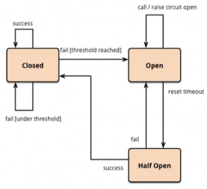
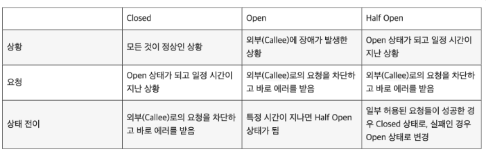

## 서킷 브레이커 패턴의 등장 및 개념

MSA 환경에서 개발을 하다보면, 다른 서비스 컴포넌트에서 제공하는 외부 API 를 호출해야 하는 경우가 흔하다. 특히나 전체적인 시스템 구성이 MSA 로 되어 있다면, 다른 서비스를 호출하는 경우가 매우 빈번하다. 문제는 서버들이 장애가 발생할 수 있다는 점인데, 호출한 다른 서비스에 장애가 발생했다면 장애가 전파되어, 현재 외부 API 를 호출하는 본 서비스에까지 장애가 전파될 수 있다. 

특히나 MSA 환경은 클라이언트의 요청이 수 많은 서비스를 거쳐서 응답이 이루어질 수 있다는 점이다. 서비스 A 로 부터 시작된 장애가 서비스 B, C, D, E, ... 로 계속 전파되어 영향을 미칠 수 있다는 점이다. 또한, 장애가 시작될 경우 장애가 어떤 서비스에서부터 시작된 것인지 그 장애 시작점을 파악하기는 쉽지 않다. 따라서, MSA 환경내 각 서비스는 스스로 다른 컴포넌트의 장애가 발생했을 경우를 대비한 장애 우회 정책, 장애 격리 및 FailOver 등을 할 수 있어야 한다.

따라서 장애가 발생한 서비스를 탐지하고, 요청을 재전송하지 않고 장애를 다른 방법으로 우회하도록 차단할 필요가 있다. 

## 서킷 브레이커 패턴



위 문제처럼, MSA 환경내 각 서비스간에 장애 전파를 차단하기 위해 등장한 디자인패턴이 빠로 서킷 브레이커 패턴(Circuit Breaker Pattern) 이다. 서킷 브레이커 패턴은 이름과 같이 과부하가 걸린 전기를 자동으로 차단해서, 전기 사고를 방지하는 회로 차단기와 비슷하게 동작한다.

서킷 브레이커는 다른 서비스에 대한 호출을 모니터링하며, 요청의 실패율이 일정 임계치(Threshold) 를 넘어가면, 장애가 발생한 서비스로의 요청을 차단하여 장애 전파를 막는 방식이다. 만약 서킷 브레이커가 열렸다면, 서비스에 요청하는 대신에 Fallback 을 하게된다. 



서킷 브레이커는 위와 같이 크게 3가지 타입의 `상태값(State Value)` 를 가진다. `Closed`, `Open`, `Half Open` 이 3가지 타입이 존재하는데, 각 상태를 정리하면 다음과 같다.

- `Closed` : 요청 실패율이 정해놓은 임계치보다 낮은 상태로, 평소대로 모든 요청이 처리된다.
- `Open` : 요청 실패율이 정해놓은 임계치보다 높아진 상태로, 서킷 브레이커가 열린 경우, 요청을 보내지 않고 즉시 실패 처리한다.
- `Half Open` : Open 이후 일정 시간이 지나면 Half Open 된다. 이 상태에서 요청이 성공하면 Closed 상태로 변경되고, 실패하면 Open 상태를 유지한다.

서킷 브레이커가 동작하는 상황 예시를 들자면 다음과 같다.

- `(1)` 일반적으로 외부 서버는 정상 실행중이므로, 서킷에 닫혀있고 요청이 정상적으로 전달된다.
- `(2)` 이때, 외부 서버에 장애가 발생했다고 해보자.
- `(3)` 이후의 요청들은 장애가 발생한 외부 서버가 더 이상 전달되지 않고 차단되며, 빠르게 에러 실패 또는 에러를 응답을 반환한다.
- `(4)` 이후의 요청들은 외부 서버가 정상적으로 복구된다.
- `(5)` 이후의 외부 서버가 정상적으로 북구된다.
- `(6)` 회로가 Open 상태가 된지 특정 시간이 지나고, Half Open 상태로 변경된다.
- `(7)` 일부 요청들이 외부 서버로 전달되고, 응답에 성공하여 Closed 상태가 된다.
- `(8)` 모든 요청들이 정상적으로 복구된다.

Open 상태가 되면 특정 시간이 지나야 Half Open 상태가 된다. 만약 Half Open 상태가 되었는데 외부 서버가 복구되지 않았다면, 요청들은 실패해서 다시 Open 상태로 변경될 수도 있다. 여기서 중요한 것은 이러한 상태 변경이 자동으로 수행된다는 것이며, 상태 전이를 위한 시간들은 시스템 내부에서 관리되므로, 대부분 타임아웃과 관련된 모니터링 시스템을 제공해준다.

## 서킷 브레이커 패턴의 장점과 필요성

서킷 브레이커 패턴을 도입하였을 때 얻는 장점은 다음과 같이 정리해 볼 수 있다.

#### 장애 감지 및 격리

만지 장애가 발생한 서비스를 호출한다면 요청이 타임아웃만큼 대기하게 되고, 쓰레드와 메모리 및 CPU 등의 자원을 점유하게 된다. 이것은 결국 시스템 리소스를 부족하게 만들어 장애를 유발할 수 있다. 장애가 발생한 것은 다른 서비스인데, 장애가 전파되는 것이다. 서킷 브레이커 패턴은 장애가 발생한 서비스를 탐지하고, 더 이상 요청을 보내지 않도록 차단함으로써 장애를 격리시켜준다. 그래서 장애가 발생한 기능 외의 다른 기능들은 동작하게 하여, 시스템의 안정성을 높일 수 있다.

#### 자동 시스템 복구

서킷 브레이커는 요청이 차단되면, 해당 서비스가 주기적으로 검사한다. 그리고 해당 서비스가 복구되었다면 차단이 해제되고, 정상적으로 요청을 보내게 된다. 이러한 부분들은 시스템이 자동으로 해주므로, 개발자들이 신경쓰지 않아도 된다. 대부분 타임아웃 등을 위한 모니터링 기능까지 제공하여, 서킷 브레이커가 모든 연동이 적용되면 데시보드를 통해 전체 시스템들의 연동 현황까지 모니터링 가능하다.

#### 빠른 실패 및 고객 응답

만약 다른 서비스가 문제있음을 알 수 있다면, 타임아웃 동안 자원을 낭비할 필요가 없다. 그래서 빠르게 장애를 탐지하는 것이 중요한데, 서킷브레이커 패턴을 적용하면 가능한 빠르게 실패를 반환하고, 고객에게 응답을 전달할 수 있다.

#### 장애 서비스로의 부하 감소

외부 서비스가 완전히 죽지는 않았는데, Slow Query 등의 이유로 사용 가능한 쓰레드가 더 이상 남아있지 않을 수도 있다. 이때, 계속 요청을 보내는 것은 외부 서비스의 상황을 악화시켜서 장애를 유발할 수 있다. 그러므로 해당 서비스가 안정을 찾도록 멈추는 것이 좋은데, 서킷 브레이커를 사용하면 해당 서비스는 더 이상의 요청이 유입되지 않아서 장애를 복구할 수 있는 기회를 얻을 수 있다.

#### 장애 대안 커스터마이징

외부 서비스에서 장애가 발생했다면, 원하는 데이터를 얻지 못할 수 있다. 이때, 아무런 대응책이 없다면 해당 서비스 역시 장애가 발생한다. 서킷 브레이커를 적용하면, 장애 대안을 커스터마이징 할 수 있는데, 예를들어 다른 소스로부터 값을 얻어오거나, 서킷 브레이커가 캐싱해 둔 값으로 응답하는 등 다양한 방법을 적용할 수 있다. 그러면 외부에 장애가 발생해도 문제없이 서비스를 운영할 수도 있다.

국내 대부분의 서비스들은 MVC 기반으로 되어있다. 스프링 MVC 는 멀티 쓰레드 기반으로 동작하므로, 장애가 있는 서비스를 호출하면 쓰레드를 점유에 의한 응답 지연이 발생하기 쉽다. 그래서 장애가 전파되기 쉬운데, 서킷 브레이커를 적용하면 빠르게 장애가 발생한 서버로의 요청을 차단하고 이를 해결할 수 있다.

## Resilience4j 를 사용한 서킷 브레이커 구현

서킷 브레이커 패턴을 개발자가 직접 구현하는 방식보단, 기존에 잘 만들어진 라이브러리를 사용하는 방법이 더 좋다. Resilience4j 는 함수형 프로그래밍으로 설계된 경량(light weight) 장애 허용(fault tolerance) 라이브러리로, 서킷브레이커 패턴을 위해 사용된다. Resilience4j 를 활용한 간단한 서킷 브레이커 구현을 실습해보도록 한다.

> 💡 서킷 브레이커 실습 코드는, [참고1](https://hudi.blog/circuit-breaker-pattern/) 을 보았을 때 아래 처럼 간단히 구현 가능한 방법도 있는 것으로 보이나, 외부 API 호출시 FeignClient 에 대한 서킷 브레이커 설정을 통해서도 외부 API 호출시 장애를 차단하는 방법이 있는 것으로 보인다. 이에 대한 실습 코드는 향후 잘 이해가 되었을 떄, 추가로 실습해보도록 한다.


### gradle

```java
dependencies {
	implementation("org.springframework.boot:spring-boot-starter")
	implementation("org.springframework.boot:spring-boot-starter-web")
	implementation("org.springframework.boot:spring-boot-starter-aop")
	implementation("io.github.resilience4j:resilience4j-spring-boot2")
}
```

의존성은 위와 같다. `spring-boot-starter-app` 의존성이 없으면, 뒤이어 사용할 `@CircuitBreaker` 어노테이션을 사용할 수 있으니 추가하도록 한다.

### application.yml

```java
resilience4j.circuitbreaker:
	configs:
		default:
			registerHealthIndicator: true
			slidingWindowSize: 10
			minimumNumberOfCalls: 5
			permittedNumberOfCallsInHalfOpenState: 3
			automaticTransitionFromOpenToHalfOpenEnabled: true
			waitDurationInOpenState: 5s
			failureRateThreshold: 50
			eventConsumerBufferSize: 10
	instances:
		orderService:
			baseConfig: default
```

resilience4j-spring-boot2 의존성을 사용하므로, 스프링부트 application.yaml 을 통해 선언적으로 서킷 브레이커에 대한 설정을 할 수 있다.

### 컨트롤러

```java
@RestContoller
class OrderController {
	private val orderService: OrderService,
) }
	
	@GetMapping("/orders/{orderId}")
	fun getOrder(
		@PathVariable orderId: Long,
	): Order? {
		return orderService.getOrder(orderId);
	}
}
```

주문을 수행하는 컨트롤러다. 주문 API 요청시 고객 정보를 가져오기 위해 Service Layer 에서 UserClient API 를 호출하는 상황을 가정하도록 한다.


### 서비스내 서킷 브레이커 적용

```java
@Service
class OrderService(
	private val userClient: UserClient,
) {
	
	@CircuitBreaker(name = "orderService", fallbackMethod = "fallback")
	fun getOrder(id: Long): Order? {
		val user = userClient.getUser(1)
		return Order(id = id, user = user)
	}
	
	private fun fallback(e: Exception): Order? {
		println("Circuit Breaker is opened : $e")
		return null
	}
}
```

서비스 코드에 서킷 브레이커를 적용했다. `@CircuitBreaker` 어노테이션을 붙이면 된다. name 파라미터는 서킷 브레이커 설정시 넣어둔 이름과 동일하다. 

fallbackMethod 파라미터는 서킷이 열렸을 때 fallback 을 하기위해 실행할 메소드 이름을 입력한다. 단, 메소드 시그너치는 `@CircuitBreaker` 가 붙어있는 메소드와 메소드 시그너치가 동일해야하되, 추가로 Exception 파라미터를 받아야 한다. 다만, 위와 같이 원본 메소드의 파라미터를 생략하고 Exception 만 받아도 괜찮은 듯 하다.

## 참고 및 인용

- https://hudi.blog/circuit-breaker-pattern/
- https://mangkyu.tistory.com/261
- https://mangkyu.tistory.com/290