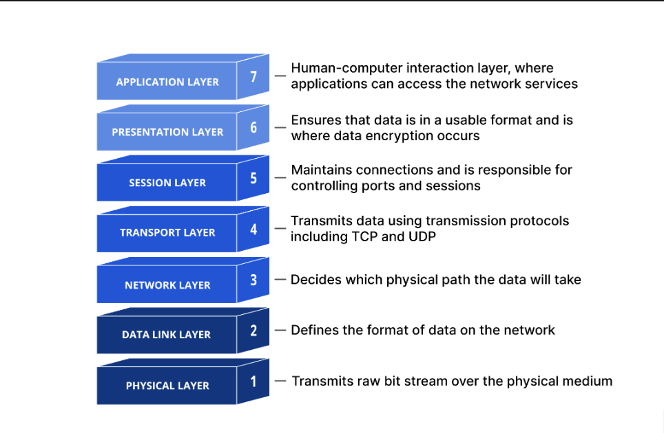

네트워크를 다시금 공부하면서 장기 기억화를 위해 글을 작성한다. OSI 의 각 계층에 대해선 향후 포스트에서 자세히 다루도록 할 것이며, 현 포스트에선 네트워크의 전반 흐름에 대해 오버뷰로 간단히만 다루도록 한다.

---

## 랜(LAN) 과 웬(WAN)

네트워크를 이해하려면 통신 범위의 단위인 LAN 과 WAN 에 대해 선수로 알아야한다. `랜(LAN, Local Area NetWork)` 란 좁은 범위내에 특정 지역을 범위로 하는 네트워크를 뜻하며, `웬(WAN, Wide Area NetWork)` 이란 2개 이상의 LAN 을 연결한 광범위의 네트워크를 뜻한다. 또한 LAN 은 WAN 에 비해 비교적 근거리 통신망 형태로 구축되므로 전송 속도가 매우 빠르다.

### LAN

특히 LAN 의 구성방법에 대해 자세히 알 필요가 있다. 랜의 구성 방법, 즉 네트워크 접속 형태는 다음과 같이 3가지 방식으로 구할 수 있다. (3가지 이상의 다양한 방식으로 LAN 을 구성 가능하지만, 이 정도만 알아도 충분할 것으로 보인다.)

> - 스타형 (star) : 하나의 허브(Hub) 에 여러대의 컴퓨터를 연결하는 방식
> - 링형 (ring) : 개별 컴퓨터가 서로 원(circle) 형태로 연결되는 방식
> - 버스형 (bus) : 하나의 긴 케이블에 컴퓨터를 포함한 모든 주변 장치를 연결하는 방식

한편 WAN 은 LAN 과 달리 광범위한 영역을 커버해야 하기 때문에 LAN 과 같은 별도의 네트워크 접속 형태가 없다. 이미 LAN 에서 접속 형태를 정의헀으니, 또 다시 네트워크를 구성할 필요가 없기 때문이다. 네트워크 망을 구축시 LAN 사이에 통신이 잘 이루어지도록 연결만 해주면 된다.

---

## 네트워크 기본 구성장치

컴퓨터와 컴퓨터간에 통신하기 위해선 다양한 접속 장치가 필요하다. 접속 장치에 대해 자세한 설명은 향후 포스트에서 자세히 다룰것이므로, 여기선 간단히 장치의 종류만 언급하겠다.

컴퓨터 A, 컴퓨터 B 가 있다고 가정했을 때 이 둘은 서로 통신하기 위해 허브, 스위치, 라우터등의 네트워크 장치가 필요하다. 가령 이 예시의 경우 컴퓨터 A 가 B 에 대해 데이터를 통신하기 위해선 아래와 같은 플로우로 통신하게 된다.

> 컴퓨터 A -> 허브1 -> 스위치A -> 라우터 -> 스위치B -> 허브2 -> 컴퓨터B

반대로 컴퓨터 B 에서 A 방향으로 통신하길 원한다면 위 플로우와 반대 방향으로 이루어질 것이다.

각 장치에 대한 기능을 정리해보면 다음과 같다.

> - 허브: 여러대의 컴퓨터를 연결할 때 사용하는 장치
> - 스위치: 대역폭을 확대해주는 장치
> - 라우터: 컴퓨터 B를 찾아가기 위한 길을 제시하는 장치
> - 브리지: 2개 이상의 네트워크를 연결하기 위한 장치로, 데이터를 한 곳에서 다른 곳으로 전달하는 역할

이때 브리지는 OSI 7계층에서 각 상.하위 계층간에 데이터를 전갈할 때 다리 역할을 하는 것으로 이해하면 된다. 또한 스위치를 설명할 때 `대역폭` 이란 키워드가 등장했는데, 대역폭이란 1초당 처리할 수 있는 데이터의 양을 의미한다. 다시 말해, 대역폭이 넓을 수록 해당 네트워크가 동일한 시간내에 처리할 수 있는 양은 커지는 것이다.

---

## OSI 7계층

`프로토콜(protocol)` 이란 컴퓨터나 원거리 통신 장비 사이에서 메시지를 주고받는 양식과 규칙의 체계를 뜻한다. 쉽게말해, 컴퓨터 세계에서 형식적으로 나누는 인사 과정을 뜻한다. 네트워크를 조금이라도 접해봤으면 알듯이, `OSI 7계층` 과 `TCP/IP 4계층` 이 대표적인 프로토콜이다. 이들의 간단한 오버뷰에 대해 알아보자.

### OSI 7계층의 등장배경, 필요성

1980년대 부터 시작하여 "다양한" 통신 기술, 컴퓨터의 생산은 급격히 증가했다. 이에따라 당연하게도 컴퓨터간의 통신을 위해 각 회사마다 각기 다른 다양한 허브, 스위치, 라우터 장치를 생산하기 시작했다. 이렇듯 다양한 제조사에서 만든 컴퓨터와 허브, 스위치, 라우터를 서로 연결하여 통신할 떄 각기 다른 통신방법, 프로토콜을 사용하게 되었다.

이에 따라 OSI 프로토콜 표준 규약이 등장했다. **제조사마다 각기 다른 자신들만으 프로토콜을 사용하기 때문에 호환성을 보장하기 위해 등장했다.** 다양한 장치가 서로 간의 통신을 보장할 수 있는 규악이며, 각 계층별로 필요한 장치들을 정의했기 때문에 제조사들은 통신에 필요한 프로토콜을 통일할 수 있게 되었다.

### OSI 7계층

OSI 7계층은 컴퓨터와 컴퓨터가 통신하는 구조를 7개의 계층으로 정의해둔 약속, 즉 프로토콜이다.

각 계층에 대한 특징은 다음과 같다.

> - 7계층(Application Layer): 사용자와 애플리케이션 간의 소통을 정의함.
> - 6계층(Presentation Layer): 데이터를 어떻게 표현할지 정의함.
> - 5계층(Session Layer): 통신을 설정, 관리, 종료함.
> - 4계층(Transport Layer): 신뢰성있는 정확한 데이터를 전달함.
> - 3계층(Network Layer): 네트워크 장치간의 경로 선택과 데이터를 전송함.
> - 2계층(Data Link Layer): 물리적인 연결을 위해 오류없는 데이터를 전달함.
> - 1계층(Physical Layer): 전기 신호를 이용해서 통신 케이블로 데이터를 전송함.

### 캡슐화와 역캡술화, 헤더(Header)

송신자가 데이터를 전송할 때는 `캡슐화`, 반대로 수신자가 데이터를 전달받을때는 `역캡슐화` 가 발생한다. 캡슐화는 7계층에서 1계층 방향으로, 반대로 역캡슐화는 1계층에서 7계층으로 발생하면서 각 계층을 지나칠 때 마다 `헤더(Header)` 라는 단위가 덧붙여진다(해제된다).

이때 각 계층에서 덧붙여지는 헤더(Header) 는 각 계층마다 다른 이름으로 부른다. 각 계층에서 사용하는 전송 단위인 헤더를 나열해보면 다음과 같다.

> - 응용 계층부터 세션 계층까지(7~5계층): 데이터(메시지)
> - 전송 계층(4계층): 세그먼트(segment)
> - 네트워크 계층(3계층): 패킷
> - 데이터 링크 계층(2계층): 프레임
> - 물리 계층(1계층): 비트

다시 설명하자면 캡슐화 과정이 일어날 떄 한 단계씩 아래로 내려가면서 통신을 위한 정보인 헤더가 하나씩 붙게된다.
`세그먼트` 에서는 포트 번호, `패킷` 에서는 송.수신자의 IP 주소, `프레임` 에서는 송.수신자의 MAC 주소가 붙게 된다.

반대로 역캡술화 과정이 발생할땐 헤더 정보가 하나씩 벗겨진다. `데이터 링크 계층(프레임)`에선 수신자가 MAC 주소를 획득하고, `네트워크 계층(패킷)`에선 IP 주소, `전송 계층(세그먼트)`에선 포트번호를 획득하게 된다.

---

## VPN

마지막으로 VPN 에게 소개하곘다. `VPN(Virtual Private Network)` 란 인터넷을 통해 데이터를 안전하게 전송하기 위한 기술이다.

인하대학교 학사관리 시스템을 예로 들어보겠다. 가령 인하대학교 본교(본교는 인천시 미추홀구에 위치해있음) 의 학사관리 시스템이 있을 때, 학교의 중요한 기밀 정보를 외부에서 함부로 접근하지 못하도록 신경써야 할 것이다. 여기서 하나 가정을 더 붙여보자면, 인하대학교 본교가 아닌 제2 캠퍼스가 송도가 있다고 해보자. 이때 학사관리 시스템은 본교(미추홀구) 에 위치해있게 때문에 제2 캠퍼스(송도)에서 근무하는 교직원들에게도 특별히 외부 접근 권한을 부여해야 한다. 이때 VPN 이라는 것을 이용하면 제2 캠퍼스 교직원들이 학사관리 시스템이 접속하여 중요한 정보를 가져올 수 있다.

### VPN 의 동작방식

VPN 은 일반적으로 다음과 같은 방식으로 동작한다.

> - (1) VPN 클라이언트 소프트웨어 섩치
> - (2) VPN 서버 연결 및 인증
> - (3) 데이터 암호화
> - (4) 터널링

우선 `(1)` 먼저 컴퓨터에 VPN 클라리언트 소프트웨어를 설치해야 한다. 인하대학교 제2 캠퍼트에서 근무하는 교직원들으 경우 자신의 노트북에 VPN 클라이언트를 설치해야 한다. 이후 `(2)` 설치된 VPN 클라이언트를 이용하여 VPN 서버에 연결해야 한다. 이때 사용자 이름과 암호를 사용하여 인증을 한다.

`(3)` VPN 연결이 설정되면 모든 데이터는 암호화되어 전송된다. 이는 데이터가 인터넷을 통해 전송될 때 누구나 볼 수 없게 만들어준다. 마지막으로 `(4)` VPN 은 암호화된 데이터를 전송하기 위해 터널링 기술을 사용한다. `터닐링(Tunneling)` 이란 본교와 제2 캠퍼스 간에 마치 터널이 뚫린 것처럼 네트워크 사이에 통로를 설정하는 것을 말한다.

이후 통신이 종료되면 VPN 터널은 종료되고 VPN 연결도 종료된다.

---

## 마치며

다음 포스트부터 본격적으로 OSI 7계층에 대해 다루고자 한다.
