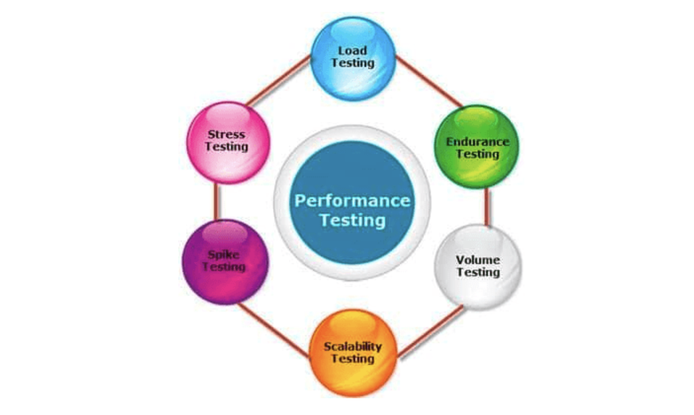
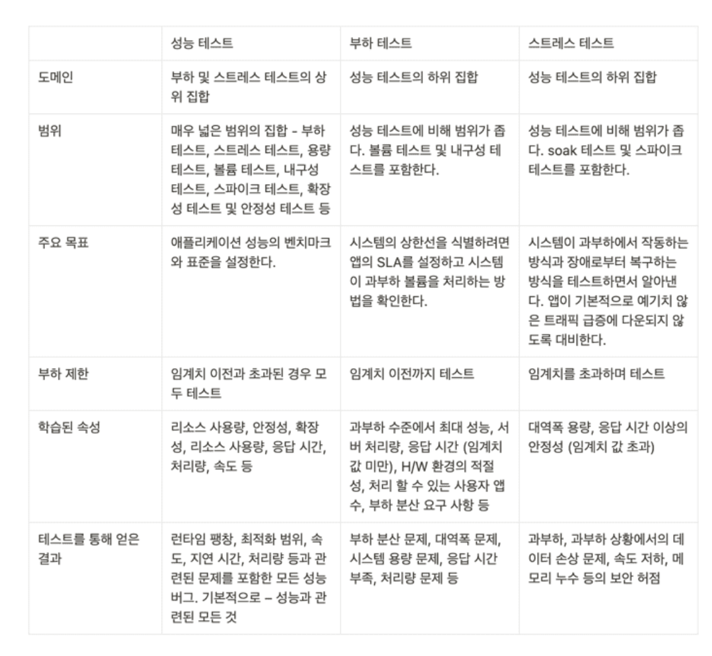
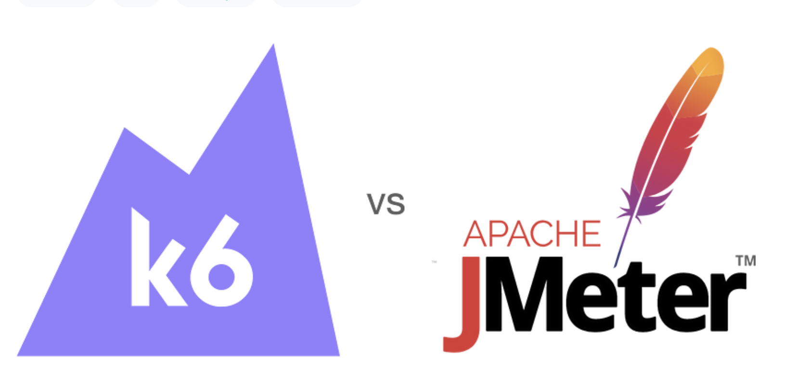

> 💡 현재 포스트는 [하모니 팀 기술 블로그](https://kakaotech-harmony.netlify.app/backend/performance-test/) 에 게시된 글 입니다.

## 성능 테스트(Performance Test) 란 ?

성능 테스트란 특정 상황에서 시스템이 어느 수준의 성능을 내는지 측정하는 테스트 방식이다. 성능 테스트를 통해 시스템의 자원 사용량, 확장성, 신뢰성 등을 검증할 수 있다. 서버에 일정량의 부하를 주는 방식으로 테스트하며, 보통 애플리케이션의 성능을 측정하고, 최적화하기 위해 사용한다.

일반적으로 개발을 하면서 부하 테스트와 스트레스 테스트 등의 키워드를 많이 접해봤을 것이다. 위 사진을 보면 해당 테스트들은 모두 성능 테스트 하위에 있는 것을 알 수 있다. 그만큼 성능 테스트는 매우 광범위한 범위를 갖고 있는데, 그 중 가장 많이 사용되는 테스트가 바로 부하 테스트와 스트래스 테스트이다.

### 부하 테스트 (Load Test)

부하 테스트는 서버에 부하를 점진적으로 한계치까지 가하는 방식의 성능 테스트이다. 이 테스트로 애플리케이션의 최대 성능을 파악할 수 있다. 즉, 부하 테스트를 통해 우리 애플리케이션이 견딜 수 있는 한계치의 요청을 측정 수 있다.

### 스트레스 테스트 (Stress Test)

스트레스 테스트는 정상적인 상황에서 발생할 수 없는 극단적인 상황을 가정하고, 서비스가 극한의 부하 상황에서 어떻게 동작하고 어떻게 견디는지를 확인하는 테스트이다. 극단적인 상황이라 함은, 버퍼 오버플로우, 메모리 누수등이 해당될 것이다. 이러한 극단적인 상황을 사전에 발견하고 해결하기 위해 사용된다. 이 테스트를 통해 애플리케이션이 예기치 못한 극단적인 상황, 트래픽 유입으로 인해 마비되지 않도록 사전에 예방할 수 있다.

### 우리 팀이 사용할 테스트 종류는?

우리 하모니 팀의 경우 성능 테스트를 통해 애플리케이션의 성능을 측정하고, 그 측정 결과를 기반으로 최적의 설정 값과 아키텍처를 구성하는 것이 목표이다. 즉, HikariCP 커넥션 풀 사이즈, DB 레플리케이션 아키텍처 등 성능 개선을 위해, 성능 테스트를 이어가며 최적의 설정을 구상하는 것이 목표이다. 

따라서 우리 팀이 실행한 테스트는 부하 테스트 쪽에 가깝다. 부하 테스트를 통해 애플리케이션, 데이터베이스 등의 최대 성능을 파악할 예정이기 때문이다. 그리고 성능 테스트라는 포괄적인 의미로 표현해도 될 것이다.

## TPS (Transaction Per Seconds)

그렇다면 우리는 성능 테스트시 어떤 지표를 보고 "성능이 개선되었다" 라고 표현할 수 있을까? 객관적인 지표가 필요하다. 우리 팀은 가장 많이 사용되는 지표인 TPS(Transaction Per Seconds) 를 기반으로 성능 테스트를 수행하고자 한다.

TPS 란 말 그대로 초당 처리된 트랜잭션 수를 의미한다. 웹 애플리케이션 맥락에서 트랜잭션은 Request와 Response의 한 쌍이 처리됨을 말합니다. 

> 💡 TPS = Virtual User / Average Response Time

TPS 는 위와 같은 공식으로 계산된다. Virtual User 란 가상 유저의 수, Average Response Time 은 요청 이후 응답이 되돌아오는 평균 시간을 뜻한다. 만약 200명의 유저가 접속하고 평균 응답속도가 10이라면 TPS 는 20이 된다.

## 성능 테스트 도구, Jmeter 선택 

성능 테스트 도구로 어떤 것을 선택할지 고민이 많았다. Jmeter 와 k6 중에 가장 고민이 많았는데, 우리 팀은 우선 Jmter 를 선택하기로 했다. 

Jemter 는 초기엔 웹 서버 테스트를 위해 개발된 성능 테스트 도구로 사용되었는데, 현재는 데이터베이스, TCP, FTP 등 여러 프로토콜의 성능을 테스트할 수 있도록 발전했다. 

### GUI

무엇보다 가장 매력적인 점은 GUI 가 존재한다는 점이 가장 매력적이었다. k6 와 달리 직접 스크립트를 작성할 필요가 없기 떄문에 비교적 빠르게 적응할 수 있고 테스트가 가능하다. k6 도 k6 Test Builder 라는 간단한 GUI 가 존재하기 하지만, Jmeter 처럼 모든 기능을 사용할 순 없으며 기본적으로 스크립트 코드를 사용해야 하므로 완전한 GUI 를 제공한다고는 할 수 없다.

### 풍부한 레퍼런스와 커뮤니티가 존재한다

JMeter는 1998년도에 출시된 오래된 도구이다. 그렇기 때문에 20년 이상 발전해오면서 무수한 사용 사례를 거쳐왔다. 아파치 공식 문서도 좋지만, 많은 사용 경험을 가진 개발자들이 작성한 훌륭한 자습서나 책도 많다. 이러한 장점은 JMeter를 처음 사용하기 위한 어려움을 상당히 줄여주고 자료를 쉽게 찾을 수 있게 해준다.

### 메모리 점유율이 다소 크지만, 큰 무리는 없다

Jemeter 의 최장점은 GUI 와 전통적인 역사 아래 풍부한 레퍼런스로 빠르게 테스트 툴 사용에 적응하고, 성능을 측정할 수 있다는 점이다. 하지만 k6 에 비해 다소 메모리를 많이 사용한다. 3개의 요청을 보내는 간단한 테스트를 기준으로, JMeter는 600MB를 사용한다. 반면에 k6는 동일한 조건에서 100MB 정도를 사용하죠. 이 장점은 k6가 더 많은 가상 사용자를 생성하고 더 많은 부하를 가할 수 있게 만들어준다.

하지만 우리 팀은 그럼에도 우선적으로 Jmeter 를 사용하기로 했다. 아직 우리 서비스에 대규모 부하를 가해야하는 테스트는 발생하지 않을 것이기 때문이다. 우선 빠르게 적응할 수 있는 Jmeter 로 적응한 뒤, 향후 메모리 점유율 문제가 생겼을 때 k6 로 마이그레이션 하는 것에 큰 무리가 없을 것이라 생각하기 때문이다.

> 이 외에도 nGrinder 라는 성능 테스트 툴이 존재하나, 낮은 인지도와 커뮤니티로 인해 선정에서 제외되었다. 무엇보다 WAS 기반으로 동작하기 때문에 EC2 인스턴스에 설치해야 하는데, 이것이 하나의 허들로 작용하였다. 또한 보안그룹 문제로 Agent를 제대로 사용하지 못하는 문제가 존재한다. 그렇다고 로컬에서 직접 돌리기엔 JMeter와 차이점이 없게된다 🧐

## Jmeter 사용

이렇게 우리 팀은 Jmeter 로 성능 테스트를 수행하기로 결정했다. `jpgc-graphs-basic` 플러그인을 설치하면 핵심 지표인 TPS를 편하게 그래프로 확인할 수 있다 😎

## 참고

- https://velog.io/@yongtae923/k6-vs-JMeter
- https://seongwon.dev/ETC/20220919-%EC%84%B1%EB%8A%A5%ED%85%8C%EC%8A%A4%ED%8A%B8-%EB%B6%80%ED%95%98%ED%85%8C%EC%8A%A4%ED%8A%B8-%EC%8A%A4%ED%8A%B8%EB%A0%88%EC%8A%A4%ED%85%8C%EC%8A%A4%ED%8A%B8%EB%9E%80/
- https://loosie.tistory.com/821