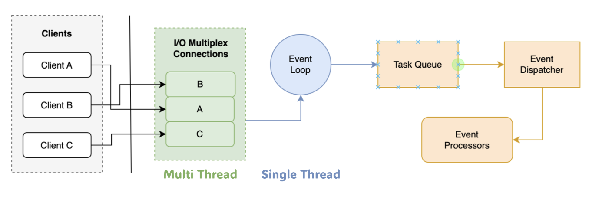

아직 제대로 지식이 체화된 것 같지는 않지만, 이해도를 더 확보하기 위해 짧게나마 글을 작성해본다. 특히 멀티플렉싱이 아직 추가 학습이 필요해보이지만, 우선 글을 쓰며 이해도를 보다 높인 후 향후 더 자세히 추가 학습해보도록 한다.

## Redis

Redis 를 떠올리면 인메모리, key-value, 빠른 성능, 싱글 쓰레드등의 키워드가 떠오는다. 그런데 왜 싱글 쓰레드인데 성능이 빠른 것일까?

### Redis 는 싱글 쓰레드와 멀티 쓰레드를 함께 사용한다.

이번에 처음 알았던 사실인데, Redis 는 싱글 쓰레드로 동작하되, 일부 기능에서 멀티 쓰레드 방식으로 동작한다. 클라이언트로부터 전송된 네트워크를 읽는 부분과 전송하는 부분은 멀티 쓰레드로 구현되어 있다. 아래 사진을 보면 알 수 있듯이, 멀티플렉싱(Multiplexing) 방식으로 클라이언트의 요청을 받아 이벤트 루프(Event Loop) 에서 싱글 쓰레드로 처리한다. 즉, 우리가 Redis 에 요청한 명령을 실행하는 부분은 싱글 쓰레드로 구현되어 있다. 이 때문에 싱글 쓰레드의 장점인 Atomic 연산이 가능해진다.

다시 정리하자면, 사용자의 요청을 받을 때와 해당 요청에 대해 메모리에 I/O 작업을 할 때는 멀티 쓰레드 방식으로 처리한다. 이후 각 요청들을 큐에 넣고 처리하는 부분은 싱글 쓰레드로 동작한다.

이 덕분에 수행되는 각 명령어들에 대한 원자성(atomic) 을 보장할 수 있고, 컨텍스트 스위칭 없이 빠른 작업이 가능하다.

### 멀티플랙싱(Multiplexing)

아직 멀티플렉싱 개념이 잘 와닿지는 않지만, 일단 작성해본다. I/O 멀티플렉싱이란 싱글 쓰레드가 여러 I/O 작업을 동시에 모니터링 할 수 있도록 해주는 기술이라고 한다. 이 방법을 사용하면, 여러 파일 디스크립터(File Descriptor) 의 I/O 상태를 하나의 호출로 확인하고, Non-Blocking Model 의 단점을 극복할 수 있게 해준다.

- `(1)` 클라이언트 연결이 발생하면(소캣 생성), Redis 는 여러 연결(소캣)을 동시에 감시(모니터링)한다.
- `(2)` 데이터가 준비되었는지 확인한 후, 준비 된 요청만 처리한다.
- `(3)` 처리중인동안 다른 요청들은 대기하지 않고, 준비가 되면 바로 처리한다.

여기서 "준비된 요청" 이라는 말이 햇갈릴 수 있는데, 우선 준비가 안된 요청에 대해 먼저 설명해보겠다. 준비가 안된 요청이란 클라이언트가 Redis 에 데이터를 보내고 있지만, 아직 네트워크 지연등으로 인해 데이터가 도착하지 못해 처리하지 못하는 요청을 뜻한다. 이에 반면 준비된 요청이란 클라이언트의 요청이 완전히 도착했고, Redis 가 바로 읽고 처리할 수 있는 상태를 뜻한다. (마치 비유하자면, 식당에서 손님이 주문을 할 때 주방장이 손님이 주문을 말하고 있는 중에는 조리를 시작할 수 없고, 주문을 다 말했을 때 주문서를 보고 바로 요리를 시작할 수 있는 상황과 같다.)

### 이벤트 기반

또한 이벤트 기반으로 처리하기 떄문에 소켓 연결의 도착, 데이터의 도착, 데이터 전송 가능 상태등과 같은 상황을 받아서 처리할 작업을 그때그때 효율적으로 선택하고 처리할 수 있다.

## 정리

- Redis 는 Multiplexing I/O 모델을 사용하여 하나의 싱글 쓰레드만으로도 여러 클라이언트에게 입출력이 가능하다.

- 이벤트 기반으로 처리하기 떄문에 동적으로 그때그때 처리할 이벤트를 빠르게 처리할 수 있다.

## 참고

- https://www.linkedin.com/pulse/why-heck-single-threaded-redis-lightning-fast-beyond-in-memory-kapur/
- https://junuuu.tistory.com/746
- https://weights-learn-develop.tistory.com/75
- https://velog.io/@ohjinseo/Redis가-싱글-스레드-모델임에도-높은-성능을-보장하는-이유-IO-Multiplexing
