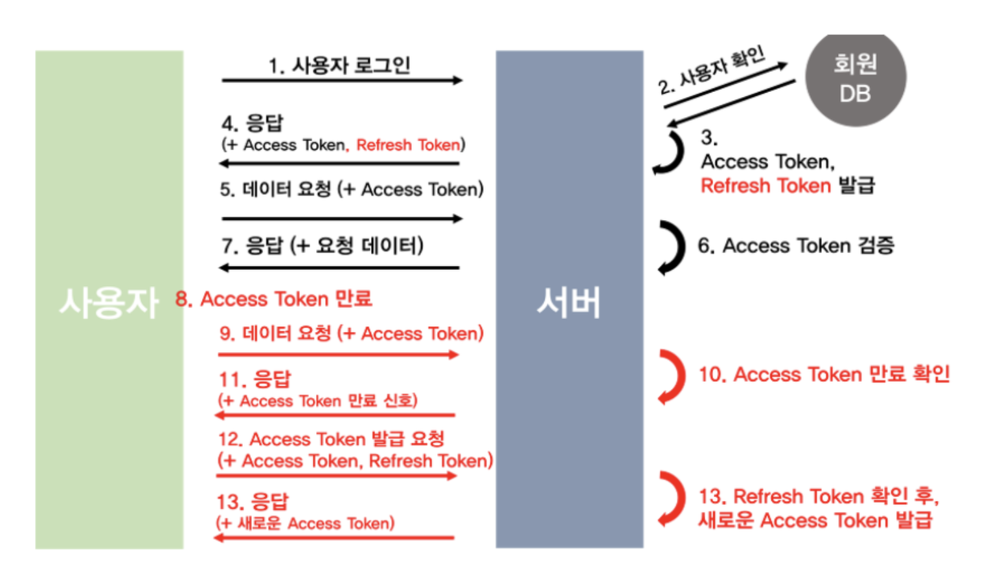
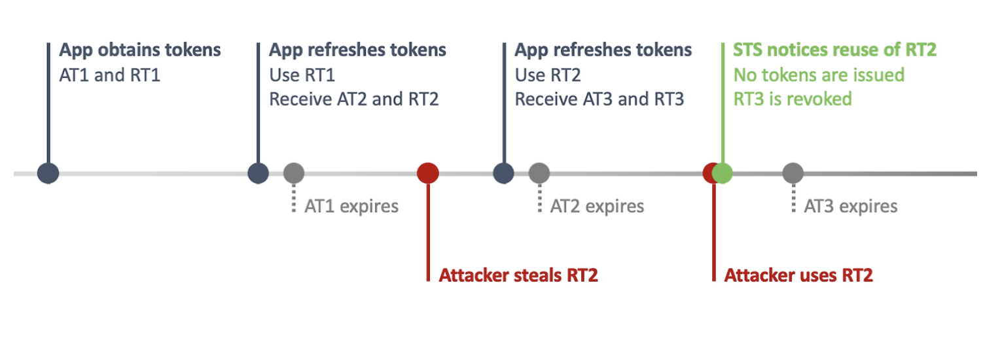

## AccessToken 의 한계

Access Token 만을 활용한 인증(Authentication) 방식으로는 제 3자에게 토큰이 탈취 당할경우 보안에 정말 취약해진다는 점이다. AccessToken 이 발급된 이후 해당 토큰이 과연 탈취를 안당할 가능성이 없을까? 우리는 토큰 기반 인증방식을 구현할 때 탈취의 가능성과 그로 인한 보안 위험을 염두해두고 개발해야한다.

AccessToken 하나만을 사용하여 인증/인가를 구축한다면, 우선 앞서 설명했듯이 탈취 당했을 경우의 위험성이 매우 크다. 토큰을 탈취한 해커는 해당 토큰으로 얼마든지 서비스에 접속하여 유저 정보를 탈취할 수 있기 떄문이다. 

JWT 토큰의 Payload 를 조정하여 엑세스 토큰의 유효기간을 짧게 설정할 수 있다. 즉, 유효기간을 짧게 설정하여 만료기간이 지났을 경우 해커가 해당 토큰을 탈취하더라도 사용 불가능하게 만드는 것이다. 하지만 이 또한 문제점이 있다. 만약 엑세스 토큰의 유효기간이 30분 정도로 짧게 설정했다면? 사용자는 매번 30분마다 자동 로그아웃이 되고, 30분 주기로 서비스를 이용하고자 매번 재로그인을 시도해야한다. 이는 보안 문제를 해결할 수 있지만, 사용자에게 매우 큰 불편함을 야기할 수 있다.

정리하자면, AccessToken 만으로 인증 시스템을 구현한다면 보안 상의 문제가 발생하거나 또는 자주 로그아웃되는 사용자 불편함 둘 중 하나를 감수해야한다.

## RefreshToken 의 등장

하나의 토큰(엑세스 토큰) 만으로는 인증 시스템을 구축하기 힘들기 떄문에, 이를 보안하고자 리프레시 토큰이 등장했다. 리프레시 토큰은 엑세스 토큰의 유효 기간을 짧게 두고, 자주 재발급 하도록 만들어서 보안을 강화면서도 사용자에게 자주 로그아웃되는 경험을 주지 않도록 하기 위함에 있다.

### 어떤 방식으로 동작하는가?

뒤이어서 더 자세히 후술하겠지만, 리프레시 토큰을 통해 새로운 엑세스 토큰을 발급받는 방식으로 동작한다. 즉, 유효기간이 매우 긴 리프레시 토큰을 통해 짧은 유효기간 주기를 가진 새로운 액세스 토큰을 갱신함으로써, 액세스 토큰이 탈취 당했을 경우의 보안 위험성을 낮춘 방식이다. 보통 액세스 토큰의 유효기간은 30분 정도로 설정하는데, 해커가 이 짧은 시간동안 액세스 토큰을 탈취해서 서비스 내 중요한 자원을 탈취하는 기간을 최소화하는 것이다.

다시 정리하자면, 엑세스 토큰은 클라이언트와 서버 송.수신에 직접 관연하는 토큰이고, 리프레시 토큰은 새로운 액세스 토큰 재발급에 관연하는 토큰이다.

### 적절한 토큰 유효기간

보통의 경우 리프레시 토큰의 유효기간을 약 2주, 엑세스 토큰은 30분 정도로 설정한다. 우리 하모니 팀 프로젝트의 경우도 이와 같은 방식으로 유효기간을 설정했다. 당연하게도 유효기간은 각 팀의 서비스마다 적절한 유효기간을 논의하여 설정하는 것이 바람직하다.

## AccessToken 과 RefreshToken 의 인증/인가 요청 플로우

토큰을 발급받고 만료하는 모든 동작 플로우를 나타냈다. 참고로 아래에 필자가 서술한 번호는 위 그림에 표현된 번호가 다르다.

- `(1)` : 사용자가 로그인을 한다.
- `(2)` : 서버는 데이터베이스에 저장된 회원 정보와 일치하는지 확인한다.
- `(3)` : 회원 정보가 일치한다면(로그인에 성공했다면) 엑세스 토큰과 리프레시 토큰을 모두 클라이언트에게 발급한다.
- `(4)` : 이때, 서버는 리프레시 토큰을 데이터베이스에 저장한다.
- `(5)` : 앞으로 클라이언트는 서버에게 자원을 요청할 떄 마다 엑세스 토큰을 실어서 요청한다.
- `(6)` : 서버는 매번 요청에 유입된 엑세스 토큰이 유효성(변조 여부, 만료 여부 등) 을 체크한다.
- `(7)` : 서버는 요청받은 엑세스 토큰이 만료되었다면, 클라이언트에게 엑세스 토큰이 만료되었다는 신호를 응답한다.
- `(8)` : 클라이언트는 앞서 `(3)` 에서 발급받은 리프레시 토큰을 전송하여 새로운 엑세스 토큰 재발급(갱신) 을 시도한다.
- `(9)` : 서버는 클라이언트로부터 전달받은 리프레시 토큰과, 앞서 `(4)` 과정에서 데이터베이스에 저장해놓은 리프레시 토큰을 서로 비교하여 토큰 변조 여부를 체크한다. 
- `(10)` : `(9)` 번과 동시간대 발생하는 일인데, 당연하지만 리프레시 토큰의 만료여부도 체크한다.
- `(11)` : `(9)` 와 `(10)` 과정을 통해 전달받은 리프레시 토큰이 유효하다고 판단되면, 새로운 엑세스 토큰을 클라이언트에게 발급해준다.
- `(12)` : 반대로 리프레시 토큰이 유효하지 않다고 판단되면, 즉 리프레시 토큰도 만료기간이 지났다면 클라이언트에게 다시 로그인을 해야한다고 신호를 응답한다. (즉, 로그아웃된 상태임을 알린다.)

## 그럼에도 RefreshToken 또한 한계가 존재한다

### AccessToken 의 유효기간이 짧다고 해서 탈취 가능성은 여전하다

RefreshToken 을 도입하여 AccessToken 의 유효기간을 짧게 설정했다고 한들, "탈취 여부" 그 자체로는 문제점이 여전하다. 즉, 유효기간이 짧다고 해서 엑세스 토큰이 탈취가 안되는 것이 아니다. **탈취된 엑세스 토큰은 짧은 그 유효기간 동안에 탈취 당하여 악용될 수 있다는 문제점은 여전하다.**

### RefreshToken 을 탈취 당할 경우

리프레시 토큰 또한 엑세스 토큰에 비해 서버-클라이언트 송.수신에 덜 오고 갈 뿐이지, 이 또한 탈취 당할 가능성은 존재한다. 이 리프레시 토큰을 탈취 당하면 해커는 마음껏 엑세스 토큰을 재발급하여 장기간동안 해킹할 수 있다. 서버 데이터베이스 내에 리프레시 토큰을 저장하여 직접 추적하여 피해를 최소화할 수 있겠지만, 그 피해가 발생하기 전까진 탈취 여부를 알 수 없다.

## RTR (Refresh Token Rotation)

리프레시 토큰을 단 1번만 사용할 수 있게(One Time Use Only) 만드는 방법이 있다. 이 방법을 `RTR(Refresh Token Rotation)` 이라고 한다. 한 번 사용된 리프레시 토큰은 탈취된 것이라 가정하고, **리프레시 토큰을 사용하여 새로운 엑세스 토큰을 발급받을 때 해당 기존 리프레시 토큰을 폐기하고, 새로운 리프레시 토큰도 발급받는 방식이다.**

이 방식으로 이미 사용된 리프레시 토큰을 사용하게 돠면 서비스측에서 탈취를 확인하게 되어 조치할 수 있다. 하자미나, 사용되지 않은 리프레시 토큰을 훔쳐 사용하거나, 그냥 지속적으로 엑세스 토큰만을 사용한다면 이 또한 막을 수 없다.

## AccessToken 을 DB 에 저장한다면?

앞서 리프레시 토큰을 서버 데이터베이스 또는 인메모리에 보관하고, 유입된 토큰과 비교하여 유효성을 검증한다고 했다. 이와 비슷한 원리로, 리프레시 토큰을 사용 안하고 서버에 직접 엑세스 토큰을 저장하여 유효성을 검증하면 안될까?

하지만 이는 토큰 기반 인증의 장점을 잃어버리는 것이다. 토큰 기반 인증 시스템의 등장배경 중 하나는, 세션의 한계를 보완하고자 등장했다. 세션의 가장 큰 문제점은 서버가 여러개인 다중화 환경일 경우 각 서버마다 다른 세션 값을 보유하기 떄문에, 데이터 보유 일관성 불일치 문제가 발생한다는 점이다. 

## 더 학습해볼 주제 및 키워드

- 세션과 쿠키

## 참고

- https://skatpdnjs.tistory.com/60
- https://inpa.tistory.com/entry/WEB-%F0%9F%93%9A-Access-Token-Refresh-Token-%EC%9B%90%EB%A6%AC-feat-JWT
