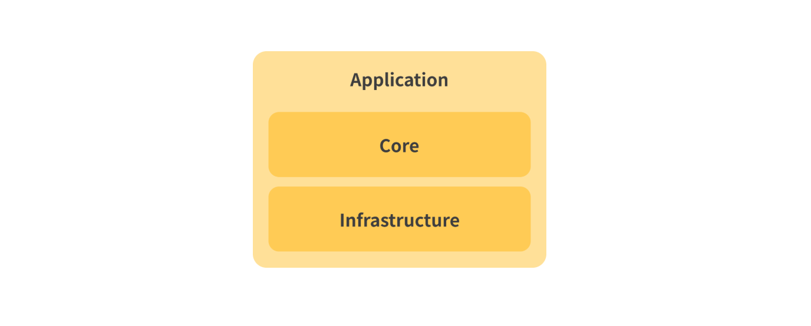
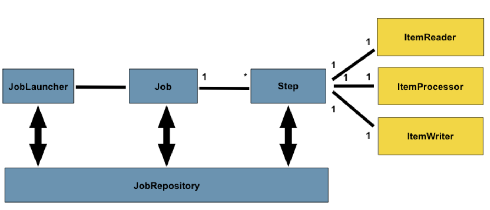
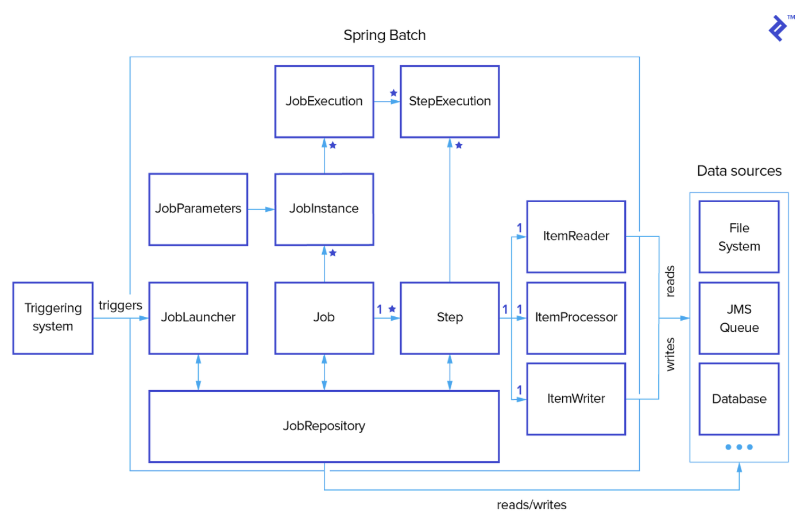

회사에서 Spring Batch 를 사용하는데, 아직 이해도가 낮아서 한번 공부해 볼 필요가 있다고 느꼈다. 이번 포스팅에선 스프링 배치를 왜 사용하고, 내부 아키텍처 동작 및 구성방식이 어떻게 이루어지는지에 대해 학습해보도록 한다.

## Batch

스프링 배치에 대해 학습하기전에, Batch 라는 그 자체의 개념에 대해 제대로 이해하고 넘어가보자. 종종 애플리케이션에서 필수적인 작업으로 배치 프로세싱이 요구된다. 그런데 여기서, 배치란 무슨 뜻일까? 배치는 `집단, 무리, 함께 묶다` 라는 뜻을 가진다. 다시 정리하면, 배치는 하나의 큰 무리.집단 단위를 의미하며, 대부분 그 규모가 큰 것들을 뜻한다. 그래서 Batch Job 이라고 하면 개발자가 정의한 작업을 한번에 일괄 처리하는 애플리케이션 Job 이라고 정의할 수 있다.

예를들어, 한 기업에서 할인 이벤트를 매일매일 진행한다고 해보자. 회원가입된 유저 수는 100만건이며, 매일마다 유저들에게 새로운 할인 이벤트 소식을 전달해야한다. 그러면 이 할인 이벤트 소식을 100만건의 유저에게 어떻게 하루마다 매일 보낼 수 있을까? 

이 작업은 기존의 일반적인 웹 애플리케이션을 개발.처리하던 방식과는 다른 처리 방식을 가져야한다. **유저와의 상호작용이 없으며, 대용량 데이터, 복잡한 프로세스, 반복적이고 주기적인 프로세스를 가진다는 특징**이 있기 때문이다. 이런 상황말고도, 월말 정산을 처리한다거나 따로 적재된 데이터베이스를 통합하는 작업, 은행 점검 상황등이 있을 것이다. 이런 상황에서 처리하면 되는 작업이 바로 배치이다. 배치 Job 은 사용자가 개입하지 않는 환경에서 특정 완료 지점까지 실행된다.

### Batch 처리시 고려사항

Batch 가 없는 일반적인 애플리케이션 개발 상황에서는 고려사항이 꽤나 많다. 트래픽 및 리소스 사용률 급증, 보안 검증, 데이터 Validation 처리 등등 그 모든 것들을 유저를 고려한 소프트웨어 개발이 필요하다. 

그와 달리 배치는 위 사항들을 고려할 필요가 없다. **즉, 배치를 사용.처리하는 상황에서는 유저를 고려한 설계.개발 처리가 필요 없다는 것이다.** 배치를 사용할 때는 확실한 로그와 피드백용 알림만을 사용해서 정확하게 에러를 인지하고, 복구.처리하는 것에만 집중하면 된다. 몰론 보안이나 데이터 유효성을 처리하기야 해야 겠지만, 트래픽 사용량이나 사용자 중심의 에러 처리를 고려하지 않아도 된다는 뜻이다.

## Spring Batch

Spring Batch 는 Enterprise 시스템의 일상적인 운영에 필요한 배치 애플리케이션을 쉽게 개발할 수 있도록 구현된 라이브러리이다. 제공하는 기능으로는 크게 **로깅/추적, 트랜잭션 관리, 작업 처리 통계, 작업 플로우 지정(작업을 재시작하거나 스킵), 리소스 관리 등 대량으 레코드를 처리** 하는데 필수적인 기능을 재사용 가능한 형태로 제공한다.

여기서 주목할 점은, `재사용` 가능하다는 점이다. 1달에 1번씩 필요한 배치 프로세스를 오늘 개발한 뒤에, 다음 달에 다시 자동으로 배치 프로세스를 돌릴 수 있다는 뜻이다. 또한 스프링 배치는 Java 기반 Configuration 이 가능하며, XML 없이도 POJO 기반 개발 접근 방식으로 개발 가능하다.

### vs Quartz, Schduler

나도 혼동된 개념이지만, Quartz 나 스케줄러와 같은 개념들과 Spring Batch 의 차이점이 햇갈릴 수 있다. Quartz 는 Job Scheduling 라이브러리로, 비교적 단순하거나 소규모 데이터를 스케줄링하며 처리하는데 적합하다. 즉, Quartz 의 경우는 작은 단위의 데이터를 요구하는 스케줄러만으로 작업이 가능한 범위를 처리 가능하다. 

반면 Spring Batch 는 스케줄러를 대체하는 개념이 아니라, **스케줄러에 의해서 동작될 수 있는 개념**으로 이해하는 것이 좋다. 스케줄러가 Trigger 되어서 제작한 Spring Batch 를 동작시키도록 한다. 또한 Spring Batch 는 대용량 데이터 처리에 적합하며, 기록 관리.대시보드등의 복잡한 기능까지 함께 제공받고 처리하는데 용이하다.

## Spring Batch 아키텍처

스프링 배치는 Layered 아키텍처를 취하며, 크게 3개의 Layer 로 구성된다. `Application`, `Core`, `Infrastructure` 3개의 Layer 컴포넌트가 있다. `Application` 은 스프링 배치를 사용하는 개발자가 만드는 모든 배치 Job 과 커스텀 코드를 포함한다. `Core` 는 Job 을 실행하고 제어하는데 필요한 핵심 Runtime 클래스를 포함한다. 각각에 대해 더 자세히 알아보자.

### Application

가장 바깥쪽을 보면 Application Layer 가 존재한다. 개발자가 구성한 배치 처리에 사용되는 코드나 컴포넌트가 이 계층에 포함된다. 즉, **업무 로직이나 서비스, 또는 Job 구조화**와 관련된 내용이 Application 계층에 포함된다.

개발자가 배치를 위해 짜놓은 대부분의 코드가 Core 계층과 함께 동작하는 Application 계층에 있지만, 위 그림은 종종 `Reader` 나 `Writer` 를 커스텀하여 Core 또는 Infrastructure 의 일부를 만들기도 하기 때문에, Core 와 Infrastructure 를 감싸도록 표현했다.

### Core

배치 Core 에는 배치 작업을 시작하고 제어하는데 필요한 **핵심 클래스**가 포함된다. **Job, Step, JobLauncher, JobParameters 구현체**가 포함된다.

### Infrastructure

어떤 처리를 수행하려면 파일, 데이터베이스 등으로부터 읽고 쓸 수 있어야 할 것이다. 또한, Job 수행에 실패한 이후 재시도 처리할 때 어떤 일을 수행하며 재시도할지를 다룰 수 있어야 할 것이다. 이 기능을 가능케 하는 계층이 Infrastructure 계층이다. 애플리케이션 개발자가 코어 프레임워크 자체 두 계층에서 사용할 수 있는 기능들을 제공한다.

예를들어 개발자가 사용할 수 있는 `ItemReader` 와 `ItemWriter` 와 같은 `Reader` 나 `Writer` 가 포함되어 있으며, 코어에서 사용할 수 있는 기본 Reader 나 Writer 와 `RetryTemplate` 과 같은 서비스가 포함된다.

## Batch 아키텍처

Spring Batch 의 배치 작업에서 사용되는 핵심 개념들에 대해 살펴보도록 한다. 각각의 개념 및 용어를 살펴보기전에, 우선 Batch 아키텍처를 살펴보자.

위 다이어그램은 스프링 배치의 핵심 개념을 도메인 언어로 나타내고 있다. `Job` 은 하나 이상의 `Step` 을 가질 수 있고, 각각의 Step 은 `ItemReader`, `ItemProcessor`, `ItemWriter` 를 단 하나씩만을 가지며, 현재 프로세스에서 필요한 메타정보들은 `JobRepository` 에 저장된다. 위 아키텍처를 더 자세히 뜯어보면 아래와 같다.

Batch 아키텍처에 등장하는 각 컴포넌트의 개념에 대해 학습해보자.

### Job

Job 이란 **배치 처리 과정들을 하나의 단위로 만들어 놓은 객체**이다. 또한 배치 처리 과정에 있어서 전체 계층 최상단에 위치하고 있다. 또한 Job 은 여러개의 Step 단계별로 나누어진 Step 들을 묶어놓은 논리적인 하나의 배치 처리 단위라고도 정의할 수 있다. 즉, Job 은 그 안에서 여러개의 Step 단계별로 나뉜다.

### JobInstance

JobInstance 는 **Job 의 실행 단위**를 나타낸다. Job 을 실행시키게 되면 하나의 JobInstance 가 생성된다. 예를들어 10월 1일 실행, 10월 2일 실행을 하게되면 각각의 JobInstance 가 생성되며, 10월 1일 실행한 JobInstance 가 실패하여 다시 실행을 시키더라도 이 JobInstance 는 10월 1일에 대한 데이터만 처리하게 된다.

### JobParameters

앞서 JobInstance 는 Job 의 실행 단위라고 했다. 그렇다면 각각의 JobInstance 는 어떻게 구별할까? 이는 바로 JobParameters 객체로 구분하게 된다. 즉, JobParameters 는 **JobInstance 의 구분.식별자**로, 보통 날짜 형식으로 식별자를 만들 수 있다. 

JobParameters 는 JobInstance 의 식별자 역할 외에도 개발자 JobInstance 에 전달되는 매개변수 역할도 하고있다. 또한 JobParameters 는 String, Double, Long, Date 와 같은 4가지의 형식만을 지원하고 있다.

### JobExecution

JobExecution 은 **JobInstance 에 대한 실행 시도**에 대한 객체이다. 1월 1일에 실행한 JobInstance 가 실패하여 재실행을 하여도, 동일한 JobInstance 를 실행시키지만 이 각각의 실행에 대한 JobExecution 은 개별로 생성된다. JobExecution 은 이러한 JobInstance 실행에 대한 상태, 시작시간, 종료시간, 생성시간 등의 정보를 담고있다.

### Step

Step 은 Job 의 배치 처리를 정의하고 순차적인 단계를 캡슐화한다. 즉, **Step 은 Job 내부적으로 순차적인 세부 단계를 정의하는 각각의 논리적인 단위이다.** Job 은 최소한 1개 이상의 Step 을 가져야 하며 Job 의 실제 일괄 처리를 제어하는 모든 정보가 들어있다.

### StepExecution

StepExecution 은 JobExecution 과 동일하게 **Step 실행 시도에 대한 객체**를 나타낸다. JobExecution 이 Job 을 위한 객체였다면, StepExecution 은 Step 을 위한 객체인 것이다. 하지만 Job 이 여러개의 Step 으로 구성되어 있을 경우, 이전 단계의 Step 이 실패하게 되면 다음 단계가 실행되지 않음으로 인하여, 실패 이후의 StepExeution 은 생성되지 않는다. 

StepExecution 또한 JobExecution 과 동일하게 실제 시작이 될 때만 생성된다. StepExectuion 에는 JobExecution 에 저장되는 정보외에 Read 수, Write 수, Commit 수, Skip 수 등의 정보들도 저장이 된다.

### ExecutionContext

ExecutionContext 란 Job 에서 데이터를 공유할 수 있는 데이터 저장소이다. Spring Batch 에서 제공하는 ExecutionContext 는 **JobExecutionContext, StepExecutionContext 2가지 종류**가 있으나, 이 2가지는 지정되는 범위가 다르다. JobExecutionContext 의 경우 Commit 시점에 저장되는 반면, StepExecutionContext 는 실행 사이에 저장이 된다. ExecutionContext 를 통해 Step 간에 데이터 공유가 가능하며, Job 실패시 ExecutionContext 를 통한 마지막 실행 값을 재구성 할 수 있다.

### JobRepository

JobRepository 는 앞서 말한 **모든 배치 처리 정보를 담고있는 일종의 저장소**이다. Job 이 실행되면 JobRepository 에 JobExecution 과 StepExecution 을 생성하게 되며, JobRepository 에서 Execution 정보들을 저장하고 조회하며 사용하게 된다.

### JobLauncher

Job 과 JobParameters 를 사용하여 Job 을 실행하는 객체이다.

### ItemReader

ItemReader 는 Step 에서 Item 을 읽어오는 인터페이스이다. ItemReader 에 대한 다양한 인터페이스가 존재하며, 다양한 방법으로 Item 을 읽어올 수 있다.

### ItemWriter

ItemWriter 는 처리된 데이터를 Write 할때 사용한다. Writer 는 처리 결과물에 따라 Insert 가 될 수도, Update 가 될 수도, 또는 Queue 를 사용한다면 Send 가 될 수도 있다. Writer 또한 Read 와 동일하게 다양한 인터페이스가 존재한다. Writer 는 기본적으로 Item 을 Chunk 로 묶어서 처리한다.

### ItemProcessor

ItemProcessor 는 Reader 에서 읽어온 Item 을 데이터를 처리하는 역할을 한다. Processor 는 배치를 처리하는데 필수 요소는 아니며, Reader, Writer, Processor 처리를 분리하여 각각의 역할을 명확하게 구분하고 있다.

## 마치며

다음 포스팅에선 Spring Batch 를 직접 코드로 작성하며, 더 높은 이해도를 갖고 Batch 를 다루어볼까 한다.

## 참고

- https://gngsn.tistory.com/177#google_vignette
- https://loosie.tistory.com/838
- https://khj93.tistory.com/entry/Spring-Batch%EB%9E%80-%EC%9D%B4%ED%95%B4%ED%95%98%EA%B3%A0-%EC%82%AC%EC%9A%A9%ED%95%98%EA%B8%B0#google_vignette