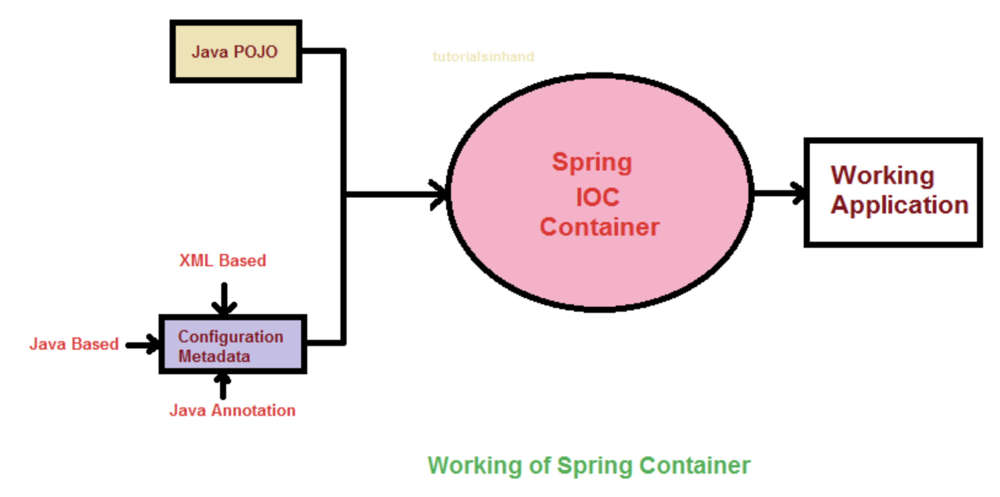
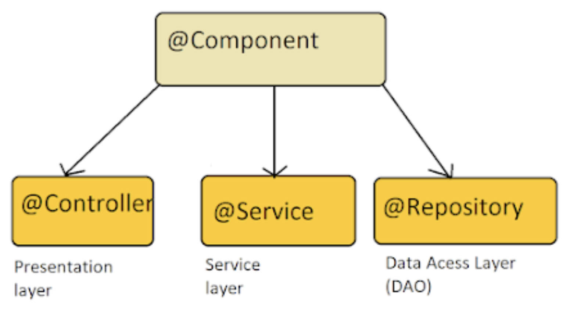

> 💡 현 포스트 학습동기는 지난 [스프링 컨테이너의 제어의 역전(IoC) 과 의존성 주입(DI)](https://haon.blog/spring/loc/) 에서 이어지는 내용이다.

지난 포스트에서 `IoC(Inversion Of Control)` 과 `DI(Dependency Injection)` 에 대해 다루었다. 다만 스프링부트에서 제공하는 IoC 컨테이너에 관한 내용을 자세히 다루지 않고, IoC 와 DI 라는 그 자체의 개념에 대해서만 집중적으로 다루었다. 이번에는 스프링 컨테이너에 어떻게 IoC 를 제공하는지, 개발자가 어떻게 DI 를 제공할 수 있는지에 대해 다루어보고자 한다.

## 스프링 빈 (Spring Bean)

`제어의 역전(IoC)` 은 제 3자인 외부 라이브러리에게 객체의 생명주기에 대한 제어권을 넘겨주는 것을 뜻한다고 했다. 이때 스프링 프레임워크 생태계에서 외부 라이브러리란 스프링 컨테이너를 뜻한다. 스프링은 스프링 컨테이너 내에서 제어의 역전(IoC) 로 객체를 관리하는데, 이때 **스프링이 제어 권한을 가져 직접 생성하고 관계를 부여하는 객체를** `Bean` **이라고 한다.** 즉, Spring Bean 은 스프링 컨테이너가 생성, 관계성정, 사용등을 제어해주는 제어의 역전이 적용된 객체를 뜻한다.

스프링은 내부에 스프링 컨테이너라는 것이 구현되어있다. 이 스프링 컨테이너는 IoC Container 라고도 불리는데, 말 그대로 IoC 를 제공해주는 특정한 컨테이너 공간으로 구현되어있다. 이 컨테이너 공간 안에는 스프링에서 자체적으로 관리하는 Spring Bean 이 존재한다. 우리는 객체간의 의존성 정보를 `생성자 주입` 을 통해 제공해주기만 하면, 스프링 컨테이너내에 Bean 객체가 자동으로 생성되고, 관리된다. 이후 클라이언트가 필요할 떄 마다 매번 개발자가 직접 객체를 생성하여 서비스를 제공하는 방식이 아닌, Spring IoC Container 내에 생성된 스프링 Bean 객체를 불러와 사용할 수 있게 된다.

또한 스프링 컨테이너라는 외부의 제 3자에게 객체의 생명주기 관리 제어권을 원활히 도맡기기 위해선, 우리가 스프링 컨테이너에서 관리될 각 객체들간의 최소한의 관계(relationship) 정보, 즉 의존관계 정보를 넘겨줘야한다. 그래야 스프링 컨테이너가 어떤 각 객체들간의 의존관계를 파악하고, 상황에 알맞는 의존성을 컨테이너내에 등록하여 이후 클라이언트에게 서비스를 제공할 수 있을 것이다. 스프링 프레임워크는 프로그래머가 코드를 작성하여 제공해준 최소한의 의존관계 정보를 바탕으로, 스프링 컨테이너내에 객체(Bean) 를 등록하고, 관리한다. 이후 클라이언트에게 필요한 의존관계를 자동으로 제공해준다. 이를 `DI(Dependency Injection)` 이라고 한다. **즉, DI 란 의존성 주입이라는 개념으로, 객체간의 의존성을 외부(스프링 컨테이너)에서 주입하는 방식을 뜻한다.** 

최소한의 의존관계 정보만을 제공하면 Spring IoC Container 내에서 자동으로 객체(Bean) 을 관리하고, 클라이언트에게 필요한 유연한 의존성을 주입해준다. 이 의존관계 정보를 스프링에게 제공하는 방법은 아주 간단한 코드(어노테이션 등)를 작성하기만 하면 된다. 이에 대한 내용은 아래에서 다루어보겠다.

기본적으로 Spring IoC Container 내에 등록되는 Bean 객체들은 `싱글톤(SingleTon)` 으로 관리된다. 또한 Spring IoC Container 로는 `Bean Factory` 와 `Application Context`  가 사용된다. 요즘은 Bean Factory 를 확장한 `Application Context` 를 관례적으로 사용하는 추세라고 한다. 이들에 대한 이해도는 아직 높지 않기 떄문에, 추가 학습이 필요하다.

## 스프링 컨테이너에 Bean 등록하기

백문이불어일타. 직접 스프링 프레임워크에서 제공하는 기능들로 어떻게 Bean 을 스프링 컨테이너에 등록하고 관리하는지 간단한 코드를 작성해보자. 

### Bean 으로 의존성 주입하기

Spring Bean 을 스프링 컨테이너에 등록하는 방법에는 크게 3가지로 나뉜다.

> - (1) xml에 직접 등록
> - (2) 수동으로 직접 의존관계 등록 : Bean 설정파일에 직접 Bean 을 등록
> - (3) 자동으로 의존관계 등록 : 이미 제공되는 어노테이션 활용함. @Component, @Controller, @Service, @Repository 어노테이션을 활용

과거에는 XML 로 빈을 설정하고 관리하는 방식이 이루어졌지만, 이젠  어노테이션을 활용하여 빈을 간편히 등록하고, DI 를 할 수 있도록 개선되었다. 사실상 `(1)` 은 요즘 거의 사용되지 않는 방법이니, 가볍게만 다루도록 한다.

### XML 에 직접 등록하기

`<bean>` 태그를 직접 사용하는 방식이다. application-config.xml 을 resource 아래에 만들어 준다. 그리고 <beans> 태그 안에 <bean>을 만들어 준다. 위의 코드는 의존성 주입까지 한 코드이다. 

~~~java
<bean id="helloService" class="com.example.myapp.di.HelloService"/>

<bean id="helloController" class="com.example.myapp.di.HelloController" p:helloService-ref="helloService">		
</bean>
~~~

### Bean 설정파일에 수동으로 직접 Bean 을 등록

스프링 Bean 을 등록하는 가장 근본적인 코드이다. 자바 클래스를 생성하고, 그 위에 `@Configuration` 어노테이션을 명시해준다. 바로 아래에서 살펴볼 `@Controller`, `@Component` 와 같은 어노테이션을 활용한 방법은 의존관계가 자동으로 등록되는 방식이라면, 이 방식은 Bean 의존관계를 수동으로 직접 등록하고자 할때 사용하는 방식이다. 

`@Configuration` 안에는 `@Component` 를 내부적으로 사용하기 떄문에 `@Configuration` 어노테이션을 붙인 해당 클래스는 `@ComponentScan` 의 대상이 된다. 그리고 그에따라 Bean 설정 정보가 읽힐 때, 그 안에 정의된 Bean 들이 IoC 컨테이너가 등록된다.

~~~java
@Configuration
public class AppConfig {

    @Bean
    public Item item1() {
        return new ItemImpl1();
    }

    @Bean
    public Store store() {
        return new Store(item1());
    }
}
~~~

그리고 아래처럼 Main 에서 어노테이션을 사용하기 위해 `AnnotationConfigApplicationContext` 를 사용한다.

~~~java
public class HelloMain {

	public static void main(String[] args) {
		AbstractApplicationContext context = new AnnotationConfigApplicationContext(AppConfig.class); 

		System.out.println("-----------------------");
		HelloController controller = context.getBean("helloController", HelloController.class);
		controller.hello("홍길동");
		System.out.println("=====================");
		context.close();
		}
}
~~~

### 이미 제공되는 어노테이션으로 자동으로 의존관계를 등록

앞선 `(2)` 방식은 스프링 컨테이너에 개발자가 직접 추가적으로, 직접 수동으로 등록하고 싶은 특별한 객체가 존재할 떄 주로 사용할 것이다. 그러나, 대부분의 경우 스프링에서 이미 제공하고 있는 어노테이션들이 존재한다. 이들을 활용하면 자동으로 Bean 이 등록된다. 또한 이 어노테이션들을 중심으로 Bean 을 자주 등록하게 될 것이다.

- `@Controller` : 해당 클래스가 Presentation Layer 에서 컨트롤러임을 명시함.
- `@Service` : 해당 클래스가 Application Layer 에서 Service 임을 명시함.
- `@Repository` : 해당 클래스가 Persistence Layer 에서 DAO 임을 명시한다.
- `@Component` : 위 3가지 경우 이외에 Bean 으로 등록하고 싶은 클래스에 명시한다.

위 어노테이션들을 붙이면 스프링이 자동으로 `컴포넌트 스캔` 을 진행하여 각 객체들간의 의존관계를 읽어들인다. 그리고 그들을 기반으로 자동으로 Spring Bean 객체로 등록한다. 

추가적으로 `@ComponentScan` 이라는 어노테이션이 존재한다. 이 어노테이션이 붙어있는 클래스가 있는 패키지에서부터 모든 하위 패키지의 모든 클래스를 훑어보며 `@Component` 가 붙은 클래스를 찾는다.  또한 `@Controller`, `@Service`, `@Repository` 들은 모두  내부적으로 `@Component` 를 포함하고 있다는 점을 알고있자.

#### @Autowired 로 의존성 주입하기

스프링에서 Bean 인스턴스가 생성되면, @Autowired 를 설정한 메서드가 자동으로 호출되고, 파라미터에 명시한 Bean 인스턴스가 자동으로 주입된다. 즉, 이 어노테이션이 달린 생성자, setter, 필드는 직접 해당 객체를 생성할 필요없이 Spring IoC Container 에 등록된 Bean 을 자동으로 주입(DI) 해준다.

위 어노테이션이 달리는 위치에 따라 `생성자 주입`, `setter 주입`, `필드 주입` 3가지로 나뉜다. 다만 생성자에 어노테이션을 단 경우, 생성자의 파라미터가 Bean 으로 등록되어 있어야 하며, setter 와 필드 또한 Bean 으로 등록되어 있어야 IoC Container 가 Bean 을 자동으로 주입해준다.

#### 생성자 주입

~~~java
@RestController
public class UserController {
    private final UserService userService;

    @Autowired
    public UserController(UserService userService) {
        this.userService = userService;
    }

    // ...
}
~~~

#### setter 주입

~~~java
@RestController
public class UserController {
    private final UserService userService;

    @Autowired
    public setService(UserService userService) {
        this.userService = userService;
    }

    // ...
}
~~~

#### 필드 주입

~~~java
@RestController
public class UserController {

    @Autowired
    private final UserService userService;

    // ...
}
~~~

## 더 학습해볼 키워드

- ApplicationContext, Bean Factory

## 참고

- https://docs.spring.io/spring-framework/reference/core/beans/introduction.html
- https://dev-wnstjd.tistory.com/440
- https://hudi.blog/spring-bean-and-spring-ioc-container/
- https://velog.io/@rnqjaah1536/Spring-Bean이란
- https://f-lab.kr/insight/understanding-spring-framework-and-ioc-di-container?gad_source=1&gclid=CjwKCAjwy8i0BhAkEiwAdFaeGPMHTnKlKL1k0Xh4G3r6Vjbql71d7ns8CAlIiy0M5ffGK9SIGz1vtRoCzr8QAvD_BwE
- https://velog.io/@seasame_oil/Spring-bean