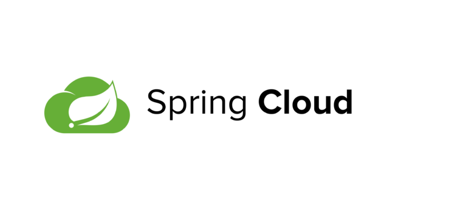
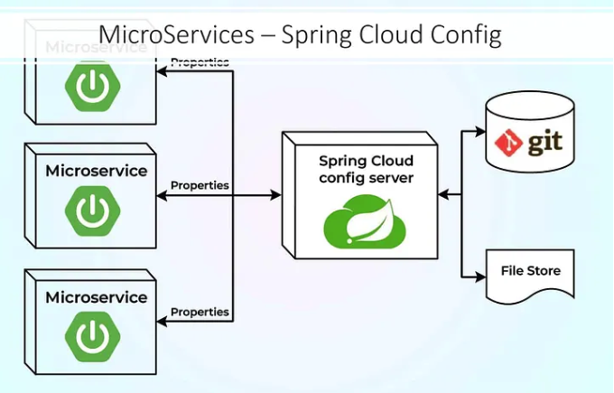
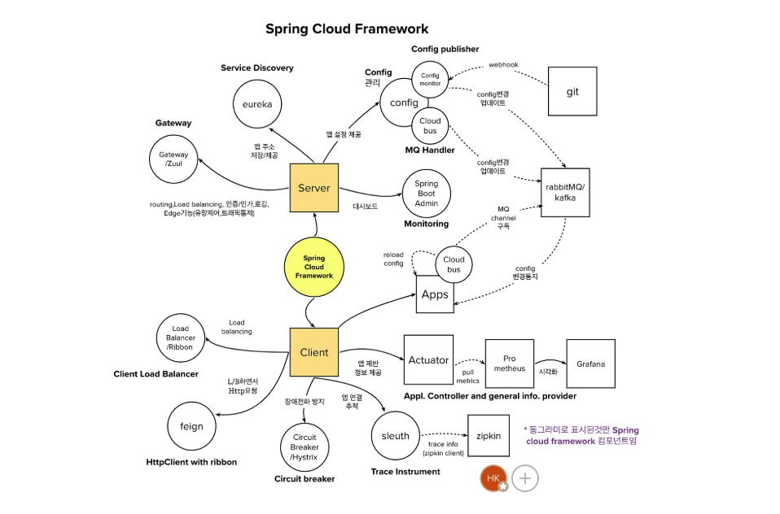

## MSA 환경에서 Spring Cloud 의 필요성

MSA 는 단일 애플리케이션을 작은 서비스 단위로 분할하여 개발, 배포, 확장을 용이하게 하는 아키텍처이다.  이러한 MSA 환경에서 각 마이크로 서비스들은 독립적으로 운영되며, 서로 유기적으로 협력하여 전체 시스템을 구성한다. Spring Cloud 는 바로 이러한 MSA 환경에서 각 서비스들이 유연하게 통신.동작할 수 있도록 기능을 제공하는 라이브러리이다.

## Spring Cloud 란?

Spring Cloud 는 MSA 를 구현하는데 필요한 다양한 도구와 라이브러리를 제공하는 프레임워크이다. 즉, MSA 환경 구성시 개발, 빌드, 배포, 운영에 필요한 내용들을 쉽게 구성할 수 있도록 도와주는 라이브러리이다. 이를 통해 MSA 환경에서 각 서비스간의 통신, 설정관리, 부하 분산, 서킷 브레이커등 여러 문제를 해결할 수 있다. 더 자세히 어떤 기능을 제공하는지 살펴보자.

---

## Spring Cloud 주요 기능

Spring Cloud 에서 제공하는 기능은 매우 다양하다. 그 중에 가장 핵심 기능에 대해서만 우선 다루고, 아래에서 상세 기능들 각각을 더 자세히 다루어볼까 한다.

### 중앙화된 구성(설정) 관리

Spring Cloud 는 `Spring Cloud Config` 라는 솔루션을 제공하여, 애플리케이션의 설정.구성 내용을 중앙에서 관리할 수 있는 기능을 제공한다. 마이크로 서버는 환경에 따라 다른 설정을 필요로 하며, 이런 설정을 일괄적으로 중앙화된 한 곳에서 관리하는 것이 복잡성이 줄어들 것이다. 

Spring Cloud Config 를 사용하면 중앙에서 설정을 관리하고, 각 서비스가 변경된 설정을 실시간으로 반영할 수 있도록 해준다. 이를 통해 개발자는 환경 설정 변경으로 인한 문제를 최소화하고, 더 집중적으로 애플리케이션 개발에 집중할 수 있다.

### 서비스 디스커버리(Service Discovery)

MSA 환경에서는 서비스가 동적으로 배포되고 확장되므로 각 서비스의 위치(IP, 포트) 를 고정할 수 없다. 즉, 각 서비스는 위치값이 동적으로 계속 변한다. 이를 해결하기 위해 Spring Cloud 는 `Eureka` 와 같은 Service Discovery 솔루션을 제공하여, 각 서비스가 중앙 레지스트리에 자신의 정보를 등록하고 다른 서비스가 이를 동적으로 검색할 수 있도록 기능을 지원해준다.

즉, 각 마이크로 서비스가 네트워크 상에서 서로를 자동으로 찾고 통신할 수 있게 해준다. 이를 통해 서비스간의 유연한 통신.확장성을 갖게 해주며, 마이크로 서버으 위치(IP, Port)가 동적으로 변하는 환경에서도 유연하게 동작할 수 있도록 해준다.

### 로드밸런싱(부하 분산)

서비스 간에 호출이 발생할 때, 트래픽을 여러 인스턴스에 효율적으로 분산하는 것이 필수이다. Spring Cloud 는 Ribbon 과 같은 클라이언트 사이드 로드밸런서를 제공하여, 서비스간 부하를 자동으로 분산시켜서 시스템의 안정성을 높인다.

### 장애 대응과 회복력(Fault Tolerance) - 서킷 브레이커

MSA 환경에서는 개별 서비스에 장애가 터질 가능성이 높다. Spring Cloud 는 `Hystrix` 를 통해 서킷 브레이커(Circuit Breaker) 패턴을 지원하여, 장애가 발생했을 때 빠르게 감지하고 대체 경로를 활용하여 시스템의 안정성을 확보한다.

Spring Cloud 에서 제공하는 서킷 브레이커는, 특정 기준에 따라서 실패한 서비스 API Call 을 자동으로 중단시키고, 시스템이 장애를 우회하고 계속해서 작동할 수 있도록 한다. 이 덕분에 서비스 간의 장애 전파 및 의존성을 최소화할 수 있게된다.

### API Gateway

마이크로 서비스를 클라이언트에게 노출할 때, 단일 진입점(Entry Point) 를 제공하는 것이 효율적이고,좋다. Spring Cloud 는 `Zuul` 과 `Spring Cloud GW` 를 통해 API Gateway 역할을 수행하며, `요청`, `라우팅`, `인증`, `로깅` 등 다양한 기능을 제공한다.

### 분산 트레이싱(Distributed Tracing)

MSA 환경에서는 요청이 여러 서비스에 걸쳐 분산되어 처리되므로, 장애 분석과 성능 최적화에 어려움이 따른다. Spring Cloud는 `Sleuth` 와 `Zipkin`을 이용하여 분산 로그 추적 기능을 제공함으로써 요청의 흐름을 시각적으로 분석하고 문제 발생 시 원인을 파악하는 데 도움을 준다.

---

## Spring Cloud 의 주요 모듈

앞서 Spring Cloud 에서 제공해주는 여러 모듈.툴을 통해 `서비스 디스커버리(Service Discovery)`, `API 게이트웨이`, `로드밸런싱`, `중앙화된 설정.구성 관리`, `서킷 브레이커`, `분산 트레이싱` 등의 기능을 제공받을 수 있음을 알게 되었다. 그렇다면 Spring Cloud 내에서 제공하는 각 기능은 어떤 툴에서 제공하는지에 대해 살펴보자.

> Spring Cloud 에서 제공하는 모든 모듈을 다루지는 않겠다.

### 서비스 디스커버리

- `(1)` Spring Cloud Netfix Eureka : 서비스 인스턴스 등록 및 검색을 위한 서비스 디스커버리 서버를 제공하는 툴이다. 각 서비스는 Eureka 서버에 자신의 위치를 등록하고, 다른 서비스의 위치 정보를 조회할 수 있다.
- `(2)` Spring Cloud Zookeeper : ZooKeeper 를 기반으로 서비스 디스커버리 기능을 제공한다.

### API Gateway

- `(1)` Spring Cloud Gateway : 동적 라우팅, 필터링, 인증, 권한 부여 기능을 제공하는 고성능 API 게이트웨이이다.
- `(2)` Spring Cloud Netfix Zuul : (Deprecated 된 기능이다.)  라우팅 및 필터링 기능을 제공한다.

### 중앙화된 설정.구성 관리

- `(1)` Spring Cloud Config : Git 레포지토리, SVN, 로컬 파일 시스템과 같은 외부 레포지토리로부터 설정.구성 정보를 가져와서 서비스에 적용한다. 설정 정보 변경 내용은 실시간으로 즉시 적용된다.

### 로드밸런싱

- `(1)` Spring Cloud Load Balancer : 서비스 디스커버리와 연동하여 Client-Side 로드밸런싱 기능을 제공한다.
- `(2)` Spring Cloud Netfix Ribbon : (Deprecated 되었다) Client-Side 로드밸런싱 기능을 제공한다. Spring Cloud Load Balancer 로 대체되는 추세이다.

### 서킷 브레이커

- `(1)` Spring Cloud Circuit Breaker : 서비스 장애가 터졌을 떄, 해당 서버로의 요청을 차단하고 `FallBack` 처리를 한다. `Resilience4j` 를 기반으로 구현되었다.
- `(2)` Spring Cloud Netfix Hystrix : (Deprecated) 마찬가지로 서킷 브레이커 기능을 제공하지만, Deprecated 되었다.

### 분산 트레이싱

- `(1)` Spring Cloud Sleuth : 서비스 간 호출 흐름을 추적하야 장애 원인을 찾아내는데 도움을 준다. 관련 기술로는 `Span`, `Trace`, `OpenTelementry`, `Zipkin`, `Jager` 등이 있다.

위와 같은 기능 및 모듈외에도 Spring Cloud 에선 다양한 모듈을 통해 여러가지 기능을 제공한다. `비동기 메시징`, `함수형 프로그래밍`, `보안`, `클라우드 연동` , `REST Client`, `배치 처리` 등을 제공한다. 

## 참고

- https://www.cncf.co.kr/blog/spring-cloud-intro/
- https://freedeveloper.tistory.com/469
- https://www.elancer.co.kr/blog/detail/248
- https://pixx.tistory.com/273