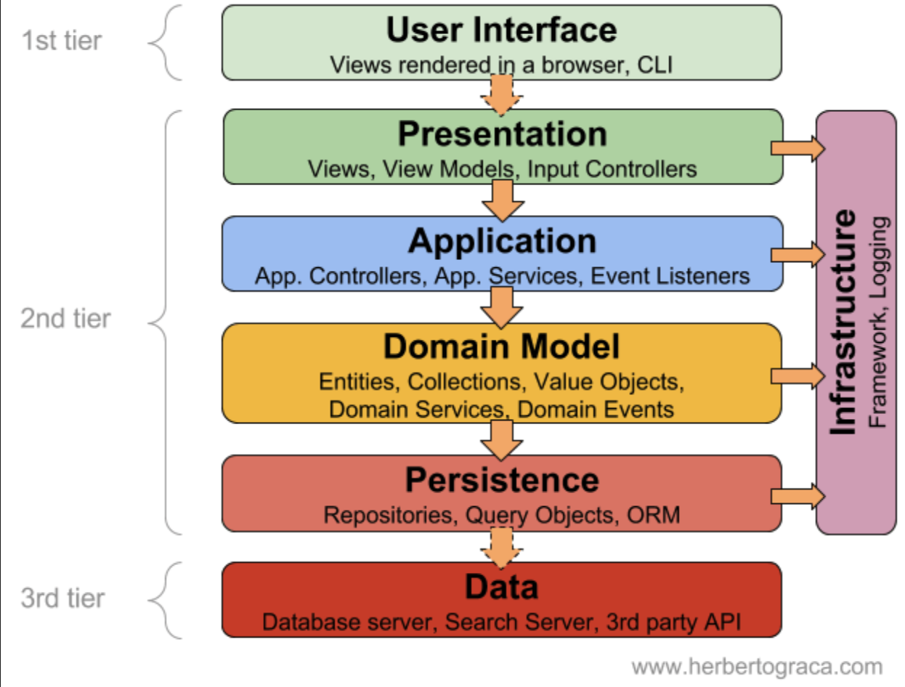

## 학습배경

이번 카카오테크 교육과정에 참여하면서 내가 세운 목표중 하나는 이미 잘 알고있을 것 같은 지식도, 조금이라도 모호하게 알고있는 지식들도 글쓰기를 통해 생각을 머리 밖으로 인출(Output) 하는 것이다. 메타인지 활성화를 위해 글을 하나 또 적을것이 생겼는데, 바로 DAO 와 Repository 의 명확한 차이점이다. 둘의 차이점을 명확히 알기위해 글을 작성해본다.

## DAO, Repository 패턴은 왜 등장했는가?

우리가 하나의 애플리케이션을 구현할 때, `영속성(Data Persistence)` 을 가진 영구저장소를 필요로 하는 경우가 많다. 영구 저장소라 함은 대표적으로 MySQL, MongoDB 와 같은 데이터베이스가 해당 될 것이다. 

애플리케이션에서 영구저장소에 접근하기 위해선, 각 영구저장소 표준에서 제공하는 API 를 사용해야한다. 이때, 만약 영구저장소의 API 를 직접 활용하는 로직이 우리 서비스의 핵심 비즈니스 로직과 함께 존재한다면 어떠할까?

아래와 같이 UserService 에서 회원가입을 수행하는 signup 메소드를 정의했다고 해보자. 또한 보듯이 Service 계층에서 쿼리문을 직접 실행하고, 영구저장소 표준 API 에 따라 정확한 쿼리문과 로직을 수행해야한다. 이는 무엇이 문제가 될까? 

~~~java
public class UserService {
    // ...

    public void signup(User user) {
        // ... 
        String sql = "INSERT INTO MEMBER(name, password) VALUES(?, ?)";
        // ... 
    }
}
~~~

우선 `(1)` **구현체와 로직이 지나치게 강한 결합성을 가지게 된다.** 즉, 애플리케이션의 핵심인 Service 레이어에서 영구저장소의 API 를 직접 사용하기 떄문에, 강한 결합을 가진다는 것이다. 만약 영구저장소를 MySQL 에서 MongoDB 로 변경헀을 때, 기존 비즈니스 로직 코드에서 영구저장소 API 를 사용한 모든 비즈니스 로직 코드를 변경해야한다. 즉, `OCP(개방 폐쇄 원칙)` 을 워반하는 사례가 된다.

또한 `(2)` **레이어드 계층간 간섭 문제가 발생한다.** 전통적인 레이어드 아키텍처는 보통 아래와 같은 방식으로 구성되는데, 영구저장소에 대한 API 활용 코드가 애플리케이션 계층에 존재하면 계층 구조가 무너진다. 이는 곧 데이터베이스 중심적인 개발로 이어질 수 있게 된다. 레이어드 아키텍처의 이점은 모듈화, 유연성, 확장성을 제공하기 위함인데, 이 이점을 누리기 위해선 **비즈니스 로직과 영구저장소의 API 를 분리할 필요가 있다.**

## DAO 패턴

`DAO(Data Access Object)` 는 위와 같은 문제들을 해결하기 위해 등장한 패턴이다. DAO 는 **영속성 벤더들의 API 와 비즈니스 로직 그 중간에 위치하여 서로를 연결해주는 어댑터와 같은 역할을 수행한다.** 직접적인 DB 와의 상호작용을 추상화하고 쿼리를 실행하는 객체로, 이러한 DAO 를 이용하여 데이터에 접근할 수 있게된다.

DAO 는 `어댑터` 와 같은 역할을 수행한다. 애플리케이션 계층에선 벤더의 API 구현체를 직접 사용하지 않는 대신에 DAO 객체를 이용한다. 이로 인해 데이터 소스가 변경되더라도 비즈니스 로직을 해치지 않는, 변화를 없도록 하는 강한 결합 문제를 해결했다. 또한 각 벤더별 구현의 차이점을 극복했다.

## Repository 패턴

반면 Repository 는 단순히 "저장소" 라는 의미를 지니고 있다. 지금까지 내가 작성해왔던 JPA 에서 제공하는 Repository, `@Repository` 어노테이션이 붙은 클래스를 보면 대부분 `Domain` 패키지에 배치시켜왔다. 

`Repository` 패턴은 앞서 설명햇듯이 단순히 저장소라는 의미이다. Repository 는 단순히 객체의 Collection 을 저장하고, 검색하는등의 동작을 캡슐화한 개념이다. 여기서 Collection 이란 자바 진영의 Collection 클래스라기 보단, `객체의 모임(저장 검색등이 가능한 )` 의 개념에 가깝다.

## 그래서, 둘의 차이점은 무엇인가

`DAO(Data Access Object)` 패턴은 이름 그대로 데이터에 접근하기 위한 객체이다. 그 자체가 영속성의 추상화이기 떄문에, 애플리케이션(도메인) 계층이 아닌, **영속성 계층에 속한다.** 이 떄문에 DAO 가 도메인 패키지에 위치하면 어색한 느낌을 준다. 

일반적으로 DAO 는 데이터베이스의 테이블과 일치한다. **즉, 테이블 중심이라고 할 수 있다.**

반면 `Repository` 는 단순히 객체의 상태(State) 를 관리하는 저장소다. **즉, Repository 는 영구 저장소를 의미하는 것이 아닌, 객체의 상태를 관리하고 저장하는 단순한 저장소**이다. 따라서, 도메인 정보를 가지고 있어야하는 Repository 는 DAO 와 같이 영속성 계층이 아닌, 도메인 계층으로 분류하는 것이 올바르다.

즉, **DAO 는 영속성 계층에서 직접적으로 데이터베이스 벤더 API, 테이블에 접근하는 개념이지만, Repository 는 도메인 객체의 상태를 관리 및 저장하는 개념에 가깝다는 점에서 차이를 보인다.** DAO 는 Storage System 에 더 가까운 개념이고 상대적으로 Low Level 이며, Repository 는 Domain 객체에 가까운 개념이고 상대적으로 High Level 개념이다. 

또한 Repository 는 **객체의 정보를 가진 저장소에 대한 관리** 에 대한 책임을 위임받은 인터페이스이다. 이 떄문에 저장소는 인메모리에 위치할 수도 있고, 애플리케이션 외부의 어떤 단순한 파일이 될 수도 있고, MySQL 과 같은 RDBMS 가 될 수도 있다. **객체의 상태를 어떤, 어디의 저장소에 저장하는것이 중요한 것이 아니라, 그냥 어떤 자장소에 데이터를 넣고, 읽어오고, 삭제하는 기능을 충실히 제공해주는 것이 Repository 의 역할이다.**

## 더 학습해볼 키워드

- 레이어드 아키텍처 명학한 정리
- SQL 중심적인 개발의 문제점

## 참고 

- https://tecoble.techcourse.co.kr/post/2023-04-24-DAO-Repository/
- https://velog.io/@maketheworldwise/DAO와-Repository의-차이
- https://isaac56.github.io/etc/2021/08/29/difference_DAO_Repository/