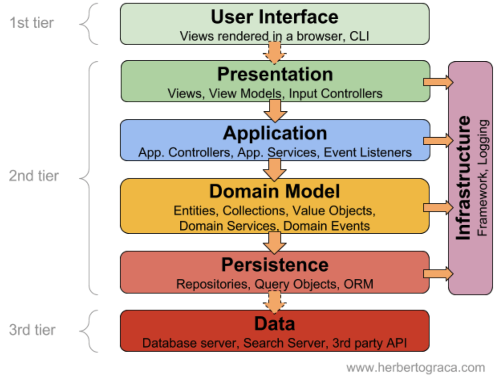
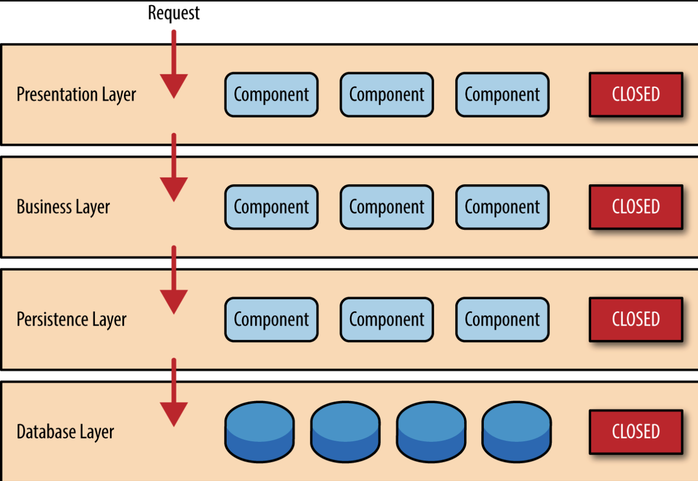

## 계층형 아키텍처 (Layered Architecture)

계층형 아키텍처는 소프트웨어 개발 진영에서 널리 사용되는 아키텍처이다. 필자는 스프링부트 기반 소프트웨어를 개발중에 있지만, 단순 프레임워크에 국한되지 않고 여러 진영에서 사용될 수 있는 유용한 아키텍처 패턴이라 생각한다.

구분되는 계층 숫자 갯수에 따라 N 계층 아키텍처 (N-tier Architecture) 이라고 한다. 각 계층은 애플리케이션 내에서 서로 독립적으로 구성되어 있기 때문에, 한 계층의 변경이 다른 계층에 영향을 주지않게 설계할 수 있다. 

### N-Tier Layered Architecture 

필자가 계층형 아키텍처를 학습하며 가장 혼란스러웠던 점은, 각 계층을 정확히 명시하고 있지 않다는 점이다. 즉, 계층형 아키텍처의 구성은 딱 1가지로 정의되어 있지 않고, **애플리케이션의 크기, 복잡도, 요구사항에 따라 자율적으로 구성하면 된다는 점이다.**  또한 계층형 아키텍처는 정확히 어떤 계층으로 구성했는지보단, **계층을 분리하여 각 계층 사이의 의존성을 줄임**으로써 외부 변화로부터 비즈니스 로직의 변화를 박고, 애플리케이션의 유지보수와 확장성을 높이려는 목적으로 설계된 기법임이 더 중요하다.

## 4-Tier Layered Architecture

그럼에도 필자는 가장 일반적으로 구성되는 계층 아키텍처에 대해 학습하도록 한다. 전형적인 구성 방법을 학습하여, 이 학습이 향후 아키텍처 구성에 도움이 되기 위한 목적으로 작성해본다. 각 계층별 특징에 대해 학습해보자.

내가 학습해볼 계층형 아키텍처는 `Presentation Layer`, `Application Layer`, `Domain Layer`, `Infrastructure Layer` 총 4가지로 분류된다. 각 계층에 대해 학습해보자.

### Presentation Layer

서비스 사용자와 시스템간의 상호작용을 처리하는 것이 주 관심사인 계층이다. 사용자 인터페이스(UI) 를 담당하며, 사용자의 **(1) 입력값을 검증**하고, **(2) 비즈니스 로직이 어떻게 수행되는지 알 필요가 없도록 개발**해야한다. 대표적인 구성요소로는 View 와 Controller 가 있다. 즉, Presentation Layer 에선 비즈니스 로직을 처리하지 않아야하며, 단순히 UI 를 표시하는 역할만을 수행해야힌다.

### Application Layer

Presentation Layer 와 Domain Layer 비즈니스 로직을 수행하는 것이 주 관심사인 계층이다. **그저 Persistence Layer 에서 데이터를 가져와 비즈니스 로직을 수행하고, 그 결과를 Presentation Layer 로 전달하는 역할이다.** 이 계층으로 구성되는 대표적인 구성요소로 `Service` 가 해당한다.

이 계층에선 데이터베이스와 직접적으로 상호작용하지 않아야하며, **Domain Layer 의 엔티티와 데이터를 처리하는 일만을 수행**야한다. 

종종 내가 현재 학습중인 현재 계층 아키텍처가 아니라, 프레젠테이션 계층, 비즈니스 계층, 데이터 자장소 계층 3가지 계층으로 구분하는 계층 아키텍처 패턴도 존재하는데, 이 패턴에선 Application Layer  비즈니스 로직과 비슷한 역할을 수행한다고 볼 수 있다.

### Domain Layer

비즈니르 로직을 처리하는 핵심 계층으로, 시스템의 핵심 로직이 담겨있다. 주요 역할로 **데이터의 유효성 검증, 엔티티간의 관계(Relationship) 처리, 비즈니스 로직 수행**등을 수행한다. 또한 Domain Layer 에선 Infrastrcture Layer 계층을 직접 참조해선 안되며, 이 계층은 순수한 비즈니스 로직만을 수행해야한다.

#### Entity 는 Domain Layer 에 속하는것인가? 

이전에 학습을 하며 항상 혼동되었던 부분은 JPA 로 설계한 ORM 기반 Entity 가 Domain Layer 로 볼 수 있는가였는데, 내가 현재까지 이해한바로는 이 아키텍처에선 Domain Layer 에 속하는것으로 바라보는 것이 올바르다.  이전에 [DAO 와 Repository 패턴, 차이점은 무엇인가 🤷
](https://haon.blog/spring/dao-repository/) 에서 다루었듯이 Repository 는 DAO 와 달리 도메인 객체의 상태를 관리 및 저장하는 개념에 가깝다고 했었는데, 이때 도메인 객체를 바로 엔티티의 개념으로 충분히 바라볼 수 있다. 즉, 상황에 따라 충분히 엔티티는 도메인 객체의 개념이 될 수 있다.

또한 Repository 는 객체의 정보를 가진 저장소에 대한 관리 에 대한 책임을 위임받은 인터페이스이다. Spring Data JPA 로 구현한 Repository 는 Domain 객체인 엔티티에 접근하는 메소드를 제공하는 방식인 것이다. 결론적으로 ORM 기반의 엔티티와 레포지토리 모두 Domain Layer 에 배치시키는 것이 적합하다.

아무것도 몰랐을 땐 엔티티와 Repository 는 Persistence Layer 에 속하는 개념이라고 생각했는데, 큰 오산이었다 🥲

### Infrastructure Layer 

시스템의 **하부 기술적인 부분을 담당하며**, **데이터베이스, 네트워크 파일 시스템등과 관련한 로직을 수행**한다. 주요 역할은 **시스템의 기술적인 문제 해결**, 그리고 **데이터의 영속성을 보장하는 것**이다. Spring JDBC, DAO, `@Repository` 어노테이션이 명시된 특정 레포지토리등을 활용하여 데이터베이스와 통신함으로써 애플리케이션의 영속성을 구현할 수 있다. 반면 Spring Messaging 을 사용하여 외부 메세징 시스템과 상호작용할 수도 있다.

이 계층에선 도메인 계층과의 상호작용을 최소화해야 한다. 자칫 데이터베이스 중심적인 설계방식은 유지보수, 확장성에 용이한 코드를 만들지 못하게 하므로, 유의해야 할 부분이다. 

## 구성은 자유롭게, 단 반방향으로 구성할 것

계층형 아키텍처에서 각각의 분할된 수평 계층은 수직적으로 배치된다. 이런 구조에서 특정 레이어는 바로 하위 레이어에만 연결된다. 즉, 계층형 아키텍처에서는 계층간의 의존성이 최소화되어야 하므로, **각 계층은 단방향으로 상위 계층의 기능만 사용할 수 있도록 구현해야 한다.**

각 계층은 의존성을 최소화하고, 격리되어 있어야한다. 각 계층은 다른 계층의 내부 동작을 모르도록 설계해야한다. 각 계층은 캡슐화되어있고, 단일 책임을 가져야한다. 따라서 따라서 특정 레이어는 다른 레이어에 영향을 주지 않고 변경될 수 있다.

## 참고

- https://www.baeldung.com/cs/layered-architecture
- https://hudi.blog/layered-architecture/
- https://engineerinsight.tistory.com/63