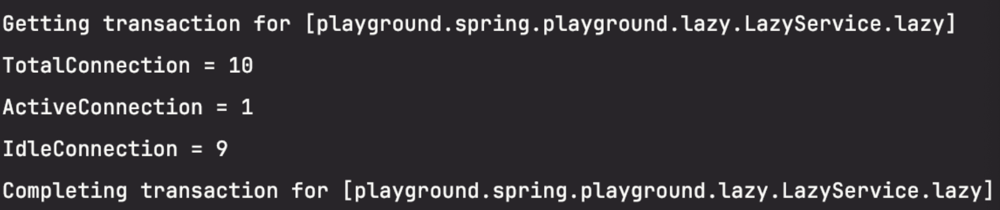
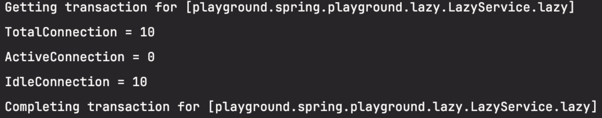
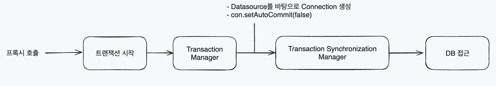

[MySQL 8.0 레플리케이션과 스프링부트 DataSource 라우팅을 통한 부하 분산](https://haon.blog/database/replication-mysql-springboot/) 에서도 다루었듯이, 우리 서비스는 레플리케이션을 위해 `LazyConnectionDataSourceProxy` 를 사용한다. 이에 대한 학습을 더 자세히 진행해볼까 한다.

## LazyConnectionDataSourceProxy

스프링은 어떤 시점에 DataSource 로 부터 커넥션을 가져올까? 결론부터 말하면, **스프링에서는 트랜잭션에 진입하는 순간 그 즉시 설정된 DataSource 의 커넥션을 가져온다.** 그런데, 이 특징 때문에 발생할 수 있는 문제점은 다음과 같다.

- Encache 같은 Cache 를 사용하는 경우 실제로 데이터베이스에 접근하지 않지만 불필요하게 커넥션을 점유
- Hibernate 의 영속성 컨텍스트 1차 캐시 (실제 데이터베이스에 접근하지 않음) 에도 불필요한 커넥션을 점유
- 외부 서비스 (http, etc ...) 에 접근해서 작업을 수행한 이후에 그 결과값을 데이터베이스에 Read/Write 하는 경ㅂ우 외부 서비스에 의존하는 시간만큼 불필요한 커넥션 점유
- Multi DataSource 환경에서 트랜잭션에 진입한 이후 DataSource 를 결정해야할 때 이미 트랜잭션 진입 시점에 DataSource 가 결정되므로 분기가 불가능

위 단점들을 해결할 수 있는 방법이 바로 LazyConnectionDataSourceProxy 이다. 이를 사용하면 실제로 커넥션이 필요한 경우가 아니라면 커넥션 풀에서 커넥션을 점유하지 않고, **실제로 필요한 시점에만 커넥션을 점유할 수 있다.** 

## 사용에 따른 차이 확인

아래 예제를 살펴보쟈.`lazy()` 메소드는 DBCP 의 DataSource 타입에 따라 분기처리를 한다. 실제 데이터베이스에 쿼리를 날리지 않고, 커넥션 수의 변화를 확인하는 코드이다. 여기서 중요한 점은, 실제로 데이터베이스와 통신하는 부분이 없다는 점이다.

~~~java
@Transactional
@Service
public class LazyService {
    private final DataSource dataSource;

    public void lazy() {
        HikariPoolMXBean hikariPool;

        if(datasource instanceof LazyConnectionDataSourceProxy) {
            hikariPool = ((HikariDataSource) (LazyConnectionDataSourceProxy) dataSource).getTargetDataSource()).getHikariPoolMXBean();
        } else {
            hikariPool = ((HikariDataSource) dataSource).getHikariPoolMXBean();
        }

        log.info("TotalConnection = {}", hikariPool.getTotalConnections());
        log.info("ActiveConnection = {}", hikariPool.getActiveConnections());
        log.info("IdleConnection = {}", hikariPool.getIdleConnections());
    }
}
~~~

`LazyProxy` 는 `LazyConnectionDataSourcePrroxy` 를 빈으로 등록하는 코드이다. `LazyProxy` 를 통해 프록시를 사용했을 때와 사용하지 않았을 때 어떻게 커넥션이 변경되는지 확인해보자.

~~~java
@Component
public class LazyProxy {

    @Bean
    public DataSource lazyDataSource(final DataSourceProperties dataSourceProperties) {
        final HikariConfig hikariConfig = new HikariConfig();

        hikariConfig.setJdbcUrl(dataSourceProperties.getUrl());
        hikariConfig.setDriverClassName(dataSourceProperties.getDriverClassName());
        hikariConfig.setUsername(dataSourceProperties.getUsername());
        hikariConfig.setPassword(dataSourceProperties.getPassword());

        return new LazyConnectionDataSourceProxy(new HikarDataSource(hikariConfig));
    }
}
~~~

LazyConnectionDataSourceProxy 를 사용하지 않았을 때의 결과는 아래와 같다. 데이터베이스에 쿼리를 날리지 않고, 아무런 작업을 하지 않았음에도 커넥션을 불필요하게 사용하게 된다.

반대로 LazyConnectionDataSourceProxy 를 사용한 결과는 아래와 같다. LazyConnectionDataSourceProxy 를 사용하면 커넥션이 꼭 필요한 시점이 되기 전까지 커넥션을 가져오지 않는 모습을 확인할 수 있다.

## 커넥션을 가져오는 시점

LazyConnectionDataSourceProxy 를 사용하지 않는다면, `@Transcational` 을 만나는 그 즉시 설정된 DataSource 에 대한 커넥션을 획득하게 된다. 그렇다면 트랜잭션이 시작되고 정확히 어떤 시점에서 커넥션을 획득하는 것일까?

트랜잭션을 보통 위와 같이 동작한다. 트랜잭션이 적용되어 있는 객체의 CGLIB 프록시가 호출이 되면 트랜잭션이 시작된다. 그 후 트랜잭션의 커밋이나 롤백등을 관리하는 `TransactionManager` 의 인터페이스를 가져오고, 설정된 DataSource 를 바탕으로 커넥션을 생성한다. 그러고 난 뒤에서야 뒤 늦게 `TransactionSynchornizationManager` 를 통해 트랜잭션을 유지할 수 있게 같은 커넥션을 사용하도록 보장한다. `TransactionSynchornizationManager` 와 관련한 자세한 내용은 [스프링 트랜잭션 동기화와 추상화 (feat. TransactionManager)](https://haon.blog/spring/transaction-synchornization-and-abstraction/) 에서 다룬적이 있다.

즉, `TransactionSynchornizationManager` 가 DataSource 정보를 읽어오는 시점은 이미 DataSource 가 결정되고 커넥션까지 모두 생성된 뒤에서야 그 정보를 읽어오게 된다. 그런데, 만약 `LazyConnectionDataSourceProxy` 를 사용하면 데이터베이스를 접근하기 전 (쿼리를 날리기 직전) 타이밍이 되었을 때 커넥션을 가지고 오게 된다. 앞서 설명했듯이, `LazyConnectionDataSourceProxy` 를 사용하면 실제로 데이터베이스와 쿼리를 주고받고 통신하며 커넥션을 획득해야 하는 시점까지 커넥션 획득을 지연시킬 수 있기 때문이다. 

## Multi DataSource 환경에서 LazyConnectionDataSourceProxy 의 역할

이전 포스팅에서 다루었듯이, 데이터베이스 레플리케이션 환경에서 원활한 라우팅을 위해 `AbstractRoutingDataSource` 를 사용하고 있다. 여기서  `determineCurrentLookupKey()` 메소드를 사용해서 DataSource 를 찾는다. 그렇다면, LazyConnectionDataSourceProxy 를 설정안하고 `AbstractRoutingDataSource` 만 사용해서 분기를 할 수 있을 것 같지만, 그렇지 않다.

~~~java
//  AbstractRoutingDataSource : Multi DataSource 환경에서 여러 DataSource 를 묶고 분기해줄 때 사용한다.
public class RoutingDataSource extends AbstractRoutingDataSource {
    // determineCurrentLookupKey 메소드 : 여러 datasource 중에서 실제로 사용될 DataSource 를 결정하는 역할
    // 현재 트랜잭션의 속성에 따라 targetDataSourceMap 의 조회 Key 를 결정하기위해 AbstractRoutingDataSource 를 상속받아서 determineCurrentLookupKey 를 구현했다.
    @Override
    protected Object determineCurrentLookupKey() {
        boolean isReadOnly = TransactionSynchronizationManager.isCurrentTransactionReadOnly();
        logger.info("현재 트랜잭션 속성이 ReadOnly인가?:" + isReadOnly);
        return isReadOnly ? "slave" : "master";
    }
}
~~~

내부적으로 `TransactionSynchornizationManager` 를 통해서 트랜잭션의 Read Only 여부를 확인하고 있다. 그런데 앞서 학습했듯이, 스프링은 기본적으로 커넥션을 `TransactionManager` 에서 `TransactionSynchornizationManager` 으로 넘어갈 때 가져온다. 따라서 `LazyConnectionDataSourceProxy` 를 사용하지 않고서는 Read Only 여부에 따라 다른 DataSource 를 선택할 수 없게 된다.

결론적으로, `LazyConnectionDataSourceProxy` 통해 커넥션을 획득하는 시점을 실제 데이터베이스와 쿼리로 통신하는 시점으로 미루기 때문에, `TransactionSynchornizationManager` 를 통해 트랜잭션 Read Only 여부를 파악해 알맞은 DataSource 로 라우팅 해줄 수 있다.

## 참고

- https://velog.io/@yyong3519/LazyConnectionDataSourceProxy란
- https://kookiencream.tistory.com/135#1.%20LazyConnectionDataSourceProxy%EB%9E%80%3F-1