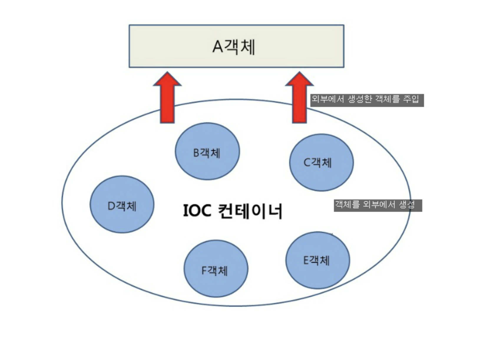

## 학습배경

카카오테크 교욱과정에 참여하면서, 정말 좋은 학습 키워드들을 만나고있다. 다음주부터 백엔드 과정을 본격적으로 진행하게 될텐데, 그 전에 스프링부트 프레임워크의 가장 근본이자 핵심 키워드인 IoC, Bean 에 대해 제대로 되짚으며, 이들에 대한 생각을 확실히 정교화하고자 한다. 

## 제어의 역전 (Inversion Of Control)

> "Don't call us. We'll call you." - Hollywood Principle

Inversion Of Control, 우리 말로 번역했을 때 **제어의 역전** 으로 번역할 수 있다. 무엇이 역전된다는 걸까? 흔히 IoC 를 설명할 때 위에서 설명했던 `할리우드 원칙` 을 들어서 설명하곤 한다. 이는 제어의 역전에 대한 비유적 표현이다. 말 그대로 배우들(객체) 에게 영화사에서 필요하면 연락할테니 먼저 연락하지 말라는 뜻이다.

본론 내용으로 들어가보자. 우리가 프레임워크 사용없이 일반적인 코딩으로 작성해왔던 프로그램을 생각해보자. 객체의 생명주기(객체의 생성, 초기화, 소멸, 메소드 호출 등) 를 프로그래머가 직접 관리한다. 또한 다른 사람이 작성한 외부 코드(라이브러리) 를 호출하더라도 해당 코드의 호출 시점 역시 직접 관리한다. 

하지만, 프레임워크를 사용한다면 객체의 생명 주기를 모두 프레임워크에 위임할 수 있다. **즉, 프로그램의 제어 흐름을 프로그래머가 직접 제어하는 것이 아니라, 외부 라이브러리(스프링 컨테이너)에서 프로그래머가 작성한 코드를 호출하고, 흐름을 제어하는 것을 제어의 역전(IoC) 라고 한다.**

## 프레임워크의 IoC 기반 제어권

스프링부트와 같은 프레임워크를 사용할 때를 생각햅면, `Controller`, `Service` 와 같은 객체들의 동작을 우리가 직접 구현하긴 하지만, 해당 객체들이 어느 시점에 호출될지는 전혀 신경쓰지 않는다. **단지 프레임워크가 요구하는대로 객체를 생성하면, 프레임워크가 해당 객체들을 가져다가 알아서 생성하고, 메소드를 호출하고, 소멸시킨다.** 프로그램의 제어권이 역전된 것이다. 

이처럼 개발자가 작성한 객체가 메소드의 제어를 개발자가 아닌, 외부의 제 3자에게 위임하는 설계 원칙을 `제어의 역전` 이라고 한다. 즉, 프레임워크는 제어의 역전 개념이 적용된 대표적인 기술이라고 할 수 있다.

제어의 역전은  원칙의 이름 그대로 제어에 대한 권한이 개발자에서 외부 환경으로 역전되는 것이다.  만약 전통적인 방식으로 라이브러리를 사용했다면, 이는 우리의 서비스의 일부분으로써 라이브러리를 가져와 우리가 직접 제어하는 것이다. 반면 **IoC 는 우리의 코드가 프레임워크의 일부분이 되어, 프레임워크에 의해 제어되는 것이라 생각할 수 있다.**

### IoC 를 통해 얻는 이점은 무엇인가?

그렇다면 IoC 개념을 도입함으로써 무엇을 얻을 수 있을까? 가장 핵심적인 이점은 바로, 애플리케이션의 제어 책임이 프로그래머에서 프레임워크로 위임되므로, **개발자가 핵심 비즈니스 로직 개발에 더 집중할 수 있게 된다.** 객체의 생멍주기 관리 (객체의 생성, 설정, 초기화, 메소드 호출, 소멸 등) 을 개발자가 아닌 프레임워크가 제어하기 떄문에, 우리는 비즈니스 로직 코드 작성에 집중하고 이 외의 객체 관리 부분을 프레임워크에게 맡기면 되기 때문이다.

## DI (Dependency Injection)

IoC 는 `DI(Dependency Injection)` 과 밀접한 연관이 있다. DI 는 IoC 원칙을 실현하기 위한 여러 디자인패턴 중 하나이다. IoC 와 DI 모두 객체간의 결합을 느슨하게 만들어, 유연하게 확성이 있는 코드를 작성하게 만들어준다.

### DI 는 IoC 를 구현하기 위한 패턴이다.

내가 IoC 와 DI 를 학습하면서 가장 혼동스러웠던 점은, DI 와 IoC 가 서로 동일한 개념이 아닌가였다. 나를 제외한 다른 사람들도 흔히들 IoC 와 DI 를 햇갈려하거나, 동일시한다. 하지만 IoC 와 DI 는 엄밀히 다른 개념이다. **IoC 는 프로그램의 제어권을 제 3자인 외부 라이브러리(스프링 컨테이너 등) 에게 역전시키는 개념이다. 반면 DI 는 해당 개념을 구현하기 위해 사용하는 패턴 중 하나로, 이름 그대로 객체의 의존관계를 외부에서 주입시키는 패턴을 뜻한다.**

### 의존성 주입

DI 란 이름 그대로 객체의 의존관계를 외부에서 주입시키는 패턴을 뜻한다고 했다. 즉, `의존성 주입` 이라는 개념이 들어가는데, 이 개념을 이해하기 위해 아래 코드를 살펴보자. 

#### A는 B에게 의존한다

~~~java
public class UserController {
    private UserService userService = new UserService();
}
~~~

위와 같은 클래스 Controller 에선 Service 클래스 타입을 필드로 가진다. 그런데 만약 UserService 에 final 필드가 추가되는 변경이 일어난다면 어떨까? `new` 키워드로 UserService 객체를 생성하는 부분에서 오류가 발생한다. UserService 내부의 변경이 일어났는데, 이 변경이 A 에도 영향을 미치는 상황이다. 이런 경우를 UserController 가 UserService 에 의존한다고 표현한다.

`의존성 주입`이란, 이러한 의존성을 외부에서 주입해준다는 것을 뜻한다.  위 코드는 UserController 내부에서 UserService 객체를 직접 생성하고 이씨 떄문에, Controller 가 반드시 내부에서 생성한 Service 객체에 의존하는 것으로 의존관계가 항상 고정되어 있다. 하지만, 이렇게 의존성이 고정되는 것이 아닌, 외부에서 그때그떄 유연하게 의존성, 의존관계를 변경할 수 있도록 코드를 변경해보자.

#### 외부에서 (생성자를 통한) 의존성 주입하기

외부에서 의존성을 주입받도록 변경했다. Controller 의 생성자를 통해 의존성을 주입받는다. 의존 대상을 직접 생성(결정)하는 것이 아니라, 생성자를 통해 외부로부터 주입받는 방식으로 변했다. 지금은 주입 대상인 UserService 가 단순 클래스 타입이지만, 클래스가 아닌 인터페이스 타입으로 추상화하면 다양한 구현체가 생성자를 통해 들어옴으로써 다양한 타입의 의존성을 주입시킬 수 있다.

~~~java
public class UserController {
    private UserService userService;

    public UserController(UserService userService) {
        this.userService = userService;
    }
}
~~~

이처럼 `생성자 주입` 을 통해 외부에서 의존성을 주입시키는 방식을 `DI(Dependency Injection)` 이라고 하며, 이 DI 패턴을 통해 IoC 를 구현할 수 있는 것이다. 제 3자인 외부 라이브러리(스프링 컨테이너) 에게 객체의 생명주기 관리 제어권을 맡기기 위해선, 각 객체간의 의존관계 정보를 제공해줘야 하고, 따라서 의존성 주입을 해줘야한다. 이 의존성 주입은 추후 포스트에서 다루어 볼 스프링 어노테이션을 통해 주입해줄 수 있다. 

사실 생성자 주입외에도 setter, 인터페이스를 통한 의존성 주입 방식도 존재한다. 하지만 생성자 주입외에는 관례적으로 그리 권장되는 방식은 아니기에, 자세한 설명 및 학습은 생략한다.

## 더 학습해 볼 키워드

- 스프링 Bean, 어노테이션 등 
- 의존성 주입을 어떻게 제공하는가?

## 참고

- https://hudi.blog/inversion-of-control/
- https://velog.io/@ohzzi/Spring-DIIoC-IoC-DI-그게-뭔데
- https://tecoble.techcourse.co.kr/post/2021-04-27-dependency-injection/