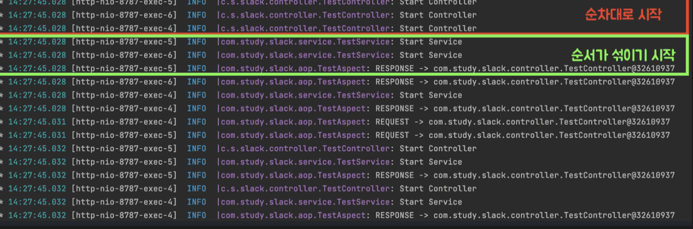
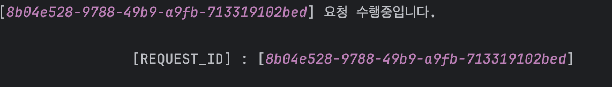

## 로그가 뒤섞이는 문제 

서비스를 운영하다보면 로그를 통해 모니터링을 하고, 발생한 애러에 대응하기 위해 로그를 추적하고, 기록을 남긴다. 이때 문제점은 멅티 쓰레드 환경에서 동시 요청이 다량 유입되는 경우 로그가 뒤죽박죽 섞이고 쌓인다는 점이다. 

위 로그는 파악하기 쉬운가? 로그를 확인해보면 1개의 요청에 대한 로그가 순차적으로 나열되는 것이 아니라, 여러 사용자의 요청에 대한 로그가 쌓이고 섞여서 파악하기가 힘들다. **즉, 로그에 맥락이 부재된 상황이라면 문제가 발생했을 떄 원인을 추적하고 진단하기가 힘들다.** 우리는 각 요청별로 식별 가능한 맥락을 남겨아만 로그를 추적하기 용이할 것이다.

### 맥락(Context) 남기기

요청별로 식별 가능한 맥락(Context) 의 종류로는 요청을 날린 현재 사용자 고유 정보등 여러가지가 존재하는데, 그 중에 **Correlation ID** 라는 정보를 맥락으로 남기고자 한다.  **Correlation ID 란 단일 요청에 대해 무작위하게 생성된 고유한 ID 를 뜻한다.** Correlation ID 에 대한 대표적인 사례가 바로 UUID 가 될 것이다. 우리는 UUID 를 맥락으로 남겨서, 문제가 있는 요청들을 UUID 별로 그룹화할 수 있도록 만들 것이다.

### 쓰레드 로컬(ThreadLocal)

이러한 Correlation ID 는 어떻게 로그와 함께 맥락으로 남길 수 있을까? 가장 무식한 방법으로는 로그를 남겨야할 모든 메소드내에 Correlation ID 를 파라미터로 전달하여 로그를 남기도록 하는 방법이 있을 것이다. 하지만, 이는 모든 메소드에 로깅을 위한 코드가 남발되고 실수를 범할 여지가 크기에 그다지 좋은 방법이 아니다.

우리는 각 요청별로 고유한 ID 를 저장할 특정 저장소를 활용하는 방법을 떠올릴 수 있다. 이 공간이 바로 쓰레드 로컬이다. **각 요청별로(쓰레드별로) Correlation ID 를 쓰레드 로컬에 저장하고, 로깅할 떄 마다 Correclation ID 를 꺼내어 함께 로깅하면 될 것이다.**  MDC 는 이 쓰레드 로컬을 사용하여 요청별로 맥락을 관리한다.

## MDC (Mapped Diagnostics Context)

Slf4j 를 사용하여 **MDC(Mapped Diagnostics Context)** 라는 기능을 제공받을 수 있다. MDC 는 현재 실행중인 쓰레드에 특정 클라이언트에 대한 고유한 데이터 (Correlation ID 등) 를 넣고 관리하는 공간이다. MDC 는 각 쓰레듭ㄹ로 맥락을 관리하기 위해, 내부적으로 쓰레드 로컬을 사용하여 구현되어 있다. Map 형태 (key-value 데이터)로 맥락(Context) 를 저장한다. 

~~~java
MDC.put("key1", "value1"); // 저장
MDC.get("key1"); // 조회
MDC.clear(); // 초기화
~~~

쓰레드 로컬은 오직 하나의 쓰레드에 의해서 읽고 쓰여질 수 있는 고유한 저장소다. 두 쓰레드가 같은 코드를 실행하고 이 코드가 하나의 쓰레드 로컬 변수를 참조한다고 한들, 서로가 같은 쓰레드 로컬을 참조할 수 없다. 따라서 MDC 쓰레드 로컬을 사용함으로써, 멀티 쓰레드 환경에서 각 쓰레드 환경에서 독립적인 접근 데이터를 관리핧 수 있게된다. 

## MDC 로 로깅하기

MDC 를 사용하여 각 요청별로 고유 ID (Correlation ID) 를 할당하고, 로그를 출력해보자. MDC 를 사용하여 로깅하는 방법에는 **인터셉터(Interceptor), 필터(Filter), AOP** 등 여러 방법이 존재하지만, 이번 포스팅에선 필터를 사용하여 로깅하는 방법을 학습해보도록 한다. 참고로 MDC 는 Slf4j 구현체 중 Log4j 와 Logback 2가지만 지원하고 있다. 이 중에선 Logback 을 사용하도록 한다.

### Servlet Filter 구현

구현 방법은 어렵지 않다. `Filter` 를 구현한 MDCFilter 라는 구현체를 만들고 Bean 으로 등록해주면 된다. 이후 `doFilter()` 에서 `MDC.put()` 을 사용하여 랜덤으로 생성된 고유 UUID 를 넣어주면 된다. 이렇게 되면 서블릿이 요청을 받을 때 마다, 요청이 서블릿 `MDCFilter` 를 거치게 되고, 항상 MDC 의 `REQUEST_ID` 라는 Key에 대한 Value 로 UUID 가 저장된다.

~~~java
@Component
@Order(Ordered.HIGHEST_PRECEDENCE)
public class MdcFilter implements Filter {

    @Override
    public void doFilter(final ServletRequest servletRequest,
                         final ServletResponse servletResponse,
                         final FilterChain filterChain) throws ServletException, IOException {
        setMdc((HttpServletRequest) servletRequest);
        filterChain.doFilter(servletRequest, servletResponse);
        MDC.clear();
    }

    private void setMdc(final HttpServletRequest request) {
        MDC.put("REQUEST_ID", UUID.randomUUID().toString());
    }
}
~~~

이때 유의할 점은, 요청이 완료되면 항상 `MDC.clear()` 를 통해 쓰레드를 반납해야한다. Spring MVC 는 쓰레드 풀에 쓰레드를 생성하여, 요청이 오면 쓰레드를 할당해 처리하고 반납한다. 그러나 MDC 는 쓰레드 별로 저장되는 쓰레드 로컬을 사용하고, 요청이 완료될 때 `MDC.clear()` 를 하지 않으면 다른 요청이 해당 쓰레드를 재사용할 때 이전에 남긴 UUID 데이터가 쓰레드 로컬에 남아있을 수 있다. 이 떄문에 동일한 UUID 가 남아있을 수 있게되니 주의하자.

### 로그에 Correlation ID 함께 출력하기 

Filter 를 구현했다면 `MDC.get()` 을 사용하여 Correlation ID 와 함께 로그를 출력해보자. 

~~~java
logger.warn("[{}] 요청 수행중입니다.", MDC.get("REQUEST_ID"));
~~~

위와 같이 로그 메시지에 Correlation ID 를 포함시키는 것은 몰론, Logback 설정을 통해 모든 로그에 Correlation ID 가 함께 기록되도록 해보자. `logback-spring.xml` 을 아래처럼 작성해보자.

~~~xml
<appender name="FILE-WARN" class="ch.qos.logback.core.rolling.RollingFileAppender">
    <file>./log/warn/${BY_DATE}.log</file>
    <filter class="ch.qos.logback.classic.filter.LevelFilter">
        <level>WARN</level>
        <onMatch>ACCEPT</onMatch>
        <onMismatch>DENY</onMismatch>
    </filter>
    <encoder>
        <Pattern>
            %msg%n
            [REQUEST_ID] : [%X{REQUEST_ID:-NO REQUEST ID}]
        </Pattern>
        <charset>utf8</charset>
    </encoder>
    <rollingPolicy class="ch.qos.logback.core.rolling.SizeAndTimeBasedRollingPolicy">
        <fileNamePattern>./log/backup/warn/%d{yyyy-MM-dd}.%i.log</fileNamePattern>
        <maxFileSize>100MB</maxFileSize>
        <maxHistory>10</maxHistory>
        <totalSizeCap>1GB</totalSizeCap>
    </rollingPolicy>
</appender>
~~~

Logback Pattern 설정에서 `%msg` 을 통해 Logger 로 출력할 로그를 출력하고, `%X{MDC_키:-텍스트}` 와 같은 형태로 MDC 에 저장된 값을 꺼내와서 로그로 기록할 수 있다. 이때 텍스트에 MDC 값을 찾을 수 없을 때 대체하여 대신 출력할 내용을 설정할 수 있다. 따라서 위의 경우 `REQUEST_ID` 라는 key 값을 지닌 데이터를 MDC 찾으면 그대로 출력하고, 찾지 못하면 NO REQUEST ID 텍스트를 출력한다.

### 로그 출력 결과

정상적으로 수행을 마쳤다면, 로그는 아래와 같은 형태로 출력될 것이다.

또한 Logback 을 통해 기록된 로그는 아래와 같이 출력될 것이다. 

이로써 로깅 내역에 Prefix 로 Correlation ID 가 함께 출력되어, 로그를 요청별로 그룹화할 수 있게 되었다. MDC 는 Slf4j 에서 지원하는 것이므로, Appender 에 따라 파일, 데이터베이스, 엘라스틱서치 등 다양한 소스와 함께 맥락을 남길 수 있다. 

## 비동기 처리시 MDC 전파

MDC가 전파되지 않는 케이스로 `@Async` 를 사용한 비동기 처리가 존재한다. 아직 우리 모행 서비스에는 비동기 처리 작업이 없기에 당장엔 고려할 필요가 없지만, 이와 관련하여 미리 알아둘 필요가 있다고 생각한다. 

스프링에서 `@Async` 어노테이션을 붙인 메소드는 요청 쓰레드와는 다른 별도의 쓰레드에서 작업이 수행되어 비동기적으로 다른 테스트를 수행할 수 있다. MDC 는 쓰레드 로컬을 사용하기 때문에 `@Async` 가 붙은 메소드에는 MDC 가 전파되지 않는다. 이를위해 비동기 작업을 수행하는 쓰레드에 MDC 를 전파할 방법이 필요하다.

### TaskDecorator

스프링에선 `TaskDecorator` 비동기 작업이 수행되기 이전/이후의 작업을 데코레이트 할 수 있다. 이를 구현하여 비동기 작업이 수행되는 쓰레드에 MDC 를 복제할 수 있다.

~~~java
public class MdcTaskDecorator implements TaskDecorator {

    @Override
    public Runnable decorate(final Runnable runnable) {
        final Map<String, String> copyOfContextMap = MDC.getCopyOfContextMap();
        return () -> {
            MDC.setContextMap(copyOfContextMap);
            runnable.run();
        };
    }
}
~~~

앞서 구현한 `TaskDecorator` 구현체를 `TaskExecutor` 가 사용하도록 하자. `TaskExecutor` 는 비동기 작업을 관리하고 수행하는 인터페이스이다. 

~~~java
@Configuration
@EnableAsync
public class AsyncConfig {
    @Bean
    public TaskExecutor taskExecutor() {
        ThreadPoolTaskExecutor threadPoolTaskExecutor = new ThreadPoolTaskExecutor();
        threadPoolTaskExecutor.setCorePoolSize(10);

        threadPoolTaskExecutor.setTaskDecorator(new MdcTaskDecorator());
        return threadPoolTaskExecutor;
    }
}
~~~

## 참고

- https://hudi.blog/slf4j-mapped-diagnotics-context/
- https://dev-jwblog.tistory.com/126#article-1--1--mdc(mapped-diagnostic-context)%EB%9E%80?
- https://0soo.tistory.com/246
- https://mangkyu.tistory.com/266